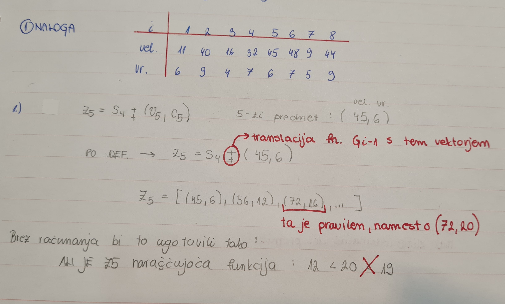

# 0/1 Nahrbtnik

**Ime:** Hana Lukež

**Datum:** 22.2.2023

---
## Naloga 1

### __Navodilo__
_Ponovitev 0/1 nahrbtnika. Bellmanova enačba  ter S in Z množice.
Rešimo vprašanja iz https://ucilnica.fmf.uni-lj.si/pluginfile.php/131586/mod_resource/content/0/O_1_Nahrbtnik_vaja.pdf_

### __Ponovitev__
Vhod: 
- predmeti: (vi, ci), kjer v pomeni velikost c pa pomeni vrednost; i=1,...,n; 
- velikost nahrbtnika W

Izhod:
- X = (x1, ..., xn); 
kjer je X množica 1 in 0; xi = 1 (če predmet vzamemo), xi = 0 (če predmet ne vzamemo)

Pri pogojih:
- $\sum_{i=1}^n vi * xi <= W$
- $\sum_{i=1}^n ci * xi$ je maksimalna možna

Bellmanowa enačba:
- G(i,W) = max{G(i-1, W), G(i-1, W-vi) + ci } + robni pogoji
--> G(i,W) pomeni maksimalna vrednost nahrbtnika z predmeti od 1 do i z velikostjo W

### __Reševanje__
a) _Pri prepisu množice Z5 je pri natanko enem paru prišlo do napake. Kateri par je napačen in
kakšen bi moral biti? Opiši, kako lahko napako ugotovimo, ne da bi šli Z5 računati na novo._

b) _Če imamo na voljo 160 enot prostora, kakšna je optimalna vrednost nahrbtnika?_

Na voljo imamo 160 enot prostora. Razberemo iz S8: prvi, ki je manjši od 160 --> (152, 40). V S8 pogledamo zadnji manjši par (w,c), da je w <= 160. Optimalna vrednost nahrbtnika s tem volumnom je 40.

c) _Koliko neizkoriščenega prostora nam ostane, če optimalno napolnimo nahrbtnik velikosti
110 s prvimi petimi predmeti. Kakšna je ta optimalna vrednost polnitve? Opiši vse možne
načine, kako dosežemo to optimalno vrednost!_

 V S5 poiščemo zadnji par (w,c), da je w <= 110. Neizkoriščenega prostora je 11 enot. Optimalna vrednost nahrbtnika s tem volumnom je 26.

d) _Ugotovili smo, da imamo na voljo še en predmet, in sicer velikosti 15 in vrednosti 4 (torej je
na voljo 9 predmetov). Kakšna je optimalna vrednost nahrbtnika, ki ima 180 enot prostora?
Opiši vse možne načine, kako dosežemo to optimalno vrednost!_

## Naloga 2

### __Navodilo__
_Rešimo na tablo naslednji problem. Na voljo imamo seznam pozitivnih naravnih števil sez in naravno število S.
Zanima nas, ali lahko S zapišemo kot vsoto števil iz sez. 
Recimo: sez = [3, 34, 4, 12, 5, 2], S = 9 vrne True, saj 9 = 4 + 5.
Zapiši dinamični problem (Bellmanovo enačbo) ter oceni časovno zahtevnost.
Kako bi še lahko rešil ta problem (z uporabo 0/1 nahrbtnika)?_

