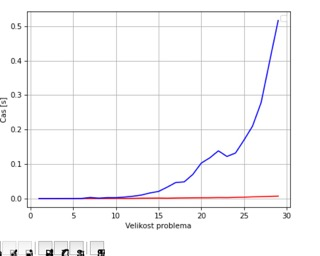
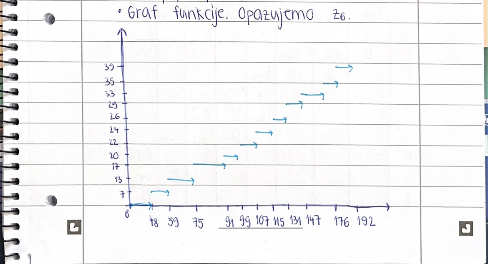
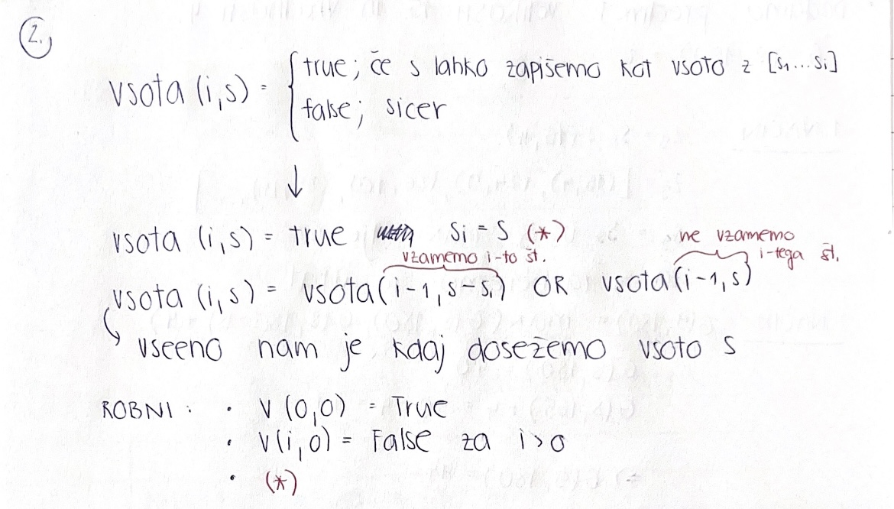
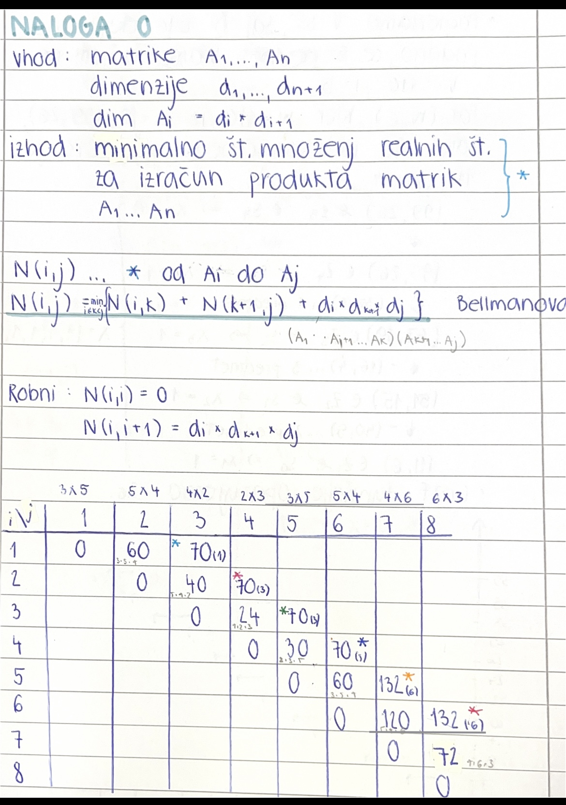
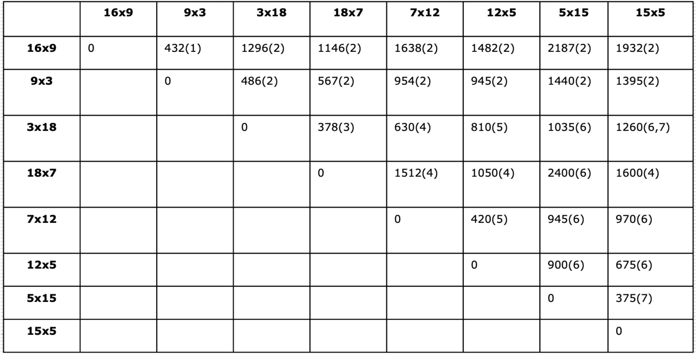

# **1. POROČILO**
**Ime:** Ela Kenda
# Vsebina:
* Vaje 1
* Vaje 2
* Vaje 3
* Vaje 4

# **VAJE 1 - 15.2.2023**

## NALOGA 1: Ponovitev časovne zahtevnosti

## - Seznam
| Operacija    | Časovna zahtevnost |
| ----------- | ----------- |
| Dodajanje na konec      | O(1)       |
| Dodajanje v sredino| O(n) |
| Dodajanje na začetek   | O(n)      |
| Dostop   | O(1)        |
| Iskanje  | O(n)        |
| Brisanje na začetku   | O(n)        |
| Brisanje v sredini   | O(n)        |
| Brisanje na koncu  | O(1)        |

##  - Slovar
| Operacija    | Časovna zahtevnost |
| ----------- | ----------- |
| Dodajanje na konec      | O(1)       |
| Dodajanje v sredino| O(1) |
| Dodajanje na začetek   | O(1)        |
| Dostop   | O(1)         |
| Iskanje  | O(1)         |
| Brisanje na začetku   | O(1)         |
| Brisanje v sredini   | O(1)         |
| Brisanje na koncu  | O(1)         |

## - Verižni seznam
| Operacija    | Časovna zahtevnost |
| ----------- | ----------- |
| Dodajanje na konec      | O(1) / O(n)       |
| Dodajanje v sredino| O(1) / O(n) |
| Dodajanje na začetek   | O(1) / O(n)        |
| Dostop   | O(n)        |
| Iskanje  | O(n)        |
| Brisanje na začetku   | O(1) / O(n)        |
| Brisanje v sredini   | O(1) / O(n)        |
| Brisanje na koncu  | O(1) / O(n)        |

Pri možnostih O(1) / O(n) je odvisno, kje se nahaja kazalec. 

## NALOGA 2: Naloga iz dinamičnega programiranja
Žabica se je izgubila v močvari in želi kar se da hitro odskakljati ven. Na srečo močvara vsebuje veliko muh, s katerimi si lahko povrne energijo, kajti utrujena žabica ne skoči daleč.

S funkcijo zabica(mocvara) želimo ugotoviti, kako hitro lahko žabica odskaklja iz močvare. Močvaro predstavimo s tabelo, kjer žabica prične na ničtem polju. Če je močvara dolžine k, je cilj žabice priskakljati vsaj na k-to polje ali dlje (torej prvo polje, ki ni več vsebovano v tabeli).

Energičnost žabice predstavimo z dolžino najdaljšega možnega skoka. Torej lahko žabica z količino energije e skoči naprej za katerokoli razdaljo med 1 in e, in če skoči naprej za k mest ima sedaj zgolj e - k energije. Na vsakem polju močvare prav tako označimo, koliko energije si žabica povrne, ko pristane na polju. Tako se včasih žabici splača skočiti manj daleč, da pristane na polju z več muhami. Predpostavimo, da ima vsako polje vrednost vsaj 1, da lahko žabica v vsakem primeru skoči naprej.

V primeru [2, 4, 1, 2, 1, 3, 1, 1, 5] lahko žabica odskaklja iz močvare v treh skokih, v močvari [4, 1, 8, 2, 11, 1, 1, 1, 1, 1] pa potrebuje zgolj dva.

Rešitev s pomočjo memoizacije:
```python
def zabica(mocvara):
    def skaci(i, e):
        if i >= len(mocvara):
            return 0
        if (i, e) in memo:
            return memo[(i, e)]
        nova_energija = e + mocvara[i]
        min_skokov = min(skaci(i + k, nova_energija - k) for k in range(1, nova_energija + 1))
        memo[(i, e)] = 1 + min_skokov
        return memo[(i, e)]
    memo = {}
    return skaci(0, 0)
```

Primeri:
 ```python
 >>> mocvara1 = [2,3,4,5,6,7]
    zabica(mocvara1)
    2

>>> mocvara2 = [2,4,6,8,3,4,5,2,3,8]
    zabica(mocvara2)
    3
>>> mocvara3 = [2, 4, 1, 2, 1, 3, 1, 1, 5]
    zabica(mocvara3)
    3
>>> mocvara4 = [2,2,2,2,2,2,2,2,2,2]
    zabica(mocvara4)
    5
>>> mocvara5 = [1,0]
    zabica(mocvara5)
    2
 ```
Časovna zahtevnost: $O(n)^2 * C = O(n^3)$, kjer $O(n)^2$ predstavlja število stanj, $O(n)$ pa predstavlja čas izračuna minimuma v seznamu oz. čas za izračun enega stanja.

Rešitev s pomočjo rekurzije: (pri reševanju sem vzela kodo od sošolcev)
```python
def zabica_iterativno(mocvara):
    """Iterativni postopek za iskanje najmanjšega števila skokov"""
    n = len(mocvara)
    dp = [[0] * (n + 1) for _ in range(n + 1)]

    for i in range(n + 1):
        dp[n][i] = 0
        dp[n - 1][i] = 1

    for i in range(n - 1, -1, -1):
        for j in range(n - 1, -1, -1):
            m = n
            e = j
            e += mocvara[i]

            if i + j > n:
                dp[i][j] = 1
                continue

            for d in range(1, e + 1):
                if i + d >= n:
                    m = 0
                else:
                    if e - d >= n:
                        m = 1
                    else:
                        m = min(m, dp[i + d][e - d])
            dp[i][j] = 1 + m
    return dp[0][0]
```
Tu je časovna zahtevnost $O(2^n)$ saj opravimo rekurzivni klic.

Primerjava časovne zahtevnosti:



Z rdečo barvo je označena rešitev z memoizacija z modro pa rešitev s pomočjo rekurzije.
# **VAJE 2 - 22.2.2023**

## NALOGA 1: Odgovori na vprašanja.


Pri prepisu množice Z5 je pri natanko enem paru prišlo do napake. Kateri par je napačen in kakšen bi moral biti? Opiši, kako lahko napako ugotovimo, ne da bi šli Z5 računati na novo.
* Napačen je par (72,20), kateri bi moral biti (72,16). Napako brez računanja ugotovimo iz tega, da je funkcija Z5 naraščajoča. 

Če imamo na voljo 160 enot prostora, kakšna je optimalna vrednost nahrbtnika?
* V S8 pogledamo prvi par (W,C), kjer je W manjši ali enak 160, torej gledamo (152, 40), kjer je optimalna vrednost 40.

Koliko neizkoriščenega prostora nam ostane, če optimalno napolnimo nahrbtnik velikosti 110 s prvimi petimi predmeti. Kakšna je ta optimalna vrednost polnitve? Opiši vse možne načine, kako dosežemo to optimalno vrednost!


Skiciraj graf funkcije, ki pokaže, kako se v odvisnosti od razpoložljivega prostora spreminja optimalna vrednost nahrbtnika, če imamo na voljo prvih 6 predmetov in 6. predmet moramo dati v nahrbtnik.




Ugotovili smo, da imamo na voljo še en predmet, in sicer velikosti 15 in vrednosti 4 (torej je na voljo 9 predmetov). Kakšna je optimalna vrednost nahrbtnika, ki ima 180 enot prostora? Opiši vse možne načine, kako dosežemo to optimalno vrednost!


## NALOGA 2
Rešimo na tablo naslednji problem. Na voljo imamo seznam pozitivnih naravnih števil sez in naravno število S.

Zanima nas, ali lahko S zapišemo kot vsoto števil iz sez.

Recimo: sez = [3, 34, 4, 12, 5, 2], S = 9 vrne True, saj 9 = 4 + 5.

Zapiši dinamični problem (Bellmanovo enačbo) ter oceni časovno zahtevnost.



# **VAJE 3 - 1.3.2023**
Naloga 1:

Implementiraj funkcijo optimalni_tovor(predmeti, W), ki vrne največjo skupno ceno predmetov, ki jih lahko trgovec natovori na letalo z maksimalno nosilnostjo W. 
``` python
from functools import lru_cache

def optimalni_tovor(predmeti, W):
    
    @lru_cache(maxsize=None)
    def max_cena(i, w):
        if i == 0:
            if w < 0:
                return float("-inf")
            else:
                return 0
        c = predmeti[i-1][0]    
        return max(c + max_cena(i-1, w-predmeti[i-1][1]), max_cena(i-1, w))
    
    return max_cena(len(predmeti), W)
```

Naloga 2:

Implementiraj funkcijo optimalni_tovor_zaloga(predmeti, W), ki vrne največjo skupno ceno predmetov, ki jih lahko trgovec natovori na letalo z maksimalno nosilnostjo W.
```python
from functools import lru_cache

def optimalni_tovor_zaloga(predmeti, W):
    nov_seznam = []
    for predmet in predmeti:
        for _ in range(predmet[2]):
            nov_seznam.append(predmet)
    @lru_cache(maxsize=None)
    def max_cena(i, w):
        if w < 0: #ko ni podane nosilnosti letala
            return float("-inf")
        if i == 0 or w == 0: #ni predmetov in ni prostora
            return 0      
        c = nov_seznam[i-1][0]    
        return max(c + max_cena(i-1, w-nov_seznam[i-1][1]), max_cena(i-1, w))

    return max_cena(len(nov_seznam), W)
```
Naloga 3:

Predpostavi, da ima sedaj trgovec na voljo neomejeno zalogo posameznih predmetov. implementiraj funkcijo neomejena_zaloga(predmeti, W), ki vrne najvišjo skupno ceno tovora na letalu z maksimalno nosilnostjo W. 
```python
def neomejena_zaloga(predmeti, W):
    @lru_cache(maxsize = None)
    def nahrbtnik(w):
        if w == 0: #ni prostora
            return 0
        return max([nahrbtnik(w-v) + c for (c,v) in predmeti if v <= w] + [0]) #pogledamo vse, nato izberemo katerega se najbolj splača vzeti
    return nahrbtnik(W)
```
Naloga 4:

Letalski prevoznik je trgovcu ponudil opcijo, da mu ni treba pošiljati celotnih predmetov. Zapakira jih lahko v manjšo škatlo in jih naloži na letalo. Bolj natančno, za nek predmet (ci,vi)
 lahko na letalo naloži predmet oblike $(ci/r,vi/r)$
 za $r∈{1,2,3,4}$. Pri tem lahko na letalo naloži le en tip predmeta. Na letalu ne more tako biti recimo 1/2+1/3=5/6
 nekega predmeta. Implementiraj funkcijo # tovor_rezanje(predmeti, W), ki vrne koliko je sedaj največja skupna cena tovora, če je nosilnost letala največ W. Rezultat vrni zaokrožen na dve decimalni mesti.
``` python
from functools import lru_cache

def tovor_rezanje(predmeti, W):
    
    @lru_cache(maxsize=None)
    def max_cena(i, w):
        if w < 0:
            return float("-inf")
        if i == 0 or w == 0:
            return 0
        c = predmeti[i-1][0]
        v = predmeti[i-1][1]
        return max(c + max_cena(i-1, w-v), max_cena(i-1, w), c/2 + max_cena(i-1, w-v/2), c/3 + max_cena(i-1, w-v/3), c/4 + max_cena(i-1, w-v/4))
    
    return round(max_cena(len(predmeti), W),2)
```

# **VAJE 4 - 8.3.2023**

**NALOGA 0:** Spomnimo se problema matričnega množenja iz predavanj ter kako ga rešimo. Opiši Bellmanovo enačbo oz. rekurzivno zvezo. Izračunajte problem za produkt matrik velikosti: 3x5, 5x4, 4x2, 2x3, 3x5, 5x4, 4x6, 6x3 v tem vrstnem redu.


**NALOGA 1:** Recimo, da imamo izračunano tabelo N(i,j) = (v, idx) iz Bellmanove enačbe, kjer je v optimalno število operacij, idx pa je seznam indeksov k, kjer je bil dosežen minimum pri združevanju podproblemov. Kako bi izračunal število vseh optimalnih produktov? Kakšna je časovna zahtevnost? Kaj pa če bi želel izpisati vse optimalne produkte?
$O(i,j)$...število optimalnih produktov matrik $A$

$O(i,i) = 1$

$O(i, i+1) = 1$

$O(i,j) = 	\sum_{k ∈ N(i,j)[1] } O(i,k) *O(k+1,j)$

**Časovna zahtevnost:** 
časovna zahtevnost = število operacij * število stanj
$O(n^2 * n) = O(n^3)$

**NALOGA 2:** V spodnji tabeli imamo že izveden izračun za vse vrednosti N(i,j) za matrike podanih velikosti, kjer matrike štejemo od 1 dalje. V tabeli je v (i,j)-ti celici prikazano min_operacij(index kjer je bil dosežen min). Koliko je optimalno število operacij? Na kakšne načine lahko zmnožimo te matrike, da imamo toliko operacij?



Optimalno število operacij je 1932. Matrike lahko zmnožimo na dva različna načina:
* k = 6: $(A1*A2)*(((A3*A4)*(A5))*(A6)(A7*A8))$
* k = 7: $(A1*A2)*(((((A3*A4)*(A5))*A6)*A7)*A8)$
**NALOGA 3:** Podobno kot pri prejšnji nalogi imamo izračunano spodnjo tabelo (le da se to tabele številčijo od 0 naprej). Odgovori na vprašanja.


Koliko operacij potrebujemo, da jih optimalno zmnožimo?
* Potrebujemo 242 operacij.

Kako jih moramo množiti?
* $(A1*(A2*A3))((((A4*A5)*A6)*A7)*A8)$

Kako optimalno zmnožimo matrike od 3 do 7?
* $A3*(((A4*A5)*A6)*A7)$

Koliko operacij potrebujemo, da optimalno zmnožimo prvih 5 matrik?
* Potrebujemo 130 operacij.

Kako naj zmnožimo zadnje štiri matrike, da bo število operacij najmanjše?
* N(5,8) = 168

Ali si lahko pomagamo z izračunanimi podatki, če spremenimo število stolpcev zadnje matrike iz 3 na 4, da izračunamo novo optimalno množenje? Kaj moramo narediti?
* Na novo moramo poračunati zadnji stolpec ( v smeri od spodaj navzgor).

**NALOGA 4:** Pri tej nalogi bomo obravnavali primer, ko imamo na razpolago več kot en računalnik oziroma procesor. Kot vzorčni primer lahko vzamemo primer iz prejšnje naloge, bomo pa poizkušali povedat čim bolj splošno. Predstavi nekaj strategij kako bi si pomagal z dodatnim računalnikom. Obravnavaj možnosti:

* En računalnik lahko obdela največ L (recimo 4) matrike.
* Vseeno koliko matrik lahko obdela en računalnik.
* kaj če nas nekaj stane, da matriko prestavimo iz enega računalnika do drugega (recimo kopija matrike preko mreže v O(velikost matrike))?

Kaj se zgodi s številom operacij, ki jih moramo izvesti v zgornjih primerih? Ali se zmanjša/zveča? Kaj pa čas za izračun?


