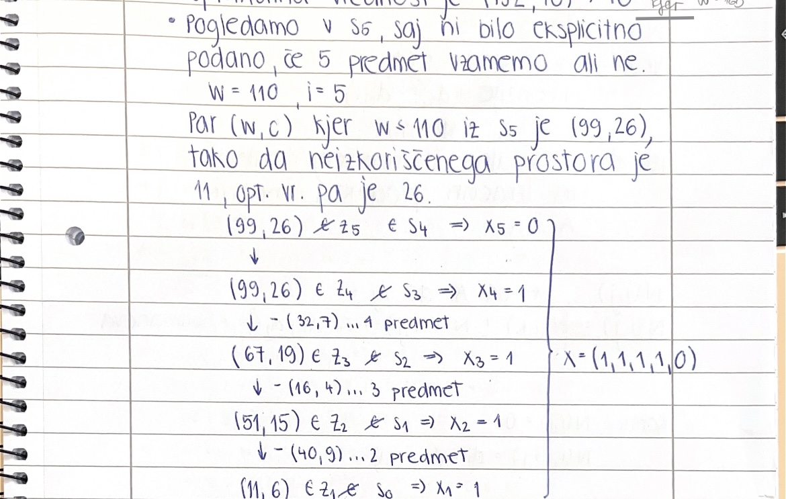
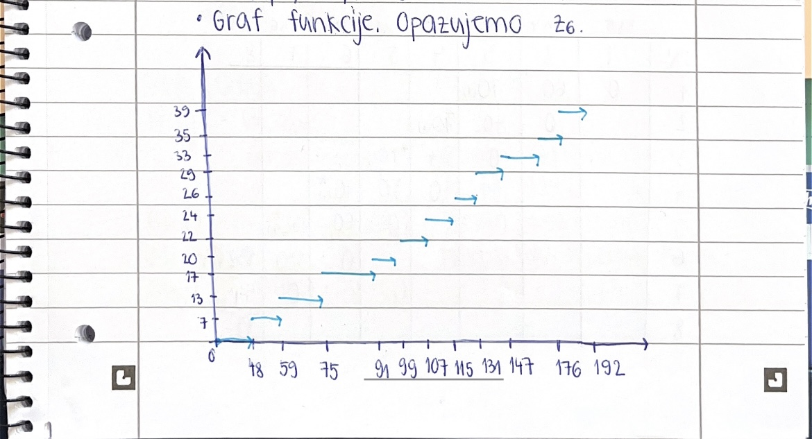
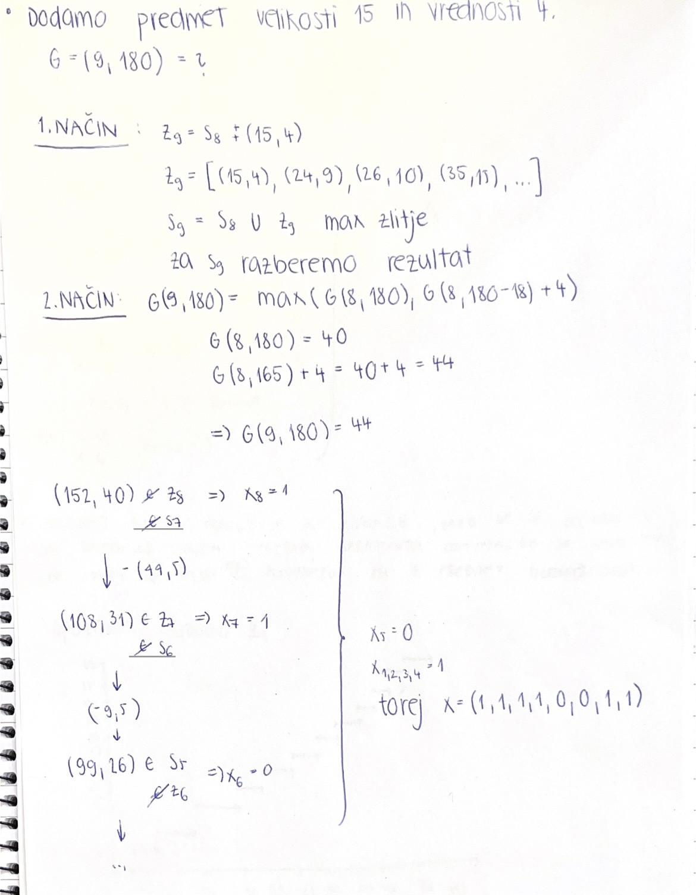
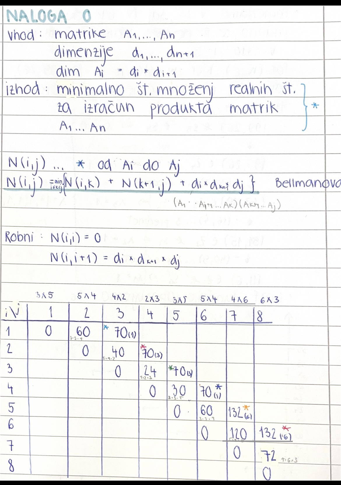
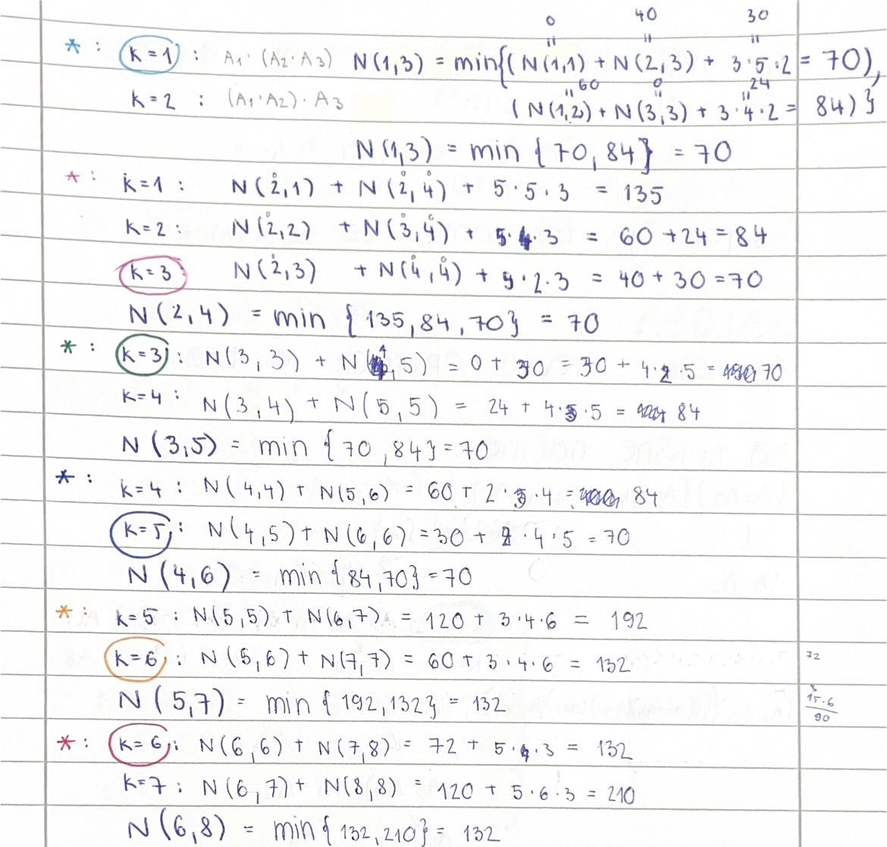
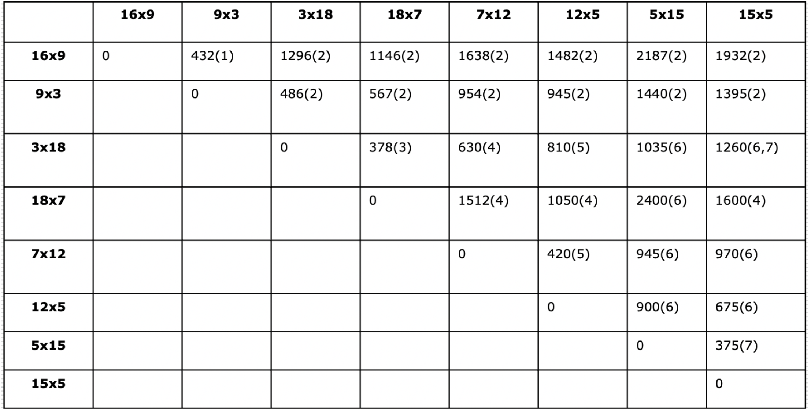
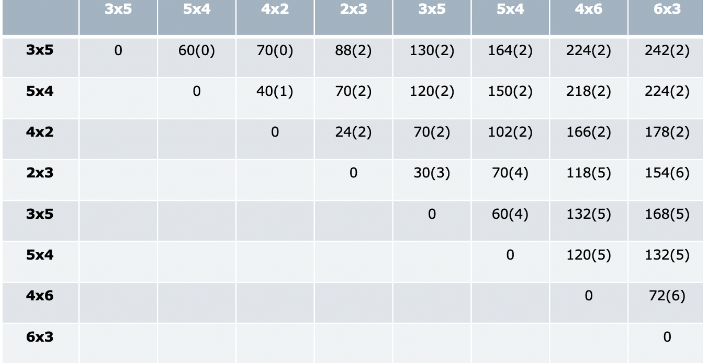

# **1. POROČILO**
**Ime:** Ela Kenda
# Vsebina:
* Vaje 1
* Vaje 2
* Vaje 3
* Vaje 4

# **VAJE 1 - 15.2.2023**

## NALOGA 1: Ponovitev časovne zahtevnosti

## - Seznam
| Operacija    | Časovna zahtevnost |
| ----------- | ----------- |
| Dodajanje na konec      | O(1)       |
| Dodajanje v sredino| O(n) |
| Dodajanje na začetek   | O(n)      |
| Dostop   | O(1)        |
| Iskanje  | O(n)        |
| Brisanje na začetku   | O(n)        |
| Brisanje v sredini   | O(n)        |
| Brisanje na koncu  | O(1)        |

##  - Slovar
| Operacija    | Časovna zahtevnost |
| ----------- | ----------- |
| Dodajanje na konec      | O(1)       |
| Dodajanje v sredino| O(1) |
| Dodajanje na začetek   | O(1)        |
| Dostop   | O(1)         |
| Iskanje  | O(1)         |
| Brisanje na začetku   | O(1)         |
| Brisanje v sredini   | O(1)         |
| Brisanje na koncu  | O(1)         |

## - Verižni seznam
| Operacija    | Časovna zahtevnost |
| ----------- | ----------- |
| Dodajanje na konec      | O(1) / O(n)       |
| Dodajanje v sredino| O(1) / O(n) |
| Dodajanje na začetek   | O(1) / O(n)        |
| Dostop   | O(n)        |
| Iskanje  | O(n)        |
| Brisanje na začetku   | O(1) / O(n)        |
| Brisanje v sredini   | O(1) / O(n)        |
| Brisanje na koncu  | O(1) / O(n)        |

Pri možnostih O(1) / O(n) je odvisno, kje se nahaja kazalec. 

## NALOGA 2: Naloga iz dinamičnega programiranja
```python
def zabica(mocvara):
    def skaci(i, e):
        if i >= len(mocvara):
            return 0
        if (i, e) in memo:
            return memo[(i, e)]
        nova_energija = e + mocvara[i]
        min_skokov = min(skaci(i + k, nova_energija - k) for k in range(1, nova_energija + 1))
        memo[(i, e)] = 1 + min_skokov
        return memo[(i, e)]
    memo = {}
    return skaci(0, 0)
```

# **VAJE 2 - 22.2.2023**

## NALOGA 1: Odgovori na vprašanja.


Pri prepisu množice Z5 je pri natanko enem paru prišlo do napake. Kateri par je napačen in kakšen bi moral biti? Opiši, kako lahko napako ugotovimo, ne da bi šli Z5 računati na novo.
* Napačen je par (72,20), kateri bi moral biti (72,16). Napako brez računanja ugotovimo iz tega, da je funkcija Z5 naraščajoča. 

Če imamo na voljo 160 enot prostora, kakšna je optimalna vrednost nahrbtnika?
* V S8 pogledamo prvi par (W,C), kjer je W manjši ali enak 160, torej gledamo (152, 40), kjer je optimalna vrednost 40.

Koliko neizkoriščenega prostora nam ostane, če optimalno napolnimo nahrbtnik velikosti 110 s prvimi petimi predmeti. Kakšna je ta optimalna vrednost polnitve? Opiši vse možne načine, kako dosežemo to optimalno vrednost!


Skiciraj graf funkcije, ki pokaže, kako se v odvisnosti od razpoložljivega prostora spreminja optimalna vrednost nahrbtnika, če imamo na voljo prvih 6 predmetov in 6. predmet moramo dati v nahrbtnik.




Ugotovili smo, da imamo na voljo še en predmet, in sicer velikosti 15 in vrednosti 4 (torej je na voljo 9 predmetov). Kakšna je optimalna vrednost nahrbtnika, ki ima 180 enot prostora? Opiši vse možne načine, kako dosežemo to optimalno vrednost!


## NALOGA 2

# **VAJE 3 - 1.3.2023**
Naloga 1:
``` python
from functools import lru_cache

def optimalni_tovor(predmeti, W):
    
    @lru_cache(maxsize=None)
    def max_cena(i, w):
        if i == 0:
            if w < 0:
                return float("-inf")
            else:
                return 0
        c = predmeti[i-1][0]    
        return max(c + max_cena(i-1, w-predmeti[i-1][1]), max_cena(i-1, w))
    
    return max_cena(len(predmeti), W)
```

Naloga 2:

Naloga 3:
```python
from functools import lru_cache

def optimalni_tovor_zaloga(predmeti, W):
    nov_seznam = []
    for predmet in predmeti:
        for _ in range(predmet[2]):
            nov_seznam.append(predmet)
    @lru_cache(maxsize=None)
    def max_cena(i, w):
        if w < 0:
            return float("-inf")
        if i == 0 or w == 0:
            return 0      
        c = nov_seznam[i-1][0]    
        return max(c + max_cena(i-1, w-nov_seznam[i-1][1]), max_cena(i-1, w))

    return max_cena(len(nov_seznam), W)
```
Naloga 6:
``` python
from functools import lru_cache

def tovor_rezanje(predmeti, W):
    
    @lru_cache(maxsize=None)
    def max_cena(i, w):
        if w < 0:
            return float("-inf")
        if i == 0 or w == 0:
            return 0
        c = predmeti[i-1][0]
        v = predmeti[i-1][1]
        return max(c + max_cena(i-1, w-v), max_cena(i-1, w), c/2 + max_cena(i-1, w-v/2), c/3 + max_cena(i-1, w-v/3), c/4 + max_cena(i-1, w-v/4))
    
    return round(max_cena(len(predmeti), W),2)
```

# **VAJE 4 - 8.3.2023**

## NALOGA 0: Spomnimo se problema matričnega množenja iz predavanj ter kako ga rešimo. Opiši Bellmanovo enačbo oz. rekurzivno zvezo. Izračunajte problem za produkt matrik velikosti: 3x5, 5x4, 4x2, 2x3, 3x5, 5x4, 4x6, 6x3 v tem vrstnem redu.


## NALOGA 1: Recimo, da imamo izračunano tabelo N(i,j) = (v, idx) iz Bellmanove enačbe, kjer je v optimalno število operacij, idx pa je seznam indeksov k, kjer je bil dosežen minimum pri združevanju podproblemov. Kako bi izračunal število vseh optimalnih produktov? Kakšna je časovna zahtevnost? Kaj pa če bi želel izpisati vse optimalne produkte?

## NALOGA 2: V spodnji tabeli imamo že izveden izračun za vse vrednosti N(i,j) za matrike podanih velikosti, kjer matrike štejemo od 1 dalje. V tabeli je v (i,j)-ti celici prikazano min_operacij(index kjer je bil dosežen min). Koliko je optimalno število operacij? Na kakšne načine lahko zmnožimo te matrike, da imamo toliko operacij?



Optimalno število operacij je 1932. Matrike lahko zmnožimo na dva različna načina:
* k = 6: $(A1*A2)*(((A3*A4)*(A5))*(A6)(A7*A8))$
* k = 7: $(A1*A2)*(((((A3*A4)*(A5))*A6)*A7)*A8)$
## NALOGA 3: Podobno kot pri prejšnji nalogi imamo izračunano spodnjo tabelo (le da se to tabele številčijo od 0 naprej). Odgovori na vprašanja.



Koliko operacij potrebujemo, da jih optimalno zmnožimo?
* Potrebujemo 242 operacij.

Kako jih moramo množiti?
* $(A1*(A2*A3))((((A4*A5)*A6)*A7)*A8)$

Kako optimalno zmnožimo matrike od 3 do 7?
* $A3*(((A4*A5)*A6)*A7)$

Koliko operacij potrebujemo, da optimalno zmnožimo prvih 5 matrik?
* Potrebujemo 130 operacij.

Kako naj zmnožimo zadnje štiri matrike, da bo število operacij najmanjše?
* N(5,8) = 168

Ali si lahko pomagamo z izračunanimi podatki, če spremenimo število stolpcev zadnje matrike iz 3 na 4, da izračunamo novo optimalno množenje? Kaj moramo narediti?
* Na novo moramo poračunati zadnji stolpec ( v smeri od spodaj navzgor).

## NALOGA 4