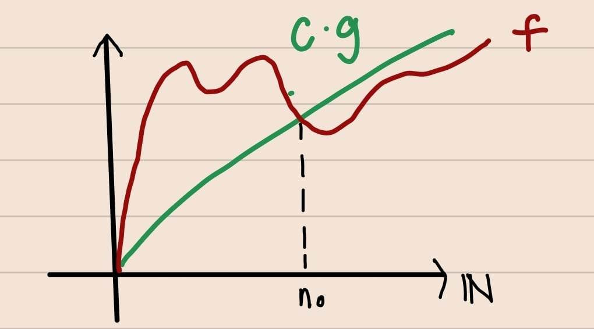
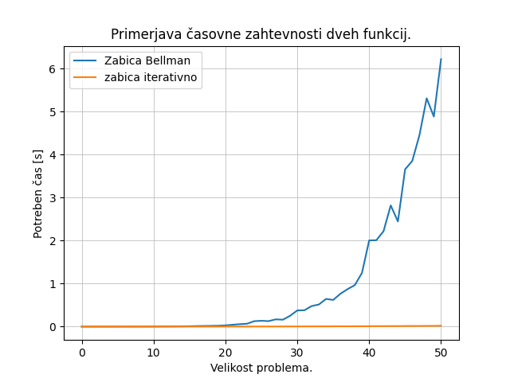
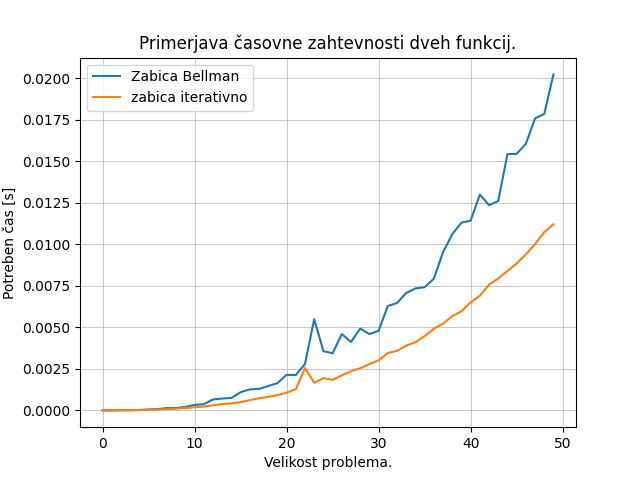
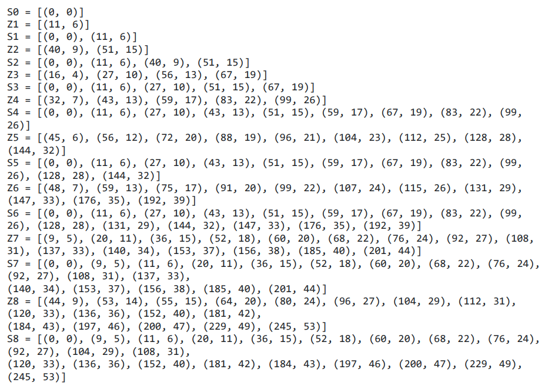
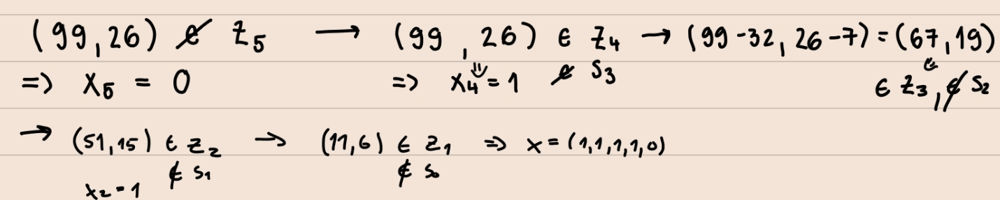
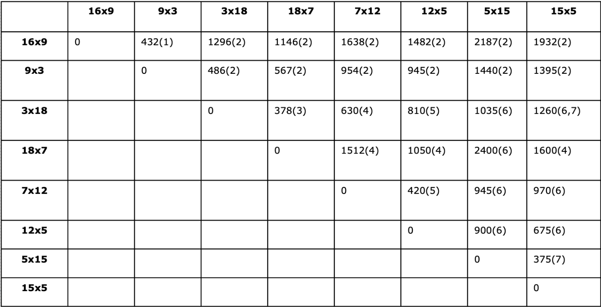
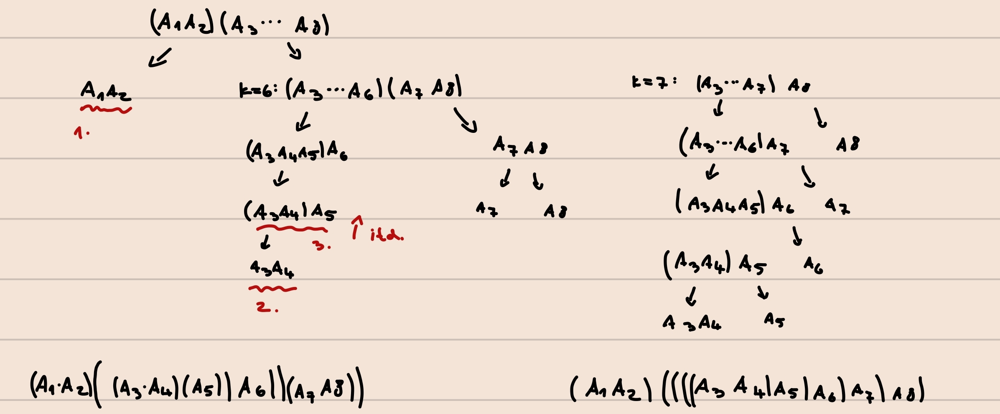
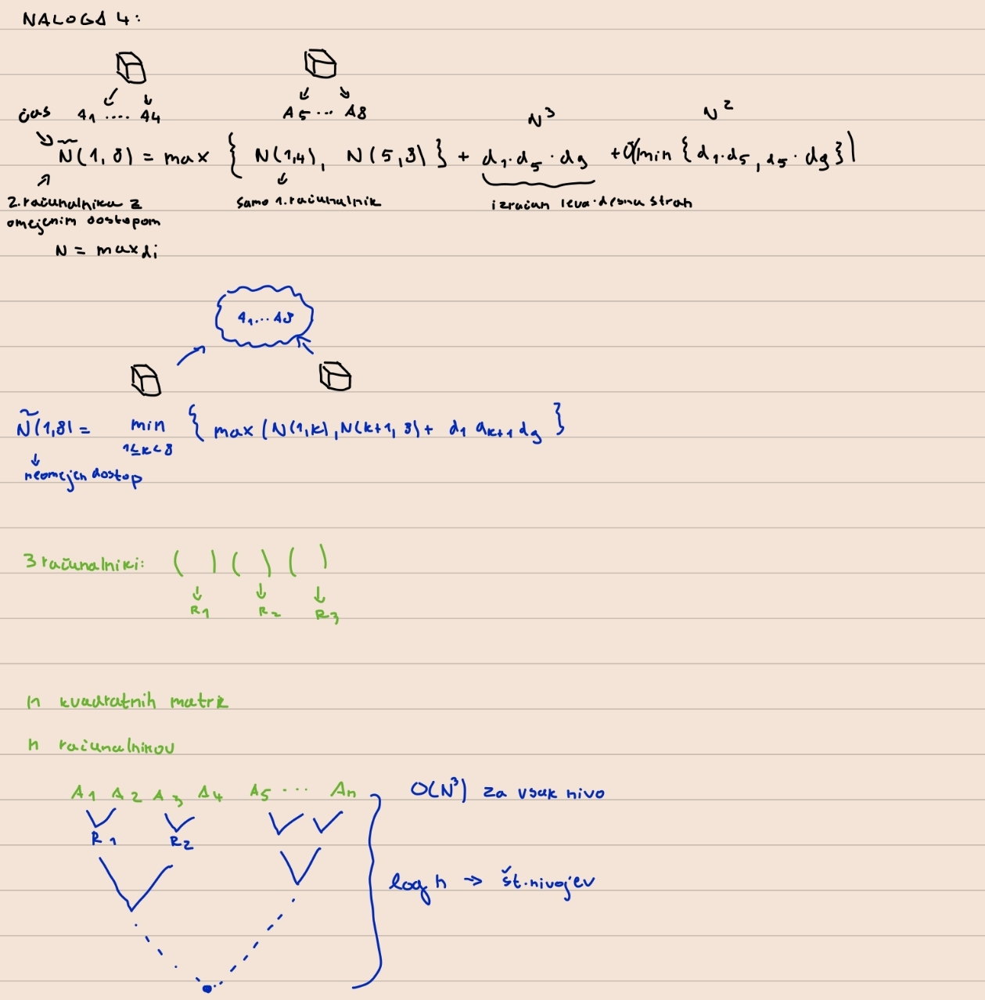

# **POROČILO 1. DEL**

**Ime:** Adnan Pajalić

## **Vsebina**
* Vaje 1 (15.2.2023)
* Vaje 2 (22.2.2023)
* vaje 3 (1.3.2023)
* vaje 4 (8.3.2023)

---

## **Vaje 1**

**Datum**: 15.2.2023

### **Povzetek**:
Na uvodnih vajah smo se najprej pogovorili o načinu dela. Dogovorili smo se, kako bodo vaje potekale in kako naj bi izgledala oddaja poročil. Nato smo začeli s samo snovjo. Za začetek smo ponovili definicijo časovne zahtevnosti. Ogledali smo si tudi, kakšne so časovne zahtevnosti različnih tipov podatkovnih struktur v odvisnosti od operacij, ki jih želimo na njih izvajati.

V drugem delu smo začeli z reševanjem nalog iz dinamičnega programiranja. Skupaj smo si pogledali nalogo "Žabice" iz spletne strani Tomo. Idejo smo zapisali na tablo, v zadnjih minutah pa smo jo sami implementirali na računalnik.

### **Komentarji in opombe**:
Na uvodnih vajah mi je bil všeč pristop k reševanju nalog. Najprej smo skupaj premislili, kako bi rešili določen problem in zapisali idejo rešitve na tablo. Po tem je na nas ostala le še implementacija, ki ne bi smela biti problematična, v primeru, da je ideja posamezniku razumljiva.

### **Naloga 1**

OPIS:\
Ponovitev časovne zahtevnosti in O notacije. Za podatkovne strukture v pythonu (seznam, slovar in verižni seznam) zapiši njihove časovne zahtevnosti za:
 
* dodajanje na začetku/sredini/koncu
* poizvedbe
* iskanje
* brisanje začetku/sredini/koncu

REŠITEV:\
Kaj pomeni $f \in O(g)$ za neki funkciji $f,g: \mathbb{N}\ \rightarrow \mathbb{R^+}\ ?$  
$f \in O(g) \iff \exists\ c\ \exists\ n_0 : f(n) \leq c \cdot g(n)$  



primer: $n \in O(n)$, kjer je $O(n)$  velikost vhodnih podatkov.


| operacija  | seznam          | množica/slovar | verižni seznam |
| :--------: | :-------------: | :------------: | :------------: | 
| dodaj(n)   | $O(1)$          | $O(1)$         | $O(1)/O(n)$  |
| dodaj(i)   | $O(n)$          | $O(1)$         | $O(1)/O(n)$  | 
| dodaj(0)   | $O(n)$          | $O(1)$         | $O(1)/O(n)$  | 
| dostop     | $O(1)$          | $O(1)$         | $O(n)$       | 
| $x$ in     | $O(n)$          | $O(1)$         | $O(n)$       | 
| briši(0)   | $O(n)$          | $O(1)$         | $O(1)/O(n)$  | 
| briši(i)   | $O(n)$          | $O(1)$         | $O(1)/O(n)$  | 
| briši(n)   | $O(1)$          | $O(1)$         | $O(1)/O(n)$  | 


**opomba:** $n$ predstavlja velikost podatkovne strukture. V zadnjem stolpcu zgornje tabele je časovna zahtevnost operacij odvisna od tega, ali je v verižnem seznamu kazalec na mestih, kamor vstavljamo podatke. Če imamo ustrezne kazalce, potem je časovna zahtevnost reda $O(1)$ sicer pa $O(n)$. Pri operaciji brisanje je ideja v tem, da ko izbrišemo podatek, moramo vse ostale podatke zamakniti za eno mesto nazaj. zato je časovna zahtevnost $O(n)$, razen v primeru, ko brišemo s konca, saj ni potrebno zamikati podatkov.

### **Naloga 2**

OPIS:
Žabica se je izgubila v močvari in želi kar se da hitro odskakljati ven. Na srečo močvara vsebuje veliko muh, s katerimi si lahko povrne energijo, kajti utrujena žabica ne skoči daleč.

S funkcijo zabica(mocvara) želimo ugotoviti, kako hitro lahko žabica odskaklja iz močvare. Močvaro predstavimo s tabelo, kjer žabica prične na ničtem polju. Če je močvara dolžine $k$, je cilj žabice priskakljati vsaj na $k$-to polje ali dlje (torej prvo polje, ki ni več vsebovano v tabeli).

Energičnost žabice predstavimo z dolžino najdaljšega možnega skoka. Torej lahko žabica z količino energije $e$ skoči naprej za katerokoli razdaljo med $1$ in $e$, in če skoči naprej za $k$ mest ima sedaj zgolj $e - k$ energije. Na vsakem polju močvare prav tako označimo, koliko energije si žabica povrne, ko pristane na polju. Tako se včasih žabici splača skočiti manj daleč, da pristane na polju z več muhami. Predpostavimo, da ima vsako polje vrednost vsaj $1$, da lahko žabica v vsakem primeru skoči naprej.

V primeru $[2, 4, 1, 2, 1, 3, 1, 1, 5]$ lahko žabica odskaklja iz močvare v treh skokih, v močvari $[4, 1, 8, 2, 11, 1, 1, 1, 1, 1]$ pa potrebuje zgolj dva.

KODA 1: (Top-down)
```python
from functools import lru_cache

def zabica(mocvara):
    """Funkcija s pomočjo Bellmanove enačbe poišče najmanjše število skokov, da žabica zapusti močvaro"""
    @lru_cache(maxsize=None)

    def min_skokov(k, e):
        if k >= len(mocvara):
            return 0
        else:
            e += mocvara[k]
            return 1 + min([min_skokov(k+d, e-d) for d in range(1, e+1)]) 
    
    return min_skokov(0, 0)
```


KODA 2: (Iterativni način)
```python 
def zabica_iterativno(mocvara):
    """Iterativni postopek za iskanje najmanjšega števila skokov"""
    n = len(mocvara)
    dp = [[0] * (n + 1) for _ in range(n + 1)]

    for i in range(n + 1):
        dp[n][i] = 0
        dp[n - 1][i] = 1

    for i in range(n - 1, -1, -1):
        for j in range(n - 1, -1, -1):
            m = n
            e = j
            e += mocvara[i]

            if i + j > n:
                dp[i][j] = 1
                continue

            for d in range(1, e + 1):
                if i + d >= n:
                    m = 0
                else:
                    if e - d >= n:
                        m = 1
                    else:
                        m = min(m, dp[i + d][e - d])
            dp[i][j] = 1 + m
    return dp[0][0]
```

**Primerjava časovne zahtevnosti**

* Prva Funkcija uporablja pristop top-down in memoizacijo s pomočjo `lru_cache`, ki omogoča hitrejšo izvedbo funkcije, saj se že izračunane vrednosti shranijo v pomnilnik. S tem se izognemo ponovnemu izračunu že izračunanih vrednosti in tako pospešimo izvedbo funkcije.
Časovna zahtevnost prve kode je $O(2^n)$, saj s pomočjo rekurzivnega klica preverjamo vse možne kombinacije skokov, ki jih žabica lahko izbere.

* Druga funkcija uporablja pristop bottom-up in sproti računa vrednosti, ki si jih shranjuje. Časovna zahtevnost tega pristopa je $O(n^3)$, saj imamo tri zaporedne gnezdene zanke. V prvih dveh zankah iteriramo $n$-krat, v tretji gnezdeni zanki pa v najslabšem primeru prav tako. 

Spodnji graf nam prikazuje časovne zahtevnosti obeh pristopov in potrjuje opisane predpostavke o časovni zahtevnosti.



---
## **POPRAVEK ANALIZE ČASOVNE ZAHTEVNOSTI**
Po ponovnem razmisleku in poigravanju s funkcijo `analiza_casovna_zahtevnosti` sem prišel do drugačnega zaključka, glede primerjave obeh metod, na primeru naloge `zabica`. Tokrat sem generiral za tabelo energij generiral sezname naključnih števil, ki so bile omejene z energijo 5. Na ta način nam graf interpretira primerjavo obeh metod na drugačen način. V tem primeru sta obe metodi približno enake časovne zahtevnosti, oziroma je metoda z oporabo Bellmanove enačbe kanček počasnejša. Razlog, da je v prvi primerjavi prišlo do napačne interpretacije podatkov je v tem, da v primeru generiranja prevelikih naključnih energij, naša žabica lahko odskaklja iz močvare v morda dveh ali treh skokih, saj si z nekim potencialnim skokom lahko pridobi dovolj energije, da takoj odskaklja ven iz močvare. Spodnji graf nam torej pove, da sta časovni zahtevnosti obeh metod približno enakega reda. Pri podobnih časovnih analizah je potrebno biti pazljiv, saj nam generiranje napačnih začetnih podatkov lahko poda napačno interpretacijo analize časovne zahtevnosti. 



---

## **Vaje 2**

**Datum**: 22.2.2023

### **Povzetek**:
Začeli smo s ponovitvijo problema 0/1 nahrbtnika. Imamo nahrbtnik z volumnom $V$ v katerega želimo spraviti predmete tako, da maksimiziramo vsoto cen predmetov, ki jih imamo v nahrbtniku. Gre za tipičen primer dinamičnega programiranja, ki ima 4 možne verzije. Mi smo si ogledali način, kjer predmete ne delimo, predmeti pa se ne ponavljajo t.j. nimamo več kopij enakega predmeta. Nadalje smo skupaj na tablo rešili nekaj primerov, kjer smo uvedli množice S in Z, s katerimi pridemo do rešitve hitreje kot z zapisom Bellmanove enačbe.

### **Komentarji in opombe**:
Poudariti moram ponovno, da je način reševanja na tablo zelo učinkovit in veliko bolje kot, da bi se vsi usedli za svoj računalnik programirali sami.

### **Naloga 1**
OPIS:\
Ponovitev 0/1 nahrbtnika. Bellmanova enačba  ter S in Z množice.

Rešimo naslednja vprašanja: Dani so predmeti:

| i        |  1  |  2  |  3  |  4  |  5  |  6  |  7  |  8  |
| :------: | :-: | :-: | :-: | :-: | :-: | :-: | :-: | :-: | 
| velikost | 11  | 40  | 16  | 32  |  45 | 48  |  9  | 44  |
| vrednost | 6   | 9   | 4   |  7  |  6  |  7  |  5  |  9  |

Ker postopek reševanja s pomočjo dinamičnega programiranja zelo dobro obvladamo, smo zlahka
prišli do naslednjih množic:



1. Pri prepisu množice Z5 je pri natanko enem paru prišlo do napake. Kateri par je napačen in kakšen bi moral biti? Opiši, kako lahko napako ugotovimo, ne da bi šli Z5 računati na novo.

2. Če imamo na voljo 160 enot prostora, kakšna je optimalna vrednost nahrbtnika?
   
3. Koliko neizkoriščenega prostora nam ostane, če optimalno napolnimo nahrbtnik velikosti 110 s prvimi petimi predmeti. Kakšna je ta optimalna vrednost polnitve? Opiši vse možne načine, kako dosežemo to optimalno vrednost!

4. Skiciraj graf funkcije, ki pokaže, kako se v odvisnosti od razpoložljivega prostora spreminja optimalna vrednost nahrbtnika, če imamo na voljo prvih 6 predmetov in 6. predmet moramo dati v nahrbtnik.

5. Ugotovili smo, da imamo na voljo še en predmet, in sicer velikosti 15 in vrednosti 4 (torej je na voljo 9 predmetov). Kakšna je optimalna vrednost nahrbtnika, ki ima 180 enot prostora? Opiši vse možne načine, kako dosežemo to optimalno vrednost!

REŠITEV:\
Ponovimo najprej problem 0/1 nahrbtnika.

Vhodni podatki: 
* predmeti $(v_i, c_i)$ za $i = 1 \dots n$ 
* velikost nahrbtnika $W$


Izhdoni podatki:
* $X = (x_1, \dots ,x_n)$, kjer je 
$$
x_i = 
\left \{ \begin{array}{ll}
1; \text{vzamemo i-ti predmet}\\
0; \text{sicer}
\end{array}
\right. 
$$ 
(vzamemo i-ti predmet ali pa ga ne vzamemo)
* $\sum\limits_{i=1}^{n}v_i \cdot x_i \leq W$ (v nahrbtnik ne moremo dati več, kot je volumen nahrbtnika)
* $max\{\sum\limits_{i=1}^{n}c_i \cdot x_i\}$ (iščemo predmete, ki nam prinesejo največjo ceno)

Z $G(i,W)$ označimo maksimalno vrednost nahrbtnika s predmeti $1, \dots ,i$ in velikostjo $W$. Bellmanova enačba za problem 0/1 nahrbtnika je sledeča: $G(i,W) = max\{G(i-1,W), G(i-1, W-v_i) + c_i\}$. Robni pogoj pa je: 
$$
G(0,W) = 
\left \{ \begin{array}{ll}
-\infty; w < 0 \\
0; w \ge 0 
\end{array}
\right. 
$$ 

Toda reševanje na način od zgoraj navzdol (top-down) je v tem primeru zelo počasen, saj dejansko pregledamo vse možne kombinacije predmetov v nahrbtniku. Ker je premetov $n$ in imamo za vsak predmet dve možnosti, torej ali ga damo v nahrbtnik ali ne, je časovna zahtevnost reda $O(2^n)$. Zato se problema lotimo na drugačen način, kot z tako imenovano silo (brut force).

Uvedemo množice $S$, $Z$. Ker je $G(i,W)$ odsekoma konstantna funkcija, je dovolj, če si zapomnimo samo točke, kjer se zgodi skok. Označimo s $S_i = množica \ parov\ (W,C), ki\ opisuje\ G(i,W)$. Velja $S_0(0,0)$. Označimo z $Z_i = množica\ parov\ (W,C), ki\ opisuje\ G(i,W), pri\ čemer\ i-ti\ predmet\ vzamemo$. Množico $Z_i$ izračunamo kot $Z_i = S_{i-1} + (v_i, c_i)$ za vsak par $(w,c)$ in $S_i$. Množico $S_i$ dobimo z "zlitjem" množic $S_{i-1}$ in $Z_i$, tako da vzmamemo maksimum odsekoma naraščajočih funkcij na posameznem intervalu. Časovna zahtevnost je na ta način reda $O(n\cdot W)$. S tem smo bistveno optimizirali čas.

ODGOVORI NA VPRAŠANJA:
1. Vrednost $(a, b)$ predstavlja velikost in ceno predmeta. Napaka se pojavi pri tretjem paru v tabeli. Množico $Z_5$ dobimo kot $Z_5 = S_4 + (45, 6)$, kjer je $(45, 6)$ velikost in cena petega predmeta. Namesto $(72, 20)$ bi na tem mestu morala biti vrednost $(72, 16)$. Brez računanja bi napako lahko opazili s primerjanjem vrednosti zaporednih cen. Ker vemo, da je funkcija $Z_i$ naraščajoča funkcija, mora biti vsaka naslednja vrednost večja. Na prehodu iz tretjega na četrti element se cena zmanjša, kar nakazuje, da se tu skriva napaka.

2. V $S_8$ pogledamo prvi manjši par $(w, c)$, tako da $w \leq 160$. Torej ta par je $(152, 40)$ in optimalna vrednost je 40.

3. Pogledamo v $S_5$, ker ni bilo eksplicitno podano ali vzamemo 5-ti element. Poiščemo par $(w,c)$, kjer $w \leq 110$ in vrednost $w$ najbližja 110. To je par (99, 26), torej neizkoriščenega prostora imamo 11, optimalna vrednost p aje 26. Vse možne načine razberemo iz spodnje slike:



4. Ker vzamemo 6. element opazujemo torej $Z_6$. (uporabil sem sliko od sošolke Zale Duh) 


5. 
**1. Način:**
Če želimo dodati še en predmet moramo izračunati še množico $S_9$ in iz nje razbrati optimalno vrednost. Zato moramo izračunati še množico $Z_9 = S_8 + (15, 4)$ in zliti $Z_9$ ter $S_8$.

**2. Način:** (Sliko sem si izposodil od Zale Duh)
Pomagamo si z Bellamnovo enačbo: $G(9,180) = max\{G(8,180), G(9, 165) + 4\}$
iz $S_8$ razberemo:

$G(8, 180) = 40$\
$G(8,165) + 4 = 44$\
in tako dobimo, da je optimalna vrednost nahrbtnika s 180 enot prostora 44.


### **Naloga 2**
OPIS:\
Na voljo imamo seznam pozitivnih naravnih števil **sez** in naravno število $S$. Zanima nas, ali lahko $S$ zapišemo kot vsoto števil iz **sez**. 

Recimo: $sez = [3, 34, 4, 12, 5, 2]$, $S = 9$ vrne **True**, saj je $9 = 4 + 5$.

Zapiši dinamični problem (Bellmanovo enačbo) ter oceni časovno zahtevnost.

Kako bi še lahko rešil ta problem (z uporabo 0/1 nahrbtnika)?

REŠITEV:\
Dinamično:
$$ 
vsota(i,S) =
\left \{ \begin{array}{ll}
true; &\text{če S lahko zapišemo kot vsoto } [s\_1,\dots,s\_n] \\
false; &\text{sicer} 
\end{array}
\right. 
$$

Bellmanova enačba: $vsota(i,S)= vsota(i-1,S-s_i) \lor vsota(i-1,S)$

Robni pogoji:
* $vsota(i,S)=true \dots S_i = S$ 
* $vsota(0,0)=true$  
* $vsota(i,0)=false \dots i > 0$

---

## **Vaje 3**

**Datum**: 1.3.2023

### **Povzetek**:
Na vajah smo se razdelili v pare in izvedli tekmovanje. Na Tomu smo reševali naloge iz dinamičnega programiranja. Zmagovalna ekipa je bila za nagrado oproščena pisanja poročila za tokratne vaje. Na žalost nisem bil del te ekipe, zato pišem pišem poročilo za vaje 3. Minimalna zahteva je bila, da vsak par reši vsaj 4 naloge. Proti koncu vaj smo si še pogledali samo idejo rešitve za vse podnaloge.

### **Komentarji in opombe**:
Odlična ideja za izvedbo vaj. S tekmovanjem smo se vsi angažirali k reševanju nalog. Menim, da bi morali na tak način izvesti večino vaj, kjer bi vsakič zamenjali pare, tako da bi se vsak študent naučil dela v skupini z vsemi kolegi. Čeprav so bile vaje za moje pojme dokaj težke, se je bilo v paru zagotovo lažje lotiti reševanja.

### **Naloga 1**

OPIS:\
Implementiraj funkcijo `optimalni_tovor(predmeti, W)`, ki vrne največjo skupno ceno predmetov, ki jih lahko trgovec natovori na letalo z maksimalno nosilnostjo `W`. Na primer:

> optimalni_tovor([(2,3), (4,4), (5,4), (3,2), (1,2), (15,12)], 7)\
> 8


KODA:
```python
from functools import lru_cache

def optimalni_tovor(predmeti, W):
    
    @lru_cache(maxsize=None)
    def max_cena(i, w):
        # Robni pogoji: 
        if w < 0: # v nahrbtnik ne moremo dati več kot je volumen
            return float("-inf")
        if i == 0 or w == 0: # zmanjkalo je predmetov oziroma je nahrbtnik poln
            return 0
        c = predmeti[i-1][0]    
        # Bellmanova enačba
        return max(c + max_cena(i-1, w-predmeti[i-1][1]), max_cena(i-1, w))
    
    # max_cena uporabimo za naš nahrbtnik
    return max_cena(len(predmeti), W)
```

### **Naloga 2**

OPIS:\
Implementiraj funkcijo `optimalni_predmeti(predmeti, W)`, ki vrne seznam predmetov
ki dosežejo največjo vrednost, če lahko na letalo natovorimo skupno težo največ `W`. Če je možnosti več, vrni katerokoli. Na primer:

> optimalni_predmeti([(2,3), (4,4), (5,4), (3,2), (1,2), (15, 12)], 7)\
> [(3, 2), (5, 4)]


KODA:
```python
from functools import lru_cache

def optimalni_tovor_zaloga(predmeti, W):

    # ustvarimo tabelo predmetov, kjer se i-ti predmet ponovi tolikokrat
    # kolikor je tretji element trojice pri i-tem predmetu v tabeli predmeti
    nov_seznam = []
    for predmet in predmeti:
        for _ in range(predmet[2]):
            nov_seznam.append(predmet)

    # Na nov_seznam uporabimo kodo iz prve naloge
    @lru_cache(maxsize=None)
    def max_cena(i, w):
        if w < 0:
            return float("-inf")
        if i == 0 or w == 0:
            return 0      
        c = nov_seznam[i-1][0]    
        return max(c + max_cena(i-1, w-nov_seznam[i-1][1]), max_cena(i-1, w))

    return max_cena(len(nov_seznam), W)
```

### **Naloga 3**
OPIS:\
Predpostavi, da ima sedaj trgovec na voljo neomejeno zalogo posameznih predmetov.
implementiraj funkcijo `neomejena_zaloga(predmeti, W)`, ki vrne najvišjo skupno ceno tovora na letalu z maksimalno nosilnostjo `W`. Na primer:

> neomejena_zaloga([(2,3), (4,4), (5,4), (3,2), (1,2), (15, 12)], 23)\
> 33


KODA:
```python
def neomejena_zaloga(predmeti, W):
    # Izračunamo koliko je predmet vreden: c(i) / v(i)
    koristnosti = sorted(predmeti, key = lambda x : x[0]/x[1], reverse = True)
    vrednost = 0
    # Vsakega predmeta vzamemo maksimalno kolikor gre, 
    # stem da začnemo jemati najkoristnejši predmet
    for predmet in koristnosti:
        koliko_vzame = W // predmet[1]
        vrednost += koliko_vzame * predmet[0]
        W -= koliko_vzame * predmet[1]
    return vrednost
```

### **Naloga 4**

OPIS:\
Letalski prevoznik je trgovcu ponudil opcijo, da mu ni treba pošiljati celotnih predmetov. Zapakira jih lahko v manjšo škatlo in jih naloži na letalo. Bolj natančno, za nek predmet $(c_i, v_i)$ lahko na letalo naloži predmet oblike $(c_i/r, v_i/r)$ za $r \in \{1,2,3,4\}$. Pri tem lahko na letalo naloži le en tip predmeta. Na letalu ne more tako biti recimo $1/2 + 1/3 = 5/6$ nekega predmeta. Implementiraj funkcijo `tovor_rezanje(predmeti, W)`, ki vrne koliko je sedaj največja  skupna cena tovora, če je nosilnost letala največ `W`. Rezultat vrni zaokrožen na dve decimalni mesti. Na primer:

> tovor_rezanje([(2,3), (4,4), (5,4), (3,2), (1,2), (15, 12)], 20)\
> 25.0


KODA:
```python
from functools import lru_cache

def tovor_rezanje(predmeti, W):
    
    @lru_cache(maxsize=None)
    def max_cena(i, w):
        # Robni pogoji kot do sedaj
        if w < 0:
            return float("-inf")
        if i == 0 or w == 0:
            return 0
        c = predmeti[i-1][0]
        v = predmeti[i-1][1]
        # Zapišemo ustrezno Bellmanovo enačbo. Pogledamo kako in katere predmete se najbolj splača spraviti v nahrbtnik.
        # Vzamemo lahko cel predmet, polovico, tretjino ali četrtino predmeta
        return max(c + max_cena(i-1, w-v), max_cena(i-1, w), c/2 + max_cena(i-1, w-v/2), c/3 + max_cena(i-1, w-v/3), c/4 + max_cena(i-1, w-v/4))
    
    return round(max_cena(len(predmeti), W), 2)
```

---

## **Vaje 4**

**Datum**: 8.3.2023

### **Povzetek**:
Na 4. vajah smo ponovili matrično množenje, ki smo ga spoznali na predavanjih. Gre za to, da želimo zmnožiti $n$ matrik tako, da za to opravimo čim manj operacij. Število načinov je eksponentega reda in izkaže se, da dobimo *Catalanovo* število. Na vajah smo skupaj rešili nekaj nalog različnih tipov in opisali Bellmanovo enačbo. 

### **Komentarji in opombe**:
Posebnih komentarjev in opomb glede teh vaj ni. Snov je bila lepo jasno obrazložena na večih različnih primerih. 

### **Naloga 1**

OPIS:\
Formuliraj problem množenja matrik in zapiši ustrezno Bellmanovo enčabo. Izračunajte problem za produkt matrik velikosti: 3x5, 5x4, 4x2, 2x3, 3x5, 5x4, 4x6, 6x3 v tem vrstnem redu.

REŠITEV:\
Vhodni podatki: 
* število matrik $A_1 \cdot A_2 \cdots A_n$
* dimenzije matrik: $dim(A_i) = d_i \times d_{i+1}$

Izhodni podatki:
* minimalno število množenj realnih števil za izračun produkta danih matrik $A_1 \cdot A_2 \cdots A_n$ (označimo z $N(1, n)$)

OPOMBA: $N(i,j)$ predstavlja minimalno število množenj realnih števil za izračun produkta danih matrik $A_i \cdots A_j$.

**Bellmanova enačba:** 
$$
\min\limits_{i \leq k<j} N(i,k) + N(k+1,j) + d_i \times d_{k+1} \times d_j
$$
,kjer je $N(i,i)=0$ robni pogoj.

i\j | $1_{(3\times 5)}$ | $2_{(5\times 4)}$  | $3_{(4\times 2)}$ | $4_{(2\times 3)}$ | $5_{(3\times 5)}$ | $6_{(5\times 4)}$ | $7_{(4\times 6)}$ | $8_{(6\times 3)}$ |
:-----:|:---:|:---:|:---:|:---:|:---:|:---:|:---:|:---:|
1|0|$60_{(1)}$|$70_{(1)}$|$88_{(3)}$|$130_{(3)}$|$164_{(3)}$|$224_{(3)}$|$242_{(3)}$|
2| |0|$40_{(2)}$|$70_{(3)}$|$120_{(3)}$|$150_{(3)}$|$218_{(3)}$|$224_{(3)}$|
3| | |0|$24_{(3)}$|$70_{(3)}$|$102_{(3)}$|$166_{(3)}$|$178_{(3)}$|
4| | | |0|$30_{(4)}$|$70_{(5)}$|$118_{(6)}$|$154_{(7)}$|
5| | | | |0|$60_{(5)}$|$132_{(6)}$|$168_{(6)}$|
6| | | | | |0|$120_{(6)}$|$132_{(6)}$|
7| | | | | | |0|$72_{(7)}$|
8| | | | | | | |0|

Vrednosti $(i,j)$ v zgornji tabeli dobimo z upoštevanjem Bellmanove enačbe.

### **Naloga 2**

OPIS:\
Recimo, da imamo izračunano tabelo $N(i,j) = (v, idx)$ iz Bellmanove enačbe, kjer je $v$ optimalno število operacij, $idx$ pa je seznam indeksov $k$, kjer je bil dosežen minimum pri združevanju podproblemov. Kako bi izračunali število vseh optimalnih produktov? Kakšna je časovna zahtevnost? Kaj pa če bi želel izpisati vse optimalne produkte?

REŠITEV:\
Z $S(i,j)$ označimo število načinov, na katere dobimo najmanjše število množenj matrik $A_i \cdots A_j$. Recimo, da je $k=l$. To pomeni, da je bil minimum dosežen pri sledečem množenju: $(A_1 \cdots A_l)\cdot (A_{l+1} \cdots{} A_n)$. Število optimalnih produktov za to množenje je $S(1,l) \cdot S(l+1,n)$. V splošnem pa $k \in \mathbb{N}$ lahko zavzame več vrednosti. Iz prejšnjega primera sledi, da je v splošnem $S(i,j)=\sum\limits_{k \in idx} S(i,k) \cdot S(k+1,j)$.

Iz uvodnih vaj vemo, da časovno zahtevnost izračunamo kot $število\ stanj \cdot število\ operacij$. Časovna zahtevnost našega problema je $O(n^2 \cdot n)$, kjer je $n^2$ število stanj (saj gresta $i$ in $j$ od 1 do $n$) in $n$ število operacij posameznega stanja.

### **Naloga 3**

 OPIS:\
 V spodnji tabeli imamo že izveden izračun za vse vrednosti N(i,j) za matrike podanih velikosti, kjer matrike štejemo od 1 dalje. V tabeli je v (i,j)-ti celici prikazano min_operacij(index kjer je bil dosežen min) .

Koliko je optimalno število operacij? Na kakšne načine lahko zmnožimo te matrike, da imamo toliko operacij?



REŠITEV:\
Optimalno število operacij preberemo iz desnega zgornjega kvadrata tabela. Optimalna vrednost je torej 1932. Da bi poiskali vse načine, na katere lahko zmnožimo matrike, da dobimo optimalno število operacij, zapišemo načine množenja v dvojiško drevo. Na vsakem nivoju problem razpade na množenje dveh matrik, dokler ne pridemo do listov. Pokažimo postopek na naslednjem primeru:



Vrednost 2 v zgornjem desnem kvadratu, ki je v oklepaju, nam pove, da je najbolj optimalen način, da zmnožimo matrike $A_1 \cdot A_2$ ter $A_3 \cdots A_8$. Problem tako razpade množenje leve matrike $M1 = A_1 \cdot A_2$in desne matrike $M2 = A_3 \cdots A_8$, ki ju moramo ponovno zmnožiti na optimalen način. Število operacij za množenje desne matrike preberemo v 3 vrstici in 8 stolpcu. Na tem položaju preberemo, da lahko $M2$ zmnožimo najbolj optimalno tako, da najprej zmnožimo matrike $A_3 \cdots A_6$ in $A_7 \cdot A_8$ ali pa $A_3 \cdots A_7$ in $A_8$. Postopek končamo, ko dosežemo liste na najnižjih nivojih drevesa in tako dobimo dvojiško korensko drevo z $n$ listi. Torej problem množenja izraza, ki ima $n$ členov, s pravilno postavljenimi oklepaji lahko predstavimo z dvojiškim drevesom z $n$ listi. Pravimo torej, da obstaja bijekcija med tema dvema problemoma.

### **Naloga 4**

OPIS:\
Podobno kot pri prejšnji nalogi imamo izračunano spodnjo tabelo (le da se to tabele številčijo od 0 naprej).

Odgovori na naslednja vprašanja:

* Koliko operacij potrebujemo, da jih optimalno zmnožimo?
* Kako jih mormao množiti?
* Kako optimalno zmnožimo matrike od 3 do 7?
* Koliko operacij potrebujemo, da optimalno zmnožimo prvih 5 matrik?
* Kako naj zmnožimo zadnje štiri matrike, da bo število operacij najmanjše?
* Ali si lahko pomagamo z izračunanimi podatki, če spremenimo število stolpcev zadnje matrike iz 3 na 4, da izračunamo novo optimalno množenje? Kaj moramo narediti?

REŠITEV:
* 242 operacij (desni zgornji element tabele)
* $(A_1(A_2 A_3))((((A_4 A_5)A_6)A_7)A_8)$
* $A_3(((A_4 A_5)A_6)A_7)$
* 130 operacij (preberemo v 1. vrstici in 5. stolpcu)
* $(A_5A_6)(A_7 A_8)$ (preberemo v 5 vrstici in 8 stolpcu)
* Zadnji stolpec bi poračunali od spodaj navzgor

### **Naloga 5**

OPIS:\
Pri tej nalogi bomo obravnavali primer, ko imamo na razpolago več kot en računalnik oziroma procesor. Kot vzorčni primer lahko vzamemo primer iz prejšnje naloge, bomo pa poizkušali povedat čim bolj splošno.

Predstavi nekaj strategij kako bi si pomagal z dodatnim računalnikom. Obravnavaj možnosti:

* en računalnik lahko obdela največ L (recimo 4) matrik.
* vseeno koliko matrik lahko obdela en računalnik.
* kaj če nas nekaj stane, da matriko prestavimo iz enega računalnika do drugega (recimo kopija matrike preko mreže v O(velikost matrike))?

Kaj se zgodi s številom operacij, ki jih moramo izvesti v zgornjih primerih? Ali se zmanjša/zveča? Kaj pa čas za izračun?

Kaj pa če imamo na razpolago tri računalnike. Lahko zgornje ideje posplošimo oz izboljšamo?

REŠITEV:\
Če imamo dva računalnika lahko polovico matrik podamo enemu, polovico pa drugemo računalniku. Na ta način pohitrimo problem množenja matrik, saj glavni problem razpade na dva manjša podproblema. Zapišemo lahko sledečo Bellmanovo enačbo za minimalen čas izvajanja operacij:



---