# **POROČILO 2. DEL**

**Ime:** Adnan Pajalić

## **Vsebina**
* Vaje 5 (15.3.2023)
* Vaje 6 (22.3.2023)
* vaje 7 (29.3.2023)
* vaje 8 (5.4.2023)
* vaje 9 (12.4.2023)
* vaje 10 (19.4.2023)

---

# **Vaje 5**

**Datum**: 15.3.2023

## **Povzetek**:
Na 5. vajah smo se začeli obravnavati grafe. Začeli smo z osnovnimi izrazi v grafu (vozlišča, povezave...) ter si pogledali, kako lahko graf predstavimo v Pythonu. Navedli smo tri najpogostejše primere ter njihove prednosti in slabosti. Nadalje smo spoznali kaj pomeni graf topološko urediti in se prepričali, kako pomemben koncept v teoriji grafov je to. 

## **Naloga 1**

**OPIS:**
Imamo graf $G = (V,E)$ z utežmi $\omega : E \mapsto A$, ki vsaki povezavi dodeli utež iz množice A. $V = \{1,...,n\}, E \subset \binom{v}{2}$

Navedi nekaj možnih podatkovnih struktur za predstavitev grafa $G$. Navedi nekaj prednosti oz. slabosti vsake izmed njih. Ponovi tudi, kaj je v grafu pot, sprehod in cikel.

**REŠITEV:**
Graf $G$ lahko predstavimo na več možnih načinov. Mi smo si pogledali tri najbolj pogoste predstavitve. Najprej si poglejmo nekaj oznak in pojmov, ki so sestavni deli grafa $G$.

- $V = \{1,...,n\}$ množica vozlišč, ki sestavljajo graf,
- $E \subset \binom{v}{2}$ množica povezav grafa $G$,
- $n = |V|$ število vozlišč,
- $m = |E|$ število povezav,

1) **Matrika sosednosi $A$ (tabela tabel):**

    $A$ je matrika dimenzij $n \times n$ s sledečim predpisom:
    
    $$ A[i][j] = \left \{\begin{array}{ll}
    \omega(i,j) & , (i,j) \in E \\ 
    \text{None} &\text{, sicer}
    \end{array}
    \right. $$

    Primer matrike $A$: 
    $$ A = \begin{bmatrix}1 & 2 & None & None & \dots & 17\\
    &\\
    &\\
    &\\
    \end{bmatrix} $$

2) **Seznam sosednosti $G$:**
    
    $G$ je seznam seznamov dolžine $n$ s predpisom:  
    $G[i] = [(j, w(i,j)\ \text{za vsak j, da je (i, j) povezava})]$  

    Prednost predstavitve s pomočjo seznama sosednosti v primerjavi z matriko sosednosti je v tem, da lahko takoj dostopamo do določenega vozlišča in nam ni potrebno izračunati vseh povezav na grafu.

3) **Slovar sosednosti $G$:**
    
    $G$ je seznam slovarjev dolžine $n$.   
    $G[i] = \{j: w(i,j)\ \text{za}\ \forall\ j, \text{da je} (i,j)\ \text{povezava}\}$

    |     |Prostorska zahtevnost|ali sta $(i,j)$ soseda?   |Sosedi od $i$|
    | :-: |:-------------------:|:------------------------:|:-----------:| 
    | a)  |$O(n^2)$             |$O(1)$                    |$O(n)$|               
    | b)  |$O(n + m)$           |$O(\small{deg(i)}) = O(n)$|$O(1)$       | 
    | c)  |$O(n+m)$             |$O(1)$                    |$O(n)$/$O(1)$|

    Prostorska zahtevnost v b) in c) primeru je $O(n+m)$, ker moramo za graf za vsako vozlišče hraniti vse povezave (glej: lema o rokovanju, ki ji "prištejemo" število vozlišč).
    
    $\sum\limits_{i=1}^{n} deg(i) + 1 = 2|E| + |V| = O(m+n)$  ---> Lema o rokovanju

Zaporedje točk $v_0 v_1 \dots v_k$ grafa $G$ je *sprehod* dolžine $k$, če $v_i \sim v_{i+1}$ za $0 \leq i < k$, kjer $v_i \sim v_{i+1}$ pomeni, da sta vozlišči sosednji. Sprehod, na katerem so vse točke različne, je *pot*. Enostaven sklenjen sprehod z vsaj eno povezavo, na katerem sta enaki le prva in zadnja točka, pa je *cikel* grafa. 

## **Naloga 2**

**OPIS:**
Usmerjenemu grafu $G$ z $n$ vozlišči, ki nima ciklov rečemu tudi DAG (directed acyclic graph). Vozlišča takega grafa lahko topološko uredimo. To pomeni, da obstaja zaporedje vozlišč $(v1,v2,\dots,v_n)$, tako da ne obstaja povezava od $v_i$ do $v_j$, če je $j < i$.

Sestavi algoritem, ki najde tako zaporedje. Namig: Katera vozlišča lahko zagotovo damo na prvo mesto v to ureditev? 

**REŠITEV:**
Na spodnji sliki je naveden primer topološke ureditve grafa. Na prvo mesto postavimo vozlišča, v katera ne kaže nobena povezava. Nadaljujemo tako, da iz grafa izbrišemo vozlišča, ki smo jih že postavili v vrsto. Nadalje ponovno v vrsto vstavimo tista vozlišča, v katera ne kaže nobena povezava. Pomembno je opoziriti na to, da je možnih več topoloških ureditev, torej topološka ureditev v splošnem ni enolično določena. Topološko urejenanje se pri računalniških algoritmih pogosto pojavlja in je pomemben koncept v teoriji grafov. 

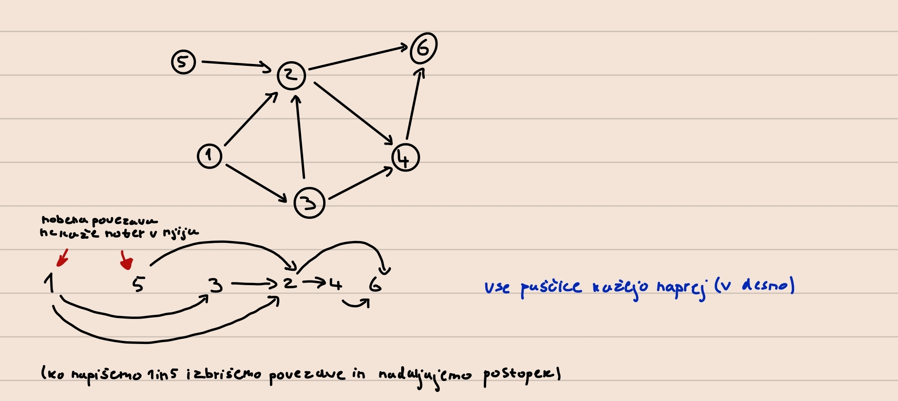

Psevdokoda topološke ureditve grafa v Pythonu

``` python
def topo_sort(G):
    """
    Sprejme graf G kot seznam sosednosti in vrne njegovo topološko ureditev.
    """
    n = len(G)
    in_deg = [0] * n # in_deg[i]: število povezav, ki kažejo v i
    for i in range(n): # Čez vsa vozlišča
        for j in G[i]: # Čez vse sosede
            in_deg[j] += 1 # Imamo povezavo od i do j
        izvori = [i for i in range(n) if in_deg(i) == 0] 
        rezultat = []
        while(izvori):
            izvor = izvori.pop()
            rezultat.append(izvor)
            for sosed in G[izvor]:
                in_deg[sosed] -= 1
                if in_deg[sosed] == 0:
                    izvor.append(sosed)
    return rezultat
```

**Časovna zahtevnost algoritma:**
- for zanka: $O(n+m)$
- izvori: $O(n)$
- while zanka: $O(n+m)$
- **skupaj: $O(n+m)$**

## **Naloga 3**

**OPIS:**
Naj bo sedaj $G$ usmerjen utežen graf brez ciklov. Kako bi izračunal ceno najdaljše poti v tem grafu med vozliščema $s$ in $t$.

**REŠITEV:** Namig: razmišljaj dinamično.  

$D[i] =$ najdaljša pot od $i$ do $t$

$D[t] = 0$

$D[i] = max_{(j , \omega) \in G[i]}\{ D[j] + \omega \}$

Graf uredimo topološko, poiščemo kje se $t$ nahaja v topološki ureditvi in seznam $D$ polnimo v obratni topološki ureditvi.

---

# **Vaje 6**

**Datum**: 22.3.2023

## **Povzetek**:
Na vajah 6 smo spoznali nekaj novih algoritmov za iskanje najkrajših poti v grafu. Najprej smo si ogledali algoritma BFS in DFS, kjer smo se prvega lotili natančneje. Prvi naredi pregled grafa v širino drugi pa v globino. BFS lahko med drugim uporabimo za iskanje najkrajših poti od nekega vozlišča do vseh ostalih, kjer je graf neutežen. V nadaljevanju smo spoznali Floyd-Warshalov algoritem, ki ga uporabljamo za iskanje najkrajših poti v uteženem grafu. FW algoritem vrne najkrajše poti med vsemi vozlišči grafa $G$. 

## **Naloga 1**

**OPIS:**
Ponovi BFS algoritem. Modificiraj ga, tako da bo iskal najkrajše poti v neuteženem grafu.

**REŠITEV:**  
- BFS (Breath first search)
- DFS (Depth first search)

DFS je algoritem, ki kot pove ime, pregleda graf v globino. Začne pregledovanje grafa v korenu (ali v nekem določenem vozlišču v primeru grafa) ter se pomika po eni veji dokler je to mogoče, preden se vrne nazaj v koren. S tem algoritmom se v nadaljevanju ne bomo pretirano ukvarjali. Za nas bo bolj zanimiv BFS algoritem, ki pregleda najprej vse sosede od korena, nato sosede od sosedov korena itd. Spoznali smo tudi kdaj lahko prepoznamo negativen cikel v grafu s pomočjo uporabe FW algoritma.

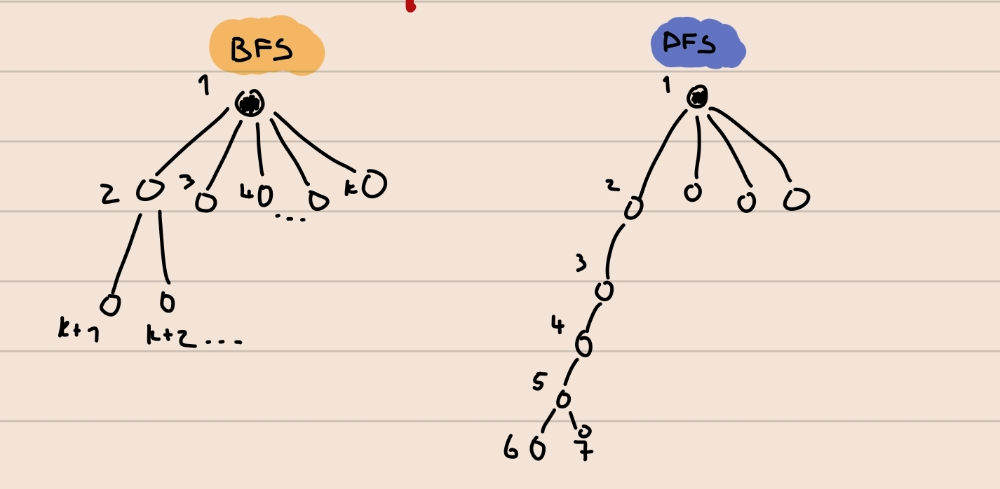

BFS uporabljamo za:
- pregled grafa,
- iskanje vpetega drevesa/gozda v grafu, povezanih komponent,
- preverjanje dvodelnosti grafa,
- iskanje najkrajših poti v neuteženem grafu.

Poglejmo si implementacijo BFS-ja, ki samo pregleda graf in ne vrača ničesar.

```python
from collections import Deque

def BFS(G, u):
    """ 
    Funkcija sprejme graf G predstavljen kot seznam sosedov 
    in štartno vozlišče u ter naredi pregled v širino.
    """
    n = len(G)
    obiskani = [False] * n
    q = vrsta([u]) # začnemo v u. V primeru DFS-ja to spremenimo v sklad

    while q:
        trenutni = q.popleft()
        if obiskani[trenutni] : continue # soseda smo že obiskali
        obiskani[trenutni] = True
        for sosed in G[trenutni]:
            if not obiskani[sosed]:
                q.push(sosed) # doda nov element v q
```

Sedaj pa si poglejmo modificiran BFS, ki poišče najkrajše poti v neuteženem.

```python
from collections import Deque

def BFS(G, u):
    """ 
    Funkcija sprejme graf G predstavljen kot seznam sosedov in štartno vozlišče 
    u ter vrne seznam najkraših poti od vozlišča u do vseh ostalih vozlišč.
    """
    n = len(G)
    d = [0] * n
    obiskani = [False] * n
    q = vrsta([(u,0)]) # začnemo v u. V primeru DFS-ja to spremenimo v sklad

    while q:
        trenutni, razdalja = q.popleft()
        if obiskani[trenutni]: continue # soseda smo že obiskali
        obiskani[trenutni] = True
        d[trenutni] = razdalja
        for sosed in G[trenutni]:
            if not obiskani[sosed]:
                q.push(sosed, razdalja+1) # doda nov element v q
    return d
```
**Časovna zahtevnost algoritma: $O(n+m)$**, kjer je $n$ število vozlišč in $m$ število povezav.

## **Naloga 2**

**OPIS:**
Ponovi Floyd-Warshallow algoritem. Kaj računa in kaj vrne? Kakšna je njegova časovna zahtevnost?

**REŠITEV:**  
VHOD: 
- utežen graf G (negativne uteži so dovoljenje).

IZHOD: 
- Matrika $D$ oz. $(D_{ij}(n))$ predstavljena kot seznam seznamov v Pythonu, dimenzije $n \times n$, kjer je $n$ število vozlišč,
- $D_{ij} \dots$ cena najkrajše poti med $i$-tim in $j$-tim vozliščem.

IDEJA:  
- $D_{ij}(k) = min \{D_{ij}(k-1), D_{ik}(k-1) + D_{kj}(k-1) \}$, kjer je $D_{i,j}(k)$ enako kot $D_{i,j}$, le da uporabljamo vozlišča od 1 do $k$.

ROBNI POGOJI:
- $D_{i,i} (1) = 0$
- $D_{1,i}(1) = \omega_{1,i}$ (utež povezave)

**Časovna zahtevnost algoritma: $O(n^3)$** ($n$ matrik krat $n^2$ elementov, kjer vsak izračun porabimo konstantno mnogo operacij).

**Prostorska zahtevnost algoritma: $O(n)$** (saj lahko operacije izvajamo samo na eni matriki in jo na vsakem koraku algoritma spreminjamo).

## **Naloga 3**

**OPIS:**
Simuliraj FW algoritem na spodnjem grafu.

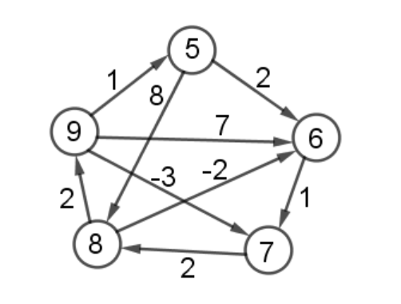

Nato dodamo vozlišče 10 in povezavo (5 -> 10) z utežjo -1 in (10 -> 6) z utežjo 2. Kako bi uporabil prejšnje rezultate, da bi izračunal nove najkrajše poti?

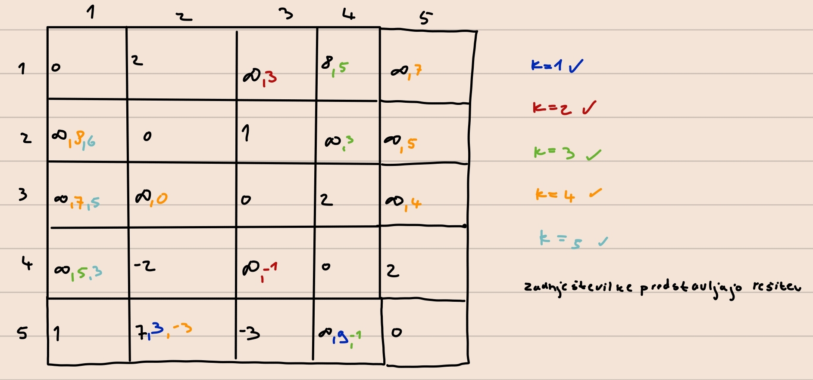

Ko dodamo novo vozlišče s povezavo, lahko uporabimo prejšnje izračune tako, da le dodamo novo vrstico in stolpec ter izračunamo elemente po enakem postopku. Če na diagonali dobimo negativen element, potem imamo negativen cikel v grafu.

## **Naloga 4**

**OPIS:**
Na predavanjih ste poleg izračuna matrike $D(n)$ izračunali tudi $P(n)$. Kaj lahko iz njih razberemo? Kako dobimo najkrajšo pot med $i$ in $j$?

**REŠITEV:**
Mesto $P_{i,j}$ v matriki $P(n)$ nam poda zadnje vozlišče v najkrajši poti med vozliščema $i$ in $j$.

Algoritem:
```python
def najkrajša_pot(i, j):
    """
    Vrne najkrajšo pot med vozliščema i in j.
    """
    sez = []
    zacetek = i
    konec = j
    while zacectek != konec:
        sez.append(konec)
        konec = P[i][j]
    sez.append(konec)
    return sez[::-1]
```

## **Naloga 5**

**OPIS:**
Kako bi s FW algoritmom odkrili, če v grafu obstajajo negativni cikli? Kaj vrne FW, če graf vsebuje negativen cikel?

**REŠITEV:**
V matriki, bi se na diagonali pojavilo negativno število. Na ta način bi vedeli, da v grafu obstaja negativni cikel.

---

# **Vaje 7**

**Datum**: 29.3.2023

## **Povzetek**: 
Na 7. vajah smo reševali naloge v povezavi s FW algoritmom in na koncu ponovili še Dijkstrin algoritem. Pogledali smo si kaj bi se zgodilo, če bi graf na katerem izvajamo FW algoritem malo modificirali. Rešili smo tudi eno zanimivo nalogo v kateri smo iskali arbitražne strategije s pomočjo teorije grafov in algoritmov, ki jih uporabljamo na grafih. Na ta način smo si pogledali, kako lahko povsem praktičen primer prevedemo na primer omrežja in ga rešujemo z znanimi algoritmi.

## **Naloga 1**

**OPIS:**
Iz prejšnjih vaj obravnavaj, kako razberemo najkrajše poti s pomočjo matrike $\Pi$, ki jo dobimo z FW algoritmom.

**REŠITEV:**
Ponovimo FW algoritem:

VHOD:
$D_{ij}(k) = min \{D_{ij}(k-1), D_{ik}(k-1) + D_{kj}(k-1) \}$. 

IZHOD: 
Matrika $D$ oz. $(D_{ij}(n))$ predstavljena kot seznam seznamov v Pythonu, dimenzije $n \times n$, kjer je $n$ število vozlišč. 

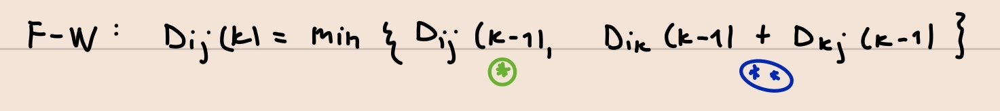

$\Pi_{i,j}(k)\dots$ zadnje vozlišče na $i-j$ poti, kjer smemo vmes uporabiti samo vozlišča od $1$ do $k$.

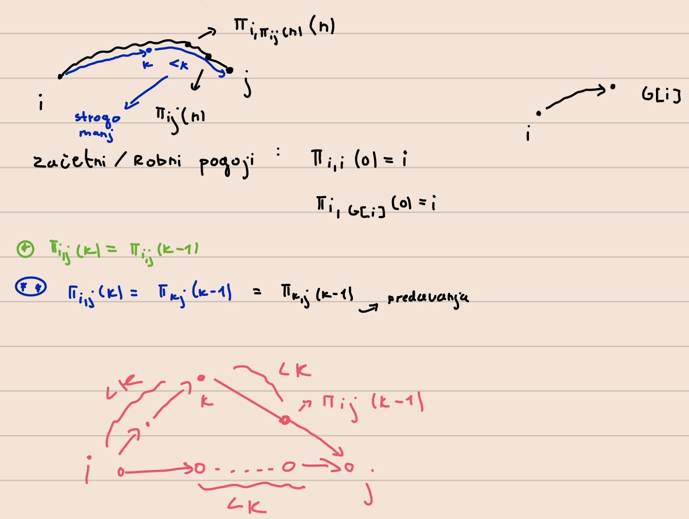

**Rekonstrukcija poti:**

VHOD: vozlišča $i,j$, matrika $\Pi(n) = \Pi$

IZHOD: najkrajša pot od $i$ do $j$

ALGORITEM:
```python
p = j
pot = []
while p != i:
    pot.append(p)
    p = Π[i][p] # starš vozlišča p
pot.append(i)
return pot.reverse()
```

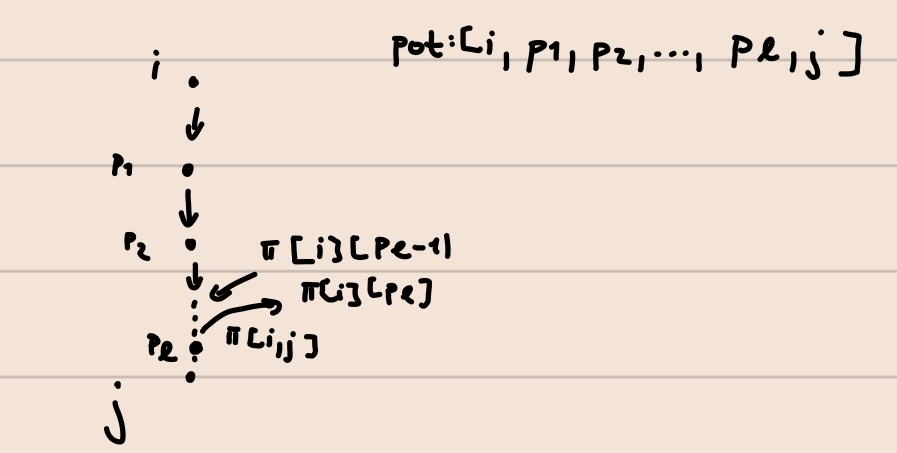

**Časovna zatevnost:**
$O(n)$, kjer je $n$ dolžina poti (v najslabšem primeru je dolžine $n$).

## **Naloga 2**

**OPIS:**
Uteži sedaj dodamo še na vozlišča. Kako sedaj poiskati najcenejše poti?

**REŠITEV:**  
Možne ideje:
- Prištejemo povezave, ki kažejo v to vozlišče,
- Prištejemo povezave, ki kažejo ven iz vozlišča.

Odločimo se glede na problem (smiselno obravnavamo začetno in končno vozlišče v poti).

## **Naloga 3**

**OPIS:**
Premisli, zakaj preprosta sprememba v FW algoritmu iz $min$ na $max$ ne najde nujno najdražje poti v grafu.

**REŠITEV:**

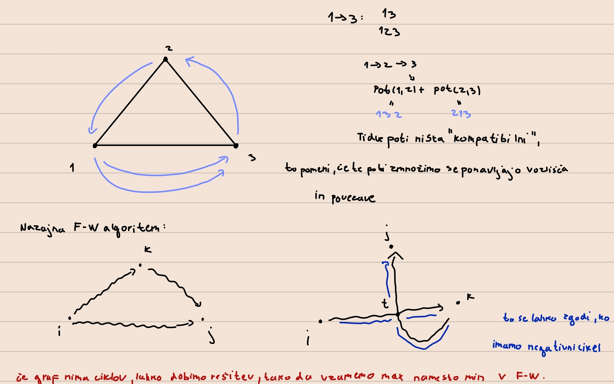

## **Naloga 4**

**OPIS:**
Na neki borzi se trgujejo valute po menjalnem tečaju, ki ga podaja tabela $R$ velikosti $n\times n$, kjer je $n$ število različnih valut. Vrednost $R[i][j]$ pove, da za $a$ enot valute $i$ dobimo $a\cdot R[i][j]$ enot valuje $j$. Ker menjalni tečaji lahko hitro spreminjajo in so odvisni od raznih parametrov se lahko zgodi, da $R[i][j]\cdot R[j][i] \neq 1$.

Za primer si oglejmo naslednjo shemo: 


Če trgujemo USD -> YEN -> EUR -> USD končamo z 1.44 USD. Tako zaporedje imenujemo arbitraža.

Predpostavi, da ne obstaja arbitražnih zaporedij. Kako bi poiskal najbolj ugodno pretvorbo valute $i$ v valuto $j$?

Kaj pa če sedaj opustimo predpostavko in dovoljujemo, da arbitražna zaporedja obstajajo. Kako bi odkril, kakšna so?

**REŠITEV:** 
Sestavimo graf $G(V, E)$, kjer so vozlišča valute, povezave pa menjalni tečaji. Na temu grafu nas zanima: "najdražja" pot v grafu $G(V, E)$ od $i$ do $j$. Ceno poti dobimo tako, da zmnožimo uteži na povezavah.

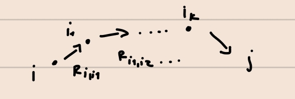

**Ideja: produkt pretvorimo na vsoto.**

ceno izračunamo na sledeč način: 

$$R_{i,i_1} \cdot R_{i_1,i_2} \cdots R_{i_k,i_1}$$

$$log(R_{i,i_1} \cdot R_{i_1,i_2} \cdots R_{i_k,i_1}) = \sum log(R)$$

Sedaj imamo najdražjo pot in neke uteži na grafu. Ker nas zanima najbolj ugodna pretvorba valute, utež na povezavi $ij$ nastavimo na $-log(R_{ij})$. Problem smo prevedli na iskanje najceneše poti od $i$ do $j$ v novem grafu. V ta namen bi si želeli uporabiti FW algoritem. To lahko storimo, če graf nima negativnih ciklov. Želimo pokazati, da jih naš graf res nima.

Dokazovanja se lotimo s protislovjem. Predpostavimo, da imamo negativen cikel od $i-i$. Cena tega cikla je: 

$$-(\sum\limits_{j=1}^k \log(R_{i_{j-1}, i_{j}})) < 0$$

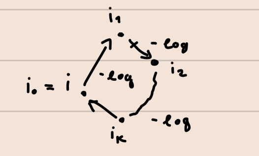

Enačbo pomnožimo z $-1$ in vsoto logaritmov zapišemo kot logaritem produktov:

$$\log (\prod\limits_{j=1}^k (R_{i_{j-1}, i_{j}})) > 0$$

Antilogaritmiramo in dobimo:

$$\prod\limits_{j=1}^k (R_{i_{j-1}, i_{j}}) > 1$$

Iz tega sledi, da imamo arbitražo, kar nas je pripeljalo do protislovja, saj smo predpostavili, da arbitražna priložnost ne obstaja. Od tod sledi, da graf ne premore negativnih ciklov.

Če opustimo predpostavko o neobstoju arbitraže, lahko arbitražna zaporedja odkrijemo tako, da izvedemo FW algoritem in preverimo, če obstaja negativen cikel v grafu. Negativni cikel (iz zgonjega dokaza) pomeni arbitražno strategiijo.

## **Naloga 5**

**OPIS:** Ponovi Djikstrov algoritem. Kaj so vhodni in izhodni podatki, kakšne so predpostavk, itd.

Zapiši tudi njegovo glavno idejo oziroma kar psevdo kodo.

**REŠITEV:**

Vhodni podatki: 
- usmerjen graf $G(V, E)$
- začetno vozlišče $s \in V$
- cene povezav $c_{i,j} \in E$ (cene povezav so nenegativne!)

Izhodni podatki:
- cene najcenejših poti od začetnega do $i$-tega vozlišča $\forall i \in V$ --> D
- drevo najkrajših poti od začetnega do $i$-tega vozlišča $\forall i \in V$ --> P

Psevdo koda:

```python
def dijkstra(G, s):
    """
    Vrne najkrajšo pot od s do vseh vozlišč v grafu G.
    """
    n = len(G)
    D = [float("inf")] * n
    P = [None] * n
    D[s] = 0 # D[i] pove razdaljo od s do i -> pri nas je i=s
    P[s] = s
    obiskani = [False] * n
    q = Vrsta(V(G)) # v vrsto dodamo še nedodana vozlišča ... list[range(n)]

    while len(obiskani) != n:
        c = q.popmin() # dobimo najmanjši element in ga odstrani iz seznama
        obiskani.add(c)

        for sosed, utez in G[c]:
            if sosed not in obiskani:
                if D[c] + utez + D[sosed]:
                    D[sosed] = D[c] + utez
                    P[sosed] = c
    return D, P
```

---

# **Vaje 8**

**Datum**: 5.4.2023

## **Povzetek**:
vaje 8 so bile najbolj zanimive do sedaj, saj smo reševali konkretne naloge v Pythonu. Naloge so se navezovale na teorijo grafov in algoritme za iskanje najkrajših poti. Tu smo se ukvarjali tudi s časovno analizo in hitrostjo BFS ter Dijkstrinega algoritma.

## **Naloga 1**

**OPIS:**
Vaša naloga bo, da uporabite ta algoritem na teh podatkih, torej:

- RoadNet-TX.txt spremenite v ustrezno podatkovno strukturo grafa.
- Poiščete najkrajše razdalje od vozlišča 100 do vseh ostalih.
- Koliko je razdalja dG(100, 100000)?
- Katero vozlišče je najbolj oddaljeno od vozlišča 100?
- Koliko vozlišč je dosegljivih iz vozlišča 100?

**REŠITEV:**
- Pretvorba datoteke v podatkovno strukturo grafa:

```python
from djikstra import *

def ustvari_graf(datoteka):
    """
    Funkcija prejme ime tekstovne datoteke, ki vsebuje usmerjene povezave in iz nje ustvari neutežen graf z usmerjenimi povezavami, predstavljen kot seznam sosednosti.
    """
    with open('Datoteke\\Vaje8\\' + datoteka, 'r') as datoteka:
        # prve 4 vrstice ne porebujemo, jih samo preberemo
        for _ in range(4):
            datoteka.readline()
        
        # napolnemo seznam povezav s povezavami iz datoteke roadNET-TX.txt
        sez_povezav = []
        for vrstica in datoteka:
            vrstica = vrstica.strip().split('\t')
            sez_povezav.append((int(vrstica[0]), int(vrstica[1])))

        # uredimo vozlišča po velikosti, da dobimo največje vozlišče, saj bo 
        # naš graf G, predstavljen kot seznam sosednosti, vseboval n+1 povezav
        sez_povezav.sort(key=lambda x: x[0], reverse=True)
        n = sez_povezav[0][0]

        # Ustvarimo seznam sosednosti, kjer so povezave usmerjene, uteži pa enake 1
        G = [[] for _ in range(n+1)]
        for povezava in sez_povezav:
            u = povezava[0]
            v = povezava[1]
            G[u].append((v, 1))
    return G
```

- poiščete najkrajše razdalje od vozlišča 100 do vseh ostalih.

Na tem mestu uporabimo implementacijo Djikstrinega algoritma, ki sprejme utežen graf $G$, predstavljen kot seznam sosednosti in vozlišče $s$. V našem primeru je graf neutežen, oziroma uteži so nastavljene na 1. V našem primeru je vozlišče $s$ enako 100. Dobili bomo seznam najkrajših razdalj od vozlišča 100 do vseh ostalih vozlišč. Izpišimo prvih nekaj razdalj.

```python
G = ustvari_graf("roadNet-TX")

# d - seznam najkrajših razdalj od vozlišča 100 do vseh ostalih
# p - drevo najkrajših poti od vozlišča 100 do vseh ostalih vozlišč
d, p = djikstra(G, 100)
print(d[:11]) # najkrajša razdalja od vozlišča 100 do prvih 10 vozlišč

# Rešitev
[10, 11, 9, 10, 10, 11, 12, 10, 9, 10, 10]
```

- Koliko je razdalja $d_G(100, 100000)$?

```python
# razdalja od vozlišča 100 do 100000
print(d[100000])

# Rešitev
240
```

- Katero vozlišče je najbolj oddaljeno od vozlišča 100?

```python
# Lahko se zgodi, da je več vozlišč na največji oddaljenosti od vozlišča 100
najvecja_razdalja = max(d)
najdaljsi = []
indeksi = []

for indeks, razdalja in enumerate(d):
    if najvecja_razdalja == razdalja:
        najdaljsi.append(razdalja)
        indeksi.append(indeks)
print(indeksi)
print(najdaljsi)

# Rešitev
[1389039, 1390394]
[717, 717]
```

- Koliko vozlišč je dosegljivih iz vozlišča 100?

```python
print(len(G[100]))

# Rešitev
2
```

## **Naloga 2**

**OPIS:**
Glede na to, da graf ni utežen, lahko za isto nalogo implementiramo BFS algoritem. Implementiraj BFS algoritem, ki bo poiskal dolžine najkrajših poti od $u$ do vseh ostalih vozlišč. Vrne naj tudi drevo najkrajših poti, tako kot Djikstra. Preveri iste zadeve kot zgoraj, dobiti moraš seveda iste odgovore.

**REŠITEV:**

```Python
from BFS import *

def ustvari_graf(datoteka):
    """
    Funkcija prejme ime tekstovne datoteke, ki vsebuje usmerjene povezave in iz nje 
    ustvari neutežen graf z usmerjenimi povezavami, predstavljen kot seznam sosednosti.
    Razlika v primerjavi s prejšnjo nalogo je v tem, da graf NI UTEŽEN.
    """
    with open('Datoteke\\Vaje8\\' + datoteka, 'r') as datoteka:
        # prve 4 vrstice ne porebujemo, jih samo preberemo
        for _ in range(4):
            datoteka.readline()
        
        # napolnemo seznam povezav s povezavami iz datoteke roadNET-TX.txt
        sez_povezav = []
        for vrstica in datoteka:
            vrstica = vrstica.strip().split('\t')
            sez_povezav.append((int(vrstica[0]), int(vrstica[1])))

        # uredimo vozlišča po velikosti, da dobimo največje vozlišče, saj bo 
        # naš graf G, predstavljen kot seznam sosednosti, vseboval n+1 povezav
        sez_povezav.sort(key=lambda x: x[0], reverse=True)
        n = sez_povezav[0][0]

        # Ustvarimo seznam sosednosti, kjer so povezave usmerjene, uteži pa enake 1
        G = [[] for _ in range(n+1)]
        for povezava in sez_povezav:
            u = povezava[0]
            v = povezava[1]
            # Ker bomo uporabili BFS graf ne sme vsebovati uteži!!!
            # Tu je razlika v primerjavi z nalogo1
            G[u].append(v)
    return G
```

```Python
from collections import deque

def BFS(G, s):
    """
    BFS vrne najkrajše poti od s do vseh ostalih vozlišč. Tu je s štartno 
    vozlišče, G pa je graf, ki je podan kot seznam sosednosti. Seznam d 
    predstavlja najkrajšo pot od vozlišča s do vseh ostalih.
    """
    n = len(G)

    # Nastavimo začetne vrednosti za sezname d, obiskani, in poti.
    d = [0] * n  
    obiskani = [False] * n
    poti = [-1] * n

    # Na vrsto dodamo trojico (v, d, p), kjer je: v vozlišče, d je razdalja, p 
    # pa prejšnje vozlišče na najkrajši poti od u do v.
    q = deque([(s, 0, s)])

    while q:
        u, razdalja, p = q.popleft()

        if obiskani[u]: 
            continue # smo ga že obiskali
        
        # obiščemo vozlišče ter nastavimo njegovo razdaljo
        # ter predhodnika na najkrajši poti od s do u
        obiskani[u] = True
        d[u] = razdalja
        poti[u] = p

        # gremo čez vse sosede in dodamo potrebne elemente na vrsto.
        for sosed in G[u]:
            if not obiskani[sosed]:
                q.append((sosed, razdalja + 1, u)) #doda nov element v q
    return d, poti
```

Če poženemo BFS na zgornjih nalogah dobimo enake odgovore. Testi so pripeti v datoteki `naloga2.py`. Odgovori so popolnoma enaki kot pri prvi nalogi.

## **Naloga 3**

**OPIS:**
Oba algoritma dodelaj, tako da dodaš nov vhodni podatek $t$, ki predstavlja končno vozlišče. Algoritma naj torej vrneta razdaljo med $s$ in $t$ v grafu ter poti (kot drevo) med njima. Delujeta naj, tako da se ustavita takoj ko najdemo željeno pot.

**REŠITEV:**
- Modificiran BFS algoritem:

```Python
from collections import deque

def BFS_modificiran(G, s, t):
    """
    BFS vrne najkrajše poti od s do vseh ostalih vozlišč. Tu je s štartno 
    vozlišče, G pa je graf, ki je podan kot seznam sosednosti. Seznam d 
    predstavlja najkrajšo pot od vozlišča s do vseh ostalih. Poleg tega 
    sprejme tudi končno vozlišče t in vrne najcenejšo razdaljo
    od s do t. Prav tako vrne drevo najkraših poti kot seznam, kjer
    je i-ti element oče vozlišča i-1.
    """
    n = len(G)

    # Nastavimo začetne vrednosti za sezname d, obiskani, in poti.
    d = [0] * n  
    obiskani = [False] * n
    poti = [-1] * n

    # Na vrsto dodamo trojico (v, d, p), kjer je: v vozlišče, d je razdalja, p 
    # pa prejšnje vozlišče na najkrajši poti od u do v.
    q = deque([(s, 0, s)])

    while q:
        u, razdalja, p = q.popleft()

        if obiskani[u]: 
            continue # smo ga že obiskali
        
        # obiščemo vozlišče ter nastavimo njegovo razdaljo
        # ter predhodnika na najkrajši poti od s do u
        obiskani[u] = True
        d[u] = razdalja
        poti[u] = p

        # če smo prišli do vozlišča s, skonstruiramo drevo poti
        # in vrnemo najcenejšo razdaljo od s do t
        if u == t:
            pot_do_t = [t]
            pred = poti[t]
            while pred != s:
                pot_do_t.append(pred)
                pred = poti[pred]
            pot_do_t.append(s)
            return d[t], pot_do_t

        # gremo čez vse sosede in dodamo potrebne elemente na vrsto.
        for sosed in G[u]:
            if not obiskani[sosed]:
                q.append((sosed, razdalja + 1, u)) #doda nov element v q
    return d, poti
```

- Modificiran Djikstrin algoritem:
  
```Python
import heapq
from collections import deque

def djikstra_modificiran(G, s, t):
    """
    Funkcija sprejme usmerjen in utežen graf G predstavljen
    s seznamom sosednosti ter začetno vozlišče s.
    Torej G[i] = [(v_1, w_1), ... (v_d, w_d)],
    kjer je (i, v_k) povezava v grafu z utežjo w_k.
    Vrne seznam razdaljeDo, ki predstavlja najkrajšo pot od vozlišča s
    do vseh ostalih.
    Vrne tudi seznam poti, ki predstavlja drevo najkrajših poti od s
    do vseh ostalih vozlišč.
    Poleg tega sprejme tudi končno vozlišče t in vrne najcenejšo razdaljo
    od s do t. Prav tako vrne drevo najkraših poti kot seznam, kjer
    je i-ti element oče vozlišča i-1.
    """
    n = len(G)
    
    # Nastavimo začetne vrednosti za sezname obiskani, razdaljaDo in poti.
    obiskani = [False] * n
    razdaljeDo = [-1] * n
    poti = [None] * n

    # Na vrsto dodamo trojico (d, v, p), kjer je:
    # v vozlišče, d razdalja do njega, p pa prejšnje vozlišče na najkrajši poti od
    # s do v.
    Q = [(0, s, s)]

    while Q:
        
        # Vzamemo minimalen element iz vrste
        # heapq.heappop(Q) odstrani element iz seznama Q, ter pri tem ohranja
        # lastnost kopice : seznam Q tretira kot dvojiško drevo!
        razdalja, u, p = heapq.heappop(Q)

        # če je že obiskan, nadaljujemo.
        if obiskani[u]:
            continue
        
        # obiščemo vozlišče ter nastavimo njegovo razdaljo
        # ter predhodnika na najkrajši poti od s do u
        obiskani[u] = True
        razdaljeDo[u] = razdalja
        poti[u] = p

        # če smo prišli do vozlišča s, skonstruiramo drevo poti
        # in vrnemo najcenejšo razdaljo od s do t
        if u == t:
            pot_do_t = [t]
            pred = poti[t]
            while pred != s:
                pot_do_t.append(pred)
                pred = poti[pred]
            pot_do_t.append(s)
            return razdaljeDo[t], pot_do_t
        
        # gremo čez vse sosede in dodamo potrebne elemente na vrsto.
        for (v, teza) in G[u]:
            if not obiskani[v]:

                # heap.heappush(Q, elem) doda element v seznam Q, kjer ohranja lastnost kopice.
                heapq.heappush(Q, (razdalja + teza, v, u))

    return razdaljeDo, poti
```

## **Naloga 4**

**OPIS:**
Zapiši funkcijo, ki sprejme začetno vozlišče $s$, končno vozlišče $t$ ter drevo najkrajših poti ter vrne najkrajšo pot med njima v obliki seznama.

Sedaj rekonstruiraj najkrajšo pot med vozliščem 100 in 100000.

**REŠITEV:**
```Python
from djikstra import *
from naloga1 import * 

def najkrajsa_pot(s, t, poti):
    """
    Funkcija sprejme začetno vozlišče s, končno vozlišče t ter drevo 
    najkrajših poti kot seznam, vrne pa najkrajšo pot med vozliščema 
    v obliki seznama.
    """
    pot_do_t = [t]
    predhodnik = poti[t]
    # dokler predhodnik ni začetno vozlišče 
    # v seznam dodajamo vozlišča 
    while predhodnik != s:
        pot_do_t.append(predhodnik)
        predhodnik = poti[predhodnik]
    pot_do_t.append(s) 
    return pot_do_t

if __name__=="__main__":
    G = ustvari_graf("roadNet-TX.txt")
    d, poti = djikstra(G, 100)
    najkrajsa_pot = najkrajsa_pot(100, 100000, poti)
    # preverimo ali se skonstruirana pot ujema s dijkstrinim algoritmom
    # odštejemo -1 saj ima pot eno manj povezavo kot vozlišč
    print(len(najkrajsa_pot)-1 == d[100000])
```

## **Naloga 5**

**OPIS:**
Analiziraj časovne zahtevnosti algoritmov. Primerjaj hitrost med djikstro in BFS-jem. Prav tako analiziraj razliko med djikstro, ki izračuna najkrajše poti od s do vseh ostalih ter jo primerjaj z tisto verzijo iz Naloge 3.

Če nas bi zanimale najkrajše poti od $s$ do $t_1, t_2, ..., t_k$, kateri algoritem bi uporabil? Probaj odgovor podat na podlagi parametra $k$, ter analize, ki si jo opravil.

**REŠITEV:**  
Najprej ustvarimo naključen graf s pozitivnimi utežmi, ki je predstavljen kot seznam sosednosti:

```Python
import random

def ustvari_graf(N):
    """
    Funkcija sprejme število N, ki predstavlja število vozlišč. Ustvari novo .txt 
    datoteko na katero zapiše nov graf z vozlišči od 0 do N. Vozlišča so oblike 
    (u, v) w(u, v), kjer je (u, v) povezava in w(u, v) je njena utež.
    """
    povezave = set()
    with open('ustvari_graf.txt', 'w') as datoteka:
        for u in range(N+1):
            st_povezav = random.randint(1, 10) 
            for _ in range(min(N, random.randint(1, 10))):
                v = random.randint(0, N) # ustvarimo vozlišče v katerega gre u
                while u == v:
                    v = random.randint(0, N)
                w = random.randint(1, 10) # določimo ceno te povezave
                if (u, v) in povezave:
                    continue
                povezave.add((u, v))
                datoteka.write(f"{u}\t{v}\t{w}\n")

def ustvari_G(ime_datoteke):
    """
    Funkcija sprejme ime_datoteke in ustvari graf G kot seznam 
    sosednosti iz vozlišč, ki so zapisana na tej datekeki.
    """
    with open(ime_datoteke + ".txt", "r") as datoteka:
        vrstice = datoteka.readlines()
        n = vrstice[len(vrstice)-1].split("\t")[0]
        G = [[] for _ in range(int(n)+1)]
        for vrstica in vrstice:
            u, v, w = vrstica.split("\t")
            G[int(u)].append((int(v), int(w)))
    return G
```


- **Primerjava časovne zahtevnosti Djikstre in BFS-ja:**

```Python
import matplotlib.pyplot as plt
from djikstra import djikstra
from BFS import BFS
import time
from ustvari_graf import ustvari_graf
from BF import ustvari_G

def izmeri_case():
    """
    Izmeri čase za Dijkstro in BFS.
    """
    casi = []
    for n in range(1000, 50001, 500):
        ustvari_graf(n)
        G = ustvari_G("ustvari_graf")
        zacetekD = time.time()
        g1 = djikstra(G, 0)
        konecD = time.time() - zacetekD
        zacetekBFS = time.time()
        g2 = BFS(G, 0)
        konecBFS = time.time() - zacetekBFS
        casi.append((n, konecD, konecBFS))
    return casi

def narisi():
    """
    Nariše graf za primerjanje Dijkstre in BF.
    """
    casi = izmeri_case()
    sez_x = [cas[0] for cas in casi]
    sez_D = [cas[1] for cas in casi]
    sez_BFS = [cas[2] for cas in casi]
    plt.plot(sez_x, sez_D, "r")
    plt.plot(sez_x, sez_BFS, "b")
    plt.title("BFS in Dijkstra")
    plt.xlabel("Število vozlišč")
    plt.ylabel("Potreben čas v [s]")
    plt.savefig("BFS-Djikstra-primerjava.png")
    plt.show()

if __name__ == "__main__":
    narisi()
```

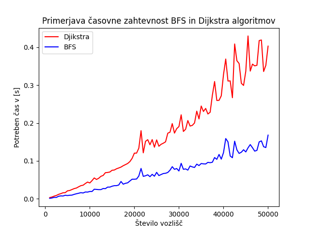

- **Primerjava časovne zahtevnosti Djikstre in BFS-ja od vozlišča s do t:**

```Python
def cas_pot(G, s, t):
    """
    Vrne potreben čas od začetnega vozlišča s do t za Djikstro in BFS.
    """
    d = []
    b = []
    for i in range(10):
        zacetni1 = time.time()
        r1 = djikstra_modificiran(G, s, t)
        koncni1 = time.time() - zacetni1
        d.append(koncni1)
    for _ in range(10):
        zacetni2 = time.time()
        r2 = BFS_modificiran(G, s, t)
        koncni2 = time.time() - zacetni2
        b.append(koncni2)
    return [sum(d) / 10, sum(b) / 10]

G = ustvari_G("ustvari_graf")
n = len(G)
def za_razlicne_k(n):
    casi = [[], [], []]
    for k in range(10, n, 2000):
        potreben_cas = cas_pot(G, 0, k)
        casi[0].append(k)
        casi[1].append(potreben_cas[0])
        casi[2].append(potreben_cas[1])
    return casi

def narisi_mod():
    """
    Nariše graf za primerjanje Dijkstre in BFS za neko končno vozlišče t, ki se spreminjajo.
    """
    casi = za_razlicne_k(len(G))
    sez_x = casi[0]
    sez_D = casi[1]
    sez_BFS = casi[2]
    plt.plot(sez_x, sez_D, "r", label="Djikstra")
    plt.plot(sez_x, sez_BFS, "b", label="BFS")
    plt.title("BFS in Djikstra pri različnih t in s = 0")
    plt.xlabel("k")
    plt.ylabel("Potreben čas [s]")
    plt.savefig("BFS_Djikstra_primerjava.png")
    plt.legend()
    plt.show()

if __name__=="__main__":
    narisi_mod()
```

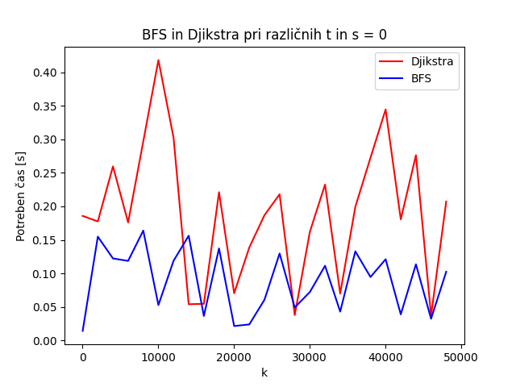


Če nas bi zanimale najkrajše poti od $s$ do $t_1, t_2, ..., t_k$, kateri algoritem bi uporabil?

- Uporabil bi BFS, saj je v obeh primerih deloval hitreje.

# **Vaje 9**

**Datum**: 12.4.2023

## **Naloga 2**

**OPIS:**
Konstruirajte nov graf, ki vsebuje le vozlišča od 0 do $N$.

Vsaki povezavi določite neko pozitivno utež (lahko čisto naključno) in zadevo shranite v novo .txt datoteko. Vrstice naj bodo oblike u v $w(u,v)$, kjer je $(u,v)$ povezava in $w(u,v)$ njena utež.

**REŠITEV:**
```Python
import random

def ustvari_graf(N):
    """
    Funkcija sprejme število N, ki predstavlja število vozlišč. Ustvari novo .txt 
    datoteko na katero zapiše nov graf z vozlišči od 0 do N. Vozlišča so oblike 
    (u, v) w(u, v), kjer je (u, v) povezava in w(u, v) je njena utež.
    """
    povezave = set()
    with open('ustvari_graf.txt', 'w') as datoteka:
        for u in range(N+1):
            st_povezav = random.randint(1, 15) 
            for _ in range(st_povezav):
                if st_povezav > N: # povezav do nekega vozlišča je več kolikor povezav v grafu
                    break
                v = random.randint(0, N) # ustvarimo vozlišče v katerega gre u
                if u == v:
                    continue
                w = random.randint(1, 10) # določimo ceno te povezave
                if (u, v) in povezave:
                    continue
                povezave.add((u, v))
                datoteka.write(f"{u}\t{v}\t{w}\n")

if __name__ == "__main__":
    ustvari_graf(20000)
```

**OPIS:**
Implementiranje še Bellman-Fordov algoritem in ga poženite na grafu iz prejšnje naloge. Analiziraje kako velik $N$ iz prejšne naloge morate vzeti, da bo algoritem še deloval v zglednem času.

**REŠITEV:**
- Implementacija BF algoritma:

```Python
def bellman_ford(G, s):
    """
    Funkcija sprejme graf G kot seznam sosednosti ter začetno vozlišče s.
    Vrne najkrajšo pot od začetnega vozlišča s do vseh ostalih vozlišč.
    V primeru, da ima graf negativen cikel to izpiše.
    """
    n = len(G)
    razdalje_do = [float("inf")] * n
    predhodnik = [None] * n
    razdalje_do[s] = 0
    for _ in range(n - 1):
        relax = False
        for u in range(n):
            for p in G[u]:
                v, w = p
                if razdalje_do[u] + w < razdalje_do[v]:
                    relax = True
                    razdalje_do[v] = razdalje_do[u] + w
                    predhodnik[v] = u
        if not relax:
            break

    # Preverimo ali obstaja negativen cikel
    for u in range(n):
        for p in G[u]:
            v, w = p
            if razdalje_do[u] != float("inf") and razdalje_do[u] + w < razdalje_do[v]:
                print("Graf ima negativen cikel!")
                return None
            
    return razdalje_do, predhodnik
```

- Časovna analiza BF algoritma:
```Python
def casovna_analiza():
    """
    Funkcija analizira časovno zahtevnost Bellman Ford 
    algoritma za različno število vozlišč.
    """
    casi = []
    for n in range(1000, 200000, 10000):
        ustvari_graf(n)
        G = ustvari_G("ustvari_graf")
        st_povezav = sum([len(sosedi) for sosedi in G])
        zacetek = time.perf_counter()
        razdalje = bellman_ford(G, 0)
        konec = time.perf_counter() - zacetek
        casi.append((n, st_povezav, konec))
    with open("casovna_analiza.txt", "w") as datoteka:
        datoteka.write('Število vozlišč'.ljust(20, ' ') +  '| ' + 'Število povezav'.ljust(20, ' ') + '| ' + 'BF v [s]'.ljust(40, ' ') + '\n')
        datoteka.write("-"*65 + "\n")
        for cas in casi:
            datoteka.write(str(cas[0]).ljust(20, ' ') +  '| ' + str(cas[1]).ljust(20, ' ') + '| ' + str(cas[2]).ljust(40, ' ') + '\n')
```

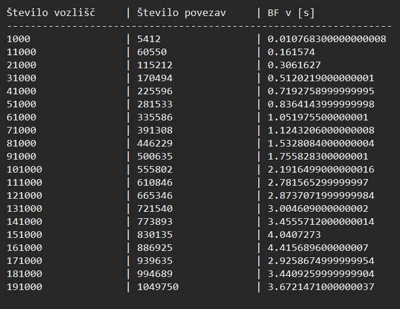

# **Vaje 10**

**Datum**: 19.4.2023

Na 10 vajah smo spoznali novo podatkovno strukturo: kopico. Najprej smo si pogledali, kakšne lastnosti in pogoje mora izpolnjevati kopica in skonstruirali en primer slednje. Naučili smo se dodajanja in odstranjevanja elementov iz kopice. Nadalje smo zapisali implementacijo operacije vstavljanje in brisanje. Nazadnje smo spoznali, zakaj je uporabna operacija *heapify* in kako sortiramo seznam s pomočjo kopice.

## **Naloga 1**

**OPIS:**
Simuliraj delovanje (min) kopice. Za vsavljanje je kot operacija število, za brisanje pa $x$. Za boljšo predstavo nariši kar drevesa.

Operacije: $8,2,1,3,7,6, x, x, 5, x, -3, x$

**REŠITEV:**
(Minimalna) Binarna kopica je levo poravnano dvojiško drevo, ki ni nujno, da je polno.

LASTNOST (MINIMALNE) KOPICE: starš je manjši ali enak sinovoma

Operacije dodajamo na sledeč način:

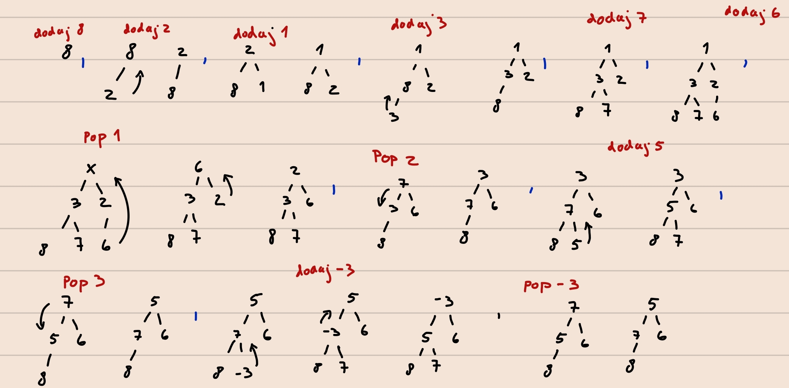

## **Naloga 2**

**OPIS:**
Predstavi kopico s seznamom in zapiši delovanje pop() in push(x) operacij.

**REŠITEV:**
Naj bo $T$ seznam dolžine $n$ (imamo torej kopico z $n$ elementi), kjer je $T[i]$ vozlišče.

- Če začnemo indekse šteti z $i=1$, so sinovi na indeksih $2i$ in $2i+1$, starš pa na mestu $i//2$. 
- Če začnemo indekse šteti z $i=0$, so sinovi na indeksih $2i+1$ in $2i+2$, starš pa na mestu $(i-1)//2$.

Delovanje operacije `push()`:

```python
def push(T,x): 
"""
Funkcija sprejme seznam T, ki predstavlja kopico 
ter element x, ki ga želimo dodati na kopico.
"""
    T.append(x) 
    i = len(T)-1 
    oce = i // 2
    while T[oce] >= T[i]: 
        # dokler ni izpolnjena lastnost kopice 
        # zamenjamo položaj sina in očeta
        T[oce], T[i] = T[i], T[oce]
        i = oce
        oce = i // 2
```

Delovanje operacije `pop()`:

```python
def pop(T): # odstranimo koren
"""
Funkcija sprejme seznam T, ki predstavlja kopico ter odstrani element 
v korenu. Pri tem seznam modificira tako, da ohrani lastnost kopice.
"""
    koren = T[1]
    T[1] = T[-1]
    T.pop()
    i = 1
    levi_sin = 2 * i
    desni_sin = 2 * i + 1
    while T[i] > T[levi_sin] or T[i] > T[desni_sin]:
        
        if T[levi_sin] > T[desni_sin]:
            T[desni_sin], T[i] = T[i], T[desni_sin]
            i = desni_sin
            levi_sin = 2 * i
            desni_sin = 2 * i + 1

        else:
            T[levi_sin], T[i] = T[i], T[levi_sin]
            i = levi_sin
            levi_sin = 2 * i
            desni_sin = 2 * i + 1

    return koren
```

## **Naloga 3**

**OPIS:**
Kako bi s kopico sortiral seznam? Časovna zahtevnost? Kako iz podanega seznama narediš kopico v $O(n)$ časa.

**REŠITEV:**
- Najprej podan seznam modificiramo tako, da bo zadoščal lastnostim maksimalne kopice. To lahko storimo tako, da si pomagamo z ukazom *heapify*. 
- Ko seznam zadošča lastnostim maksimalne kopice, imamo v korenu, oziroma na prvem mestu seznama, shranjen največji element seznama. Slednjega zamenjamo z zadnjim elementom kopice, torej zadnjim elementom seznama in ga odstranimo iz seznama. Na tem mestu imamo seznam, ki je dolžine $n-1$. Koren s pomočjo *heapify* popravimo tako, da imamo ponovno maksimalno kopico.
- Drugi korak ponavljamo, dokler nimamo v kopici le še enega elementa.
  
**Časovna zahtevnost algoritma: $O(n log(n))$**, saj je število menjav, da odstranimo element iz kopice v najslabšem primeru $log(n)$ (to je maksimalna višina kopice). Zamenjavo moramo opraviti za vsak element kopice, torej $n$ elementov, kar zahteva $O(n log(n))$ operacij.

Da bi iz danega seznama naredili kopico imamo dve možnosti:

- NAIVEN PRISTOP: Izvedemo *heapify* na celotnem polnem drevesu predstavljenim s seznamom. To storimo v zaporedju obratnega pregleda. To zahteva časovno zahtevnost $O(nlong(n))$
- EFEKTIVEN PRISTOP: Naiven pristop lahko optimiziramo tako, da izvedemo *heapify* na vseh vozliščih, razen na listih, saj le ti že izpolnjujejo lastnosti kopice. Ideja je, da poiščemo zadnje vozlišče, ki ni list in izvedemo *heapify* na vsakem vozlišču, ki ni list, v zaporedju obratnega pregleda drevesa. Zadnje vozlišče, ki ni list, se nahaja na indeksu $(n/2)-1.$