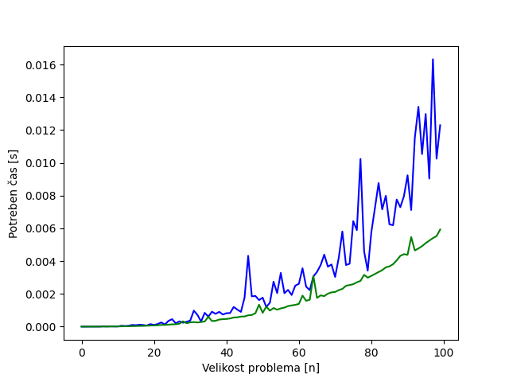

# POROČILO 1
**ime:** Filip Bojko

## Vsebina 
- <i>Vaje 1 (15.02.2023)</i>
- <i>Vaje 2 (22.02.2023)</i>
- <i>Vaje 3 (01.03.2023)</i>
- <i>Vaje 4 (08.03.2023)</i>


Vse vaje se nahajajo v folderju <i> Vaje1-4 </i>

## Vaje 1

**Datum:** 15.02.2023

Reševali smo dinamične probleme na Tomotu. Cilj vaj je bil, da smo rešili vsaj eno nalogo rekurzivno in eno z bottoms-up pristopom. Glej ```Zapiski_vaj``` in ```Vaje1\Zabica.py```.

## Vaje 2

**Datum:** 22.02.2023

Ogledali smo si problem 0/1 nahrbtnika. Glej ```Zapiski_vaj```.

## Vaje 3

**Datum:** 1.03.2023

Reševali smo problem 0/1 nahrbtnika na Tomotu. Tisti, ki je prvi rešil največ nalog mu za te vaje ni bilo potrebno oddati poročila. To sva bila jaz in Aljaž. Funkcije, ki sva jih takrat napisala se nahajajo v  ```Vaje3\Nahrbtnik.py```.

## Vaje 4

**Datum:** 8.03.2023

Reševali smo dinamični problem matrik. Glej ```Zapiski_vaj```.

## Komentarji in opombe

Vaje so super. Ničesar nebi spreminjal. Hitrost je dovolj primerna. 

---
## Dodatno

1. Analiziral sem nalogo iz prvih vaj na Tomotu - Zabico

2. Za analizo časovne zahtevnosti sem naredil ```merilnik.py```, ki glede na podane parametre prikaže graf in izpiše vrednosti. Za primerjavo sem uporabil iterativno zabico (<i>def zabica_iter</i>) in zabico z rekurzijo (<i>def zabica</i>).

3. Časovna zahtevnost iterativne zabice je ```O(n) ```, kjer je **n** dolžina tabele <i>močvara</i>. Časovna zahtevnost rekurzivne žabice pa ```O(n^2)```, ker smo iterirali skozi vsa polja in za vsako polje preverili vse možne skoke, kjer je **n** dolžina tabele <i>močvara</i>.



V rdeči barvi je časovna zahtevnost rekurzivne žabice, v zeleni pa iterativne žabice.

---

```merilnik.py``` se nahaja v mapi <i>Vaje1</i>

