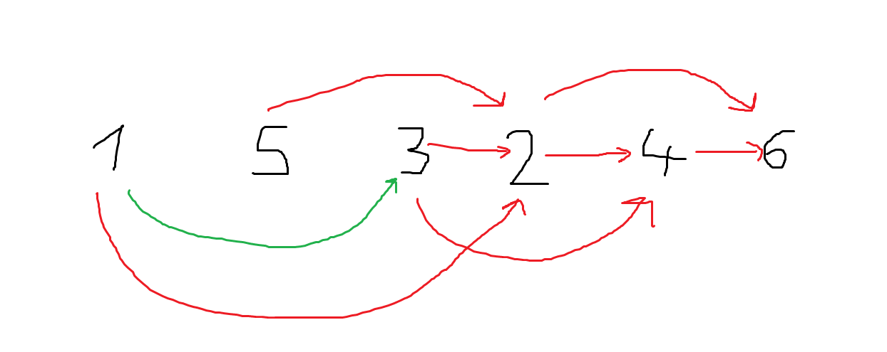
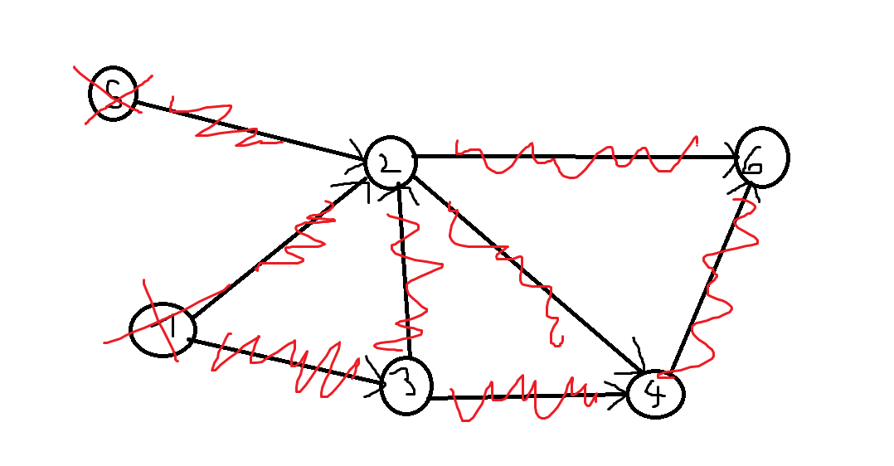

# Drugo poročilo za Računalništvo 2
**Ime:** Gregor Kuhelj


# Vaje 5 (15.3.2023)

## Naloga 1
Imamo graf $G = (V,E)$ z utežmi $\omega : E \mapsto A$, ki vsaki povezavi dodeli utež iz množice A. $ V = \{1,...,n\}, E \subset \binom{v}{2}$

Navedi nekaj možnih podatkovnih struktur za predstavitev grafa $ G $. Navedi nekaj prednosti oz. slabosti vsake izmed njih. Ponovi tudi, kaj je v grafu pot, sprehod in cikel.


#### Možne podatkovne strukture: 
- Tabela tabel (Matrika sosednosti $ A $) \
Dimenzije matrike $ A $

$$
A[i][j]= \begin{cases}\text { $w(i,j); (i,j) \in E$ } \\ None; \text { sicer }\end{cases}
$$

b)

Seznam sosednosti $G$:$G$ je seznam seznamov dolžine $n$ 
$G[i] = [(j,w(i,j))]$ za vsak $j$, da je $(i,j)$ povezan].

c)

Slovar sosednosti $G$ je seznam slovarjev dolžine $n$
$G[i] = \{ j: w(i,j)$ za $ \forall j $, da je 
$(i,j)$ povezan? $(i,j)$ poivezava $\}$


|   | Prostorska zahtevnost          | $(i,j)$ soseda? | Sosedi od $i$ |
|   :--------: | :-------------:     | :------------: | :------------: | 
| a   | $O(n^2)$   | $O(1)$ | $O(n)$ |
| b   | $O(n + m)$ | $O(\small{deg(i)}) = O(n)$ | $O(1)$ | 
| c   | $O(n+m)$ | $O(1)$ | $O(n)$ / $O(1)$  |


$\sum_{i=1}^{n} deg(i) = 2|E|$ ---> Lema o rokovanju


## Naloga 2
Usmerjenemu grafu $G$ z $n$ vozlišči, ki nima ciklov rečemu tudi DAG (directed acyclic graph). Vozlišča takega grafa lahko topološko uredimo. To pomeni, da obstaja da zaporedje vozlišč $(v1,v2,…,vn$, tako da ne obstaja povezava od $vi$ do $vj$, če je $j<i$.

Sestavi algoritem, ki najde tako zaporedje. Namig: Katera vozlišča lahko zagotovo damo na prvo mesto v to ureditev? 






Topoloska ureditev (psevdokoda):

``` python
==================================================
G ... seznam sosednosti
in_deg(i) ... število povezav, ki kažejo v i

==================================================
def topo_sort(G):
    n = len(G)
    in_deg = [0 * n] # naredimo seznam n ničel
    for i in range(n):
        for j in G[i]: 
            in_deg[j] += 1
        izvori = [i for i in range(n) if in_deg(i) == 0] 
        rezultat = []
        while(izvori):
            izvor = izvori.pop()
            rezultat.append(izvor)

            for sosed in G[izvor]:
                in_deg[sosed] -= 1
                if in_deg[sosed] == 0:
                    izvor.append(sosed)
    return rezultat
```

#### Časovna zahtevnost tega algoritma:
- for zanka $O(n+m)$
- izvori = [...] $O(n)$
- while zanka:$O(n+m)$

Torej vse skupaj <strong> O(n+m). </strong>


## Naloga 3

Naj bo sedaj $G$ usmerjen utežen graf brez ciklov. Kako bi izračunal ceno najdaljše poti v tem grafu med vozliščema $s$ in $t$.

Namig: razmišljaj dinamično
$D[i] =$ najdaljša pot od $i$ do $t$

$D[t] = 0$

$D[i] = max_{(j , \omega) \in G[i]} \; \; \{ D[j] + \omega \} $

Graf uredimo topološko, najdemo kjer se t nahaj v topološki ureditvi in seznam D polnimo v obratni topološki ureditvi.


## Naloga 4


# Vaje 6

#### Naloga 1

BFS algoritem (Breath first search)
DFS (Depth first search --> ne bomo obravnavali)

razlika je v tem, da BFS najprej gleda v širino (štartav vozlišču in pogleda vse njegove sosede, nato pa pogleda 'sosede'od sosedov) To je pregled v širino, ker graf raste 'v širino' 

DFS pa deluje tako, da greš v vozlišče, pogledaš njegovega soseda, soseda od soseda in tako naprej.


Z BFS lahko najdemo najkrajšo pot od poljubnega vozlišča do katerega koli drugega vozlišča.

Uporabimo ga lahko za:
- Pregled grafa
- Vpeto drevo/ gozd, povezane komponente
- Preverjanje dvodelnosti grafa
- Iskanje najkrajših poti (neuteženega grafa)

```python
G ... Graf kot seznam sosedov
u ... začetno vozlišče

from collections import Deque

def BFS(G,u):
    n = len(G)
    obiskani = [False] * n # nobenega vozlišča še nismo obiskali

    #    deque( ) --> knjiznica Deque
    q = vrsta([n])  # začnemo v u

    while q:
        trenutni = q.popleft()
        
        if obiskani[trenutni] : continue # soseda smo že obiskali
        obiskani[trenutni] = True

        for sosed in G[trenutni]:
            if not obiskani[sosed]:
                q.push(sosed) # doda v vrsto
```

#### Naloga 2
Ponovi Floyd-Warshallow algoritem. Kaj računa in kaj vrne? Kolikšna je časovna zahtevnost?

```python
G ... Graf kot seznam sosedov
u ... začetno vozlišče

def BFS(G,u):
    '''Vrne najkrajše poti od u do vseh ostalih poti'''
    n = len(G)
    d = [0] * n
    obiskani = [False] * n # nobenega vozlišča še nismo obiskali

    #    deque( ) --> knjiznica Deque
    q = vrsta([(u,0)])  # v vrsto damo vozlišče u in razdaljo od u do u (0)

    while q:  # dokler vrsta ni prazna
        trenutni, razdalja = q.popleft()
        
        if obiskani[trenutni] : continue # soseda smo že obiskali
        obiskani[trenutni] = True
        d[trenutni] = razdalja

        for sosed in G[trenutni]:
            if not obiskani[sosed]:
                q.push((sosed,razdalja + 1)) # doda v vrsto
    return d
```

**Časovna zahtevnost:**
$O(n + m)$, kjer je $n$ število vozlišč in $m$ število povezav.
Torej imamo linerano časovno zahtevnost (hitreje ne gre).
Če bi želeli 's sabo'  voziti še 'starše' sosedov, bi morali v vrstici 
```pyhton
q = vrsta([(u,0)])
```
morali voziti s sabo še vozlišče u.


#### Naloga 3

FW algoritem

VHOD: 
- Graf G (utežen, tudi negativne uteži so dovoljenje)

IZHOD: 
- Matrika $D$ (seznam seznamov), dimenzije $n$ x $n$, kjer je $n$ število vozlišč
- $D_j$ cena najkrajše poti med $i$-tim in $j$-tim vozliščem

IDEJA:

$D_{i,j}(k) = min \{D_{i,j}(k-1), D_{i,k}(k-1) + D_{k,j}(k-1) \}$,

kjer je $D_{i,j}(k)$ enako kot $D_{i,j}$, le da uporabljamo vozlišča od 1 do $k$.

ROBNI POGOJI:
- $D_{i,i} (1) = 0$
- $D_{1,i}(1) = \omega_{1,i}$ ($ \omega_{1,i}$ utež povezave)

**Časovna zahtevnost:**
$O(n^3)$, ker $n$-krat množimo matriko velikosti $n$ x $n$.


#### Naloga 4

Mesto v matriki nam poda zadnje vozlišče v najkrajši poti med vozliščema.


```python
def min_pot(i,j):
    '''
    Vrne najkrajšo pot med vozliščema i in j
    '''
    sez = []
    zacetek = i
    konec = j
    while zacectek != konec:
        sez.append(konec)
        konec = P[i][j]
    sez.append(konec)
    return sez[::-1]
```
#### Naloga 5
Kako bi s FW algoritmom odkrili, če v grafu obstajajo negativni cikli? Kaj vrne FW, če graf vsebuje negativen cikel?


Iskanje negativnih ciklov s pomočjo FW algoritma lahko storimo na tak način:

- Poženemo FW algoritem, s čimer izračunamo najkrajše poti med vsemi pari vozlišč.
- Nato preverimo, ali obstaja vozlišče v grafu, za katero je krajša pot od vozlišča do sebe negativna. Če obstaja, potem graf vsebuje negativni cikel.

Če graf vsebuje negativni cikel, Floyd-Warshallov algoritem vrne None.


# Vaje 7 (29.3.2023)

#### Naloga 2

Floyd Warshall: $D_{i,j} = min\{D_{i,j}(k-1), D_{i,k}(k-1) + D_{k,j}(k-1)$
                          
                            A           B

$\Pi_{i,j}(k) ...$  predstavlja zadnje vozlišče na $i-j$ pot, kjer smemo vmes uporabiti samo vozlišča od 1 do $k$.


$\Pi_{i,\Pi_{j,k}(n)}(n)$

Začetni pogoji: $\Pi_{i,i} (0) = i$
- A: $\Pi_{i,j} (k) = \Pi_{i,j}(k-1) \cdot \Pi_{i,G[i]}(0) = i$

- B: $\Pi_{i,j} (k) = \Pi_{k,j}(k-1)$


**Rekonstrukcija poti:**

VHOD: vozlišči $i,j$, matrika $\Pi(n)$

IZHOD: najkrajša pot od $i$ do $j$

ALGORITEM:
```python
p = j 
pot = []
while p != i:
    pot.append(p)
    p = π[i][p]

pot.append(i)
return pot.reverse() 

```
**Časovna zahtevnost:**
$O(n)$, ker je while zanka enaka dolžini poti.


#### Naloga 3
**Možne ideje:**
- Prištejemo povezave, ki kažejo v to vozlišče
- Prištejemo povezave, ki kažejo ven iz vozlišča

odločimo se glede na problem (smiselno obravnavamo začetno in končno vozlišče v poti).

V splošnem, je problem najdaljših poti zelo težek problem.


Floyd Warshallov algoritem bi lahko uporabili pri iskanju najdaljših poti, saj ni negativnih ciklov.


#### Naloga 4

|      |  EUR  |USD | YEN |
|:-:   | :-:   |:-: | :-: | 
| EUR  |1      | 1,2|     |
|USD   |       | 1  | 120 | 
| YEN  | 0,01  |    |  1  |


Sestavimo graf $G(V,e)$, kjer so:
* Vozlišča: $(EUR,YEN,USD)$ - valute
* Povezave: Pretvorba

Zanima nas najdražja pot v grafu od $ i $ do $j$.
To ceno bomo dobili kot produkt uteži na povezvah.

Utež na povezavah $i-j$ nastavimo na $-log(R_{i,j})$ --> iščemo najcenejšo pot od $i-j$ v tem grafu.

V ta namen želimo uporabiti Floyd Warshallov algoritem (to lahko naredimo, če graf nima negativnih ciklov).

Pokažimo, da jih naš graf res nima:

**DOKAZ S PROTISLOVJEM:**
Predpostavimo, da imamo negativen cikel od $i$ do $j$.
Cena tega cikla je: 

$-(\sum_{j=1}^{k}log(R(i_{j-1},ij))) < 0 $  (pomnožimo enačbo z -1),

$-log(\Pi_{j=1}^{k} R(i_{j-1},ij)) < 0 / \cdot(-1)$ 

$log(\Pi_{j=1}^{k} R(i_{j-1},ij)) > 0$ (in dobimo)

$\Pi_{j=1}^{k} R(i_{j-1},ij)) > 1 $ ---> TO JE ARBITRAŽA


#### Naloga 5

Vhodni podatki:
* Usmerjen graf $G(V,e)$
* začetno vozlišče $s \in V$
* $c_{i,j} \geq 0 $, cene so pozitivne

Izhodni podatki:
* cene najcenejših poti od $s$ do $i$ $\forall i \in V$ --> D
* drevo najkrajših poti od $s$ do $i$ $\forall i \in V$ --> P

```python
def dijkstra(G,s):
    '''Vrne najkrajšo pot od s do vseh vozlišč v grafu G'''
    n = len(G)
    D = [float("inf")] * n
    P = [None] * n
    D[s] = 0 # D[i] pove razdaljo od s do i -> pri nas je i = s
    P[s] = s
    obiskani = [False] * n
    q = Vrsta(V(G))  # v vrsto dodamo še nedodana vozlišča  ... list[range(n)]

    while len(obiskani) != n:
        c = q.popmin()  # dobimo najmnajši element in ga odstrani iz seznama
        obiskani.add(c)

        for sosed, utez in G[c]:
            if sosed not in obiskani:
                if D[c] + utez + D[sosed]:
                    D[sosed] = D[c] + utez
                    P[sosed] = c
    return D,P
```


pri tem nam 
 ```python
c.popmin()
```
pove, da pogledamo vsa vozlišča v q in vrnemmo tistega z najnižjim D[ ]

**Časovna zatevnost:** 

$O(n)$ --obrazlaga--> do while zanke je $O(n)$, while zanka je $O(n)$ in for zanka je $O(n)$


# Vaje 8 (5.4.2023)


#### Naloga 1:
Spodnjo implementacijo Dijkstrovega algoritma implementiramo na podatkih v datoteki roadNet-TX.txt.


```python
from djikstra import *

def ustvari_graf(datoteka):
    """
    Funkcija prejme ime tekstovne datoteke, ki vsebuje usmerjene povezave in iz nje ustvari neutežen graf z usmerjenimi povezavami, predstavljen kot seznam sosednosti.
    """
    with open(datoteka, 'r') as file:
        # prve 4 vrstice ne porebujemo, jih samo preberemo
        for _ in range(4):
            file.readline()
        
        # napolnemo seznam povezav s povezavami iz datoteke roadNET-TX.txt
        sez_povezav = []
        for vrstica in file:
            vrstica = vrstica.strip().split('\t')
            sez_povezav.append((int(vrstica[0]), int(vrstica[1])))

        # uredimo vozlišča po velikosti, da dobimo največje vozlišče, saj bo 
        # naš graf G, predstavljen kot seznam sosednosti, vseboval n+1 povezav
        sez_povezav.sort(key=lambda x: x[0], reverse=True)
        n = sez_povezav[0][0]

        # Ustvarimo seznam sosednosti, kjer so povezave usmerjene, uteži pa enake 1
        G = [[] for _ in range(n+1)]
        for povezava in sez_povezav:
            u = povezava[0]
            v = povezava[1]
            G[u].append((v, 1))
    return G
```
Ob vnosu imena datoteke roadNet-TX.txt in štartnega vozlišča, dobimo seznam najkrajših razdalj od štartnega vozlišča do vseh ostalih vozlišč.

```python
G = ustvari_graf("roadNet-TX")

# d - seznam najkrajših razdalj od vozlišča 100 do vseh ostalih
# p - drevo najkrajših poti od vozlišča 100 do vseh ostalih vozlišč
d, p = djikstra(G, 100)
print(d) 
```
Ker je vozlišč ogromno, lahko prikažemo le del vozlišč, do katerih nas zanima najkrajša pot. Recimo, najkrajša pot od vozlišča 100 do prvih 6 vozlišč:

```python
print(d[:6])

#REŠITEV:
[10, 11, 9, 10, 10, 11]
```

- Koliko je razdalja $d_G(100, 100000)$?

Odgovor je 240.


- Katero vozlišče je najbolj oddaljeno od vozlišča 100?

Ker je takih vozlišč lahko več, si moramo ogledati vsa najbolj oddaljena vozlišča:

```python
max_razd = max(d)
najdaljsi = []
indeksi = []

for ind, razdalja in enumerate(d):
    if max_razd == razdalja:
        najdaljsi.append(razdalja)
        indeksi.append(ind)

print(indeksi)
print(najdaljsi)

# Rešitev
[1389039, 1390394]
[717, 717]
```

- Koliko vozlišč je dosegljivih iz vozlišča 100?

Odgovor je 2. To dobimo s pomočjo len(G[100])
```python
print(len(G[100]))
```

#### Naloga 2


Implementacija BFS algoritma: 

```Python
from collections import deque

def BFS(G, s):
    """
    BFS vrne najkrajše poti od s do vseh ostalih vozlišč. s je začetno vozlišče, G je graf, podan kot seznam sosednosti. Seznam d predstavlja najkrajšo pot od vozlišča s do vseh ostalih vozlišč.
    """
    n = len(G)

    # Začetne vrednosti
    d = [0] * n  
    obiskani = [False] * n
    poti = [-1] * n

    # Na vrsto dodamo trojico (v, d, p), kjer je: v vozlišče, d je razdalja, p 
    # pa prejšnje vozlišče na najkrajši poti od u do v.
    q = deque([(s, 0, s)])

    while q:
        u, razdalja, p = q.popleft()

        if obiskani[u]: 
            continue # že obiskani
        
        # obiščemo vozlišče ter nastavimo njegovo razdaljo
        # ter predhodnika na najkrajši poti od s do u
        obiskani[u] = True
        d[u] = razdalja
        poti[u] = p

        # gremo čez vse sosede in dodamo potrebne elemente na vrsto.
        for sosed in G[u]:
            if not obiskani[sosed]:
                q.append((sosed, razdalja + 1, u))
    return d, poti
```

```Python
from BFS import *

def ustvari_graf(datoteka):
    """ Iz datoteke, ki vsebuje usmerjene povezave ustvari neutežen graf z usmerjenimi povezavami, predstavljen kot seznam sosednosti. """
    with open(datoteka,'r') as file:
        
        for _ in range(4):
            file.readline()
        
        sez_povezav = []
        for vrstica in file:
            vrstica = vrstica.strip().split('\t')
            sez_povezav.append((int(vrstica[0]), int(vrstica[1])))

        sez_povezav.sort(key=lambda x: x[0], reverse=True)
        n = sez_povezav[0][0]

        G = [[] for _ in range(n+1)]
        for povezava in sez_povezav:
            u = povezava[0]
            v = povezava[1]
            # Ker bomo uporabili BFS graf ne sme vsebovati uteži!!!
            # Tu je razlika v primerjavi z nalogo1
            G[u].append(v)
    return G
```

Ob zagonu BFS algoritma na enaki nalogi kot prej bomo vidimo, da so rezultati enaki.


#### Naloga 3

Modificirana algoritma (Dijkstra in BFS) sem implementiral na sledeč način:


```Python
from collections import deque

def BFS(graf, zac, konco):
    """
    BFS vrne najkrajše poti od s do vseh ostalih vozlišč. s je začetno vozlišče, G je graf, podan kot seznam sosednosti. Seznam d predstavlja najkrajšo pot od vozlišča s do vseh ostalih vozlišč.
    """
    n = len(graf)

    # Začetne vrednosti
    d = [float('inf')] * n
    obiskani = [False] * n
    poti = [-1] * n

    q = deque([(zac, 0, zac)])

    while q:
        u, razdalja, p = q.popleft()

        if obiskani[u]: 
            continue 

        if u == koncno:  razdaljo in drevo
            return razdalja, poti

        
        obiskani[u] = True
        d[u] = razdalja
        poti[u] = p

        
        for sosed in graf[u]:
            if not obiskani[sosed]:
                q.append((sosed, razdalja + 1, u)) 
    return float('inf'), poti  

def BFS_poti(graf, u, t):
    '''Vrne najkrajše poti v neuteženem grafu G od u do vseh ostalih vozlišč.Graf G je predstavljen kot seznam sosedov.
    '''
    n = len(graf)
    d = [-1]*n
    obiskani = [False]*n
    poti = [-1] * n
    q = deque([(u, 0)])
    while q:
        trenutni, razdalja = q.popleft()
        if obiskani[trenutni]:
            continue
        else:
            obiskani[trenutni] = True
            d[trenutni] = razdalja
            if trenutni == t:
                break
            for sosed in graf[trenutni]:
                if not obiskani[sosed]:
                    q.append((sosed, razdalja+1)) 
                    if poti[sosed] == -1:
                        poti[sosed] = trenutni
    poti[u] = u
    return d[t], poti

```

- Modificiran Djikstrin algoritem:
  
```Python
import heapq
from collections import deque

def Dijkstra_Mod(G, s, t):
    """ Iz usmerjenega in uteženega grafa G (seznam sosednosti), vrne najkrajšo pot od start do vseh ostalih vozlišč. Vrne še najcenejšo razdaljo od start do konc in drevo najkrajsih poti. """
    n = len(G)
    
    obiskani = [False] * n
    razdaljeDo = [-1] * n
    poti = [None] * n

    Q = [(0, s, s)]

    while Q:
        razdalja, u, p = heapq.heappop(Q)

        if obiskani[u]:
            continue
        
        obiskani[u] = True
        razdaljeDo[u] = razdalja
        poti[u] = p

        if u == t:
            pot_do_t = [t]
            pred = poti[t]
            while pred != s:
                pot_do_t.append(pred)
                pred = poti[pred]
            pot_do_t.append(s)
            return razdaljeDo[t], pot_do_t
        
        for (v, teza) in G[u]:
            if not obiskani[v]:
                heapq.heappush(Q, (razdalja + teza, v, u))

    return razdaljeDo, poti
```


#### Naloga 4

Zapiši funkcijo, ki sprejme začetno vozlišče s, končno vozlišče t
 ter drevo najkrajših poti ter vrne najkrajšo pot med njima v obliki seznama.

Sedaj rekonstruiraj najkrajšo pot med vozliščem 100 in 100000.


```python
def pot_s_t(start, konc, drevo_najkrajsih):
    '''Vrne pot od vozlišča s do t, glede na drevesa najkrajših poti od vozlišča s do vseh ostalih.'''
    sez = list()
    v = drevo_najkrajsih[konc]
    sez.append(konc)
    while v != start:
        sez.append(v)
        v = drevo_najkrajsih[v]
    sez.append(start)
    return sez
```

Za vnos 10 in 100000, funkcija vrne naslednjo rešitev
```python
[100000, 99998, 99999, 100467, 100033, 100032, 100040, 100058, 100243, 100241, 100500, 100508, 98001, 97982, 98000, 98010, 779690, 779692, 779786, 779708, 779533, 779540, 779539, 774451, 774449, 774348, 774347, 774345, 774445, 774343, 774443, 774501, 774442, 774436, 775216, 775191, 775217, 775230, 954061, 954060, 954064, 954192, 952546, 954457, 954460, 954459, 954433, 952479, 952508, 952427, 952510, 952501, 952497, 952498, 952495, 952494, 952282, 952489, 952487, 952488, 952889, 952888, 950931, 950930, 950932, 951457, 951459, 951455, 951456, 953498, 953223, 953889, 954030, 953890, 953887, 953886, 953918, 953914, 953863, 956028, 660684, 661451, 661452, 661517, 661513, 661423, 661298, 661297, 661287, 659375, 661290, 661295, 661223, 661420, 661412, 661045, 661020, 660990, 661019, 661037, 661050, 661064, 662688, 661995, 661996, 661991, 661992, 662063, 662086, 662423, 662422, 662322, 662421, 662419, 662320, 662316, 662424, 662347, 662431, 662381, 655012, 10008, 10007, 9937, 10006, 9940, 3700, 3701, 3959, 3571, 3572, 3568, 3570, 1862, 1751, 1752, 1729, 1719, 1708, 1709, 1703, 1704, 1928, 1929, 1868, 1833, 1843, 1720, 164, 180, 182, 191, 78, 41, 90, 82, 81, 77, 75, 100]
```


# Vaje 9 (12.4.2023)


Implementacija Bellman-Fordovega algoritma v Pythonu:

```python
def Bellman_Ford(graf, zacetek, n):
    '''Vrne najkrajšo pot od zacetka do vseh vozlišč. V primeru, da ima graf negativen cikel, vrne None.'''

    razdalje = [float('Inf')]*n
    razdalje[zacetek] = 0
    
    for korak in range(n-1):  # st. operacij je za 1 manj kot je vozlisc
        for u, v, w in graf:
            # u = začetek
            # v = konec
            # w = utež na povezavi (u,v)
            if razdalje[u] + w < razdalje[v]:
                # našli smo bližnjico
                razdalje[v] = razdalje[u] + w
                
    # Preverimo ali ima graf negativen cikel
    for u, v, w in graf:
        if razdalje[u] != float('Inf') and razdalje[u] + w < razdalje[v]:
            return None
        
    return razdalje
```

#### Naloga 2

Konstruirajte nov graf, ki vsebuje le vozlišča od 0 do N.

Vsaki povezavi določite neko pozitivno utež (lahko čisto naključno) in zadevo shranite v novo .txt datoteko. Vrstice naj bodo oblike u v w(u,v), kjer je (u,v) povezava in w(u,v) njena utež.


Graf je oblike 
```python
g = [(0, 1, 2),
    (0, 2, 4),
    (1, 3, 2),
    (2, 4, 3),
    (2, 3, 4),
    (4, 3, -5)]

sez_razdalj = Bellman_Ford(g, 0, 5) 

#Rešitev

[0, 2, 4, 2, 7]
```
Graf zapisan v tekstovni datoteki se nahaja v datoteki BF.txt


```python
def zapisi_txt(ime, graf):
    '''
        Zapiše graf v txt datoteko pod imenom ime.txt. Vrstice
        so v obliki `u v w(u,v)`, kjer je (u,v) povezava in w(u,v) njena utež.
        u je začetno in v končno vozlišče povezave.
    '''
    with open(ime + '.txt', 'w') as dat:
        for u, v, w in graf:
            vrstica = '{} {} {}\n'
            dat.write(vrstica.format(u, v, w))
zapisi_txt('BF',g)
```


# Vaje 10 (19.4.2023)

BINARNA KOPICA: je levoporavnano dvojiško drevo (ni nujno da je polno [ima 2n elementov] )

LASTNOSTI KOPICE (MINIMALNE):
- starš je manjši ali enak sinovoma

#### Naloga 1

Simuliraj delovanje (min) kopice. Za vsavljanje je kot operacija število, za brisanje pa x. Za boljšo predstavo nariši kar drevesa.

Operacije: 8,2,1,3,7,6, x, x, 5, x, -3, x


#### Naloga 2 
Predstavi kopico s seznamom in zapiši delovanje pop( ) in push(x) operacij.


T je seznam dolžine $n$ (kopica)

T[$i$] - vozlišče

Sinovi od $i$ so $2i$ in $2i+1$, če je prvi indeks v tabeli enak 1, če je prvi indeks v tabeli enak 0, sta sinova $2i+1$ in $2i+2$.

Oče je v primeru, da je prvi indeks v tabeli enak 0, na indeksu  $(i-1) // 2$

```python
def push(T,x):
''' Push za minimalna kopica '''
    T.append
    i = len(T)-1
    oce = i // 2
    while T[oce] > T[i]:
        T[oce], T[i] = T[i],T[oce]
        i = oce
        oce = i // 2
```

```python
def pop(T): #odstranimo koren
'''Pop za minimalno kopico'''
    koren = T[1]
    T[1] = T[-1]
    T.pop()
    levi_sin = 2 * i
    desni_sin = 2 * i + 1
    while T[i] > T[levi_sin] or T[i] > T[desni_sin]:
        
        if T[levi_sin] > T[desni_sin]:
            T[desni_sin], T[i] = T[i], T[desni_sin]
            i = desni_sin
            levi_sin = 2 * i
            densi_sin = 2 * i + 1

        else:
            T[levi_sin], T[i] = T[i], T[levi_sin]
            i = levi_sin
            levi_sin = 2 * i
            desni_sin = 2 * i + 1

    return koren
```


#### Naloga 3
Kako bi s kopico sortiral seznam? Časovna zahtevnost? Kako in podanega seznama narediš kopico v O(n) časa.

Heap sort ne more delati hitreje kot $O(n \cdot logn)$

"Heapify" --> Iz seznama želimo narediti kopico.

##### 1)  Seznam tretiramo kot kopico:
- Levoporavnano dvojiško drevo (izpolnjeno :) )
- Lastnosti kopice niso izpolnjene :(

Časovna zahtevnost (Shift up): 

$ \sum_{i=0}^{logn} 2^i \cdot i = \sum_{i=0}^{n-1}i \cdot log(i)   = O(n\cdot logn) $

#### 2) Shift down

$ \sum_{i=1}^{logn} \frac{n}{2^i} \cdot (i-1) =  \sum_{i=0}^{logn} \frac{n}{2^{i+1}} \cdot (i-1)   \leq \frac{n}{2} \sum_{i=1}^{\infty} i \cdot 2^{-i} $


