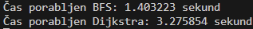
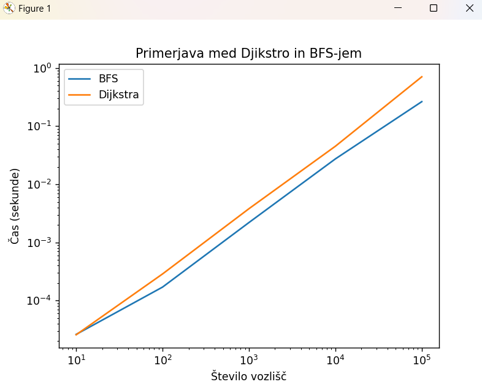
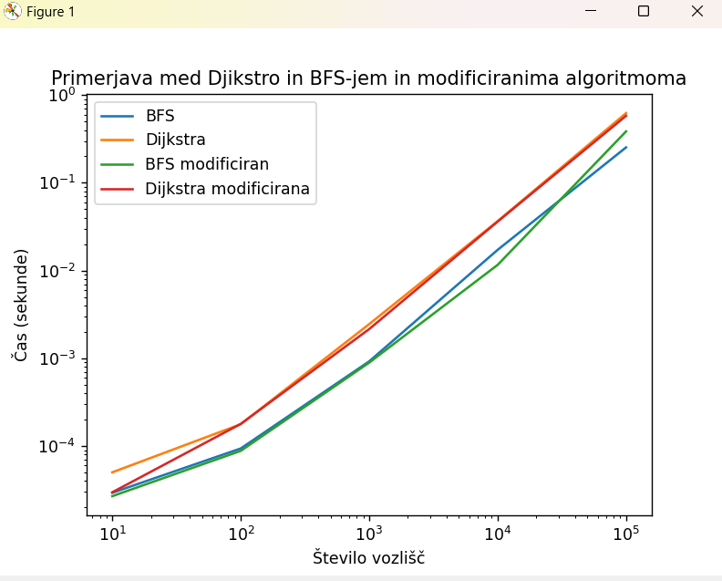

# POROČILO 2
**ime:** Filip Bojko

## Vsebina 
- <i>Vaje 5 (15.03.2023)</i>
- <i>Vaje 6 (22.03.2023)</i>
- <i>Vaje 7 (29.03.2023)</i>
- <i>Vaje 8 (05.04.2023)</i>
- <i>Vaje 9 (12.04.2023)</i>
- <i>Vaje 10 (19.04.2023)</i>


Vse vaje se nahajajo v folderju <i> Vaje5-8 </i>

## Vaje 5

**Datum:** 15.03.2023

Spoznali smo nove grafe (DAG) in rešili 3 naloge pred tablo. na koncu smo reševali naloge iz Scapegoat dreves. Glej [Vaje5](Vaje5-8/Vaje5/Vaje5.md).

## Vaje 6

**Datum:** 22.03.2023

Ogledali smo si BFS in njegovo delovanje. Rešili smo tudi nalogo iz Floyd-Warshallow algoritma. Glej [Vaje6](Vaje5-8/Vaje6/Vaje6.md).

## Vaje 7

**Datum:** 29.03.2023

Ogledali smo si BFS in njegovo delovanje. Rešili smo tudi nalogo iz Floyd-Warshallow algoritma. Glej [Vaje7](Vaje5-8/Vaje6/Vaje7.md).

## Vaje 8

**Datum:** 05.04.2023

Reševali smo **FW** algoritem. Glej [Vaje8](Vaje5-8/Vaje7/Vaje8.md).

## Vaje 9

**Datum:** 12.04.2023

Reševali smo naloge iz BFS-ja in Dijkstre. Glej [Vaje9](Vaje5-8/Vaje7/Vaje9.md).

## Vaje 10

**Datum:** 19.04.2023

Reševali smo naloge od zadnjič. Glej [Vaje10](Vaje5-8/Vaje7/Vaje10.md).

## Komentarji in opombe

Vaje so super. Ničesar nebi spreminjal. Hitrost je dovolj primerna. 

---
## Dodatno
---
# **Vaje 8**

## **Naloga 1**

- ### **Prva podnaloga**

    > **Navodilo:** roadNet-TX.txt spremenite v ustrezno podatkovno strukturo grafa.

    > **Rešitev:** Za podatkovno strukturo sem uporabil seznam sosednosti.
    ```python
    seznam_sosedov = [[] for line in open("roadNet-TX.txt") if line[0] != "#" or line != "" ]
    with open("roadNet-TX.txt", "r") as f:
    for line in f:
        if line[0] == "#" or line == "":
             continue
        vozlisca = line.split("\t")
        prvo_vozlisce = int(vozlisca[0].strip())
        drugo_vozlisce = int(vozlisca[1].strip())
        seznam_sosedov[prvo_vozlisce].append((drugo_vozlisce, 1))
    ```

- ### **Druga podnaloga**

    > **Navodilo:** poiščete najkrajše razdalje od vozlišča 100 do vseh ostalih.

    > **Rešitev:** uporabil sem Djikstro in vstavil seznam sosednosti, da sem dobil poti in razdalje od vozlišča 100 do vseh ostalih.
    ```python
    razdalje, poti = djikstra.djikstra(seznam_sosedov, 100)
    print(razdalje)
    ```

- ### **Tretja podnaloga**

    > **Navodilo:** Koliko je razdalja ``dG(100,100000)`` ?

    > **Rešitev:** Razdalja se skriva v seznamu, ki jo je vrnila Djikstra.
    ```python
    print(razdalje[100000])
    ```

- ### **Četrta podnaloga**

    > **Navodilo:** Najbolj oddaljeno vozlišče od 100?

    > **Rešitev:** Najbolj oddaljeno vozlišče dobimo z indexom največje vrednosti v seznamu razdalje.
    ```python
    print(razdalje.index(max(razdalje)))
    ```

- ### **Peta podnaloga**

    > **Navodilo:** Koliko vozlišč je dosegljivih iz vozlišča 100?

    > **Rešitev:** število dosegljivih vozlišč dobimo z dolžino seznama razdalje.
    ```python
    print(len(razdalje))
    ```
---
## **Naloga 2**

### Navodilo:
>Glede na to, da graf ni utežen, lahko za isto nalogo implementiramo BFS algoritem. Implementiraj BFS algoritem, ki bo poiskal dolžine najkrajših poti od s do vseh ostalih vozlišč. Vrne naj tudi drevo najkrajših poti, tako kot Djikstra. Preveri iste zadeve kot zgoraj, dobiti moraš seveda iste odgovore.

### Rešitev:
> BFS algoritem, ki sprejme seznam sosednosti in vozlišče v grafu ter vrne dolžino najkrajših poti od tega vozlišča do vseh ostalih in drevo najkrajših poti.
```python
    from collections import deque

    def BFS(G, s):
        """
        BFS vrne najkrajše poti od s do vseh ostalih vozlišč. Tu je s štartno 
        vozlišče, G pa je graf, ki je podan kot seznam sosednosti. Seznam d 
        predstavlja najkrajšo pot od vozlišča s do vseh ostalih.
        """
        n = len(G)

        # Nastavimo začetne vrednosti za sezname d, obiskani, in poti.
        d = [0] * n  
        obiskani = [False] * n
        poti = [-1] * n

        # Na vrsto dodamo trojico (v, d, p), kjer je: v vozlišče, d je razdalja, p 
        # pa prejšnje vozlišče na najkrajši poti od u do v.
        q = deque([(s, 0, s)])

        while q:
            u, razdalja, p = q.popleft()

            if obiskani[u]: 
                continue # smo ga že obiskali
            
            # obiščemo vozlišče ter nastavimo njegovo razdaljo
            # ter predhodnika na najkrajši poti od s do u
            obiskani[u] = True
            d[u] = razdalja
            poti[u] = p

            # gremo čez vse sosede in dodamo potrebne elemente na vrsto.
            for sosed in G[u]:
                if not obiskani[sosed[0]]:
                    q.append((sosed[0], razdalja + 1, u)) #doda nov element v q
        return d, poti
```
---
## **Naloga 3**

### Navodilo:
>Oba algoritma dodelaj, tako da dodaš nov vhodni podatek t, ki predstavlja končno vozlišče. Algoritma naj torej vrneta razdaljo med s in t v grafu ter pote (kot drevo) med njima. Delujeta naj, tako da se ustavita takoj ko najdemo željeno pot.

### Rešitev:
> Spremenjen BFS
```python
    from collections import deque

    def BFS_modificiran(G, s, t):
        """
        BFS vrne najkrajše poti od s do vseh ostalih vozlišč. Tu je s štartno 
        vozlišče, G pa je graf, ki je podan kot seznam sosednosti. Seznam d 
        predstavlja najkrajšo pot od vozlišča s do vseh ostalih. Poleg tega 
        sprejme tudi končno vozlišče t in vrne najcenejšo razdaljo
        od s do t. Prav tako vrne drevo najkraših poti kot seznam, kjer
        je i-ti element oče vozlišča i-1.
        """
        n = len(G)

        # Nastavimo začetne vrednosti za sezname d, obiskani, in poti.
        d = [0] * n  
        obiskani = [False] * n
        poti = [-1] * n

        # Na vrsto dodamo trojico (v, d, p), kjer je: v vozlišče, d je razdalja, p 
        # pa prejšnje vozlišče na najkrajši poti od u do v.
        q = deque([(s, 0, s)])

        while q:
            u, razdalja, p = q.popleft()

            if obiskani[u]: 
                continue # smo ga že obiskali
            
            # obiščemo vozlišče ter nastavimo njegovo razdaljo
            # ter predhodnika na najkrajši poti od s do u
            obiskani[u] = True
            d[u] = razdalja
            poti[u] = p

            # če smo prišli do vozlišča s, skonstruiramo drevo poti
            # in vrnemo najcenejšo razdaljo od s do t
            if u == t:
                pot_do_t = [t]
                pred = poti[t]
                while pred != s:
                    pot_do_t.append(pred)
                    pred = poti[pred]
                pot_do_t.append(s)
                return d[t], pot_do_t

            # gremo čez vse sosede in dodamo potrebne elemente na vrsto.
            for sosed in G[u]:
                if not obiskani[sosed]:
                    q.append((sosed, razdalja + 1, u)) #doda nov element v q
        return d, poti
```
>Spremenjena Djikstra:
```python
    import heapq
    from collections import deque

    def djikstra_t(G, s, t):
        """
        Funkcija sprejme usmerjen in utežen graf G predstavljen
        s seznamom sosednosti ter začetno vozlišče s.
        Torej G[i] = [(v_1, w_1), ... (v_d, w_d)],
        kjer je (i, v_k) povezava v grafu z utežjo w_k.
        Vrne seznam razdaljeDo, ki predstavlja najkrajšo pot od vozlišča s
        do vseh ostalih.
        Vrne tudi seznam poti, ki predstavlja drevo najkrajših poti od s
        do vseh ostalih vozlišč.
        Poleg tega sprejme tudi končno vozlišče t in vrne najcenejšo razdaljo
        od s do t. Prav tako vrne drevo najkraših poti kot seznam, kjer
        je i-ti element oče vozlišča i-1.
        """
        n = len(G)
        
        # Nastavimo začetne vrednosti za sezname obiskani, razdaljaDo in poti.
        obiskani = [False] * n
        razdaljeDo = [-1] * n
        poti = [None] * n

        # Na vrsto dodamo trojico (d, v, p), kjer je:
        # v vozlišče, d razdalja do njega, p pa prejšnje vozlišče na najkrajši poti od
        # s do v.
        Q = [(0, s, s)]

        while Q:
            
            # Vzamemo minimalen element iz vrste
            # heapq.heappop(Q) odstrani element iz seznama Q, ter pri tem ohranja
            # lastnost kopice : seznam Q tretira kot dvojiško drevo!
            razdalja, u, p = heapq.heappop(Q)

            # če je že obiskan, nadaljujemo.
            if obiskani[u]:
                continue
            
            # obiščemo vozlišče ter nastavimo njegovo razdaljo
            # ter predhodnika na najkrajši poti od s do u
            obiskani[u] = True
            razdaljeDo[u] = razdalja
            poti[u] = p

            # če smo prišli do vozlišča s, skonstruiramo drevo poti
            # in vrnemo najcenejšo razdaljo od s do t
            if u == t:
                pot_do_t = [t]
                pred = poti[t]
                while pred != s:
                    pot_do_t.append(pred)
                    pred = poti[pred]
                pot_do_t.append(s)
                return razdaljeDo[t], pot_do_t
            
            # gremo čez vse sosede in dodamo potrebne elemente na vrsto.
            for (v, teza) in G[u]:
                if not obiskani[v]:

                    # heap.heappush(Q, elem) doda element v seznam Q, kjer ohranja lastnost kopice.
                    heapq.heappush(Q, (razdalja + teza, v, u))

        return razdaljeDo, poti
```
---
## **Naloga 4**

### Navodilo:
>Zapiši funkcijo, ki sprejme začetno vozlišče s, končno vozlišče t
 ter drevo najkrajših poti ter vrne najkrajšo pot med njima v obliki seznama.
Sedaj rekonstruiraj najkrajšo pot med vozliščem 100 in 100000.

### Rešitev:
```python
    def izpisi_pot(poti, s, t):
    """
    Funkcija sprejme seznam poti, ki predstavlja drevo najkrajših poti
    od začetnega vozlišča do vseh ostalih vozlišč, ter začetno in končno vozlišče.
    Vrne pot od začetnega do končnega vozlišča v obliki seznama vozlišč.
    """
    # Spremenljivka path bo predstavljala pot od končnega do začetnega vozlišča.
    path = [t]

    # Sledimo predhodnikom vozlišča, dokler ne pridemo do začetnega vozlišča.
    sedanji = t
    while sedanji != s:
        sedanji = poti[sedanji]
        path.append(sedanji)

    # Pot smo gradili od konca proti začetku, zato jo je potrebno obrniti.
    return path[::-1]
```
```python 
    #pot med 100 in 100000
    pot = izpisi_pot(G, 100, 100000)
    print(pot)
```
---
## **Naloga 5**

### Navodilo:
>Analiziraj časovne zahtevnosti algoritmov. Primerjaj hitrost med djikstro in BFS-jem.

### Rešitev:
>Čas med BFS algoritmom in Dijkstro na 'roadNet-TX.txt'



>Primerjajmo še čas na generiranih grafih



>Primerjajmo še čas med navadnima algoritmoma in modificiranima



>Če nas bi zanimale najkrajše poti od s do t_1, t_2, ..., t_k, bi uporabili kar BFS algoritem, ki ni modificiran. Opazili smo, da je hitrejši kot Djikstra. Modificiran BFS pa ni kaj veliko hitrejši kot navaden BFS, ki nam vrne pot le do enega vozlišča.

---
# **Vaje 9**

## **Naloga 1**

- ### **Prva podnaloga**

>Naredimo graf z naključnimi utežmi:
```python
    import random

    N = 1000

    # Ustvari prazen graf
    graf = [[] for _ in range(N)]

    # Dodaj povezave z naključnimi utežmi
    for i in range(N):
        for j in range(N):
            if i != j:
                utez = random.randint(1, 10) # naključna utež
                graf[i].append((j, utez))

    # Shranimo graf v datoteko
    with open('graf.txt', 'w') as f:
        for i in range(N):
            for j, utez in graf[i]:
                f.write(f"{i} {j} {utez}\n")
```
- ### **Druga podnaloga**
>Metoda, ki prebere graf in ga vrne v obliki slovarja
```python
    def preberi_graf(ime_datoteke):
        # naredimo prazen graf
        graf = {}

        # preberimo datoteko vrstico po vrstici
        with open(ime_datoteke) as f:
            for line in f:
                # razbijmo vrstico
                vozlisce, sosedje, teza = line.strip().split()
                vozlisce = int(vozlisce)
                sosedje = [int(s) for s in sosedje.split(',')]
                teza = int(teza)

                # dodajmo povezavo v graf
                graf[vozlisce] = dict(zip(sosedje, [teza]*len(sosedje)))
        
        return graf
```
>Belman ford algoritem, ki sprejme graf v obliki slovarja in začetno vozlišče. Vrne razdaljo do vseh ostalih vozlišč in njene predhodnike.
```python
    def bellman_ford(graf, zacetek):
        # inicialniziramo razdalje in predhodnike
        razdalje = {vozlisce: float('inf') for vozlisce in graf}
        predhodniki = {vozlisce: None for vozlisce in graf}
        razdalje[zacetek] = 0

        for i in range(len(graf) - 1):
            for u in graf:
                for v, teza in graf[u].items():
                    if razdalje[u] + teza < razdalje[v]:
                        razdalje[v] = razdalje[u] + teza
                        predhodniki[v] = u

        # Poglejmo ali graf vsebuje negativne cikle
        for u in graf:
            for v, teza in graf[u].items():
                if razdalje[u] + teza < razdalje[v]:
                    raise ValueError('Graf vsebuje negativni cikel')

        return razdalje, predhodniki
```
>Poženimo program
```python
    graf = preberi_graf('graf.txt')
    zacetek = 6
    razdalje, predhodniki = bellman_ford(graf, zacetek)
    print('Razdalje:', razdalje)
    print('Predhodniki:', predhodniki)
```

>**Opomba:** Bellman ford je deloval v zmernem času na 100k podatkih. Več kot to pa nisem uspel generirati večje datoteke. 
