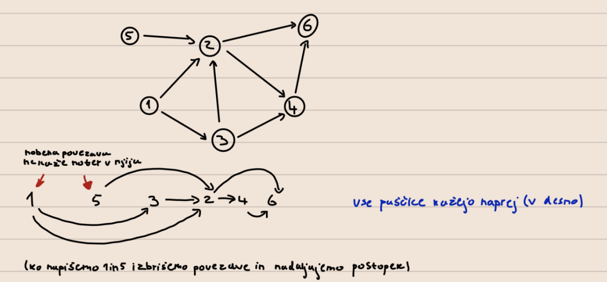

# Vaje 6
**Datum:** 15/03/2023

**Avtor:** Filip Bojko

---


## **Grafi**

> **G(V, E)**

> V = \{1,...n\}

> $n = |V|$

> $m = |E|$

> $E \leq \binom{v}{2}$


## **Naloga 1.**
>Predstavitev grafa 
### **a) Matrika sosednosti**

A je **n x n** matrika 

$$
    \begin{equation}
    A[i][j]=\begin{cases}
        \omega(i, j), & \text{$(i, j) \in E$}.\\
        None, & \text{sicer}.
    \end{cases}
    \end{equation}
$$

$$A = \begin{pmatrix}1 & 2 & None & None & ... & 17\\
 &\\
 &\\
 &\\
\end{pmatrix}$$

---

### **b) Seznam sosednosti G**

G je seznam(slovar) seznamov dolžine **n**

>$G[i] = [( j$, $\omega(i, j))$ za vsak $j$, tako daje $(i, j)$ povezava $)]$

Takoj dobimo sosede od določenega vozlišča, medtem ko v al moramo izračunati vse povezave na grafu.

---

### **c) Slovar sosednosti G**

G je seznam slovarjev dolžine **n**.

>$G[i] = [( j$ : $\omega(i, j))$ za vsak $j$, tako daje $(i, j)$ povezava $)]$

---

### **Časovna in prostorska zahtevnost grafov**

<br>

|    | i in j soseda? | i in j soseda?   | sosedi od i |
|----|----------------|------------------|-------------|
| a) | $O(n^2)$        | $O(1)$             | $O(n)$        |
| b) | $O(n + m)$       | $O(deg(i)) = O(n)$ | $O(1)$        |
| c) | $O(n + m)$      | $O(1) $            | $O(n)/O(1)$   |

<br>

>$\sum_{i=1}^n deg(i) + 1 = 2 * |E| + |V| = O(m + n)$

## **Naloga 2.**



G seznam sosednosti

```python
    def topo_sort(G): 
        n = len(G)
        in_deg = [0] * n #in_def[i]: število povezav, ki kaže v i
        for i in range(n): #čez vsa vozlišča
            for j in G[i]: #čez sosede i-ja
                in_deg[j] += 1 #imamo povezavo od i do j
        izvori = [i for i in range(n) if in_deg[i] == 0]
        rezultat = []
        while izvori:
            izvor = izvor.pop()
            rezultat.append(izvori)
            for sosed in G[izvori]:
                in_deg[sosed] -= 1
                if in_deg[sosed] == 0:
                    izvor.append(sosed)
        return rezultat
```

>**Časovna zahtevnost:** O(n + m)

DAG se uporablja tudi v multithreading-u

## **Naloga 3.**

<i>namig: Dinamična rešitev</i>

>$D[i] ...$ najdaljša pot od $i$ do $t$\
>$D[t] = 0$\
>$D[i] = -\inf$\
>$D[i] = \underset{j, \omega \in G[i]}{\operatorname{max}} \{ D[j] + \omega\}$

Graf uredimo topološko in seznam D polnimo v obratni topološki ureditvi.

