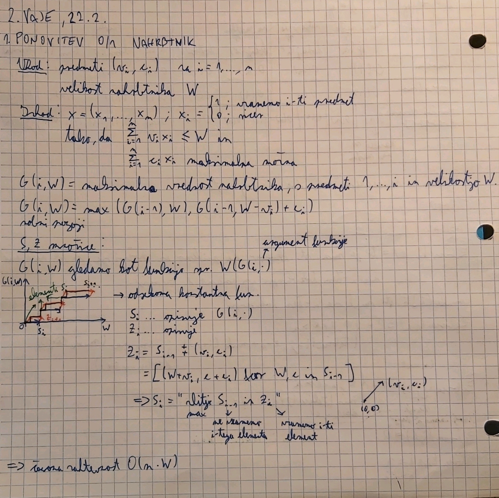
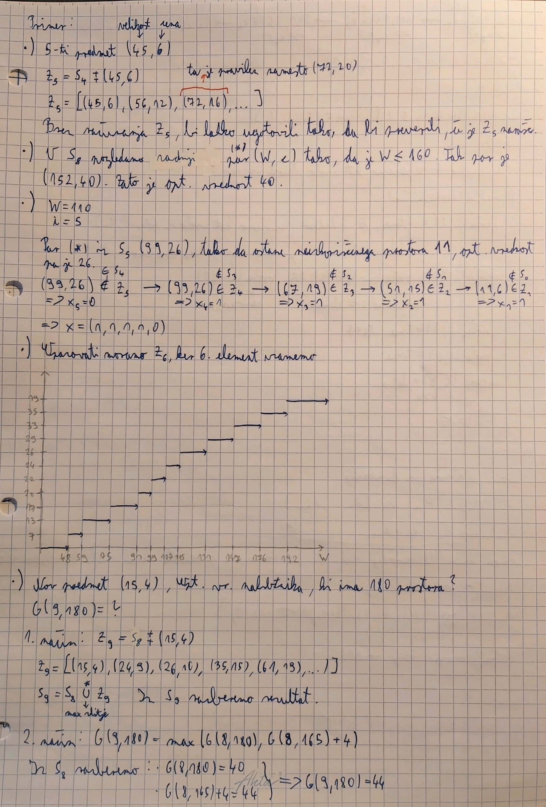
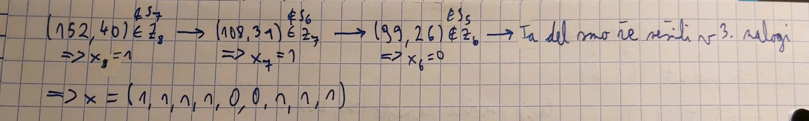
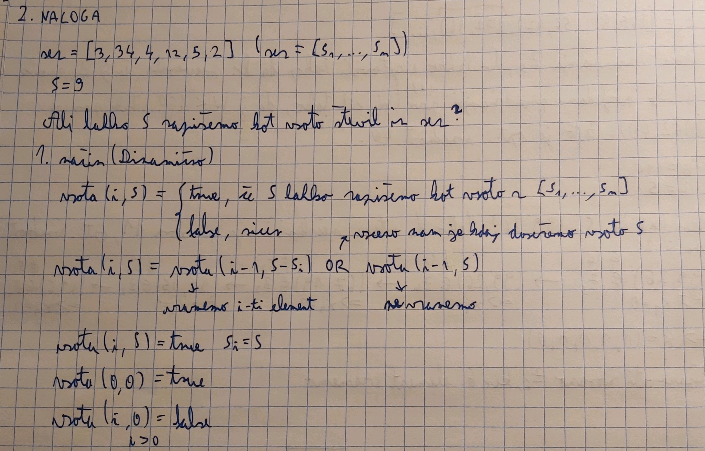
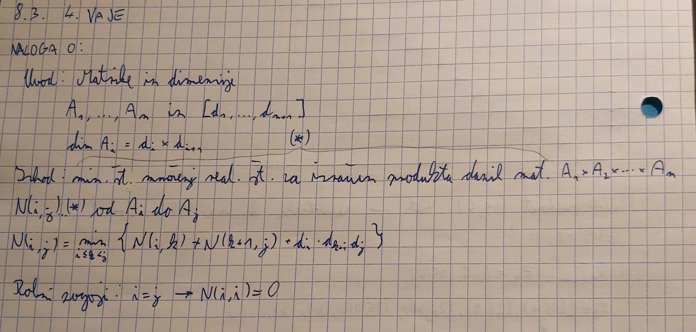
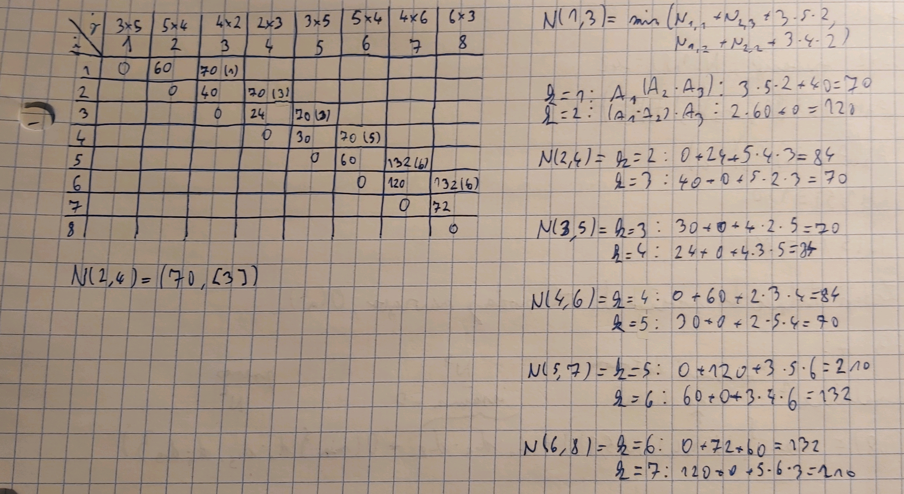
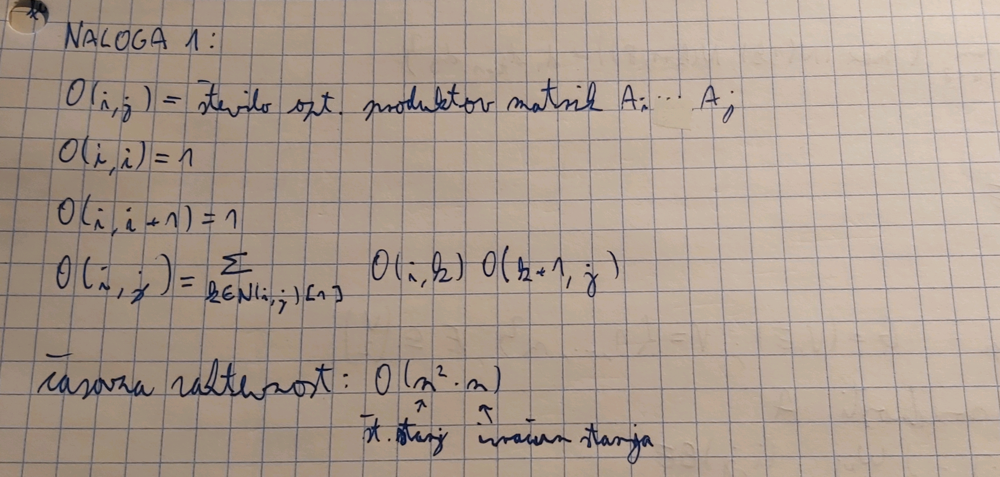
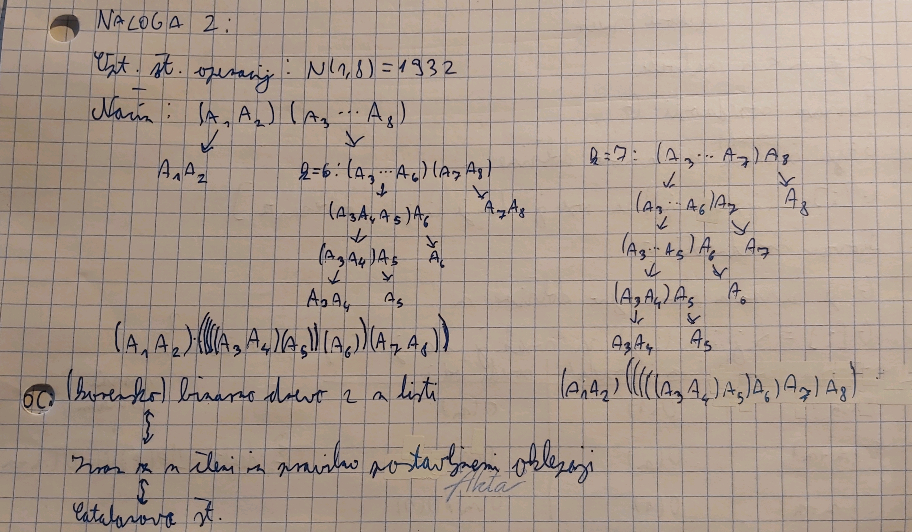
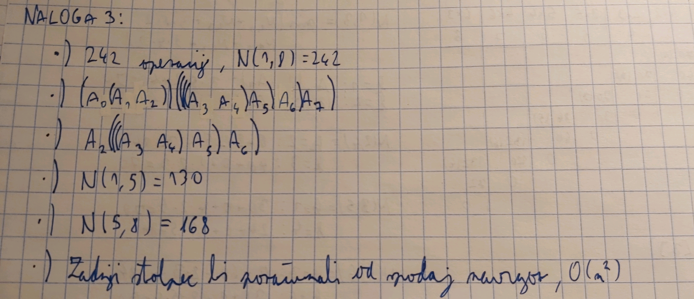
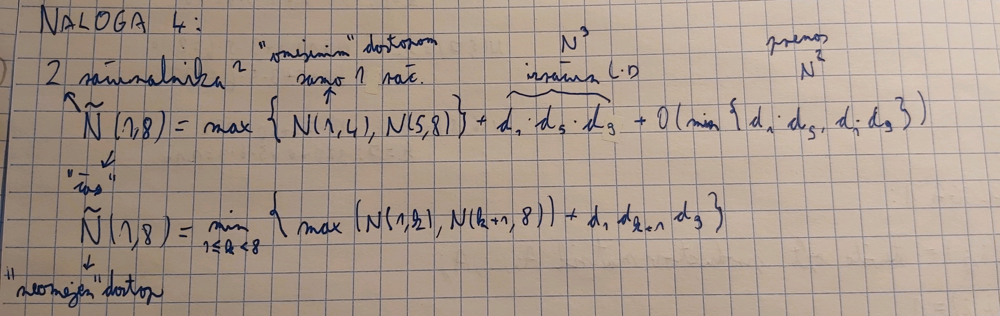

# Poročilo za vaje
**Ime:** Jure Lilija

## Vsebina
* Vaje 1 (15.2.2023)
* Vaje 2 (22.2.2023)
* Vaje 3 (1.3.2023)
* Vaje 4 (8.3.2023)

## Vaje 1
**Datum**: 15.2.2023

Na vajah smo ponovili časovno zahtevnost in O notacije. Nato smo reševali nalogo žabica na programu Tomo.

### Komentarji in opombe
Všeč mi je bil način reševanja problema žabice po korakih na tabli. Sama implementacija se mi je zdela kar težka.

### Naloga 1
Kaj pomeni $f \in O(g)$ za neki funkciji $f,g:\mathbb{N} \rightarrow \mathbb{R}^+$?

$f \in O(g) \Leftrightarrow \exists c, \exists n_{0}:\forall n\geq n_{0}, f(n)\leq c*g(n)$

| |dodaj(n)|dodaj(i)|dodaj(o)|dostop(i)|'x in'|briši(o)|briši(i)|briši(n)|
|-|-|-|-|-|-|-|-|-|
|seznam|$O(1)$|$O(n)$|$O(n)$|$O(1)$|$O(n)$|$O(n)$|$O(n)$|$O(1)$|
|slovar|$O(1)$|$O(1)$|$O(1)$|$O(1)$|$O(1)$|$O(1)$|$O(1)$|$O(1)$|
|verižni seznam|$O(1)$/$O(n)$|$O(1)$/$O(n)$|$O(1)$/$O(n)$|$O(1)$|$O(1)$|$O(1)$/$O(n)$|$O(1)$/$O(n)$|$O(1)$/$O(n)$|

Legenda:
* n = zadnje mesto
* i = nekje vmes
* o = na začetku
* / = ločuje možnost med tem, da je kazalec že na pravem mestu ali ne

### Naloga 2
Na tabli smo reševali primer Žabica iz Tomota, ki smo ga nato tudi poskušali implementirati v pythonu.

muhe[i] = število muh na i-tem lokvanju
\
zabica(i,e) = to je minimalno številov skokov, da pridemo iz močvirja, če se nahajamo na i-tem kokvanju in imamo e energije
\
Problem smo rešili na dva različna načina:
* Če ne moremo skočiti do konca, poiščemo lokvanj z največ muhami.
\
$zabica(i,e) = 1 + {0, i+e > n}$ ali ${zabica(i+j, e-j + muhe[i+j]), j = arg max(muhe[i+d]), d \in (1,...,i+e)}$
* Iščemo s pomočjo rekurzije in memoizacije.
\
$zabica(i,e) = 1 + {0, i+e > n}$ ali ${min(zabica(i+d,e-d+muhe[i+d])), d \in (1,...,e)}$
\
pogoj: če $i>n$: $zabica(i,e) = 0$
\
časovna zahtevnost: izračunati moramo vsa stanja $\Rightarrow$ $O(n^2) * O(n) = O(n^3)$, pri tem $n^2$ predstalja število stanj, $n$ pa izračun enega stranja.

Koda:
```python
from functools import lru_cache
def zabica(mocvara):
    st_lokvanjev = len(mocvara)
    energija = mocvara[0]
    lokvanj = 0
    if st_lokvanjev == 0:
        return 0
    @lru_cache(maxsize=None)
    def zabica2(lokvanj, energija):
        najmanjsi = float('inf')
        for razdalja in range(1, energija + 1):
            if razdalja + lokvanj < st_lokvanjev:
                najmanjsi = min(najmanjsi, zabica2(lokvanj + razdalja, energija - razdalja + mocvara[lokvanj + razdalja]))
            else:
                return 1
        return najmanjsi + 1
    return zabica2(lokvanj, energija)
```

## Vaje 2
**Datum**: 22.2.2023

Na tablo smo reševali naloge iz 0/1 nahrbtnika. Ponovili smo Bellmanovo enačbo in množice S in Z.

### Komentarji in opombe

Samo reševanje nalog se mi je zdelo zanimivo, čeprav so bile naloge kar lahke.

### Naloga 1

<figure>

</figure>
<figure>

</figure>
<figure>

</figure>

### Naloga 2

<figure>

</figure>

## Vaje 3
**Datum**: 1.3.2023

Na vajah smo imeli tekmovanje v parihin sicer smo na tomotu reševali naloge. Bil sem v paru s Petro Kogovšek. Uspelo nama je rešiti dve nalogi. Prvo in tretjo, ki pa ima na domačem računalniku memory error in se tako pokaže na Tomotu, kot oranžna.
\
Drugo nalogo sva poskušala delati z množicama S in Z. Vendar se nama je začelo zatikati, prav tako je bil ta način časovno zelo potraten. Tako da sva se po nasvetu raje lotila naslednje naloge.
\
Četrto nalogo sva naredila pravilno za manjše probleme. Ker pa imamo lahko neskončno enakih predmetov, se zgodi, da ob večjem številu predmetov in 'ogromnem nahrbtniku' hitro pridem do 'recursion depth limit'.

### Komentarji in opombe
Način teh vaj, torej delo v parih in tekmovanje, se mi je zdel zanimiv. Mogoče je edino bolj problem, če se kaj ustavi, potem dlje časa neveš kaj bi delal naprej.

Koda:
1. naloga:
```python
import math
from functools import lru_cache
def optimalni_tovor(predmeti, W):
    n = len(predmeti)
    
    @lru_cache(maxsize=None)
    def b(i,R):
        if i == -1 and R < 0:
            return float('-inf')
        if i == -1 and R >=0:
            return 0
        return max(predmeti[i][0] + b(i-1,R-predmeti[i][1]), b(i-1,R))
    return b(n-1,W)
```
3. naloga:
```python
from functools import lru_cache
def optimalni_tovor_zaloga(predmeti, W):
    n = len(predmeti)
    novi_predmeti = []
    for k in range(n):
        par = [(predmeti[k][0], predmeti[k][1])]*predmeti[k][2]
        novi_predmeti = novi_predmeti + par
    novi_n = len(novi_predmeti)

    @lru_cache(maxsize=None)
    def b(i,R):
        if i == -1 and R < 0:
            return float('-inf')
        if i == -1 and R >=0:
            return 0
        return max(novi_predmeti[i][0] + b(i-1,R-novi_predmeti[i][1]), b(i-1,R))
    return b(novi_n-1,W)
```

Analiza 1. naloge:

Napisali smo, da je časovna zahtevnost problema 0/1 nahrbtnika O(n*velikost_nahrbtnika). Pri samemem testiranju bi rekel, da se čas veča malo hitreje kot linearno. Velikost nahrbtnika ni spreminjala časa, ki je potreben, da se funkcija izvede. Imel sem edino probleme, če sem hotel preveč povečevati število predmetov in število ponovitve testa za bolj natančen podatke, pri tem je takoj prišlo do napak 'recursion depth limit' ter 'memory error'.

Koda:
```python
import random
def generator_predmeti(najcenejsi, najdrazji, najmanjsi, najvecji, n):
    """
    Funkcija generira n predmetov, za katere doličimo meje cene in volumna.
    """
    seznam = list()
    for i in range(n):
        cena = random.randint(najcenejsi, najdrazji)
        volumen = random.randint(najmanjsi, najvecji)
        seznam.append((cena, volumen))
    return seznam

import time

def izmeri_cas(fun, predmeti, nahrbtnik):
    """Izmeri čas izvajanja funkcije pri argumentih `predmeti, nahrbtnik`."""
    zacetek = time.time()
    x = fun(predmeti, nahrbtnik)
    konec = time.time()
    return konec - zacetek

def oceni_potreben_cas(optimalni_tovor, generator_predmeti, najcenejsi, najdrazji, najmanjsi, najvecji, n, nahrbtnik, k):
    """ Funkcija oceni potreben čas za izvedbo optimalni_tovor.
    Za oceno generira primere primerne dolžine s klicom
    `generator_predmeti(najcenejsi, najdrazji, najmanjsi, najvecji, n)`,
    ima nahrbtnik velikosti n
    in vzame povprečje časa za `k` primerov. """
    vsota = 0
    for i in range(k):
        vsota += izmeri_cas(optimalni_tovor, generator_predmeti(najcenejsi, najdrazji, najmanjsi, najvecji, n), nahrbtnik)
    povprecje = vsota / k
    return povprecje

from tekmovanje_nahrbtnik import *
print(oceni_potreben_cas(optimalni_tovor, generator_predmeti, 1, 100, 5, 100, 400, 300, 2))
print(oceni_potreben_cas(optimalni_tovor, generator_predmeti, 1, 100, 5, 100, 200, 300, 2))
print(oceni_potreben_cas(optimalni_tovor, generator_predmeti, 1, 100, 5, 100, 100, 300, 2))
print(oceni_potreben_cas(optimalni_tovor, generator_predmeti, 1, 100, 5, 100, 50, 300, 2))
```
Primer:
```python
6.182760715484619
1.321947336196899
0.28336966037750244
0.08357667922973633
```

## Vaje 4
**Datum**: 7.3.2023

Ponovili smo matrično množenje in reševali na tablo različne primere matričnega množenja.

### Komentarji in opombe

Všeč mi je, da smo šli počasi čez primere in po korakih dodajali znanje.

### Naloga 0

<figure>

</figure>
<figure>

</figure>

### Naloga 1
<figure>

</figure>

### Naloga 2
<figure>

</figure>

### Naloga 3
<figure>

</figure>

### Naloga 4
<figure>

</figure>