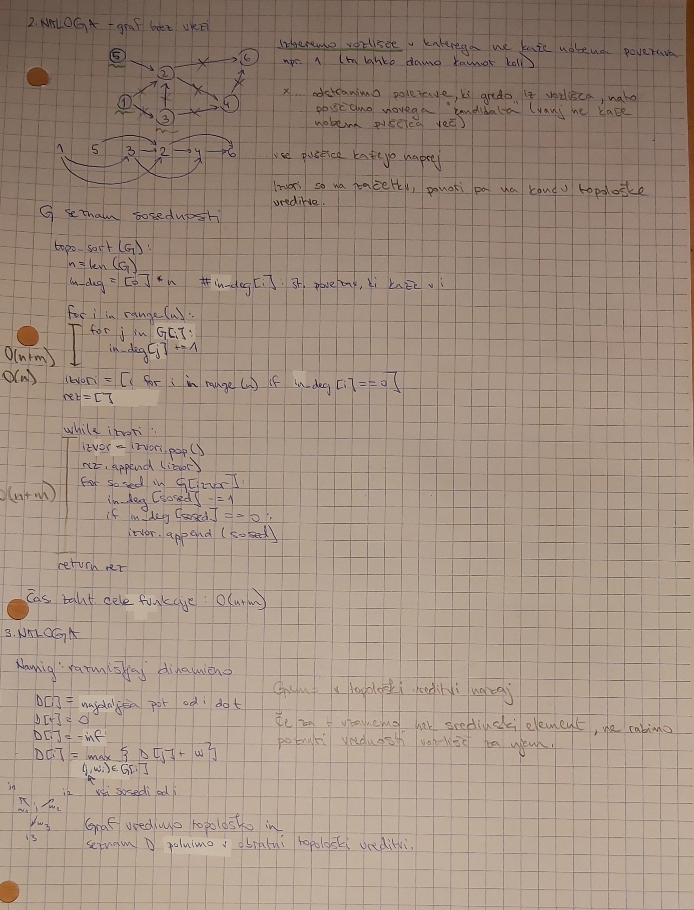
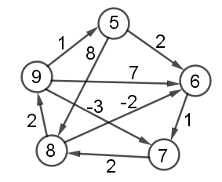

# Drugo poročilo za vaje
**Ime:** Petra Kogovšek

## Vsebina
* Vaje 5 (15.3.2023)
* Vaje 6 (22.3.2023)
* Vaje 7 (29.3.2023)
* Vaje 8 (5.4.2023)
* Vaje 9 (12.4.2023)
* Vaje 10 (19.4.2023)


## Vaje 5
**Datum**: 15.3.2023

Kratek opis:\
Na vajah smo začeli z novo snovjo in sicer z grafi. Spoznali smo tri načine predstavitve grafov in topološko ureditev.

Komentarji in opombe: \
Vaje so se mi zdele vredu.

### Naloga 1
Imamo graf usmerjen G=(V,E) z uteženimi povezavami. Torej imamo neko funkcijo ω:E→A, ki vsaki povezavi dodeli utež iz množice A.
<figure>

</figure>

### Naloga 2
Usmerjenemu grafu G z n vozlišči, ki nima ciklov rečemu tudi DAG (directed acyclic graph). Vozlišča takega grafa lahko topološko uredimo. To pomeni, da obstaja da zaporedje vozlišč `(v1,v2,…,vn)`, tako da ne obstaja povezava od `vi` do `vj`, če je `j<i`.
Sestavi algoritem, ki najde tako zaporedje. Namig: Katera vozlišča lahko zagotovo damo na prvo mesto v to ureditev? 

### Naloga 3
Naj bo sedaj G usmerjen utežen graf brez ciklov. Kako bi izračunali ceno najdaljše poti v tem grafu med vozliščema s in t?

Rešitve nalog 2 in 3 :
<figure>

</figure>

## Vaje 6
**Datum**: 22.3.2023

Kratek opis:\
Na vajah smo obravnavali BFS, povedali nekaj njegovih uporab in kako z njem poiščemo dolžine najkrajših poti. Nato pa smo še ponovili FW algoritem in ga uporabili na primeru. 

Komentarji in opombe: \
Vaje so se mi zdele vredu.

### Naloga 1
Ponovimo BFS algoritem in ga modificirajmo tako, da bo iskal najkrajše poti v neuteženem grafu.
<figure>

</figure>

### Naloga 2
Ponovimo Floyd-Warshallow algoritem. Kaj računa in kaj vrne? Kakšna je njegova časovna zahtevnost?

### Naloga 3
Simulirajmomo algoritem na spodnjem grafu.

<figure>

</figure>

<figure>

</figure>

## Vaje 7
**Datum**: 29.3.2023

Kratek opis:\
Na vajah smo delali z FW algoritmom in zapisali kodo za Dijkstrov algoritem ter ga analizirali.

Komentarji in opombe: \
Vaje so se mi zdele zelo vredu.

### Naloga 1
Iz prejšnjih vaj, kako razberemo najkrajše poti s pomočjo matrike Π, ki jo dobimo z FW algoritmom.
<figure>

</figure>

### Naloga 2
Uteži sedaj dodamo še na vozlišča. Kako sedaj poiskati najcenejše poti?

### Naloga 3
Premislimo, zakaj preprosta sprememba v FW algoritmu iz min na max ne najde nujno najdražje poti v grafu?

### Naloga 4
Na neki borzi se trgujejo valute po menjalnem tečaju, ki ga podaja tabela R velikosti n×n, kjer je n število različnih valut. Vrednost R[i][j] pove, da za a enot valute i dobimo a*R[i][j] enot valuje j. Ker menjalni tečaji lahko hitro spreminjajo in so odvisni od raznih parametrov se lahko zgodi, da R[i][j]⋅R[j][i]≠1.

Za primer si oglejmo naslednjo shemo:
||EUR|USD|YEN|
|:-|:-----:|:-----:|:-----:|
|EUR|1|1.2||
|USD||1|120|
|YEN|0.01||1|

Če trgujemo USD -> YEN -> EUR -> USD končamo z 1.44 USD. Tako zaporedje imenujemo arbitraža. Predpostavimo, da ne obstaja arbitražnih zaporedij. Kako bi poiskali najbolj ugodno pretvorbo valute i v valuto j? Kaj pa če sedaj opustimo predpostavko in dovoljujemo, da arbitražna zaporedja obstajajo. Kako bi odkrili, kakšna so?

Rešitve nalog 2-4:
<figure>

</figure>

### Naloga 5
Ponovimo Djikstrov algoritem. Kaj so vhodni in izhodni podatki, kakšne so predpostavke, itd. Zapišimo tudi njegovo psevdo kodo.

<figure>

</figure>

## Vaje 8
**Datum**: 5.4.2023

Kratek opis:\
Na vajah smo delali v pythonu, kjer smo z Dijkstrovim algoritmom reševali naloge.

Komentarji in opombe: \
Vaje so se mi zdele vredu.

Na naslovu https://unilj-my.sharepoint.com/:f:/g/personal/gasper_romih_fmf_uni-lj_si/EgIVtB_YcP1Cs6MMyjtiFCcBSEEHYH9rzpd63Ll_sXAXrA?e=QMRZzr, smo dobili dve datoteki:

    djikstra.py -> implementacija djikstrovega algoritma
    roadNet-TX.txt -> datoteka za informacijami o cestnem omrežju v Texasu. Vozlišča so bodisi križišča oz. končne destinacije povezave pa so ceste med temi vozlišči. Povezave oz. ceste niso utežene so pa usmerjene.

### Naloga 1
Uporabiti smo morali ta algoritem na teh podatkih, torej:
* roadNet-TX.txt spremenimo v ustrezno podatkovno strukturo grafa.
* poiščemo najkrajše razdalje od vozlišča 100 do vseh ostalih.
* Koliko je razdalja dG(100,100000)?
* Katero vozlišče je najbolj oddaljeno od vozlišča 100?
* Koliko vozlišč je dosegljivih iz vozlišča 100?

Koda:
```python
from dijkstra import *
dat = open('roadNet-TX.txt', 'r')
i = 1
g = []
n = -5
for vrstica in dat:
    if i>4:
        vrstica=vrstica.split()
        v1,v2 = int(vrstica[0]), int(vrstica[1])
        n = max(n,v1,v2)
        g.append((v1,v2))
    i +=1
dat.close()
graf = [[] for _ in range(n+1)]
for u,v in g:
    graf[u].append((v,1))

#dijkstra(graf,od_katerega_vozlišča_do_ostalih)
D,p = dijkstra(graf,100)
#D nam sedaj vrne dolžino najkrajših poti od vozlišča 100 do vseh ostalih
#razdalja od 100 do 100000 je
print(D[100000])
#najbolj oddaljeno vozlišče od vozlišča 100 je
D.index(max(D))
#koliko vozlišč je dosegljivih iz vozlišča 100
print(sum(x>=0 for x in D))
```

## Vaje 9
**Datum**: 12.4.2023

Kratek opis:\
Na vajah smo nadaljevali z nalogami od prejšnič, nato pa smo še konstruirali nov graf.

Komentarji in opombe: \
Vaje so se mi zdele vredu.

### Naloga 1
Nadaljujte z nalogami 2,3,4 od zadnjič. Naloga 5 naj ostane za poročilo.

#### Naloga 2
Glede na to, da graf ni utežen, lahko za isto nalogo implementiramo BFS algoritem. Implementirati moramo BFS algoritem, ki bo poiskal dolžine najkrajših poti od s do vseh ostalih vozlišč. Ki vrne tudi drevo najkrajših poti, tako kot Djikstra. Preveri iste zadeve kot zgoraj, dobiti moraš seveda iste odgovore.

Koda:
```python
from collections import deque
def bfs(G,s):
    n = len(G)
    d = [0]*n
    obiskani = [False]*n
    poti = [None] * n
    q = deque([(s,0,s)])
    while q:
        trenutni, razdalja, p = q.popleft()
        if obiskani[trenutni]:
            continue
        obiskani[trenutni] = True
        d[trenutni] = razdalja
        poti[trenutni] = p
        for sosed,cena in G[trenutni]:
            if not obiskani[sosed]:
                q.append((sosed, razdalja+1, trenutni))
    return d, poti
```

#### Naloga 3
Oba algoritma dodelaj, tako da dodaš nov vhodni podatek t, ki predstavlja končno vozlišče. Algoritma naj torej vrneta razdaljo med s in t v grafu ter pote (kot drevo) med njima. Delujeta naj, tako da se ustavita takoj ko najdemo željeno pot.

Koda:
```python
import heapq
from collections import deque
def bfs_nov(G,s,t):
    # t predstavlja končno vozlišče
    n = len(G)
    d = [0]*n
    obiskani = [False]*n
    poti = [None] * n
    q = deque([(s,0,s)])
    while q:
        trenutni, razdalja, p = q.popleft()
        if obiskani[trenutni]:
            continue
        obiskani[trenutni] = True
        d[trenutni] = razdalja
        poti[trenutni] = p
        if trenutni == t:
            break
        for sosed,cena in G[trenutni]:
            if not obiskani[sosed]:
                q.append((sosed, razdalja+1, trenutni))
    return d, poti

def dijkstra_nov(G, s, t):
    n = len(G)
    obiskani = [False] * n
    razdaljeDo = [-1] * n
    poti = [None] * n
    Q = [(0, s, s)]
    while Q:
        razdalja, u, p = heapq.heappop(Q)
        if obiskani[u]:
            continue
        obiskani[u] = True
        razdaljeDo[u] = razdalja
        poti[u] = p
        if u == t:
            break
        for (v, teza) in G[u]:
            if not obiskani[v]:
                heapq.heappush(Q, (razdalja + teza, v, u))
    return razdaljeDo, poti
```

#### Naloga 4
Zapiši funkcijo, ki sprejme začetno vozlišče s, končno vozlišče t ter drevo najkrajših poti ter vrne najkrajšo pot med njima v obliki seznama. Sedaj rekonstruiraj najkrajšo pot med vozliščem 100 in 100000.

Koda:
```python
def najkrajsa_pot(s,t):
    sez = []
    predzadnji = p[t]
    sez.append(predzadnji)

    while predzadnji != s:
        predzadnji = p[predzadnji]
        sez.append(predzadnji)
    sez.reverse()
    return sez
p = najkrajsa_pot(100,100000)
print(p)
```

#### Naloga 5
Analiziraj časovne zahtevnosti algoritmov. Primerjaj hitrost med djikstro in BFS-jem. Prav tako analiziraj razliko med djikstro, ki izračuna najkrajše poti od s do vseh ostalih ter jo primerjaj z tisto verzijo iz Naloge 3. Če nas bi zanimale najkrajše poti od s do t_1, t_2, ..., t_k, kateri algoritem bi uporabil? Probaj odgovor podat na podlagi parametra k, ter analize, ki si jo opravil.

Dijkstra ima časovno zahtevnost O(|E|*log|E|), kjer |E| predstavlja število povezav, medtem ko ima BFS pa ima časovno zahtevnost O(|V|+|E|), kjer pa |V| predstavlja število vozlišč. 

BFS algoritem najprej pogleda vse sosedenega začetnega vozlišča (te so na razdalji ena), nato pogleda vse njihove sosede (te so od začetnega vozlišča oddaljeni za dva) in tako naprej. Dijkstra pa pogleda razdalje do vseh sosedov od začetnega vozlišča in se pomakne na vozlišče, ki je najbližje, nato zopet izbere vozlišče z najkrajšo razdaljo (bodisi iz začetnega bodisi iz zdajšnega vozlišča) in postopek ponavlja.

Razlika med dijkstro iz Naloge 3, ki izračuna najkrajše poti od s do vseh ostalih, v primerjavi z "navadno" dijkstro je hitrejša, saj preneha z iskanjem takoj ko najde iskano vozlišče.

Če nas bi pa zanimale najkrajše poti od s do k vozlišč:
<figure>

</figure>

Koda:
```python
import time                         # Štoparica
import random                       # Za generiranje primerov
from dijkstra import *
from bfs import *
from bellman_ford import *
from naloga3 import *

def izmeri_cas(fun, G, s):
    """Izmeri čas izvajanja funkcije `fun` pri argumentu `G` in `s`."""
    zacetek = time.time()
    x = fun(G,s)
    konec = time.time()
    return konec - zacetek

def izmeri_cas2(fun, G, s, t):
    """Izmeri čas izvajanja funkcije `fun` pri argumentu `G` in `s`."""
    zacetek = time.time()
    x = fun(G,s,t)
    konec = time.time()
    return konec - zacetek

def oceni_potreben_cas(fun, G, s, k):
    vsota = 0
    for i in range(k):
        vsota += izmeri_cas(fun, G, s)
    povprecje = vsota/k
    return povprecje

def oceni_potreben_cas2(fun, G, s, t, k):
    vsota = 0
    for i in range(k):
        vsota += izmeri_cas2(fun, G, s, t)
    povprecje = vsota/k
    return povprecje

# -----------------------------------------------------------------------------
import random
def ustvari_graf(n):
    with open("nov_graf.txt", "w") as dat:
        for vozlisce in range(n):
            st_povezav = random.randint(1, n//2) # od i-tega vozlišča
            for k in range(st_povezav):
                do = random.randint(0, n-1) # do katerega vozlišča gre povezava
                while do == vozlisce:
                    do = random.randint(0, n-1)
                utez = random.randint(1, 100)
                vrstica = str(vozlisce) +' '+ str(do) +' '+ str(utez)
                dat.write(vrstica)
                dat.write('\n')
    dat.close()

    nov_graf = [[] for _ in range(n)]
    with open('nov_graf.txt', 'r') as dat:
        vrstice = dat.readlines()
        for vrstica in vrstice:
            vrstica = vrstica.strip().split()
            od, do = int(vrstica[0]), int(vrstica[1])
            utez = int(vrstica[2])
            nov_graf[od].append((do, utez))
    return nov_graf
# -----------------------------------------------------------------------------

if __name__ == '__main__':
    velikosti = []
    tab_casi1 = []
    tab_casi2 = []
    tab_casi3 = []
    tab_casi4 = []
    for i in range(1,10):
        velikosti.append(i*200)
        tab_casi1.append(oceni_potreben_cas(dijkstra, ustvari_graf(i*200), 1, 1))
        tab_casi2.append(oceni_potreben_cas2(dijkstra_nov, ustvari_graf(i*200), 1, 100, 1))
        tab_casi3.append(oceni_potreben_cas(bfs, ustvari_graf(i*200), 1, 1))
        tab_casi4.append(oceni_potreben_cas2(bfs_nov, ustvari_graf(i*200), 1, 100, 1))
#        tab_casi3.append(oceni_potreben_cas(bellman_ford, ustvari_graf(i*200), 1, 1))
    from matplotlib import pyplot as plt
    plt.plot(velikosti, tab_casi1, label = "dijkstra")
    plt.plot(velikosti, tab_casi2, label = "dijkstra_nov")
    plt.plot(velikosti, tab_casi3, label = "bfs")
    plt.plot(velikosti, tab_casi4, label = "bfs_nov")
#    plt.plot(velikosti, tab_casi3, label = "bellman ford")
    plt.xlabel('stevilo vozlisc')
    plt.ylabel('cas izvajanja')
    plt.legend()
    plt.show()
```
Primerjava časovnih zahtevnosti algoritmov Dijkstra, BFS in Bellman-Ford:
<figure>

</figure>

### Naloga 2
Konstruirajte nov graf, ki vsebuje le vozlišča od 0 do N. Vsaki povezavi določite neko pozitivno utež (lahko čisto naključno) in zadevo shranite v novo .txt datoteko. Vrstice naj bodo oblike u v w(u,v), kjer je (u,v) povezava in w(u,v) njena utež.

Koda:
```python
import random
n = int(input('Vnesite poljubno število vozlišč: '))
with open("nov_graf.txt", "w") as dat:
    for vozlisce in range(n):
        st_povezav = random.randint(1, n//2) # od i-tega vozlišča
        for k in range(st_povezav):
            do = random.randint(0, n-1) # do katerega vozlišča gre povezava
            while do == vozlisce:
                do = random.randint(0, n-1)
            utez = random.randint(1, 100)
            vrstica = str(vozlisce) +' '+ str(do) +' '+ str(utez)
            dat.write(vrstica)
            dat.write('\n')
dat.close()

nov_graf = [[] for _ in range(n)]
with open('nov_graf.txt', 'r') as dat:
    vrstice = dat.readlines()
    for vrstica in vrstice:
        vrstica = vrstica.strip().split()
        od, do = int(vrstica[0]), int(vrstica[1])
        utez = int(vrstica[2])
        nov_graf[od].append((do, utez))
```

### Naloga 3
Implementiranje še Bellman-Fordov algoritem in ga poženite na grafu iz prejšnje naloge. Analiziraje kako velik N iz prejšne naloge morate vzeti, da bo algoritem še deloval v zglednem času.

Koda:
```python
def bellman_ford(G, s):
    n = len(G)
    razdalja = [float("inf")] * n
    predhodnik = [None] * n
    razdalja[s] = 0
    for _ in range(n):
        sprememba = False
        for i in range(n):
            for j in range(len(G[i])):
                do, utez = G[i][j]
                trenutna = razdalja[i] + utez
                if trenutna < razdalja[do]:
                    razdalja[do] = trenutna
                    predhodnik[do] = i
                    sprememba = True
        if not sprememba:
            break
    for i in range(n):
        for j in range(len(G[i])):
            do, utez = G[i][j]
            if razdalja[i] + utez < razdalja[do]:
                return "Graf ima negativni cikel!"
    return razdalja, predhodnik
```


## Vaje 10
**Datum**: 19.4.2023

Kratek opis:\
Na vajah smo delali s kopico.

Komentarji in opombe: \
Vaje so se mi zdele vredu.

### Naloga 1
Simuliraj delovanje (min) kopice. Za vsavljanje je kot operacija število, za brisanje pa x. Za boljšo predstavo nariši kar drevesa. 
Operacije: 8,2,1,3,7,6, x, x, 5, x, -3, x

### Naloga 2
Predstavi kopico s seznamom in zapiši delovanje pop() in push(x) operacij.

<figure>

</figure>

### Naloga 2
Kako bi s kopico sortiral seznam? Časovna zahtevnost? Kako in podanega seznama nardiš kopico v O(n) časa.

<figure>

</figure>