# **Vaje 5**
**Datum: 15. 3. 2023**
## Naloga 1
Imamo graf usmerjen $G = (V, E)$ z uteženimi povezavami. Torej imamo neko funkcijo $\omega: E \rightarrow A$, ki vsaki povezavi dodeli utež iz množice A.\
\
Navedi nekaj možnih podatkovnih struktur za predstavitev grafa $G$. Navedi nekaj prednosti oz. slabosti vsake izmed njih. Ponovi tudi, kaj je v grafu pot, sprehod in cikel.\
\
**Graf lahko predstavimo kot:**
* Matrika sosednosti
* Seznam sosednosti G
* Slovar sosednosti G

**<ins>Matrika sosednosti</ins>**

$$
A[i][j] = \left \{ \begin{array}{ll}
\omega(i,j) & ; (i,j) \in E \\ 
\text{None} &\text{; sicer}
\end{array} 
\right.
$$

**<ins>Seznam sosednosti G</ins>**
* G je seznam seznamov dolžine $n$
* $G[i]=\{j:\omega(i,j); \forall j, \text{ da }(i,j)\in E\}$

**<ins>Slovar sosednosti G</ins>**
* G je seznam slovarjev dolžine $n$
* $G[i]=\{j:\omega(i,j); \forall j, \text{ da }(i,j)\in E\}$

||prostorska zahtevnost|$i$ in $j$ soseda?|sosedi od $i$|
|:--:|:--:|:--:|:--:|
matrika sosednosti|$O(n^2)$|$O(1)$|$O(n)$|
seznam sosednosti|$O(m+n)$|$O(n)$|$O(1)$|
slovar sosednosti|$O(m+n)$|$O(1)$|$O(n)$ / $O(1)$
---
## Naloga 2
Usmerjenemu grafu $G$ z $n$ vozlišči, ki nima ciklov
rečemo tudi **DAG** (directed acyclic graph). Voylišča takega grafa lahko topološko uredimo. To pomeni, da obstaja zaporedje vozlišč ($\nu_1, \nu_2,\ldots.\nu_n$), tako da ne obstaja povezava od $\nu_i$ do $\nu_j$, če je $j$ manjši od $i$.

**Primer grafa:**
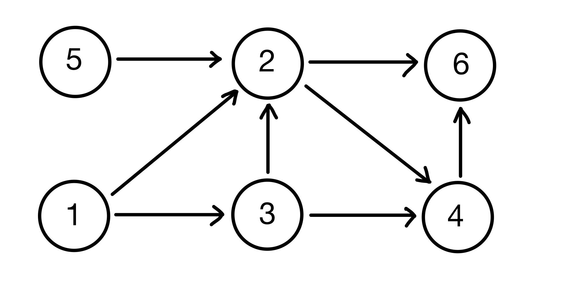
**DAG:**
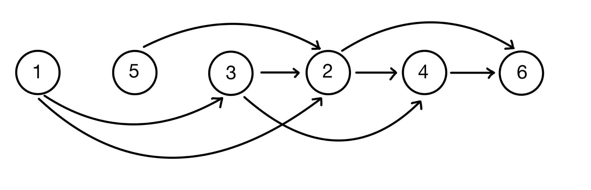

```python
def topo_sort(G):
    """
    Sprejme graf G kot seznam sosednosti in vrne njegovo topološko ureditev.
    """
    n = len(G)
    in_deg = [0] * n 
    for i in range(n): 
        for j in G[i]: 
            in_deg[j] += 1 
        izvori = [i for i in range(n) if in_deg(i) == 0] 
        rezultat = []
        while(izvori):
            izvor = izvori.pop()
            rezultat.append(izvor)
            for sosed in G[izvor]:
                in_deg[sosed] -= 1
                if in_deg[sosed] == 0:
                    izvor.append(sosed)
    return rezultat
```
## Naloga 3
Naj bo $G$ usmerjen utežen graf brez ciklov. Kako bi izračunal ceno najdaljše poti v tem grafu med vozliščema $s$ in $t$.

* $D[i]=\text{najdaljša pot od } i \text{ do } t.$;
* $D[t]=0$;
* Začetne vrednosti: $D[i]=-\infty$
* $D[i]=max\{D[j]+\omega\}$;
* $(j,\omega)\in G[i]$

Graf uredimo topološko in seznam $D$ polnimo, v obratni topološki ureditvi.

---
# **Vaje 6**
**Datum:** 22. 3. 2023
>**BFS** - "Breadth first-search"\
**DFS** - "Depth first-search"

Mi se bomo osredotočili na **BFS**.

## **BFS**
- pregled grafa
- vpeto drevo/gozd v grafu povezane komponente
- preverjanje dvodelnosti grafa
- iskanje najkrajših poti (neuteženem grafu)

## **Python koda**

```python
    def BFS(G, u) 
    # G: graf kot seznam sosedov 
    # u: začetno vozlišče
        n = len(G)
        obiskani = [False] * n
        q = Vrsta([u]) # začnemo v u (v py: from collections import Deque)
        while q:
            trenutni = q.popleft()
            if obiskani[trenutni] : continue # smo ga že obiskali
            obiskani[trenutni] = True
            for sosed in G[trenutni]:
                if not obiskani[sosed]:
                    q.push(sosed)

```
## **1. Naloga**
*Za iskanje poti*

```python
def BFS(G,u):
    '''Vrne najkrajše poti od u do vseh ostalih poti'''
    n = len(G)
    d = [0] * n
    obiskani = [False] * n # nobenega vozlišča še nismo obiskali

    #    deque( ) --> knjiznica Deque
    q = vrsta([(u,0)])  # v vrsto damo vozlišče u in razdaljo od u do u (0)

    while q:  # dokler vrsta ni prazna
        trenutni, razdalja = q.popleft()
        
        if obiskani[trenutni] : continue # soseda smo že obiskali
        obiskani[trenutni] = True
        d[trenutni] = razdalja

        for sosed in G[trenutni]:
            if not obiskani[sosed]:
                q.push((sosed,razdalja + 1)) # doda v vrsto
    return d
```
**Časovna zahtevnost:** $O(n + m)$
- $n$ ... število vozlišč
- $m$ ... število povezav

## **2. Naloga**
### **Floyd-Warshallow algoritem**
>**Vhod:** graf $G$, utežen (dovoljene so negativne uteži)\
**Izhod:** $D$ dimenzije $n \times n$ ($n$ št. vozlišč).\

$D_{ij}$ cena najkrajše poti med $i$-tim in $j$-tim vozliščem.
### **IDEJA:**
$D_{ij}(k)=min\{D_{ij}(k),D_{ik}(k-1)+D_{kj}(k-1)\}$
Isto kot $D_{ij}$, samo da uporabljamo med $1$ in $k$.
### **ROBNI POGOJI:**
$D_{ii}(1)=0$
$D_{1i}(1)=\omega_{1i}$ (utež povezave)

>**ČASOVNA ZAHTEVNOST:** $O(n^3)$

## **3. Naloga**
*Glej zgornji algoritem!*


|   | 1      | 2      | 3      | 4      | 5      |
|---|--------|--------|--------|--------|--------|
| **1** | 0      | 2      | $\infty$, 3 | 8, 5      | $\infty$, 7 |
| **2** | $\infty$, 8, 6 | 0      | 1      | $\infty$, 3 | $\infty$, 5 |
| **3** | $\infty$, 7, 5 | $\infty$, 0 | 0      | 2      | $\infty$, 4 |
| **4** | $\infty$, 5, 3 | -2     | $\infty$, -1 | 0      | 2      |
| **5** | 1      | 7, 3, -3      | -3     | $\infty$, 9, -1 | 0      |

**Komentar:** Če je kateri od diagonalnih elementov negativen, ima graf negativen cikel.

- $k=1$
- $k=2$
- $k=3$
- $k=4$
- $k=5$

# Vaje 7
**<ins>MINIMALNA BINARNA KOPICA</ins>**
* levo poravnano (ni nujno, da je polno)
* $starš\leq sinova$ za vsako vozlišče v drevesu

## **Naloga 1**

Iz prejšnjih vaj obravnavaj, kako razberemo najkrajše poti s pomočjo matrike $\Pi$, ki jo dobimo z FW algoritmom.

**FW algoritem:**

VHOD:
$D_{ij}(k) = min \{D_{ij}(k-1), D_{ik}(k-1) + D_{kj}(k-1) \}$. 

IZHOD: 
Matrika $D$ oz. $(D_{ij}(n))$ predstavljena kot seznam seznamov v Pythonu, dimenzije $n \times n$, kjer je $n$ število vozlišč. 

**FW**: $D_{ij}(k) = min\{D_{ij}(k-1), D_{ik}(k-1) + D_{kj}(k-1)\}$

$\Pi_{i,j}(k)\dots$ zadnje vozlišče na $i-j$ poti, kjer smemo vmes uporabiti samo vozlišča od $1$ do $k$.

**začetni/robni pogoji:**
* $\Pi_{i,i}(0) = i$
* $\Pi_{i,G[i]}(0) = i$
* $\Pi_{i,j}(k) = \Pi_{i,j}(k-1)$
* $\Pi_{i, j}(k) = \Pi_{k,j}(k-1)$

**Rekonstrukcija poti:**

**VHOD:** vozlišča $i,j$, matrika $\Pi(n) = \Pi$

**IZHOD:** najkrajša pot od $i$ do $j$

```python
p = j
pot = []
while p != i:
    pot.append(p)
    p = Π[i][p]
pot.append(i)
return pot.reverse()
```
**pot:** $[i, p_1, p_2,\ldots,p_l,j]$

**Časovna zatevnost:**
$O(n)$, kjer je $n$ dolžina poti (v najslabšem primeru je dolžine $n$).

## **Naloga 2**

Uteži sedaj dodamo še na vozlišča. Kako sedaj poiskati najcenejše poti?

**REŠITEV:**  
Možne ideje:
* Prištejemo povezave, ki kažejo v to vozlišče,
* Prištejemo povezave, ki kažejo ven iz vozlišča.

Odločimo se glede na problem (smiselno obravnavamo začetno in končno vozlišče v poti).

## **Naloga 3**

Premisli, zakaj preprosta sprememba v FW algoritmu iz $min$ na $max$ ne najde nujno najdražje poti v grafu.

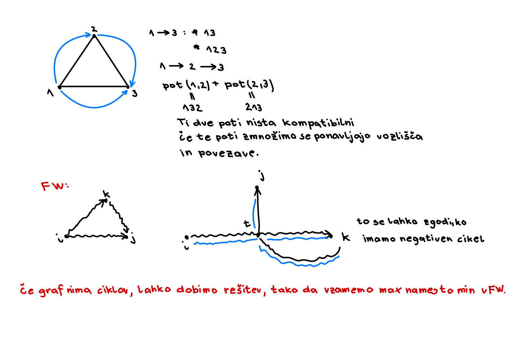

## **Naloga 4**

Na neki borzi se trgujejo valute po menjalnem tečaju, ki ga podaja tabela $R$ velikosti $n\times n$, kjer je $n$ število različnih valut. Vrednost $R[i][j]$ pove, da za $a$ enot valute $i$ dobimo $a\cdot R[i][j]$ enot valuje $j$. Ker menjalni tečaji lahko hitro spreminjajo in so odvisni od raznih parametrov se lahko zgodi, da $R[i][j]\cdot R[j][i] \neq 1$.

Za primer si oglejmo naslednjo shemo: 

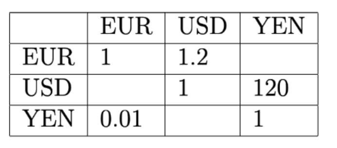

Če trgujemo USD -> YEN -> EUR -> USD končamo z 1.44 USD. Tako zaporedje imenujemo arbitraža.

Predpostavi, da ne obstaja arbitražnih zaporedij. Kako bi poiskal najbolj ugodno pretvorbo valute $i$ v valuto $j$?

Kaj pa če sedaj opustimo predpostavko in dovoljujemo, da arbitražna zaporedja obstajajo. Kako bi odkril, kakšna so?

**REŠITEV:** 
Sestavimo graf $G(V, E)$, kjer so vozlišča valute, povezave pa menjalni tečaji. Na temu grafu nas zanima: "najdražja" pot v grafu $G(V, E)$ od $i$ do $j$. Ceno poti dobimo tako, da zmnožimo uteži na povezavah.

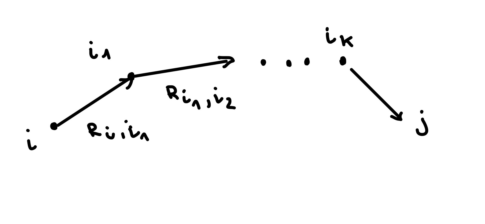

**Ideja: produkt pretvorimo na vsoto.**

Ceno izračunamo tako: 

* $R_{i,i_1} \cdot R_{i_1,i_2} \cdots R_{i_k,i_1}$

* $log(R_{i,i_1} \cdot R_{i_1,i_2} \cdots R_{i_k,i_1}) = \sum log(R)$

Sedaj imamo najdražjo pot in neke uteži na grafu. Ker nas zanima najbolj ugodna pretvorba valute, utež na povezavi $ij$ nastavimo na $-log(R_{ij})$. Problem smo prevedli na iskanje najceneše poti od $i$ do $j$ v novem grafu. V ta namen bi si želeli uporabiti FW algoritem. To lahko storimo, če graf nima negativnih ciklov. Želimo pokazati, da jih naš graf res nima.

Dokažimo s protislovjem. Predpostavimo, da imamo negativen cikel od $i-i$. Cena tega cikla je: 

$-\sum\limits_{j=1}^k \log(R_{i_{j-1}, i_{j}}) < 0$

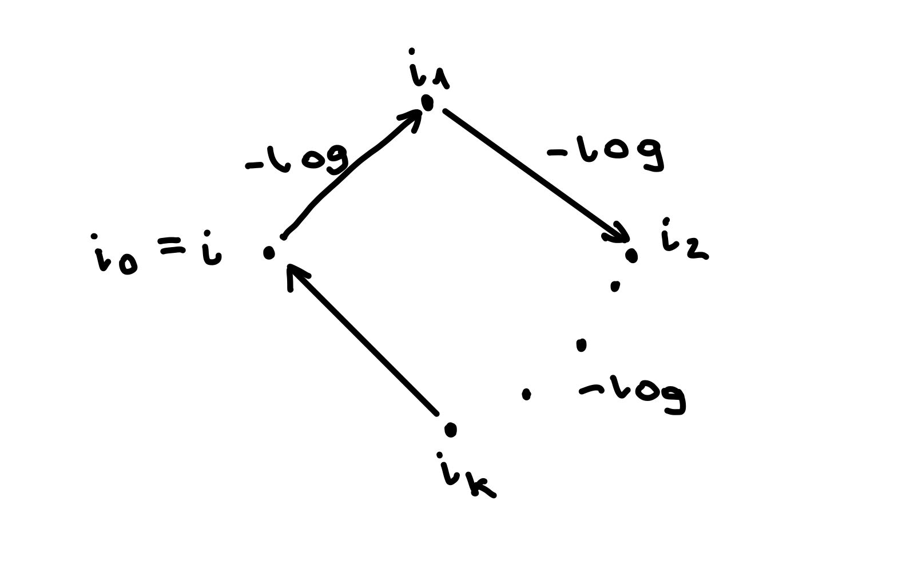

Enačbo pomnožimo z $-1$ in vsoto logaritmov zapišemo kot logaritem produktov:

$$\log (\prod\limits_{j=1}^k (R_{i_{j-1}, i_{j}})) > 0$$


$$\prod\limits_{j=1}^k (R_{i_{j-1}, i_{j}}) > 1$$

Iz tega sledi, da imamo arbitražo, kar nas je pripeljalo do protislovja, saj smo predpostavili, da arbitraža ne obstaja. Od tod sledi, da graf nima negativnih ciklov.

Arbitražna zaporedja odkrijemo tako, da izvedemo FW algoritem in preverimo, če obstaja negativen cikel v grafu. Negativni cikel (iz zgonjega dokaza) pomeni arbitražno strategiijo.

## **Naloga 5**

Ponovi Djikstrov algoritem. Kaj so vhodni in izhodni podatki, kakšne so predpostavk, itd.

Zapiši tudi njegovo glavno idejo oziroma kar psevdo kodo.

**ALGORITEM:**

Vhodni podatki: 
- usmerjen graf $G(V, E)$
- začetno vozlišče $s \in V$
- cene povezav $c_{i,j} \in E$ (cene povezav so nenegativne!)

Izhodni podatki:
- cene najcenejših poti od začetnega do $i$-tega vozlišča $\forall i \in V$ -> D
- drevo najkrajših poti od začetnega do $i$-tega vozlišča $\forall i \in V$ -> P

Psevdokoda:

```python
def dijkstra(G, s):
    """
    Vrne najkrajšo pot od s do vseh vozlišč v grafu G.
    """
    n = len(G)
    D = [float("inf")] * n
    P = [None] * n
    D[s] = 0 # D[i] pove razdaljo od s do i
    P[s] = s
    obiskani = [False] * n
    q = Vrsta(V(G)) # v vrsto dodamo še nedodana vozlišča

    while len(obiskani) != n:
        c = q.popmin() # dobimo najmanjši element in ga odstranimo iz seznama
        obiskani.add(c)

        for sosed, utez in G[c]:
            if sosed not in obiskani:
                if D[c] + utez + D[sosed]:
                    D[sosed] = D[c] + utez
                    P[sosed] = c
    return D, P
```

# Vaje 8
## **Naloga 1**
Vaša naloga bo, da uporabite ta algoritem na teh podatkih, torej:
### **Implementacija Djikstrinega algoritma**
```python
import heapq
from collections import deque

def djikstra(G, s):
    """
    Funkcija sprejme usmerjen in utežen graf G predstavljen
    s seznamom sosednosti ter začetno vozlišče s.
    Torej G[i] = [(v_1, w_1), ... (v_d, w_d)],
    kjer je (i, v_k) povezava v grafu z utežjo w_k.
    Vrne seznam razdaljeDo, ki predstavlja najkrajšo pot od vozlišča s
    do vseh ostalih.
    Vrne tudi seznam poti, ki predstavlja drevo najkrajših poti od s
    do vseh ostalih vozlišč.
    """
    n = len(G)
    
    # Nastavimo začetne vrednosti za sezname obiskani, razdaljaDo in poti.
    obiskani = [False] * n
    razdaljeDo = [-1] * n
    poti = [None] * n

    # Na vrsto dodamo trojico (d, v, p), kjer je:
    # v vozlišče, d razdalja do njega, p pa prejšnje vozlišče na najkrajši poti od
    # s do v.
    Q = [(0, s, s)]

    while Q:
        
        # Vzamemo minimalen element iz vrste
        # heapq.heappop(Q) odstrani element iz seznama  Q, ter pri tem ohranja
        # lastnost kopice : seznam Q tretira kot dvojiško drevo!
        razdalja, u, p = heapq.heappop(Q)

        # če je že obiskan, nadaljujemo.
        if obiskani[u]:
            continue
        
        # obiščemo vozlišče ter nastavimo njegovo razdaljo
        # ter predhodnika na najkrajši poti od s do u
        obiskani[u] = True
        razdaljeDo[u] = razdalja
        poti[u] = p

        # gremo čez vse sosede in dodamo potrebne elemente na vrsto.
        for (v, teza) in G[u]:
            if not obiskani[v]:
                # heap.heappush(Q, elem) doda element v seznam Q, kjer ohranja lastnost kopice.
                heapq.heappush(Q, (razdalja + teza, v, u))

    return razdaljeDo, poti
```
* roadNet-TX.txt spremenite v ustrezno podatkovno strukturo grafa.
```python
def seznam_sosednosti():
    """
    Iz grafa zapisanega v .txt datotek ustvari seznam sosednosti.
    """
    with open("roadNet-TX.txt", "r") as f:
        vrstice = f.readlines()[4:]
    n = max({int(vrstica.split("\t")[0]) for vrstica in vrstice})
    G = [[] for _ in range(n + 1)]
    for vrstica in vrstice:
        u, v = vrstica.strip().split("\t")
        G[int(u)].append((int(v), 1))
    return G
```
* Poiščete najkrajše razdalje od vozlišča 100 do vseh ostalih.
```python
razdalje, poti = djikstra.djikstra(seznam_sosednosti(), 100)
```
* Koliko je razdalja $d_G(100, 100000)$?
```python
razdalje, poti = djikstra.djikstra(seznam_sosednosti(), 100)
print(razdalje[100000])
>>> 240
```
* Katero vozlišče je najbolj oddaljeno od zovlišča 100?
```python
# Najbolj oddaljeno vozlišče
max_d = max(razdalje)
max_vozlisca = [i for i in range(len(razdalje)) if razdalje[i] == max_d]
print(max_vozlisca)
>>> [1389039, 1390394]
```
* Koliko vozlišč je dosegljivih iz vozlišča 100?
```python
# Koliko vozlišč je dosegljivih iz 100
st_dosegljivi = len([d for d in razdalje if d > -1])
print(st_dosegljivi)
>>> 1351137
```
## **Naloga 2**
Glede na to, da graf ni utežen, lahko za isto nalogo implementiramo BFS algoritem. Implementiraj BFS algoritem, ki bo poiskal dolžine najkrajših poti od $s$ do vseh ostalih  vozlišč. Vrne naj tudi drevo najkrajših poti,
tako kot Dijkstra. Preveri iste zadeve kot zgoraj, dobiti moraš seveda iste odgovore.
```python
def BFS(G, s):
    n = len(G)
    razdalje_do = [-1] * n
    razdalje_do[s] = 0
    poti = [None] * n
    q = deque()
    q.append(s)
    obiskani = [False for _ in range(n)]
    obiskani[s] = True
    prejsnje = s
    poti[s] = 0
    while q:
        v = q.popleft()
        prejsnje = v
        for sosed in G[v]:
            if obiskani[sosed[0]] == False:
                razdalje_do[sosed[0]] = razdalje_do[prejsnje] + 1 
                q.append(sosed[0])
                obiskani[sosed[0]] = True
                poti[sosed[0]] = v 
    return razdalje_do, poti
```
## **Naloga 3**
Oba algoritma dodelaj, tako da dodaš nov vhodni podatek $t$, ki predstavlja končno vozlišče. Algoritma naj torej vrneta razdaljo med $s$ in $t$ v grafu ter poti (kot drevo) med njima. Deluje naj, tako da se ustavita takoj ko najdemo željeno pot.

```python
import heapq
from collections import deque

def djikstra_modificiran(G, s, t):
    """
    Funkcija sprejme usmerjen in utežen graf G predstavljen
    s seznamom sosednosti ter začetno vozlišče s in končno vozlišče t.
    Torej G[i] = [(v_1, w_1), ... (v_d, w_d)],
    kjer je (i, v_k) povezava v grafu z utežjo w_k.
    Vrne seznam razdaljeDo, ki predstavlja najkrajšo pot od vozlišča s
    do vozlišča t.
    Vozlišče t je končno vozlišče.
    """
    n = len(G)
    
    # Nastavimo začetne vrednosti za sezname obiskani, razdaljaDo in poti.
    obiskani = [False] * n
    razdaljeDo = [-1] * n
    poti = [None] * n

    # Na vrsto dodamo trojico (d, v, p), kjer je:
    # v vozlišče, d razdalja do njega, p pa prejšnje vozlišče na najkrajši poti od
    # s do v.
    Q = [(0, s, s)]

    while Q:
        
        # Vzamemo minimalen element iz vrste
        # heapq.heappop(Q) odstrani element iz seznama  Q, ter pri tem ohranja
        # lastnost kopice : seznam Q tretira kot dvojiško drevo!
        razdalja, u, p = heapq.heappop(Q)

        # če je že obiskan, nadaljujemo.
        if obiskani[u]:
            continue
        
        # obiščemo vozlišče ter nastavimo njegovo razdaljo
        # ter predhodnika na najkrajši poti od s do u
        obiskani[u] = True
        razdaljeDo[u] = razdalja
        poti[u] = p

        if u == t:
            break
        # gremo čez vse sosede in dodamo potrebne elemente na vrsto.
        for (v, teza) in G[u]:
            if not obiskani[v]:

                # heap.heappush(Q, elem) doda element v seznam Q, kjer ohranja lastnost kopice.
                heapq.heappush(Q, (razdalja + teza, v, u))

    return razdaljeDo, poti
```

```python
from collections import deque
def BFS_modificiran(G, s, t):
    """
    BFS vrne najkrajše poti od s do vseh ostalih vozlišč. Tu je s štartno 
    vozlišče, G je graf, ki je podan kot seznam sosednosti. t predstavlja
    končno vozlišče.
    """
    n = len(G)

    # Nastavimo začetne vrednosti za sezname d, obiskani, in poti.
    d = [0] * n
    obiskani = [False] * n
    poti = [-1] * n

    # Na vrsto dodamo trojico (v, d, p), kjer je: v vozlišče, d je razdalja, p 
    # pa prejšnje vozlišče na najkrajši poti od u do v.
    q = deque([(s, 0, s)])

    while q:
        u, razdalja, p = q.popleft()

        if obiskani[u]: 
            continue # smo ga že obiskali

        # obiščemo vozlišče ter nastavimo njegovo razdaljo
        # ter predhodnika na najkrajši poti od s do u
        obiskani[u] = True
        d[u] = razdalja
        poti[u] = p


        if u == t:
            break
        
        # gremo čez vse sosede in dodamo potrebne elemente na vrsto.
        for sosed in G[u]:
            if not obiskani[sosed[0]]:
                q.append((sosed[0], razdalja + 1, u)) #doda nov element v q
    return d, poti

```
## **Naloga 4**
Zapiši funckijo, ki sprejme začetno vozlišče $s$, končno vozlišče $t$ ter drevo najkrajših poti ter vrne najkrajšo pot med njima v obliki seznama.
```python
def pot_s_t(poti, s, t):
    """
    Skonstruira pot med s in t.
    """
    pot = []
    pred = poti[t]
    while pred != s:
        pot.append(pred)
        pred = poti[pred]
        pot.append(s)
    return pot

```
Sedaj rekonstruiraj najkrajšo pot med vozliščem 100 in 100000.
```python
[100000, 99998, 99999, 100467, 100033, 100032, 100040, 100058, 100243, 100241,
100500, 100508, 98001, 97982, 98000, 98011, 98012, 779778, 779791, 779776, 779486,
779777, 783903, 783916, 783913, 783911, 774263, 774226, 774224, 774223, 784659, 784660,
774167, 774214, 774213, 774237, 774219, 774220, 774238, 774433, 774432, 774396, 774467,
774471, 775166, 774434, 774399, 774436, 775216, 775191, 775217, 775230, 954061, 954060,
954064, 954192, 952546, 954457, 954460, 954459, 954433, 952479, 952508, 952427, 952510,
952501, 952497, 952498, 952495, 952494, 952282, 952489, 952487, 952488, 952889, 951404, 
951403, 951309, 951384, 951380, 951381, 951378, 951382, 684930, 684928, 684929, 684926, 
684925, 684935, 684675, 684674, 684527, 684514, 684492, 684498, 684500, 684567, 684778, 
684782, 684833, 684832, 684831, 684888, 950672, 950673, 957830, 950662, 950684, 658334, 
658303, 658301, 658304, 658305, 658217, 658293, 658292, 658194, 658178, 657260, 657261, 
657307, 657355, 657290, 657284, 657206, 657205, 657198, 657199, 657203, 657204, 657328, 
657333, 657219, 657319, 657322, 657323, 657294, 657313, 657968, 657361, 657709, 657710, 
657634, 657629, 657834, 657970, 657971, 657972, 657451, 657456, 657973, 657975, 657974, 
657440, 657862, 657863, 656911, 657887, 657888, 657446, 657831, 654470, 654469, 654477, 
654288, 654287, 654542, 654610, 662085, 662077, 662075, 661994, 662058, 662082, 662050, 
662083, 662536, 662463, 662461, 662209, 662203, 662458, 662457, 662459, 662455, 662453, 
662456, 662132, 662545, 9794, 9792, 7338, 7333, 7324, 7322, 7323, 7312, 7313, 7314, 10804, 
7309, 7301, 7302, 7351, 7349, 7346, 3933, 3562, 3563, 3611, 3615, 3617, 3613, 3549, 3543, 
3550, 3551, 3496, 3497, 3664, 3593, 3587, 3582, 1859, 1854, 1851, 1749, 1720, 164, 180, 
183, 1866, 1680, 1664, 1653, 1636, 1635, 104, 103, 101, 100]
```
## **Naloga 5**
Analiziraj časovne zahtevnosti algoritmov. Primerjaj hitrosti med Dijkstro in BFS-jem. Prav tako analiziraj razliko mej Dijkstro, ki izračuna najkrajše poti od $s$ do vseh ostalih ter jo primerjaj z tisto verzijo iz Naloge 3.

**<ins>PRIMERJAVA MED BFS IN DIJSKTRO</ins>**
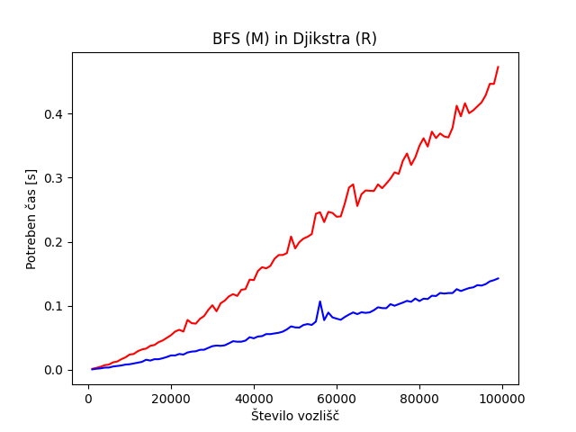
**<ins>PRIMERJAVA MED BFS IN DIJSKTRO ZA RAČUNAJNJE POTI OD O DO k</ins>**
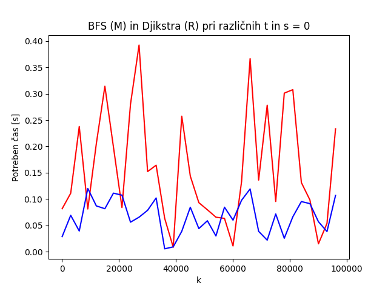
# Vaje 9
## **Naloga 2**
Konstruirajte nov graf, ki vsebuje le vozlišča od 0 do N.

Vsaki povezavi določite neko pozitivno utež (lahko čisto naključno) in zadevo shranite v novo .txt datoteko. Vrstice naj bodo oblike u v w(u, v), kjer je (u, v) povezava in w(u, v) njena utež.

```python
import random
def nov_graf(n):
    E = set()
    with open('nov_graf.txt', 'w') as f:
        for i in range(n):
            u = i
            for _ in range(min(n, random.randint(1, 10))):
                v = random.randint(0, n - 1)
                while u == v:
                    v = random.randint(0, n - 1)
                w = random.randint(1, 10)
                if (u, v) in E:
                    continue
                E.add((u, v))
                f.write(f"{u}\t{v}\t{w}\n")
```

## **Naloga 3**
Implementirajte še Bellman-Fordov algoritem in ga poženite na grafu iz prejšnje naloge. Analizirajte kako velik N iz prejšnje naloge morate vzeti, da bo algoritem še deloval v zglednem času.
```python
def bellman_ford(G, s):
    """
    Vrne najkrajšo pot od začetnega vozlišča do vseh ostalih vozlišč.
    V primeru, da ima graf negativen cikel to izpiše.
    G je seznam sosednosti.
    """
    n = len(G)
    razdalje_do = [float("inf")] * n
    predhodnik = [None] * n
    razdalje_do[s] = 0
    for _ in range(n - 1):
        relax = False
        for u in range(n):
            for p in G[u]:
                v, w = p
                if razdalje_do[u] + w < razdalje_do[v]:
                    relax = True
                    razdalje_do[v] = razdalje_do[u] + w
                    predhodnik[v] = u
        if not relax:
            break

    # Preverimo ali obstaja negativen cikel
    for u in range(n):
        for p in G[u]:
            v, w = p
            if razdalje_do[u] != float("inf") and razdalje_do[u] + w < razdalje_do[v]:
                print("Graf ima negativen cikel!")
                return None
            
    return razdalje_do, predhodnik
```
Algoritem je povzet po psevdokodi iz [Wikipedije](https://en.wikipedia.org/wiki/Bellman–Ford_algorithm). Dodana je izboljšava, ki je opisana v prvem odstavku razdelka o izboljšavah (Improvements).
|V|E|t [s]|
|:--:|:--:|:--:|
|50000|274209	|0.23613450000993907|
|100000|	550754|	0.5777042499976233|
|150000|	823628|	0.8832443330902606|
|200000|	1099822|	1.2462474160129204|
|250000|	1374280|	1.5304373749531806|
|300000|	1651921|	2.071180541999638|
|350000|	1924923|	2.156418333062902|
|400000|	2201731|	2.502102916012518|
|450000|	2474167|	2.9347820420516655|
|500000|	2748648|	3.347567791934125|
|550000|	3025121|	4.326970750000328|
|600000|	3300795|	4.79362162493635|
|650000|	3577740|	6.41567454196047|
|700000|	3846216|	6.906006208038889|
|750000|	4124127|	6.625325124943629|
|800000|	4398603|	6.840719625004567|
|850000|	4677188|	7.749579875031486|
|900000|	4951655|	8.703398999990895|
|950000|	5226940|	10.890454625012353|

# Vaje 10
## **Naloga 1**
Simuliraj delovanje (min) kopice. Za vstavljanje je
kot operacija število, za brisanje pa x. Za boljšo predstavo nariši kar drevesa.

Operacije: 8, 2, 1, 3, 7, 6, x, x, 5, x, -3, x
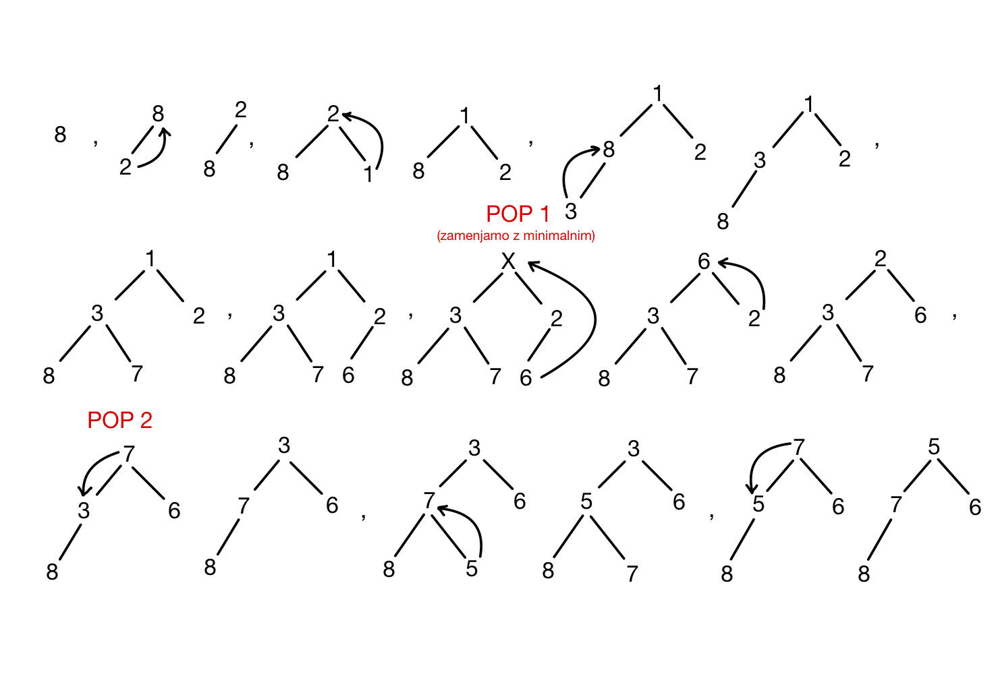

---
## **Naloga 2**
Predstavi kopico s seznamom in zapiši delovanje `pop()` in `push(x)` operacij.

* $T$ je seznam dolžine $n$ (imamo kopico z $n$ elementi)
* $T[i]\ldots\text{vozlišče}$
```python
def push(T, x): #minimalna kopica
    T.append(x)
    i = len(T) - 1
    oče = i//2
    while T[oče] >= T[i]:
        T[oče], T[i] = T[i], T[oče]
        i = oče
        oče = i//2
```

```python
def pop(T): #odstranimo koren
    koren = T[1]
    T[1] = T[-1]
    T.pop()
    i = 1
    levi_sin = 2*i
    desni_sin = 2*i + 1
    # Pazimo na indekse, da ne pademo iz seznama!
    while T[i] > T[levi_sin] or T[i] > T[desni_sin]:
        if T[levi_sin] > T[desni_sin]:
            T[desni_sin], T[i] = T[i], T[desni_sin]
            i = desni_sin
            levi_sin = 2*i
            desni_sin = 2*i + 1
        else:
            T[levi_sin], T[i] = T[i], T[levi_sin]
            i = levi_sin
            levi_sin = 2*i
            desni_sin = 2*i + 1
    return koren
```
---
## **Naloga 3**
Kako bi s kopico sortiral seznam? Časovna zahtevnost? Kako iz podanega seznama narediš kopico v $O(n)$ časa?

**"heapify"**: iz seznama v kopico
* Seznam tretiramo kot kopico

**Časovna zahtevnost:**\
$\sum\limits_{i=0}^{log(n)}2^i \cdot i = \sum\limits_{i=0}^{n-1}i \cdot log(i) = O(n \cdot log(n))$
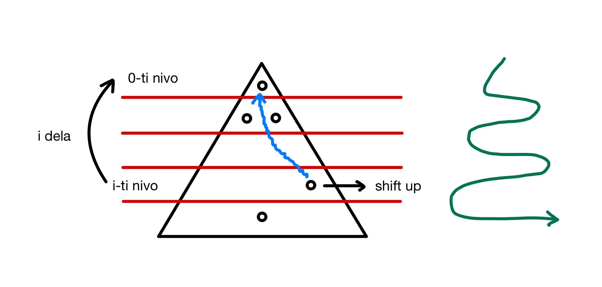
**Časovna zahtevnost:**\
$\frac{n}{2} \cdot 0 + \frac{n}{4} \cdot 1 +  \frac{n}{8} \cdot 2 + \cdots \leq \sum\limits_{i=1}^{log(n)}\frac{n}{2^i}\cdot (i-1) = \sum\limits_{i=0}^{\lfloor log(n) \rfloor}\frac{n}{2^{i+1}} \cdot i \leq \frac{n}{2} \sum\limits_{i=1}^{\infty} i \cdot 2^{-i} \leq \frac{n}{2} \cdot 2 = n$ 
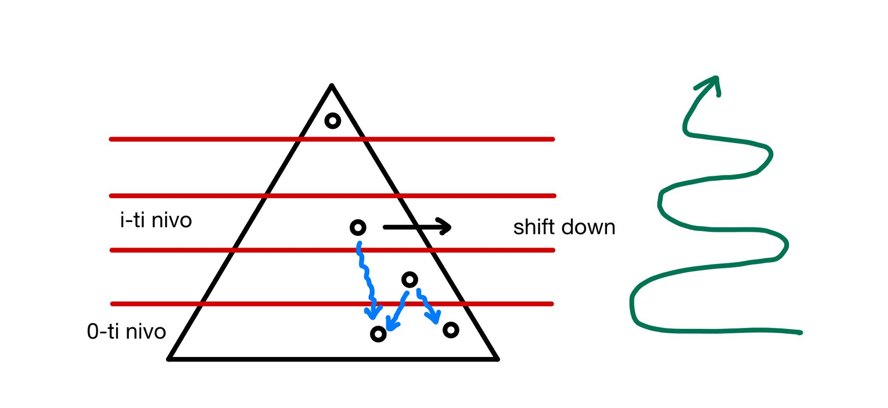