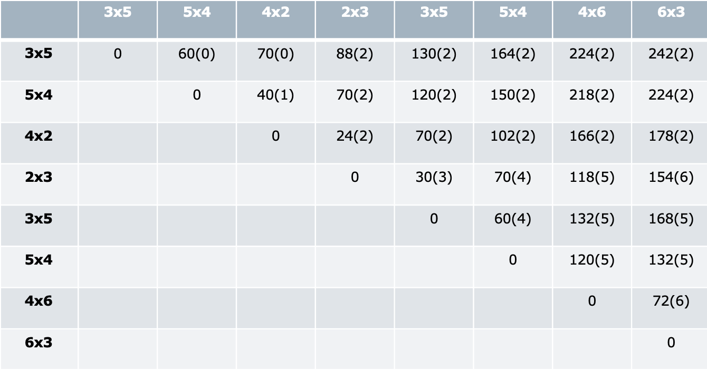

# DINAMIČNO PROGRAMIRANJE
**Ime:** Jernej Renčelj  

# **Vaje 1**
Na vajah smo ponovili časovno zahtevnost za nekaj osnovnih funckij nad seznamom, slovarjem, množico in verižnim seznamom. Po tem smo nadaljevali z reševanjem nalog na Tomotu.
## Časovna zahtevnost za nekaj podatkovnih struktur
||$dodaj(n)$|$dodaj(i)$|$dodaj(o)$|$dostop(i)$|$"x\;in"$|$briši(o)$|$briši(i)$|$briši(n)$|
|---|---|---|---|---|---|---|---|---|
|**seznam**|$O(1)$|$O(n)$|$O(n)$|$O(1)$|$O(n)$|$O(n)$|$O(n)$|$O(1)$|
|**slovar/množica**|$O(1)$|$O(1)$|$O(1)$|$O(1)$|$O(n)$|$O(n)$|$O(n)$|$O(1)$|
|**verižni seznam**|$O(1)/O(n)$|$O(1)/O(n)$|$O(1)/O(n)$|$O(n)$|$O(n)$|$O(1)/O(n)$|$O(1)/O(n)$|$O(1)/O(n)$|
# Žabica
## Dinamično
```python
def zabica(mocvara):
    """Dinamično izračuna število potrebnih skokov, da žabica zapusti močvaro."""
    def skaci(i,e):
        if i >= len(mocvara):
            return 0
        if (i,e) in memo:
            return memo[(i,e)]
        nova_energija = e + mocvara[i] 
        min_skokov = min(skaci(i+k, nova_energija-k) for k in range(1, nova_energija+1))
        memo[(i,e)] = 1 + min_skokov
        return memo[(i,e)]

    memo = {}
    return skaci(0,0)
```
## Iterativno
```python
def zabica(mocvara):
    """Iterativno izračuna najmanjše število potrebnih skokov, da žabica zapusti močvaro."""
    n = len(mocvara)
    dp = [[0] * (n + 1) for _ in range(n + 1)]

    for i in range(n + 1):
        dp[n][i] = 0
        dp[n - 1][i] = 1

    for i in range(n - 1, -1, -1):
        for j in range(n - 1, -1, -1):
            m = n
            e = j
            e += mocvara[i]

            if i + j > n:
                dp[i][j] = 1
                continue

            for d in range(1, e + 1):
                if i + d >= n:
                    m = 0
                else:
                    if e - d >= n:
                        m = 1
                    else:
                        m = min(m, dp[i + d][e - d])
            dp[i][j] = 1 + m
    return dp[0][0]
```

## **Primerjava časovne zahtevnosti**
### **Dinamično**
Spodnji graf nam prikazuje časovno zahtevnost dinamičnega pristopa k reševanju problema žabice. Čaosvna zahtevnost tega pristopa je $O(2^n)$.

### **Iterativno**
Spodnji graf nam prikazuje časovno zahtevnost iterativnega pristopa k reševanju problema žabice. Časovna zahtevnost tega pristopa je $O(n^3)$. Rešitev tega problema uporablja "bottoms-up" pristop.

### **Dinamično in iterativno**
Spodnji graf prikazuje časovno zahtevnost obeh pristopov hkrati.

**KODA:**
```python
def izmeri_cas(fun, primer):
    """Izmeri čas izvajanja funkcije `fun` pri argumentu `primer`."""
    zacetni = time.perf_counter()
    fun(primer)
    koncni = time.perf_counter() - zacetni
    return koncni

def oceni_potreben_cas(fun, gen_primerov, n, k):
    """ Funkcija oceni potreben čas za izvedbo funkcije `fun` na primerih
    dolžine `n`. Za oceno generira primere primerne dolžine s klicom
    `gen_primerov(n)`, in vzame povprečje časa za `k` primerov. """
    vsota = 0
    for _ in range(k):
        primer = gen_primerov(n)
        vsota += izmeri_cas(fun, primer)    
    return vsota / k

def primerjava_urejanj(fun1, fun2, gen, sez_n, k, shrani = False):
    """Nariše dva grafa za primerjanje dveh funkcij."""
    sez_x = sez_n
    sez_y1 = [oceni_potreben_cas(fun1, gen, n, k) for n in sez_n]
    sez_y2 = [oceni_potreben_cas(fun2, gen, n, k) for n in sez_n]
    plt.plot(sez_x, sez_y1, 'r')
    plt.plot(sez_x, sez_y2, 'b')
    plt.xlabel("Velikost problema")
    plt.ylabel("Potreben čas [s]")
    if shrani:
        plt.savefig("dve_funkciji_primerjava.png")
    plt.show()

def narisi_in_pokazi_graf(fun, gen_primerov, sez_n, k, shrani = False):
    """ Funkcija nariše graf porabljenega časa za izračun `fun` na primerih
    generiranih z `gen_primerov`, glede na velikosti primerov v `sez_n`. Za
    oceno uporabi `k` ponovitev. """
    sez_x = sez_n
    sez_y = [oceni_potreben_cas(fun, gen_primerov, n, k) for n in sez_n]
    plt.plot(sez_x, sez_y, 'r')
    plt.xlabel("Velikost problema")
    plt.ylabel("Potreben čas [s]")
    if shrani:
        plt.savefig("casovna_zahtevnost.png")
    plt.show()

def test_gen_sez_pozitivna(n):
    "Generira testni seznam dolžine n."
    return [random.randint(1, n) for _ in range(n)]

# IZRIS GRAFOV
primerjava_urejanj(zabica, zabica_iterativno, test_gen_sez_pozitivna, [i for i in range(30)], 20, True)
narisi_in_pokazi_graf(zabica_iterativno, test_gen_sez_pozitivna, [i for i in range(70)], 10, True)
narisi_in_pokazi_graf(zabica, test_gen_sez_pozitivna, [i for i in range(70)], 10, True)
```
# **Vaje 2**
Ukvarjali smo se s problemom 0/1 nahrbtnika.

Vhodni podatki so pari $(v_{i}, c_{i})$, kjer $c_{i}$ predstavlja vrednost $i$-tega predmeta in $v_{i}$ volumen $i$-tega predmeta.

Izhodni podatek je vektor $X=(x_1, x_2, \ldots ,x_n)$, kjer $x_i = \begin{cases}1; \ i-ti\;predmet\;vzamemo\\0; \;i-ti\;predmet\;ne\;vzamemo\end{cases}$.

Pri tem velja naslednje:
* $\sum_{i}^{n} v_i \cdot x_i \leq W$
* $\sum_{i}^{n} c_i \cdot x_i$ je največja možna

## 1. Naloga
Podani so predmeti:
|i|1|2|3|4|5|6|7|8|
|---|---|---|---|---|---|---|---|---|
|**velikost**|11|40|16|32|45|48|9|44|
|**vrednost**|6|9|4|7|6|7|5|9| 


**Q1:** Pri prepisu množice $Z_5$ je pri natanko enem paru prišlo do napake. Kateri par je napačen in kakšen bi moral biti? Opiši, kako lahko napako ugotovimo, ne da bi šli $Z_5$ računati na novo.

**A1:** Napaka se pojavi pri tretjem paru v tabeli. Množico $Z_5$ izračunamo kot $Z_5=S_4 + (45, 6)$, kjer je $(45, 6)$ velikost in vrednost petega predmeta. Brez računanja bi napako opazili, če bi primerjali zaporedne crednosti cen, saj mora biti vsaka naslednja vrednost večja, na prehodu iz tretjega na četrti pa se ta zmanjša.

**Q2:** Če imamo na voljo 160 enot prostora, kakšna je optimalna vrednost nahrbtnika?

**A2:** V tabeli $S_8$ poiščemo prvi par, kjer je element na prvem indeksu še manjši ali enak 160. V našem primeru je ta par $(152, 40)$ in optimalna vrednost nahrbtnika je enaka **40**.

**Q3:** Koliko neizkoriščenega prostora nam ostane, če optimalno napolnimo nahrbtnik velikosti 110 s prvimi petimi predmeti. Kakšna je ta optimalna vrednost polnitve? Opiši vse možne načine, kako dosežemo to optimalno vrednost!

**A3:** Osredotočimo se na tabelo $S_5$, ker ne vemo ali 5. elementa vzamemo ali ne. Poiščemo par, ki ima vrednost na prvem mestu manjše ali enako 110, in je kar se da blizu 110. V našem primeru je to $(99,26)$ in ostane nam 11 prostora.

|$i$|$(c_i,v_i)$|$Z_i$|$S_i$|$x_i$|
|---|---|---|---|---|
|**5**|$(99,26)$|0|0|0|
|**4**|$(99,26)$|1|0|1|
|**3**|$(67,19)$|1|0|1|
|**2**|$(51,15)$|1|0|1|
|**1**|$(11,6)$|1|0|1|

$x=[1,1,1,1,0]$

**Q4:** Skiciraj graf funkcije, ki pokaže, kako se v odvisnosti od razpoložljivega prostora spreminja optimalna vrednost nahrbtnika, če imamo na voljo prvih 6 predmetov in 6. predmet moramo dati v nahrbtnik.

**A4:** 

**Q5:** Ugotovili smo, da imamo na voljo še en predmet, in sicer velikosti 15 in vrednosti 4 (torej je na voljo 9 predmetov). Kakšna je optimalna vrednost nahrbtnika, ki ima 180 enot prostora? Opiši vse možne načine, kako dosežemo to optimalno vrednost!

**A5:**

**Prvi način:**

Izračunati moramo še množico $S_9$. Še prej moramo izračunati množico $Z_9$.

$Z_9 = S_8 \ddagger (15, 4)$

Do $S_9$ pridemo z zlitjem množic $S_8$ in $Z_9$.

**Drugi način:**

$G(9, 180) = max(G(8, 180), G(8, 165) + 4)$

Iz $S_8$ razberemo:
* $G(8, 180) = 40$
* $G(8, 165) + 4 = 44$

Optimalna vrednost nahrbtnika z 180 enot prostora je **44**.

|$i$|$(c_i,v_i)$|$Z_i$|$S_i$|$x_i$|
|---|---|---|---|---|
|**9**|$(167,44)$|0|0|1|
|**8**|$(152,40)$|1|0|1|
|**7**|$(108,31)$|1|0|1|
|**6**|$(99,26)$|0|1|0|
|**5**|$(99,26)$|0|0|0|
|**4**|$(99,26)$|1|0|1|
|**3**|$(67,19)$|1|0|1|
|**2**|$(51,15)$|1|0|1|
|**1**|$(11,6)$|1|0|1|

$x=[1,1,1,1,0,0,1,1,1]$

## 2. Naloga
Zanima nas, ali lahko **S** zapišemo kot vsoto števil iz **sez**.

**Primer:** 

**Navodilo**

Na voljo imamo seznam pozitivnih naravnih števil **sez** in naravno število **S**. Zanima nas, ali lahko **S** zapišemo kot vsoto števil iz **sez**.

sez = [3, 34, 4, 12, 5, 2], S = 9 vrne True, saj 9 = 4 + 5. 

Zapiši dinamični problem (Bellmanovo enačbo) ter oceni časovno zahtevnost.

Kako bi še lahko rešil ta problem (z uporabo 0/1 nahrbtnika)?

$vsota(i,S)=\begin{cases}True; \ S\;lahko\;zapišemo\;kot\;vsoto\;z\;s_i\in S\\False; \;sicer\end{cases}$

$vsota(i, S) = vsota(i-1,S-s_i) \lor vsota(i-1,S)$

**Robni pogoji**
* $vsota(0,0) = True \ldots S_i = S$
* $vsota(0,0) = True$
* $vsota(i,0) = False \ldots i>0$
# **Vaje 3**
Razdelili smo se v pare in na Tomo-tu poskušali rešiti čim več nalog iz 0/1 nahrbtnika.

## **Komentarji in opombe**
Vaje so mi bile všeč, saj se naučimo delati v skupinah. Nekatere naloge so bile kar precej zahtevne.
## 1. Naloga
``` python
from functools import lru_cache
def optimalni_tovor(predmeti, W):
    """Vrne največjo skupno ceno predmetov."""
    @lru_cache(maxsize = None)
    def poberi(i, p):
        if i == -1:
            if p >= 0:
                return 0
            else:
                return -float('inf')
        return max(poberi(i - 1, p), poberi(i - 1, p - predmeti[i][1]) + predmeti[i][0])
    return poberi(len(predmeti) - 1, W)
```
## 3. Naloga
``` python
from functools import lru_cache
def optimalni_tovor_zaloga(predmeti, W):
    nova = []
    for predmet in predmeti:
        if predmet[2] > 1:
            for _ in range(predmet[2]):
                nova.append(predmet)
        else:
            nova.append(predmet)
    @lru_cache(maxsize=None)
    def poberi(i, P):
        if i == -1:
            if P >= 0:
                return 0
            else:
                return float("-inf")
        return max(poberi(i - 1, P), poberi(i - 1, P - nova[i][1]) + nova[i][0])
    return poberi(len(nova) - 1, W)
```
## 4. Naloga
``` python
def cena_na_volumen(element):
    """Izračuna ceno na volumen."""
    return element[0] / element[1]

def neomejena_zaloga(predmeti, W):
    urejeni = sorted(predmeti, key=cena_na_volumen, reverse=True)
    cena = 0
    for element in urejeni:
        n = W // element[1]
        cena += element[0] * n
        W -= n * element[1]
    return cena
```
## 6. Naloga
``` python
from functools import lru_cache
def tovor_rezanje(predmeti, W):
    """Vrne največjo skupno ceno za nosilnost 'W', pri čemer predemete lahko režemo."""
    @lru_cache(maxsize=None)
    def max_cena(i, w):
        if w < 0:
            return float("-inf")
        if i == 0 or w == 0:
            return 0
        c = predmeti[i-1][0]
        v = predmeti[i-1][1]
        return max(c + max_cena(i-1, w-v), max_cena(i-1, w), c/2 + max_cena(i-1, w-v/2), c/3 + max_cena(i-1, w-v/3), c/4 + max_cena(i-1, w-v/4))

    return round(max_cena(len(predmeti), W),2)
```
# **Vaje 4**
## Matrično množenje
Na vajah se ukvarjali s problemom množenja matrik. Želimo zmnožiti $n$ matrik in pri tem opraviti čim manj operacij. Na vajah smo rešili dve nalogi.
**VHOD:** 
* matrike $A_1,\ldots, A_n$ 
* dimenzije matrik $d_1, \ldots, d_{n+1}$ \
kjer je matrika $A_i$ dimenzije $d_i \times d_{i+1}$

**IZHOD:** Minimalno število množenj realnih števil za izračun produkta danih matrik $A_{1} \cdot A_{2} \cdots A_{n}$.


## 0. Naloga
Spomnimo se problema matričnega množenja iz predavanj ter kako ga rešimo.

Opiši Bellmanovo enačbo oz. rekurzivno zvezo.

Izračunajte problem za produkt matrik velikosti: $3\times5$, $5\times4$, $4\times2$, $2\times3$, $3\times5$, $5\times4$, $4\times6$, $6\times3$ v tem vrstnem redu.

$N(i, j)$...minimalno število operacij za matrike od $A_{i} \ldots A_{j}$ 

**ROBNI POGOJI:** $i=j\rightarrow N(i,i)=0$

$N(i, j) = min \{N(i, k) + N(k+1,j) + d_{i}\cdot d_{k+1} \cdot d{j}\}$


|i\j|1|2|3|4|5|6|7|8|
|---|---|---|---|---|---|---|---|---|
|**1**|$0$|$60$|$70_1$|$88_3$|$130_3$|$164_3$|$224_3$|$242_3$|
|**2**||$0$|$40$|$70_3$|$120_3$|$150_3$|$218_3$|$224_3$|
|**3**|||$0$|$24$|$70_3$|$102_3$|$166_3$|$178_3$|
|**4**||||$0$|$30$|$70_5$|$118_6$|$154_7$|
|**5**|||||$0$|$60$|$132_6$|$168_6$|
|**6**||||||$0$|$120$|$132_6$|
|**7**|||||||$0$|$72$|
|**8**||||||||$0$|

$N(2,4) = \begin{cases}k=2:0+24+5\cdot4\cdot3=84\\k=3:40+0+5\cdot2\cdot3=70\end{cases}$

$N(3,5) = \begin{cases}k=4:24+0+4\cdot3\cdot5=84\\k=3:30+0+4\cdot2\cdot5=70\end{cases}$

$N(4,6) = \begin{cases}k=4:0+60+2\cdot3\cdot4=84\\k=5:30+0+2\cdot5\cdot4=70\end{cases}$

$N(5,7) = \begin{cases}k=5:0+120+3\cdot5\cdot6=210\\k=6:60+0+3\cdot4\cdot6=132\end{cases}$

$N(6,8) = \begin{cases}k=6:0+72+60=132\\k=7:120+0+5\cdot6\cdot3=132\end{cases}$

## 1. Naloga

Recimo, da imamo izračunano tabelo $N(i,j) = (v, idx)$ iz Bellmanove enačbe, kjer je $v$ optimalno število operacij, $idx$ pa je seznam indeksov $k$, kjer je bil dosežen minimum pri združevanju podproblemov. 

Kako bi izračunal število vseh optimalnih produktov? Kakšna je časovna zahtevnost? 

Kaj pa če bi želel izpisati vse optimalne produkte?

$O(i,j)=število\;optimalnih\;produktov\;matrik\;A_i,\ldots,A_j$

$O(i,i)=1$

$O(i,i+1)=1$

$O(i,j)=\sum_{k \in N(i,j)[1]}^{}O(i,k)\cdot O(k+1,j)$

**Časovna zahtevnost:** $O(n^2 \cdot n)$, kjer je $n^2$ število stanj in $n$ izračun stanja.

## 2. Naloga


Koliko je optimalno število operacij? Na kakšne načine lahko zmnožimo te matrike, da imamo toliko operacij?


## 3. Naloga


**VPRAŠANJA**
* Koliko operacij potrebujemo, da jih optimalno zmnožimo?
* Kako jih moramo množiti?
* Kako optimalno zmnožimo matrike od 3 do 7?
* Koliko operacij potrebujemo,da optimalno zmnožimo prvih 5 matrik?
* Kako naj zmnožimo zadnje štiri matrike, da bo število operacij najmanjše?
* Ali si lahko pomagamo z izračunanimi podatki, če spremenimo število stolpcev zadnje matrike iz 3 na 4, da izračunamo novo optimalno množenje? Kaj moramo narediti?

**ODGOVORI**
* 242 operacij
* $(A_1 \cdot (A_2 \cdot A_3)) \cdot ((((A_4 \cdot A_5) \ cdot A_6) \cdot A_7) \cdot A_8)$
* $A_3 \cdot (((A_4 \cdot A_5) \cdot A_6) \cdot A_7)$
* 130 operacij (1. vrstica, 5. stolpec)
* $(A_5 \cdot A_6)\cdot(A_7 \cdot A_8)$ (preberemo v 5. vrstici in 8. stolpcu)
* Zadnji stolpec poračunamo od spodaj navzgor.

## 4. Naloga


