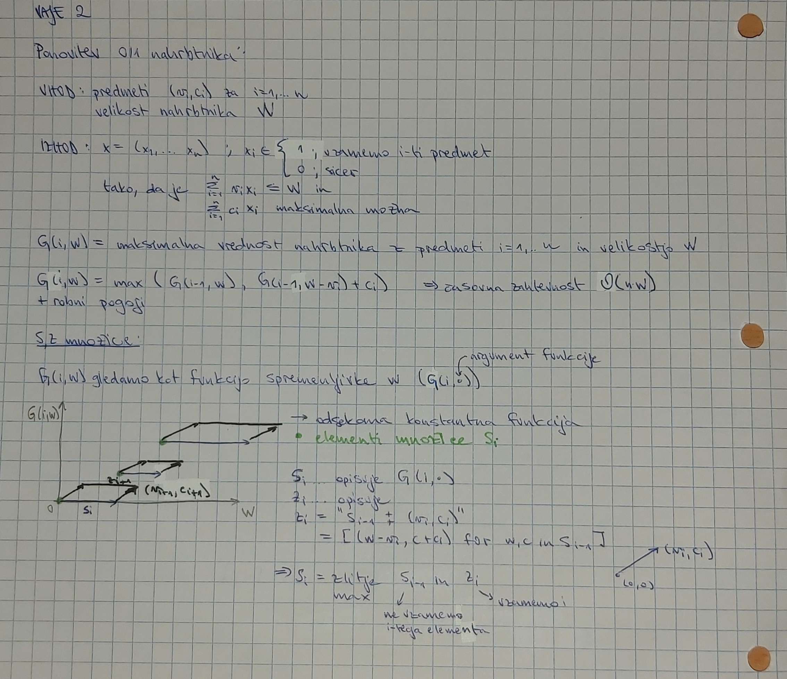
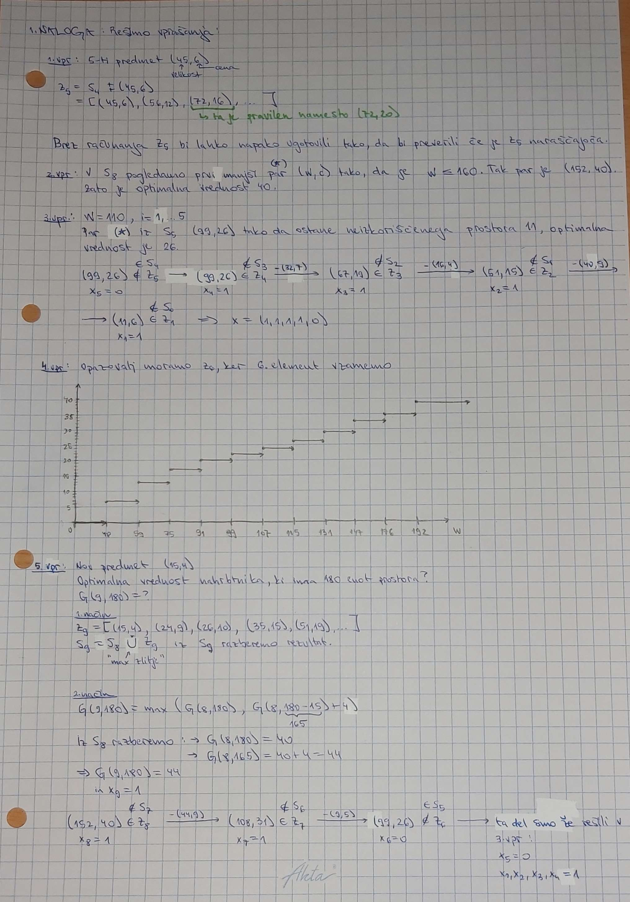
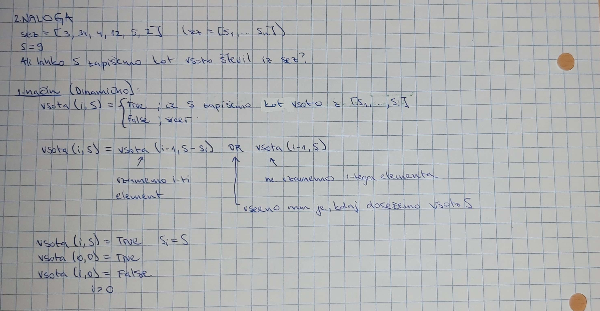
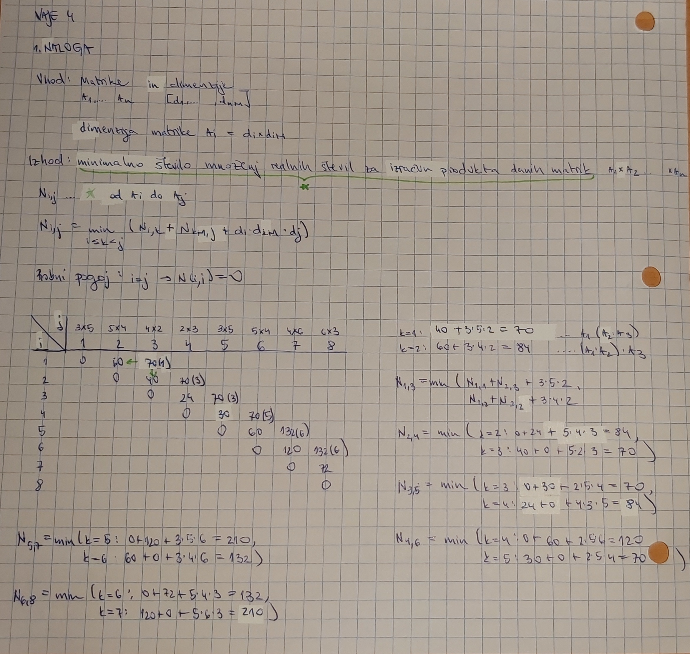
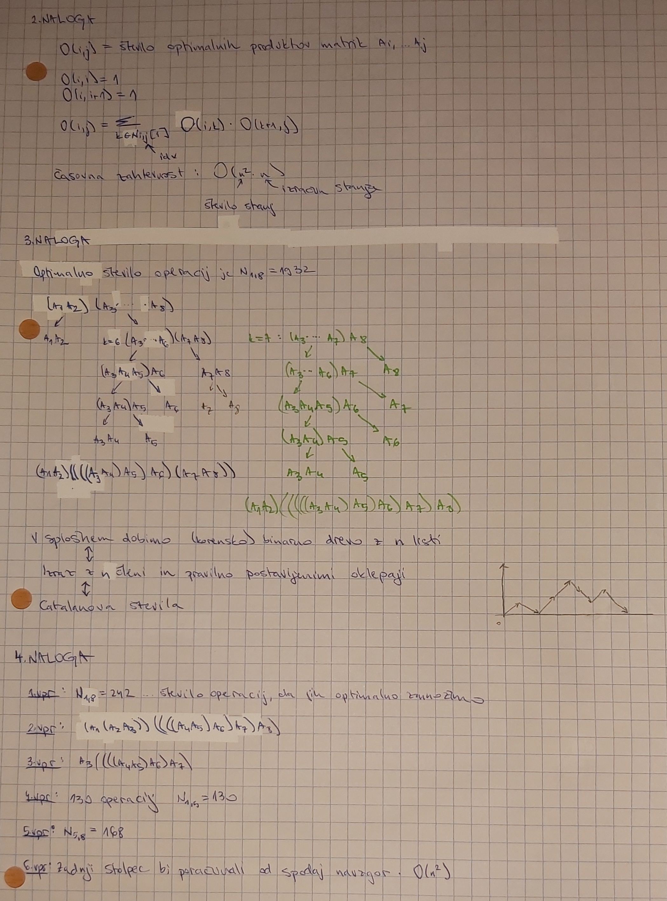
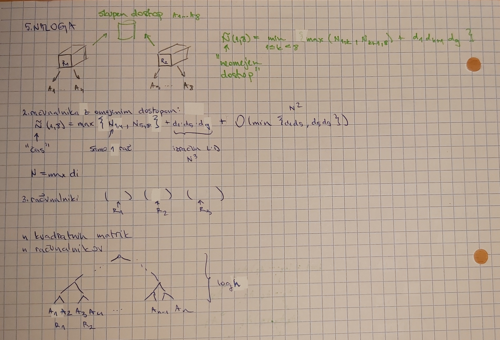

# Prvo poročilo za vaje
**Ime:** Petra Kogovšek

## Vsebina
* Vaje 1 (15.2.2023)
* Vaje 2 (22.2.2023)
* Vaje 3 (1.3.2023)
* Vaje 4 (8.3.2023)

## Vaje 1
**Datum**: 15.2.2023

Kratek opis:\
Na vajah smo ponovili časovne zahtevnosti in O notacije za nekaj osnovnih podatkovnih struktur: seznam, slovar/množica in verižni seznam. Nato smo reševali nalogo iz Tomota - žabica.

Komentarji in opombe: \
Zanimiva se mi je zdela naloga z žabico, kot smo jo reševali na tablo - je bila pa njena implementacija kar težja.

### Naloga 1
Časovne zahtevnosti za nekaj osnovnih podatkovnih struktur:

||dodaj(n)|dodaj(i)|dodaj(0)|dostop(i)|vsebuje x|brisi(n)|brisi(i)|brisi(0)|
|:-|:-----:|:-----:|:-----:|:-----:|:-----:|:-----:|:-----:|:-----:|
|seznam|O(1)|O(n)|O(n)|O(1)|O(n)|O(n)|O(n)|O(1)|
|slovar/množica|O(1)|O(1)|O(1)|O(1)|O(1)|O(1)|O(1)|O(1)|
|verižni seznam|O(1)* oz O(n)|O(1)* oz O(n)|O(1)* oz O(n)|O(n)|O(n)|O(1)* oz O(n)|O(1)* oz O(n)|O(1)* oz O(n)|

\* kazalec je že na prvem mestu

### Naloga 2
Imamo žabico, ki se je izgubila v močvari in želi kar se da hitro odskakljati ven. V močvari so lokvanji, po katerih bo žabica odskakljala ven. Na vsakem lokvanju je določeno število muh. Ko žabica skoči na lokvanj poje muhe, ki so na njemu in te ji dajo energijo za nadaljnje skoke. Na primer, če ima žabica e energije, potem lahko skoči na za katerokoli razdaljo med 1 in e, in če skoči za k mest naprej ima sedaj energije e-k+(število muh na tem lokvanju).

`zabica(i,e)` = to je minimalno število skokov potrebnih, da pridemo ven iz močvare, če se nahajamo na i-tem lokvanju in imamo e energije

mocvara[i] = število muh na i-tem lokvanju


`zabica(i,e)` = 1, če je $i+e>n$ (dovolj energije imamo, da skočimo ven iz močvare, za kar porabimo 1 skok)

`zabica(i,e)` = 1 + $min($`zabica(i+d,e-d+mocvara[i+d])`, $d\in(1,..e))$, sicer

Robni pogoji:
* `zabica(i,e)` = 0, $i>n$
* `zabica(i,e)` = 1, $e>n-i$

Časovna zahtevnost: izračunati moramo vsa stanja - vseh stanj je $n^2$, kar množimo z časom potrebnim za izračun enega stanja:
$O(n^2)*O(n) = O(n^3)$

Opis:\
Potrebno je bilo še implementirati to funkcijo (`zabica(mocvara)`).


Koda:
```python
from functools import lru_cache
def zabica(mocvara):
    st_lokvanjev = len(mocvara)
    energija = mocvara[0]
    lokvanj = 0
    if st_lokvanjev == 0:
        return 0
    @lru_cache(maxsize=None)
    def zabica2(lokvanj,energija):
        najmanjsi = float('inf')
        for razdalja in range(1,energija+1):
            if razdalja+lokvanj < st_lokvanjev:
                najmanjsi = min(najmanjsi, zabica2(lokvanj+razdalja,energija-razdalja+mocvara[lokvanj+razdalja]))
            else:
                return 1
        return najmanjsi+1
    return zabica2(lokvanj,energija)
```

Primer:
```python
>>> print(zabica([2, 4, 1, 2, 1, 3, 1, 1, 5]))
3
```

## Vaje 2
**Datum**: 22.2.2023

Kratek opis:\
Na vajah smo ponovili 0/1 nahrbtnik, njegovo Bellmanovo enačbo ter S in Z množice. Nato pa smo reševali vprašanja iz https://ucilnica.fmf.uni-lj.si/pluginfile.php/131586/mod_resource/content/0/O_1_Nahrbtnik_vaja.pdf.
Na tablo pa smo se tudi lotili problema - ali lahko neko število `S` zapišemo kot vsoto števil iz seznama.

Komentarji in opombe: \
Vaje so se mi zdele zelo vredu.

### Naloga 1
Ponovitev O/1 nahrbtnika je podana v obliki spodnje slike:
<figure>

</figure>

Vprašanja O/1 nahrbtnika:

1. Pri prepisu množice Z5 je pri natanko enem paru prišlo do napake. Kateri par je napačen in kakšen bi moral biti? Opiši, kako lahko napako ugotovimo, ne da bi šli Z5 računati na novo.
2. Če imamo na voljo 160 enot prostora, kakšna je optimalna vrednost nahrbtnika?
3. Koliko neizkoriščenega prostora nam ostane, če optimalno napolnimo nahrbtnik velikosti 110 s prvimi petimi predmeti. Kakšna je ta optimalna vrednost polnitve? Opiši vse možne načine, kako dosežemo to optimalno vrednost!
4. Skiciraj graf funkcije, ki pokaže, kako se v odvisnosti od razpoložljivega prostora spreminja optimalna vrednost nahrbtnika, če imamo na voljo prvih 6 predmetov in 6. predmet moramo dati v nahrbtnik.
5. Ugotovili smo, da imamo na voljo še en predmet, in sicer velikosti 15 in vrednosti 4 (torej je na voljo 9 predmetov). Kakšna je optimalna vrednost nahrbtnika, ki ima 180 enot prostora? Opiši vse možne načine, kako dosežemo to optimalno vrednost!

Odgovori na zgornja vprašanja:
<figure>

</figure>

### Naloga 2
Dan imamo seznam pozitivnih naravnih števil `sez` in naravno število `S`. Zanima nas, ali lahko `S` zapišemo kot vsoto števil iz `sez`.
<figure>

</figure>

## Vaje 3
**Datum**: 1.3.2023

V poročilo naj bodo vključene vsaj 4 naloge. Če kateri ekipi nebo uspelo rešiti naloge naj v poročilo zapišejo idejo ter kje se je zataknilo oziroma zakaj ne deluje.

Kratek opis:\
Na vajah smo izvedli tekmovanje v reševanju nalog o 0/1 nahrbtniku in njegovih variacijah. Sestava para: Petra Kogovšek in Jure Lilija

Komentarji in opombe:\
Vaje mi niso bile najbolj všeč z vidika, ker so bolj slonele na tekmovanju in smo dobili manj pomoči oziroma razlagah, kot jih dobimo ob reševanjih na tablo.

Imamo trgovca, ki želi iz Evrope v Ameriko spraviti nekaj predmetov. Na razpolago tovorno letalo z omejeno količino prostora. Predmete v obliki (ci,vi) predstavimo s seznamom, kjer ci predstavlja ceno i-tega predmeta, vi pa njegovo težo.

### Naloga 1
Opis:\
Potrebno je implementiraj funkcijo `optimalni_tovor(predmeti, W)`, ki vrne največjo skupno ceno predmetov, ki jih lahko trgovec natovori na letalo z maksimalno nosilnostjo `W`.

Koda:
```python
import math
from functools import lru_cache
def optimalni_tovor(predmeti, W):
    n = len(predmeti)
    
    @lru_cache(maxsize=None)
    def b(i,R):
        if i == -1 and R < 0:
            return float('-inf')
        if i == -1 and R >=0:
            return 0
        return max(predmeti[i][0] + b(i-1,R-predmeti[i][1]), b(i-1,R))
    return b(n-1,W)
```

Primer:
```python
>>> optimalni_tovor([(2,3), (4,4), (5,4), (3,2), (1,2), (15, 12)], 7)
8
```

Za dodatno analiziranje sem si izbrala to nalogo. Generator testnih primerov in merilnik časa izgleda takole:
```python
import time                         # Štoparica
import random                       # Za generiranje primerov


def izmeri_cas(fun, predmeti, volumen_nahrbtnika):
    """Izmeri čas izvajanja funkcije `fun` pri argumentu `predmeti` in `volumen_nahrbtnika`."""
    zacetek = time.time()
    x = fun(predmeti, volumen_nahrbtnika)
    konec = time.time()
    return konec - zacetek

def oceni_potreben_cas(fun, test_gen_sez, max_cena, max_volumen, n, volumen_nahrbtnika, k):
    """ Funkcija oceni potreben čas za izvedbo funkcije `fun` na primerih
    dolžine `n`. Za oceno generira primere primerne dolžine s klicom
    `test_gen_sez`, in vzame povprečje časa za `k` primerov. """
    vsota = 0
    for i in range(k):
        vsota += izmeri_cas(fun, test_gen_sez(max_cena, max_volumen, n), volumen_nahrbtnika)
    povprecje = vsota/k
    return povprecje

# -----------------------------------------------------------------------------

import math
from functools import lru_cache
def optimalni_tovor(predmeti, W):
    n = len(predmeti)
    
    @lru_cache(maxsize=None)
    def b(i,R):
        if i == -1 and R < 0:
            return float('-inf')
        if i == -1 and R >=0:
            return 0
        return max(predmeti[i][0] + b(i-1,R-predmeti[i][1]), b(i-1,R))
    return b(n-1,W)

def test_gen_sez(max_cena, max_volumen, n):
    """Generira testni seznam dolžine n. Pri čemer je cena od 1 do max_cene
    (saj se predmetov z ceno 0 ne bi 'splačalo' vzeti sabo) in volumen od 1 do max_volumen."""
    
    return [(random.randint(1, max_cena), random.randint(1, max_cena)) for _ in range(n)]

# -----------------------------------------------------------------------------

if __name__ == '__main__':
#    print(oceni_potreben_cas(optimalni_tovor, test_gen_sez, 50, 30, 50, 30, 12))
    print(oceni_potreben_cas(optimalni_tovor, test_gen_sez, 50, 30, 100, 30, 12))
    print(oceni_potreben_cas(optimalni_tovor, test_gen_sez, 50, 30, 150, 30, 12))
```
Analiza časovne zahtevnosti:

Teoretično je časovna zahtevnost O(n*W), pri čemer je n število predmetov in W velikost nahrbtnika.
Pri merjenju časa pri različno velikih testnih primerih, pa je bilo videti, da če število predmetov nahrbtnika povečamo za dvakratnik se nam s tem čas poveča nekoliko več kot za enak faktor.


### Naloga 2
Opis:\
Potrebno je implementiraj funkcijo `optimalni_predmeti(predmeti, W)`, ki vrne seznam predmetov, ki dosežejo največjo vrednost, če lahko na letalo natovorimo skupno težo največ `W`. V primeru, da je možnosti več, vrne katerokoli.

Ideja: Najina ideja je bila, da funkcijo zasnujeva na način, kot smo to nalogo reševali na tablo in sicer s pomočjo S in Z množic. Vendar nama ni uspelo priti čez.

Koda:
```python
def optimalni_predmeti(predmeti, W):
    n = len(predmeti)
    
    @lru_cache(maxsize=None)
    def s(prejsnji_s):
        cena = predmeti[i][0]
        velikost = predmeti[i][1]
        z = []
        for c1,v1 in prejsni_s:
            nov_par = (c1+cena, v1+velikost)
            z.append(nov_par)
        skupaj = prejsnji_s+z
        sorted(skupaj,key=lambda x:x[1])
        nov_s = [(0,0)]
        i = 1
        while i < len(skupaj)-1:
            if skupaj[i][1] == skupaj[i+1][1]:
                nov_s.append(skupaj[i][0] if skupaj[i][0] >= skupaj[i+1][0] else skupaj[i+1][0])
                i += 1
            elif skupaj[i][0] > skupaj[i+1][0]:
                nov_s.append(skupaj[i][0])
                i += 1
            else:
                nov_s.append(skupaj[i][0])
            i += 1
```
Primer:
```python
>>> optimalni_predmeti([(2,3), (4,4), (5,4), (3,2), (1,2), (15, 12)], 7)
[(3, 2), (5, 4)]
```

### Naloga 3
Opis:\
Trgovec je dobil dodatno pošiljko obstoječih predmetov. Tako ima sedaj na razpolago več kot en predmet posameznega tipa. Predmete tako predstavimo s seznamom elementov oblike `(ci,vi,zi)`, kjer je: `ci` cena, `vi` teža, `zi` zaloga i-tega predmeta.

Implementiraj funkcijo `optimalni_tovor_zaloga(predmeti, W)`, ki vrne največjo skupno ceno predmetov, ki jih lahko trgovec natovori na letalo z maksimalno nosilnostjo `W`.

Koda:
```python
import math
from functools import lru_cache
def optimalni_tovor_zaloga(predmeti, W):
    n = len(predmeti)
    novi_predmeti = []
    for k in range(n):
        par = [(predmeti[k][0], predmeti[k][1])]*predmeti[k][2]
        novi_predmeti = novi_predmeti + par
    novi_n = len(novi_predmeti)
    
    @lru_cache(maxsize=None)
    def b(i,R):
        if i == -1 and R < 0:
            return float('-inf')
        if i == -1 and R >=0:
            return 0
        return max(novi_predmeti[i][0] + b(i-1,R-novi_predmeti[i][1]), b(i-1,R))
    return b(novi_n-1,W)
```

Primer:
```python
>>> optimalni_tovor_zaloga([(2,3, 1), (4,4, 2), (5,4, 4), (3,2, 3), (1,2, 3), (15, 12, 2)], 7)
9
```
### Naloga 4
Opis:\
Predpostavi, da ima sedaj trgovec na voljo neomejeno zalogo posameznih predmetov. implementiraj funkcijo `neomejena_zaloga(predmeti, W)`, ki vrne najvišjo skupno ceno tovora na letalu z maksimalno nosilnostjo `W`.

Ideja: Najina ideja je bila, da vsakemu predmetu povečava zalogo na toliko kolikor bi ga šlo na letalo, v primeru da bi celotno nosilnost letala zapomnila z tem predmetom.

Naloga ni delovala zaradi prevelikega števila predmetov (rekurzivnih klicev).

Koda:
```python
import math
from functools import lru_cache
def neomejena_zaloga(predmeti, W):
    n = len(predmeti)
    novi_predmeti = []
    for cena, volumen in n:
        par = [(cena, volumen)]*round(W/volumen)
        novi_predmeti = novi_predmeti + par
    novi_n = len(novi_predmeti)
    
    @lru_cache(maxsize=None)
    def b(i,R):
        if i == -1 and R < 0:
            return float('-inf')
        if i == -1 and R >=0:
            return 0
        return max(novi_predmeti[i][0] + b(i-1,R-novi_predmeti[i][1]), b(i-1,R))
    return b(novi_n-1,W)
```

Primer:
```python
>>> neomejena_zaloga([(2,3), (4,4), (5,4), (3,2), (1,2), (15, 12)], 23)
33
```

## Vaje 4
**Datum**: 8.3.2023

Kratek opis:\
Na vajah smo ponovili matrično množenje in se lotili reševanja nalog iz njega.

Komentarji in opombe: \
Vaje so se mi zdele zanimive.

### Naloga 1
Problema matričnega množenja iz predavanj ter njegova Bellmanova enačba. Izračunajte problem za produkt matrik velikosti: 3x5, 5x4, 4x2, 2x3, 3x5, 5x4, 4x6, 6x3 v tem vrstnem redu.
<figure>

</figure>


### Naloga 2
Imamo izračunano tabelo `N(i,j) = (v, idx)` iz Bellmanove enačbe, kjer je `v` optimalno število operacij, `idx` pa je seznam indeksov k, kjer je bil dosežen minimum pri združevanju podproblemov. Kako bi izračunal število vseh optimalnih produktov? Kakšna je časovna zahtevnost? Kaj pa če bi želel izpisati vse optimalne produkte?

### Naloga 3
V spodnji tabeli imamo že izveden izračun za vse vrednosti `N(i,j)`. V tabeli je v (i,j)-ti celici prikazano min_operacij(index kjer je bil dosežen min). Koliko je optimalno število operacij? Na kakšne načine lahko zmnožimo te matrike, da imamo toliko operacij?

### Naloga 4
Podobno kot pri prejšnji nalogi imamo izračunano spodnjo tabelo (le da se to tabele številčijo od 0 naprej). Odgovori na naslednja vprašanja:
1. Koliko operacij potrebujemo, da jih optimalno zmnožimo?
2. Kako jih mormao množiti?
3. Kako optimalno zmnožimo matrike od 3 do 7?
4. Koliko operacij potrebujemo, da optimalno zmnožimo prvih 5 matrik?
5. Kako naj zmnožimo zadnje štiri matrike, da bo število operacij najmanjše?
6. Ali si lahko pomagamo z izračunanimi podatki, če spremenimo število stolpcev zadnje matrike iz 3 na 4, da izračunamo novo optimalno množenje? Kaj moramo narediti?

Rešitve od nalog 2-4:

<figure>

</figure>

### Naloga 5
Na razpolago imamo več kot en računalnik. Kot vzorčni primer lahko vzamemo primer iz prejšnje naloge, bomo pa poizkušali povedat čim bolj splošno.Predstavi nekaj strategij kako bi si pomagal z dodatnim računalnikom. Obravnavaj možnosti:
* en računalnik lahko obdela največ L (recimo 4) matrik.
* vseeno koliko matrik lahko obdela en računalnik.
* kaj če nas nekaj stane, da matriko prestavimo iz enega računalnika do drugega (recimo kopija matrike preko mreže v O(velikost matrike))?

Kaj se zgodi s številom operacij, ki jih moramo izvesti v zgornjih primerih? Ali se zmanjša/zveča? Kaj pa čas za izračun? Kaj pa če imamo na razpolago tri računalnike. Lahko zgornje ideje posplošimo oz izboljšamo?

<figure>

</figure>