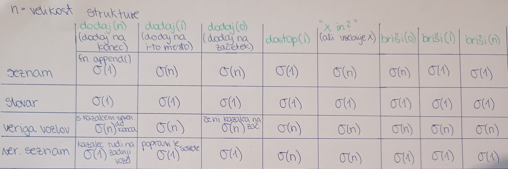

# Poročilo vaj

**Ime:** Diana Škof

## Vsebina ##
---

* Vaje 1 (15. 2. 2023)
* Vaje 2 (22. 2. 2023)
* Vaje 3 (1. 3. 2023)
* Vaje 4 (8. 3. 2023)
 
 
# Vaje 1
 Na prvih vajah smo ponovili časovno zahtevnost krajših funkcij z različnimi podatkovnimi strukturami, in sicer seznama(tabele), slovarja ter verižnega seznama, razvidno iz spodnje slike. Vsako rešitev smo tudi obrazložili.
 
 

 Ko v Pythonu ustvarimo tabelo s 5timi elementi, glavni pomnilnik shrani prostor velikosti 5. Ko želimo na konec tabele dodati nov element, pomnilnik shrani nov še enkrat večji prostor za to tabelo in vse prejšnje podatke prekopira v novi prostor. Tako se večanje prostora spreminja linearno.
 
  

 Spoznali smo tudi dve drugi notaciji za časovno zahtevnost.
 Za funkcijo  $f \in \Omega (g)$ velja, da je $f$ omejena od spodaj z funkcijo $g$ oz. velja $f \ge g$, kjer je graf od $f$ za vse vrednosti, od nekega $n_{0}$ naprej, nad grafom funkcije $g$. Za notacijo $f \in \Theta (g)$ pa velja $f = g$, kjer se grafa funkcij v glavnem ne razlikujeta.

 ## Naloga 1: Problem žabice ##

Žabica želi priti po lokvanih iz jezera. Na vsakem lokvanu je različno število muh, ki ji dajo dodatno energijo za skakanje iz jezera. Žabica ima na začetku toliko energije, kolikor je število muh na prvem lokvanu. Naša naloga je, da žabica iz jezera pride s čim manj skoki. Zanima nas najmanj kolikokrat bo morala skočiti, da pride na varno. Vemo še to, da žabica lahko preskoču toliko lokvanjev, kolikor ima energije. Če ima $k$ energije, lahko najdlje skoči na $k$-ti lokvanj.

Opis ideje:

Problem rešimo z dinamičnim programiranjem tako, da problem razdelimo na več podproblemov, ki se medseboj prekrivajo.
Če je žabica na $i$-tem lokvanju z energijo $e$, pregledamo možnosti kako pride do konca, če iz $i$-tega lokvanja skoči na $1,  ..., e$-ti lokvanj. Izmed vseh teh $e$-tih možnosti vzamemo najmanjšo.

Bellmanova enačba:


Python koda:

```python 
from functools import lru_cache

def zabica(mocvara):
    n = len(mocvara)
    @lru_cache(maxsize=None)
    def pomozna(i, e):
        """
            Žabica na i-tem lokvanju z trenutno energijo e.
        """
        if i+e >= n:
            # žabica je izven jezera
            return 0
        else:
            # energija se poveča za toliko, kolikor poje muh na novem lokvanju
            nova_energija = e + mocvara[i]
            return 1 + min(pomozna(i+k, nova_energija - k) for k in range(1, nova_energija + 1))
    # žabica začne na prvem lokvanju z energijo 0
    return pomozna(0, 0)
```

Primer:
```python 
>>> print(zabica([2, 4, 1, 2, 1, 3, 1, 1, 5]))
3
>>> print(zabica([2, 1, 1, 1, 4, 2, 2, 1]))
4
>>> 
```

Določili smo tudi časovno zahtevnost algoritma:

Ko ima žabica na i-tem lokvanju energijo e, temu pravimo stanja žabice. Nas zanima koliko je vseh stanj in kolikšen čas je potreben za izračun enega stanja. 


Ker moramo preveriti za vse $i=1, ..., n$ pri energiji $e=1, ..., n$, je to časovna zahtevnost razreda $O(n^2)$.
Čas za izračun enega stanja pa je $O(n)$ oz. čas za izračun minimuma v seznamu.
Tako je časovna zahtevnost algoritma enaka $O(n^2) \times O(n) = O(n^3) $.

## Naloga 2: Minsko polje ##

Robotka moramo prepeljati čez minirano območje, ki je pravokotne oblike in je razdeljeno na $n \times m$ kvadratnih polj. Znano je, kje so mine. Na začetku je robotek parkiran v zgornjem levem polju s koordinatama $(0, 0)$. Spodnje desno polje ima koordinati $(n-1,m-1)$. Robotek se lahko v vsakem koraku pomakne bodisi eno polje navzdol bodisi eno polje v desno. Na koliko načinov lahko pride iz začetnega na končno polje? Predpostavite lahko, da na začetnem in končnem polju ni min.

Opis ideje:

Problem rešimo z dinamičnim programiranjem tako, da na vsakem polju pregledamo, ali pridemo do cilja, če pot nadaljujemo za eno enoto navzdol (rdeč kvadratek) ali v desno (moder kvadratek). Če pridemo na polje z mino, potem v tem primeru vrnemo 0, saj to ni prava pot, kot vidimo na sliki.


Primer ene od pravilnih poti bi bila:


Bellmanova enačba:


Python koda:
```python 
from functools import lru_cache

def stevilo_poti(n, m, mine):
    '''Vrne število pravih poti iz levega zgornjega kota do spodnjega desnega, glede na
        podana minska polja v matriki. Točke, kjer se nahajajo mine, so v vhodni tabeli.
        Matrika je velokosti n x m.
    '''
    # vse točke iz tabele mine damo v množico, zaradi nadaljnega hitrejšega iskanja točk
    # tako se le enkrat sprehodimo po tabeli
    mnozica_min = set(mine)
    @lru_cache(maxsize=None)
    def prestej_poti(i, j):
        # če pridemo do spodnjega desnega polja, smo zmagali
        if i == n-1 and j == m-1:
            return 1
        # če smo na minskem polju, to ni prava pot
        elif (i, j) in mnozica_min:
            return 0
        # če pademo izven matrike, nismo prišli do cilja
        elif i>=n or j>=m:
            return 0
        # pomaknemo se desno ali dol
        else:
            desno = prestej_poti(i, j+1)
            dol = prestej_poti(i+1, j)
            return desno + dol
    return prestej_poti(0, 0)
```

Časovna zahtevnost algortima:

Ker imamo za vsako polje 2 možnosti, je časovna zahtevnost stanj $O(2^n)$. Čas za izračun enega stanja pa je konstanten, ker seštejemo dve števili. Časovna zahtevnost algoritma je tako $O(2^n) \times O(1) = O(2^n)$.


## Naloga 3: Poti v matriki ##

Dano imamo matriko, ki vsebuje števila 1, 0 in -1, kjer -1 predstavlja nevarno celico. Iz prve celice (levo zgoraj) potujemo po matriki in nabiramo točke (1 točka, če obiskana celica vsebuje število 1, 0 točk, če vsebuje število 0), pri tem pa ne smemo obiskati nevarnih celic. Poleg tega nam je dovoljeno potovati samo navzdol ali na levo, če smo v lihi vrstici oz. navzdol in na desno, če smo v sodi vrstici.
Zanima nas največje število točk, ki jih lahko naberemo na potovanju po matriki.

Opis ideje:

Glavna ideja reševanja bo podobna kot pri nalogi2. Le tokrat si shranjujemo v kateri $i$-ti vrstici se nahajamo, ali smo v sodi ali lihi. Na podlagi tega potem vemo, kam se nam je dovoljeno premikati. Za vsako polje bomo preverili, ali je varno ali ne.

Bellmanova enačba:


Python koda:

Pri pisanju kode sem si pomagala s kodo na spletni strani: 

```python
from functools import lru_cache

def ali_ni_varno(matrika, i, j):
    return i<0 or i>=len(matrika) or j<0 or j>=len(matrika[0]) or matrika[i][j]==-1

def najvrednejsa_pot(matrika):
    n = len(matrika)
    m = len(matrika[0])
    @lru_cache(maxsize=None)
    def korak(i, j):
        '''i predstavlja vrstico, v kateri se nahajamo, j pa trenutni stolpec.'''
        if not matrika or not len(matrika):
            return 0
        elif ali_ni_varno(matrika, i, j):
            return 0        
        # če smo v sodi vrstici, gremo lahko desno ali pa dol
        if i%2 == 0:
            desno = korak(i, j+1)
            dol = korak(i+1, j)
            return matrika[i][j] + max(desno, dol)
        # če smo v lihi vrstice, gremo lahko levo ali dol
        else:
            levo = korak(i, j-1)
            dol = korak(i+1, j)
            return matrika[i][j] + max(levo, dol)
                
    return korak(0, 0)
```


# Vaje 2

## 0/1 Nahrbtnik ##
 Na drugih vajah smo delali problem $0/1$ nahrbtnika. Vhodni podatki so bili:
 * $v$ = tabela velikosti i-tih predmetov 
 * $c$ = tabela vrednosti(pomembnosti) vsakega i-tega predmeta
 * $W$ velikost nahrbtnika

Opisali smo optimizacijski problem. Zanimalo nas je, katere predmete vzeti, da bomo v nahrbtniku imeli čim več vrednosti. Predmetov ne režemo.

Izhodni podatki:
* vektor $x = (x_1, x_2, ..., x_n)$, ki je sestavljen iz 1 in 0. Vrednost 1 na i-tih mestih predstavlja, katere predmete damo v nahrbtnik. Vrednost 0 pa katere predmete ne vzamemo.

Pri tem mora veljati pogoj $\sum_{i=1}^n x_i * v_i \leq W$ in kriterijska funkcija  $\sum_{i=1}^n c_i * x_i$ je maksimalna. 

Bellmanova enačba:


$G(i, W)$ predstavlja maksimalno vrednost nahrbtnika z prvimi $i$ predmeti in velikostjo nahrbtnika $W$.

V enačbi $G(i-1, W)$ predstavlja situacijo, ko $i$-tega predmeta ne vzamemo. Takrat se nam velikost nahrbtnika ne spremeni. $G(i-1, W - v_i) + c_i$ pa pomeni, da smo $i$-ti predmet vzeli, velikost $W$ se zmanjša in prištejemo vrednost $i$-tega predmeta $c_i$.

Če naprimer vzamemo prvi predmet $v_1$, zmanjšamo velikost nahrbtnika za velikost tega predmeta in prištejemo vrednosti nahrbtnika za vrednost tega predmeta oz. $c_1$. Isto potem kličemo nad manjšim problemom oz. nad predmeti $v_2, v_3, ..., v_n$.

Robni pogoji:
* $G_0(W) = 0, W \geq 0$, če imamo nahrbtnik, nimamo pa predmetov
* $G_=(W) = -\infty, W < 0$, če nimamo nahrbtnika niti predmetov.

Ta problem lahko rešimo tudi s $S$ in $Z$ množicam.

$G(i, W)$ sedaj gledamo kot funkcijo spremenljivke $W = G(i, \cdot)$, kjer $i$ fiksiramo, $\cdot$ pa je argument funkcije. 

$S_i$ je množica vseh parov $(W, c)$, ki opisujejo stanja nahrbtnika z prvimi $i$ predmeti. Množica $Z_i$ pa opisuje, kaj dobimo, ko vzamemo $i$-ti predmet.
Naprimer, če si pogledamo `Vajo 1`.  Naši podatki so:


Kot vidimo na spodnji sliki, množica $S_0$ predstavlja `začetno stanje` nahrbtnika, kjer nimamo v nej še nobenega predmeta in $W=0$.
Nato vanj vstavimo predmet z indeksom $i=1$ in dobimo $Z_1 = [(0+11, 0+6)] = [(11,6)]$. Nato naredimo maksimalno zlitje tabel $S_0$ in $Z_1$ ter dobimo $S_1$, ki nam predstavlja stanja za računanje naprej z naslednjim predmetom. Lahko drugi predmet vstavimo, ko je nahrbtnik prazen ali pa ko imamo že prvi predmet v nahrbtniku.


Vzamemo predmet z indeksom $i=2$ in ga lahko vstavimo v prazen nahrbtnik ali skupaj s prvim predmetom. Dobimo $Z_2 = [(0+40, 0+9), (11+40, 6+9)]=[(40,9), (51,15)]$. V $S_2$ imamo tako 4 možne situacije, ki jih vidimo na spodnji sliki. Če bi želeli dodati tretji predmet, bi za $Z_3$ vsem parom iz $S_2$ prišteli $(16, 4)$ in podobno naprej do zadnjega predmeta.


Na vajah smo odgovarjali na par vprašanj v zvezi z rešenim zgoprnjim primerom. Množice so naslednje:


1. Pri prepisu množice $Z_5$ je pri natanko enem paru prišlo do napake. Kateri par je napačen in
kakšen bi moral biti? Opiši, kako lahko napako ugotovimo, ne da bi šli Z5 računati na novo.

`Odgovor_1:`
Velja: $Z_5 = S_4 + (v_5, c_5) = S_4 + (45,6)$.
V $Z_5$ je napaka pri tretjem elementu po vrsti. In sicer bi moralo biti $(72, 16)$, namesto $(72, 20)$.

2. Če imamo na voljo 160 enot prostora, kakšna je optimalna vrednost nahrbtnika?

`Odgovor_2:`
Iz zadnjega $S_8$ razberemo prvi element $(w, c)$ po vrsti, ki ima $w \leq 160$ oz. tisti, ki ima zadnji po vrsti manjšo ali enako prostornino nahrbtnika kot je 160 enot. To je element $(152, 40)$. Drugi parameter para nam pove, da bi bila optimalna vrednost nahrbtnika enaka 40.

3. Koliko neizkoriščenega prostora nam ostane, če optimalno napolnimo nahrbtnik velikosti 110 s prvimi petimi predmeti. Kakšna je ta optimalna vrednost polnitve? Opiši vse možne načine, kako dosežemo to optimalno vrednost!

`Odgovor_3:`
Sedaj imamo na voljo $W=110$ velikost nahrbtnika in prvih pet elementov. Iščemo v $S_5$, ker nas zanimajo prvih 5 predmetov.
Ponovno poiščemo zadnji par po vrsti, ki ima velikost manjšo od 110.
Vidimo, da je ta element $(99, 26)$. Torej, če odštejemo od celotnega nahrbtnika (110) prostornino, ki je zapoljnjena s predmeti (99), dobimo ravno 11 enot neizkoriščenega prostora.
Optimalna vrednost bi bila enaka 26.


4. Skiciraj graf funkcije, ki pokaže, kako se v odvisnosti od razpoložljivega prostora spreminja optimalna vrednost nahrbtnika, če imamo na voljo prvih 6 predmetov in 6. predmet moramo dati v nahrbtnik.

`Odgovor_4:` Opazovazti moramo $Z_6$, ker šesti element vzamemo. Te pare predstavljajo rdeče točke na spodnjem grafu.


5. Ugotovili smo, da imamo na voljo še en predmet, in sicer velikosti 19 in vrednosti 4 (torej je na voljo 9 predmetov). Kakšna je optimalna vrednost nahrbtnika, ki ima 180 enot prostora? Opiši vse možne načine, kako dosežemo to optimalno vrednost!

`Odgovor_5:`
Nov predmet $(19,4)$. Zanima nas, koliko je $G(9, 180)$.

1. način: $Z_9 = S_8 + (15, 4)$.

$Z_9 = [(15,4), (24,9), (26,10), (35,15), (51,19), (67, 22), (75,24), (83,26), (91,28), (107,31), (119,33), (123,35), (135,37), (151,40), (167,44), ...]$

Za tabelo $S_9$ naredimo še maksimalno zlitje $Z_9$ in $S_8$ ter iz tega ven razberemo rezultat.

2.  način: $G(9, 180) = max(G(8, 180), G(8, 180 - 15) + 4)
= max(G(8, 180), G(8, 165) + 4)$

Iz $S_8$ dobimo:
* $G(8,180) = 40$
* $G(8,165) + 4 = 40+4 = 44$

$\Rightarrow G(9,180) = 44$ in $x_9 = 1$ .

---
Pri `Vaji 2` imamo podan seznam pozitivnih naravnih števil $sez$ in naravno število $\mathbf S$. Zanima nas, ali lahko število $\mathbf S$ zapišemo kot vsoto števil iz $sez$.

Če je $sez = [3, 34, 4, 12, 5, 2]$ in $S = 9$, funkcija vrne $True$, saj je $4 + 5 = 9$.

Zapiši dinamični problem (Bellmanovo enačbo).


$V(i-1, s-s_i)$ pomeni, da smo vzeli $i$-to število. 
$V(i-1, s)$ pomeni, da ne vzamemo $i$-tega števila. Vmes smo dali $or$ za preverjanje logične vrednosti. $or$ pomeni $ali$ oz. disjunkcija je pravilna, če je vsaj ena izmed izjav pravilna. 


# Vaje 3

**Par:** Diana Škof, Tom Rupnik

Na vajah smo izvedli tekmovanje v parih. Reševali smo naloge, ki se navezujejo na uporabo 0/1 nahrbtnika in njegove variacije.
Trgovec želi iz Evrope v Ameriko spravit večjo količino predmetov. Pri tem ima na razpolago tovorno letalo, ki pa lahko prenese le omejeno količino blaga. Predmete predstavimo s seznamom elementov oblike $(c_i, v_i)$, kjer $c_i$ predstavlja ceno oz. vrednost $i$-tega predmeta, $v_i$ pa njegovo velikost oz. težo.

## Naloga1 ##

Naša naloga je bila, da smo implementirali funkcijo `optimalni_tovor(predmeti, W)`, ki ki vrne največjo skupno ceno predmetov, ki jih lahko trgovec natovori na letalo z maksimalno nosilnostjo W.

Opis ideje:

Problem razdelimo na dva podproblema in se ga lotimo z dinamičnim programiranjem. Prvi bo, če trenutni predmet vzamemo. V tem primeru nosilnost aviona zmanjšamo za težo predmeta in ceni prištejemo vrednost predmeta, ki smo ga vzeli.
Drugi podproblem je, če trenutnega predmeta ne vzamemo. Takrat nosilnost aviona ostaja enaka, saj predmeta ne damo v avion in ceni ne prištejemo ničesar.
Na koncu vzamemo tisti podproblem, ki je bolj optimalen.


Python koda:

```python
from functools import lru_cache

def optimalni_tovor(predmeti, W):
    '''Vrne največjo skupno ceno predmetov, ki jih lahko trgovec natovori na letalo z maksimalno nosilnostjo `W`.'''
    @lru_cache(maxsize=None)
    def najboljsi(i, W):
        # zaustavitvena pogoja
        if W < 0:
            # če nimamo prostora
            return float("-inf")
        if W == 0 or i == 0:
            # če nimamo več predmetov ali prostora
            return 0
        
        ne_vzamemo = najboljsi(i-1,W)  # ne vzamemo i-tega predmeta, W se ne spremeni
        vzamemo = najboljsi(i-1,W-predmeti[i-1][1])+predmeti[i-1][0]  # vzamemo i-ti predmet, W se ustrezno zmanjša, vrednost se ustrezno poveča
        return max(ne_vzamemo, vzamemo)
    return najboljsi(len(predmeti),W)
```

Primer:
```python
>>> predmeti1 = [(2,3), (4,4), (5,4), (3,2), (1,2), (15, 12)]
>>> nosilnost1 = 7
>>> optimalni_tovor(predmeti1, nosilnost1)
8
>>> predmeti2 = [(11,6), (40,9), (16,4), (32,7), (45,6), (48,7), (9,5), (44,9)]
>>> nosilnost2 = 110
>>> optimalni_tovor(predmeti2, nosilnost2)
245
```

## Naloga2 ##

Implementirati smo morali funkcijo `optimalni_predmeti(predmeti, W)`, ki vrne seznam predmetov ki dosežejo največjo vrednost, če lahko na letalo natovorimo skupno težo največ W.

Python koda:
```python
def optimalni_predmeti(predmeti, W):
    '''Vrne seznam predmetov ki dosežejo največjo vrednost, če lahko na letalo natovorimo skupno težo največ `W`.'''
    predmeti = [(el[1],el[0]) for el in predmeti]
    n = len(predmeti)
    # ustvari matriko za hranjenje maksimalne vrednosti, ki je lahko posodobljena za vsak predmet
    dp = [[0 for _ in range(W + 1)] for _ in range(n + 1)]  # matrika velikosti (n+1)x(W+1)
    
    # grajenje matrike od spodaj navzgor
    for i in range(1, n + 1):  # z i gremo po vrsticah
        for j in range(1, W + 1):  # z j gremo po stolpciih
            # če trenutni predmet ustreza nahrbtniku
            if predmeti[i-1][0] <= j:
                # vzame največjo vrednost med tem, ali vzamemo predmet ali ne
                ne_vzamemo = dp[i-1][j]  # predmeta ne vzamemo
                vzamemo = dp[i-1][j-predmeti[i-1][0]] + predmeti[i-1][1]  # predmet vzamemo
                dp[i][j] = max(ne_vzamemo, vzamemo)
            else:
                # če trenutni predmet ne ustreza nahrbtniku, vzame vrednost prejšnjega predmeta
                dp[i][j] = dp[i-1][j]

    izbrani = list()
    j = W
    for i in range(n, 0, -1):
        if dp[i][j] != dp[i-1][j]:
            izbrani.append(predmeti[i-1])
            j -= predmeti[i-1][0]

    # Vrne seznam izbranih predmetov
    izbrani = [(el[1],el[0]) for el in izbrani]
    return izbrani
```

Primer:
```python
>>> predmeti1 = [(2,3), (4,4), (5,4), (3,2), (1,2), (15, 12)]
>>> nosilnost1 = 7
>>> optimalni_predmeti(predmeti1, nosilnost1)
[(3, 2), (5, 4)]
>>> predmeti3 = [(2,3), (4,4), (5,4), (1,2), (15,12)]
>>> nosilnost3 = 6
>>> optimalni_predmeti(predmeti3, nosilnost3)
[(1, 2), (5, 4)]
```

## Naloga3 ##

Trgovec je dobil dodatno pošiljko obstoječih predmetov. Tako ima sedaj na razpolago več kot en predmet posameznega tipa. Predmete tako predstavimo s seznamom elementov oblike $(c_i, v_i, z_i)$, kjer je:
* $c_i$ cena
* $v_i$ teža
* $z_i$ zaloga $i$-tega predmeta.

Implementirati smo morali funkcijo `optimalni_tovor_zaloga(predmeti, W)`, ki vrne največjo skupno ceno predmetov, ki jih lahko trgovec natovori na letalo z maksimalno nosilnostjo W.

Opis ideje:

Naredimo novo tabelo predmetov $(c_i, v_i)$ tako, da kopiramo isti tip predmeta tolikokrat, kolikor je njegova zaloga. Tako lahko ponovno kličemo funkcijo `optimalni_tovor(predmeti, W)` iz prve naloge, ki nam vrne rešitev.

 Python koda:
```python
def optimalni_tovor_zaloga(predmeti, W):
    '''Vrne največjo skupno ceno predmetov, ki jih lahko trgovec natovori na letalo z maksimalno nosilnostjo `W`.
        Sedaj so predmeti predstavljeni kot trojice (vrednost, teža, zaloga). Istih predmetov je toliko, kolikor je njegove zaloge.'''
    # ustvarimo novo tabelo, v kateri so navedeni predmeti tako, da lahko kličemo fn. iz prve naloge 
    nova = [(el[0], el[1]) for el in predmeti for _ in range(el[2])]
    return optimalni_tovor(nova, W)
```

Primer:
```python
>>> predmeti1 = [(2,3, 1), (4,4, 2), (5,4, 4), (3,2, 3), (1,2, 3), (15, 12, 2)]
>>> nosilnost1 = 7
>>> optimalni_tovor_zaloga(predmeti1, nosilnost1)
9
```
## Naloga4 ##

Sedaj predpostavimo, da ima trgovec na voljo neomejeno zalogo posameznih predmetov.
 Implementirali smo funkcijo `neomejena_zaloga(predmeti, W)`, ki vrne najvišjo skupno ceno tovora na letalu z maksimalno nosilnostjo W.


Python koda:
Koda je od Toma.
```python
def neomejena_zaloga(predmeti, W):
    def pomozna(W, n, val, wt):
        dp = [0 for i in range(W+1)]
        for i in range(W+1):
            for j in range(n):
                if (wt[j] <= i):
                    dp[i] = max(dp[i], dp[i - wt[j]] + val[j])
        return dp[W]
    return pomozna(W, len(predmeti), [el[0] for el in predmeti], [el[1] for el in predmeti])
```

Primer:
```python
>>> predmeti1 = [(2,3), (4,4), (5,4), (3,2), (1,2), (15, 12)]
>>> nahrbtnik1 = 23
>>> neomejena_zaloga(predmeti1, nahrbtnik1)
33
```
# Vaje 4

## Naloga0 (ponovitev matričnega množenja iz predavanj) ##
Ponovili smo problem matričnega množenja, napisali smo Bellmanovo enačbo in izračunali problem za produkt matrik velikosti $[3x5, 5x4, 4x2, 2x3, 3x5, 5x4, 4x6, 6x3]$.

Vhodni podatki:
* matrike $[A_1, A_2, ..., A_n]$
* dimenzije $[d_1, d_2, ..., d_n, d_{n+1}]$

Dimenzija $i$-te matrike $A_i = d_i * d_{i+1}$.
Dve sosednji matriki imata enaki dimenziji, in sicer število stolpcev prve matrike je enako številu vrstic druge matrike.

Izhodni podatki:
* minimalno število množenj realnih števil za izračun produkta danih matrik $A_1 * A_2 *** A_n$.

$N(i, j)$ pomeni minimalno število operacij od $A_i$ do $A_j$.

Bellmanova enačba:


S parametrom $k$ ločimo levi in desni del produkta od $i$-te do $j$-te matrike. Leva stran je dimenzije $d_i*d_{k+1}$, desni pa $d_{k+1}*d_j$.
Število množenj za nek $k$ je število množenj levega dela oz. leve matrike enake $N(i, k)$ $+$ število množenj desne matrike oz. $N(k+1, j)$ $+$ število operacij potrebnih za izračun produkta končnih dve matrik.

Rešen problem množenja matrik z danimi dimenzijami:


Primeri za izračun prve naddiagonale:


Primeri za izračun druge naddiagonale:


Primeri za izračun tretje naddiagonale:


## Naloga1 ##
Seda definiramo $O(i,j) = $ število optimalnih produktov matrik $A_i***A_j$. To pomeni, če nam dve različni postavitvi oklepajev vrneta enako število operacij, sta obe možnosti optimalni.
Npr. za 3 matrike. Če nam $(A_1A_2)A_3$ in $A_1(A_2A_3)$ vrneta enako število operacij, sta obe možnosti optimalni.

Robna primera:
* $O(i,i) = 1$
* $O(i, i+1) = 1$

Zanima nas, kako bi izračunali število vseh optimalnih produktov?

$O(i,j) = \sum_{k} O(i,k)*O(k+1,j)$, kjer je $k$ iz $N(i,j)[1]$

Časovna zahtevnost algoritma:

Ker i in j tečeta od 1 do n, je število stanj $O(n^2)$. Za izračun enega stanja pa potrebujemo $O(n)$. Torej je časovna zahtevnost $O(n^2 * n) = O(n^3)$.


## Naloga2 ##
V spodnji tabeli imamo že izveden izračun za vse vrednosti $N(i, j)$ za matrike podanih velikosti, kjer matrike štejemo od 1 dalje. V tabeli je v $(i, j)$-ti celici prikazano min_operacij(index kjer je bil dosežen min) .
Zanima nas, koliko je optimalno število operacij. Na kakšne načine lahko zmnožimo te matrike, da imamo toliko operacij.


Optimalno število operacij je $N(1,8) = 1932$.

V splošnem dobimo (korensko) binarno drevo z n-listi.
Izrazi z n členi in pravilno postavljenimi oklepaji.


## Naloga3 ##
Podobno kot pri prejšnji nalogi imamo izračunano spodnjo tabelo (le da se to tabele številčijo od 0 naprej).


* Koliko operacij potrebujemo, da jih optimalno zmnožimo?
242 operacij

* Kako jih mormao množiti?
$(A_1(A_2A_3))((((A_4A_5)A_6) A_7)A_8)$

* Kako optimalno zmnožimo matrike od 3 do 7?
$A_3(((A_4A_5)A_6)A_7)$

* Koliko operacij potrebujemo, da optimalno zmnožimo prvih 5 matrik?
Potrebujemo $N(1,5) = 130$ operacij.

* Kako naj zmnožimo zadnje štiri matrike, da bo število operacij najmanjše?
$6x3$ popravimo na $6x6$


## Naloga4 ##

* 1. možnost

Na računalniku številka 1 množimo matrike $A_1***A_4$, na računalniku številka 2 pa produkt $A_5***A_8$.

Bellmanova enačba za dva računalnika z omejenim dostopom:


Sedaj predpostavimo, da imata oba računalnika dostop do skupnega spomina oz. do vseh matrik.

Bellmanova enačba za dva računalnika z neomejenim dostopom:


