# Poročilo vaj

**Ime:** Diana Škof

## Vsebina ##
---

* Vaje 5 (15. 3. 2023)
* Vaje 6 (22. 3. 2023)
* Vaje 7 (29. 3. 2023)
* Vaje 8 (5. 4. 2023)
* Vaje 9 (12. 4. 2023)
* Vaje 10 (19. 4. 2023)

---
# Vaje 5

Na petih vajah smo obravnavali utežene usmerjene grafe. Usmerjeni graf je graf s povezavami med vozlišči. Povezave so lahko v eno ali v obe smeri. Utežen je pa zato, ker obstaja funkcija $w : E \to A$, ki vsaki povezavi dodeli utež iz množice $A$.

Torej imamo usmerjen graf $G = (V,E)$, kjer je $V = \{1,...,n\}$ množica n-vozlišč in $E \subseteq {V \choose 2}$ množica povezav.

 ## *Naloga 1*

 Trije primeri predstavitve grafa $G$ v programskem jeziku Python.

 1. SEZNAM SEZNAMOV (MATRIKA SOSEDNOSTI $A$):

Matrika $A$ je dimenzij $n*n$, kjer je n število vozlišč v grafu. $I$-ta vrstica matrike predstavlja $i$-to vozlišče in stolpci predstavljajo, katero izmed ostalih vozlišč je njegov sosed oz. do katerih vozlišč ima $i$-to povezavo.

Bellmanova enačba za dani primer:

 

 Za vsak element v matriki velja, da je njegova vrednost $None$ v primeru, da ni sosed od $i$-tega vozlišča ali $w(i,j)$, kar predstavlja pripadajočo utež, če je element sosed oz. je $(i,j)$ povezava iz $E$.

 2. SEZNAM SOSEDNOSTI:

Sedaj je $G$ seznam seznamov dolžine $n$. To pomeni, da vsak indeks v tabeli predstavlja neko vozlišče in element na tem indeksu je nova tabela, ki hrani vse pare $(j, w(i,j))$, kjer je $(i,j) \in E$ in $j$ neko vozlišče.

Bellmanova enačba za seznam sosednosti:

 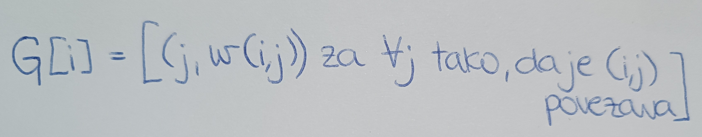

 V primeru, da bi bil graf neutežen, bi pomenilo, da na povezavah ne bi imeli uteži. Potem bi namesto $w(i,j)$ pisali le 1, če bi $i$-ti in $j$-ti vozlišči bili sosednji in 0 v nasprotnem primeru.
 Seznam sosednosti nam pride bolj prav od matrike $A$ v primeru, ko je graf redek oz. bi v matriki imeli veliko vrednosti $None$.

3. SLOVAR SOSEDNOSTI:

$G$ naj bo sedaj seznam slovarjev dolžine $n$. Na $i$-tem indeksu v seznamu bi imeli en slovar. Njegovi ključi bi bila sosednja vozlišča, vrednosti pa uteži na povezavah.

Bellmanova enačba za seznam slovarjev:

 

Prednosti in slabosti vsake izmed zgornjih predstavitev $G$, kjer je n število vozlišč in m število povezav.

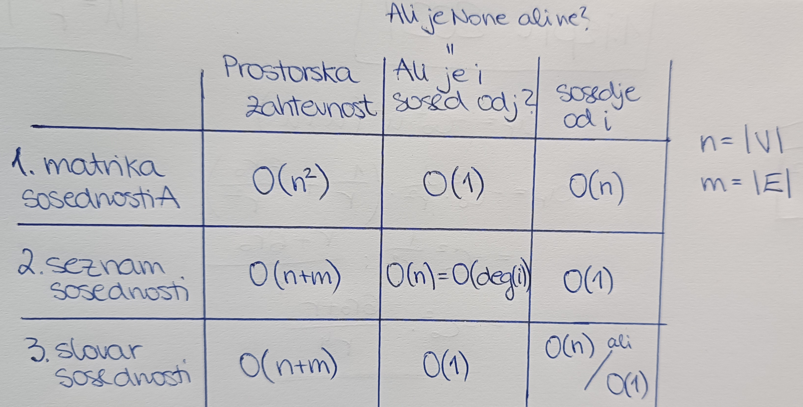

Ponovimo naslednje pojme:
* POT v grafu je zaporedje povezav $e_1, e_2, ..., e_k$, kjer je $e_i = \{ v_i, v_{i+1} \}$ za $1 \leq i \leq k$ in neka paroma različna vozlišča $v_1, v_2, ..., v_{k+1}$.

* SPREHOD v grafu je končno zaporedje vozlišč $v_1, ..., v_k$ in njihovih povezav grafa $G$. Vozlišče $v_1$ imenujemo začetek, vozlišče $v_k$ pa konec sprehoda.

* CIKEL v grafu je zaporedje povezav $e_1, e_2, ..., e_k$, kjer je $e_i = \{ v_i, v_{i+1} \}$ za $1 \leq i \leq k-1$ in $e_k = \{ v_k, v_1 \}$ za neka paroma različna vozlišča $v_1, v_2, ..., v_k$.


 ## *Naloga 2*

Usmerjenemu grafu $G$ z n-vozlišči, ki nima ciklov, rečemo tudi DAG (directed acyclic grapf). Vozlišča takega grafa lahko topološko uredimo. To pomeni, da obstaja zaporedje vozlišč $v_1, v_2, ..., v_n$ tako, da ne obstaja povezava $(v_i, v_j)$, če je $j < i$. Po domače rečeno, če graf narišemo, nobena povezava ne kaže v obratno smer kot ostale.
Na vajah smo skupaj sestavili algoritem, ki najde tako zaporedje. Katera vozlišča lahko zagotovo damo na prvo mesto v to ureditev?

Recimo, da imamo narisan naslednji neuteženi usmerjeni graf.
Množica vozlišč je $V = \{ 1, 2, 3, 4, 5, 6 \}$ in povezav $E = \{ (1, 3), (1, 2), (3, 2), (3, 4), (2, 4), (2, 6), (4, 6), (5, 2) \}$.

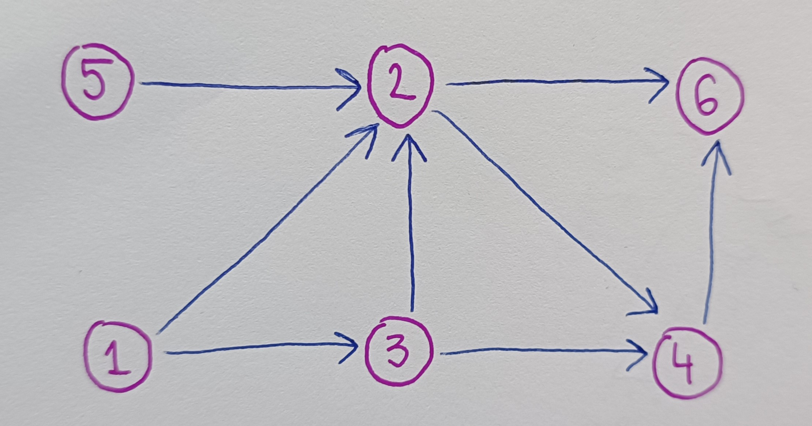

Pogledamo, katera vozlišča imajo povezave samo navzven in nobene noter. V našem primeru sta to dve vozlišči $1$ in $5$ (vse puščice kažejo ven iz vozlišča). Ta vozlišča gredo na začetek topološke ureditve. Sedaj ta vozlišča in ustrezne povezave odstranimo ter korak ponovimo na novem grafu. Postopek lahko vidimo na spodnjem primeru. Na tak način dobimo topološko ureditev usmerjenega grafa.

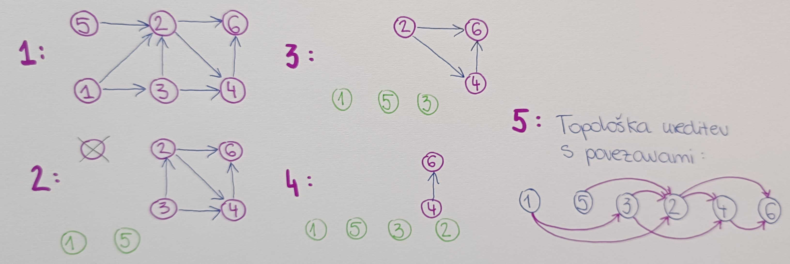

Tako dobimo DAG, ki ima n-vozlišč in nima povratnih povezav.

Napisali smo tudi psevdo kodo za dani algoritem topološke ureditve grafa:


V prvi for zanki poiščemo prve izvore v grafu, t.j. vozlišča, ki niso sosedi nobenih vozlišč. V našem primeru sta so vozlišči $1$ in $5$ oz. tisti dve vozlišči, ki imata `in_deg` enako 0.

```python
def topoSort(G):
    '''
        Funkcija vrne topološko ureditev grafa `G` kot seznam.
        Graf je podan kot seznam sosednosti.
    '''
    n = len(G)  # število vozlišč
    in_deq = [0]*n  # beleženje število povezav v i-to vozlišče
    # gremo čez vsa vozlišča
    for i in range(n):
        # gremo čez vse sosede
        for j in G[i]:
            # obstaja povezava od i do j
            # povezava, ki kaže v j-to vozlišče, zato j povečamo število povezav
            in_deq[j] += 1
    
    izvori = [i for i in range(n) if in_deq[i] == 0]  # tista vozlišča, ki niso sosedje nobenemu oz. ni povezave, ki bi šla v ta vozlišča
    rezultat = list()
    
    # ponavljamo dokler bomo imeli vsaj en izvor
    while izvori:
        izvor = izvori.pop()
        # vsem sosedom izvora odstranimo in_deq
        rezultat.append(izvor)
        for sosed in G[izvor]:
            in_deq[sosed] -= 1
            if in_deq[sosed] == 0:
                # postal je novi izvor, ker je ostal brez sosedov
                izvori.append(sosed)
    
    return rezultat
```

Vhodni testni primeri:
```python
g1= []  # prazen graf
g2 = [[1], []]  # graf z dvemi vozlišči
g3 = [[1, 2], [2], []]
g4 = [[1, 2], [3, 5], [1, 3], [5], [1], []]
g5 = [[1, 2], [3], [4], [2, 4, 5], [5], []]
```
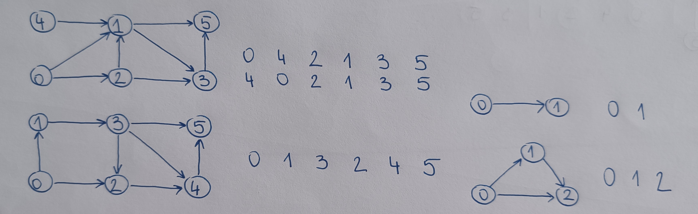

Izhod:
```python
>>> %Run topoSort.py
[]
[0, 1]
[0, 1, 2]
[4, 0, 2, 1, 3, 5]
[0, 1, 3, 2, 4, 5]
```

 ## *Naloga 3*

Sedaj naj bo $G$ usmerjen utežen graf brez ciklov. Kako bi izračunali ceno najdaljše poti v tem grafu med vozliščema $s$ in $t$.

Pomagali smo si s topološko ureditvijo grafa in dinamičnim programiranjem. Ideja je, da za neko $i$-to vozlišče pregledamo vse njegove sosede in vzamemo maksimum po vseh sosedih.

Bellmanova enačba za dani problem:

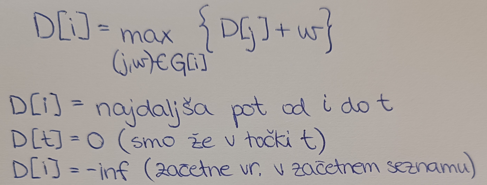

$G$ najprej uredimo topološko in seznam $D$ polnimo v obratni topološki ureditvi, glede na to kje se naš $t$ nahaja.
Torej, če je $t$ na koncu topološke ureditve, vzamemo njegovega najdaljšega soseda in potem najdaljšega soseda od tega soseda itd.
Če je $t$ nekje v sredini topološke ureditve, nas zanimajo samo njegovi predhodnjiki. Na desni strani ostanejo vsi na privzeti vrednosti $-inf$.

---
# Vaje 6

Na vajah smo obravnavali BFS algoritem ter Floyd-Warshallow algoritem za iskanje najkrajše poti v grafu.

## *Naloga 1*: BFS algoritem 

Ponovili smo izraza BFS in DFS algoritma. BFS oz. `BFS (Breadth first-search)` je algoritem za iskanje najkrajših poti v grafu, pri katerem začnemo pri nekem vozlišču $u$ in pregledamo vse njegove sosede. Nato pregledamo vse sosede teh sosedov itd.
`DFS (Deaph first-search)` pa je algoritem tudi za iskanje najkrajših poti v grafu, vendar tu začnemo pri nekem vozlišču $u$ in najprej pogledamo prvega soseda in nato prvega soseda od tega soseda itd. Nato postopek ponovimo na drugem sosedu od $u$-ja  in do konca do zadnjega soseda od $u$.

Uporaba BFS algoritma:
* pregled grafa,
* poiskati vpeto drevo/gozd v grafu,
* preverjanje dvodelnosti grafa (z enim sprehodom),
* iskanje najkrajših poti v neuteženem grafu.

Implementacija BFS algoritma:

```python
# importamo ustrezno knjižnico, da bomo lahko iz vrste vlekli vozlišča iz začetka in konca
from collections import deque

def BFS(G, u):
    '''Poišče najkrajše poti v neuteženem grafu G (G predstavljen kot seznam sosedov) tako, da začne pri vozlišču u.'''
    n = len(G)  # število vozlišč
    # pripravimo seznam/ množico, kjer hranimo vozlišča, ki smo jih že obiskali
    obiskani = [False]*n
    q = deque([u])  # začnemo pri u
    # ponavljamo, dokler q ni prazen
    while q:
        trenutni = q.popleft()
        if obiskani[trenutni]:
            continue
        else:
            # sosede od u damo v vrsto
            obiskani[trenutni] = True
            # gremo po vseh sosedih od u-ja...G[trenutni]
            for sosed in G[trenutni]:
                if not obiskani[sosed]:
                    # soseda dodamo na desno stran vrste
                    q.push(sosed)
```
Pri DFS algoritmu bi bila razlika le ta, da bi pri `q` namesto podatkovne strukture vrsta, uporabili sklad, kjer bi jemali in dodajali vozlišča z vrha.

Implementacija BFS algoritma za iskanje poti:

```python
# importamo ustrezno knjižnico, da bomo lahko iz vrste vlekli vozlišča iz začetka in konca
from collections import deque

def BFS_poti(G, u):
    '''Vrne najkrajše poti v neuteženem grafu G od u do vseh ostalih vozlišč.'''
    n = len(G)
    d = [0]*n  # vse razdalje na začetku nastavimo na 0
    obiskani = [False]*n
    q = deque([(u, 0)])  # drugi element=0 je razdalja i-tega vozlišča do u
    while q:
        trenutni, razdalja = q.popleft()
        if obiskani[trenutni]:
            continue
        else:
            obiskani[trenutni] = True
            d[trenutni] = razdalja
            for sosed in G[trenutni]:
                if not obiskani[sosed]:
                    # soseda dodamo na desno stran vrste
                    q.push((sosed, razdalja + 1))
    return d
```
Razdaljo povečamo za 1, ker je sosed na višini večji za 1 od svojega starša.

Časovna zahtevnost je $O(n+m)$, kjer je $n$ število vozlišč in $m$ število povezav.

Če bi želeli izpisati najkrajšo pot, bi morali v vrsto dodati še en parameter in sicer `starša` od trenutnega vozlišča. Tako bi vedeli, od kje smo prišli do trenutnega vozlišča. Njegova privzeta vrednost bi bila kar enaka $u$. Torej bi zapisali:

```python
    q = deque([(u, 0, u)])
```

## *Naloga 2*: Floyd-Warshallow algoritem ##

Z njim računamo najkrajše poti vozlišč med seboj v uteženem usmerjenem grafu.

Vhodni podatki:
* graf G (utežen, dovoljene negativne vrednosti povezav)

Izhodni podatki:
* matrika D dimenzije $n\times n$, kjer je $n$ število vozlišč.

$D_{i,j}$ nam pove dolžino/ceno najkrajše poti od $i$-tega do $j$-tega vozlišča.

Bellmanova enačba:

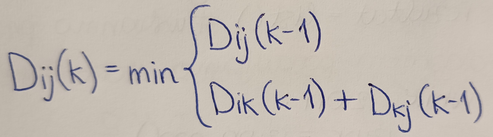

$D_{ij}(k)$ nam pove dolžine najkrajših poti iz vozlišča $i$ do $j$, kjer so dovoljena vmesna vozlišča od $1, ..., k$. $D_{ij}(k-1)$ pomeni, da gremo optimalno od $i$ do $j$ brez $k$-tega vozlišča. $D_{ik}(k-1) + D_{kj}(k-1)$ pa pomeni, da gremo najprej optimalno od $i$ do $k$-tega in nato optimalno od $k$ do $j$-tega vozlišča.

Robni pogoji:
* $D_{ii}(1) = 0$
* $D_{1i}(1) = w_{1i}$ ($w$ je utež povezave)

Časovna zahtevnost algoritma je $O(n^3)$, ker $i$ in $j$ oba tečeta od $1$ do $n$ in izračunati je potrebno $n$ matrik velikosti $n \times n$.


## *Naloga 3*: Simulacija FW algoritma ##

Podan imamo usmerjen utežen graf G, ki ga vidimo na sliki.

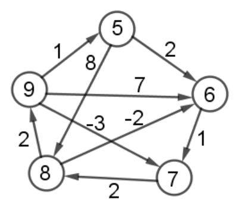

Narišemo si matriko $A$ velikosti $5 \times 5$. 
Označimo si vozlišča $1 = 5$, $2 = 6$, ..., $5 = 9$.
Nastavimo $k=0$ in po diagonali zapišemo 0-ke, v matriki zapišemo direktne povezave iz grafa ter na preostalih mestih zapišemo neskončno, saj med temi vozlišči ni povezav.


Nato nastavimo $k=1$. Ker je $k$ 1, velja, da se prva vrstica in prvi stolpec ne spremenita. S pomočjo Bellmanove enačbe izračunamo novo matriko oz. posodobimo vrednosti matrike $A$. Postopek ponovimo za $k = 2,3,4,5$. Na koncu algoritma dobimo spodnjo matriko.

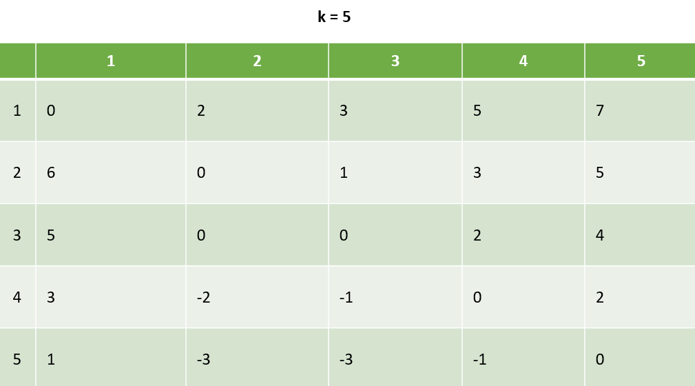

Če bi dodali na novo še šesto vozlišče, bi izračunali še matriko $D_{6}$, ki bi imela eno vrstico in en stolpec več.


## *Naloga 5*

S FW algoritmom bi odkrili, ali v grafu obstajajo negativni cikli tako, da bi preverili diagonalne elemente v končni matriki. Če je kateri od diagonalnih elementov negativen, potem ima graf negativni cikel.

---
# Vaje 7

## *Naloga 1*

Iz prejšnjih vaj smo ponovili postopek, kako razberemo najkrajše poti s pomočjo matrike $\pi$, ki jo dobimo z FW algoritmom.
Spomnimo se, da pri Floyd-Warshallovem algoritmu dopuščamo tudi negativne uteži na povezavah. Edini pogoj je, da nima negativnih ciklov.

Ponovimo rekurzivno zvezo:

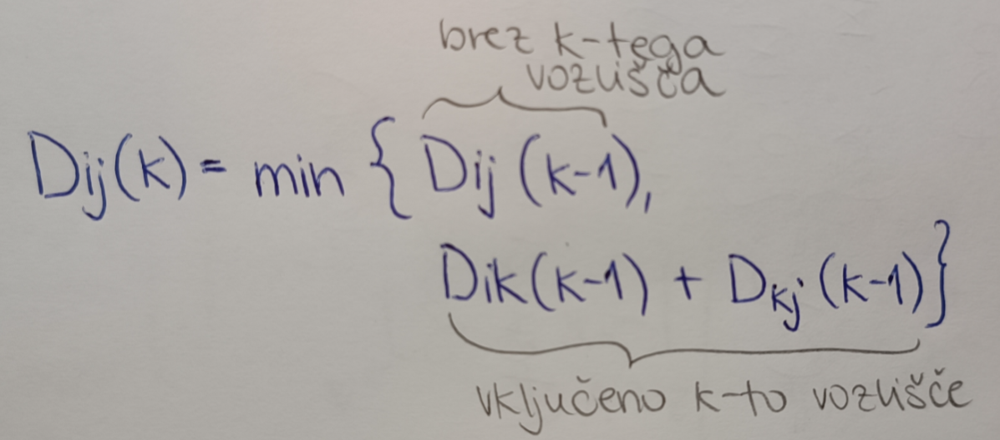

Spomnimo se, da $D_{ij}(k)$ predstavja dolžine najkrajših poti iz vozlišča $i$ do $j$, kjer so dovoljena vmesna vozlišča od $1, ..., k$.

Kako bi algoritem spremenili, da bi si najkrajšo pot dveh poljubnih vozlišč zapomnili tako, da bi si shranili predhodnjika zadnjega oz. $j$-tega vozlišča.

Ideja:
Hranili bi matriko predzadnjih vozlišč najkrajših poti.

$\pi _{ij}(k) := $ predzadnje vozlišče na poti od $i$ do $j$, kjer smemo uporabiti vmesna vozlišča od $1$ do $k$-tega.

Če bi nas zanimala najkrajša pot $i - j$, bi pregledali vse predhodnjike zadnjih vozlišč t.i. "podpoti", kot vidimo na spodnji sliki, v smeri od vozlišča $j$ do $i$
-tega.

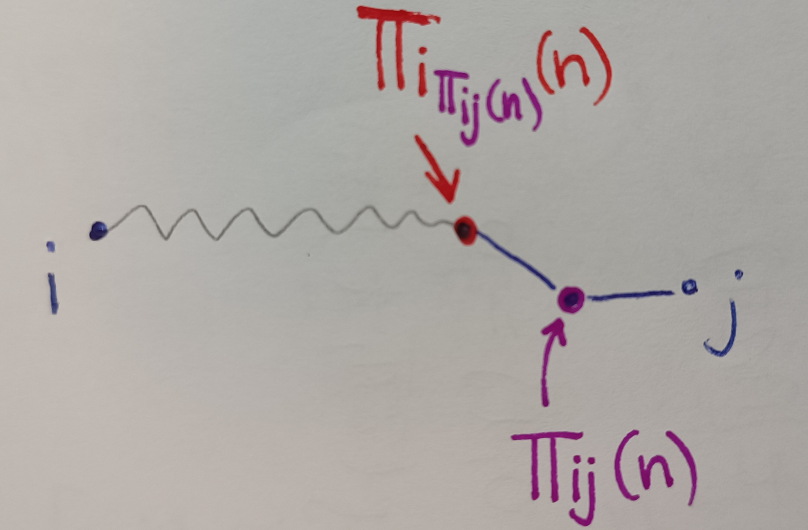

Torej $\pi _{ij}(n)$ predstavlja predhodnjika zadnjega elementa poti $i-j$ oz. prvega predhodnjika v tej poti. Nato vzamemo vozlišče $\pi _{i\pi _{ij}(n)}(n)$, ki je naslednji predhodnjik poti od i do $\pi _{ij}(n)$. Algoritem ponavljamo, dokler ne pridemo do začetnega vozlišča $i$. 

$(n)$ pomeni, da je pot dovoljena preko vseh vozlišč v grafu.

Robni pogoji:

* $\pi _{ii}(0) = i$, če nas zanima najkrajša pot od začetnega in končnega vozlišča, kjer sta ta dva kar enaka in ne smemo it skozi nobeno drugo vozlišče, je pot dolga i

* $\pi _{iG[i]}(0) = i$, če je drugo vozlišče sosed od prvega ter ne smemo it skozi nobeno drugo vozlišče

* kadar je minimum izpolnjen pri pogoju $D_{ij}(k-1)$, velja $\pi _{ij}(k) = \pi _{ij}(k-1)$

* kadar je minimum izpolnjen pogoju $D_{ik}(k-1) + D_{kj}(k-1)$, velja $\pi _{ij}(k) = \pi _{kj}(k-1)$. V tem primeru nas pot od $i$ do $k$ niti ne zanima, ker bo predhodnjik tako ali tako iz poti $D_{kj}(k-1)$.

V kodi dodamo dva `if` stavka pri kateri od dveh možnosti se minimum izpolni, da tako ustrezno posodobimo vrednost elementa $\pi _{ij}(k)$ v matriki.

Rekonstrukcija poti:

* VHOD: vozlišča $i,j$ in matrika $\pi(n)$
* IZHOD: najkrajša pot od $i$ do $j$

Skica algoritma:

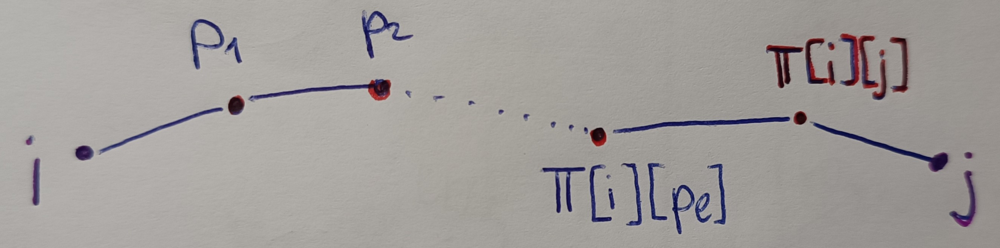

Algoritem(psevdo koda):
```python
p = j  # trenutno zadnje vozlišče
pot = list()
# ponavljamo, dokler ne pridemo do začetnega vozlišča poti
while p != i:
    # dodamo zadnje vozlišče
    pot.append(p)
    # starša nastavimo na pl(predhodnjika)
    p = Pi[i][p]
# na koncu dodamo še zašetno vozlišče
pot.append(i)
# vrnemo obrnjen seznam (od i do j)
return pot.reverse()
```

While zanka se bo odvijala tolikokrat, koliko je pot dolga. Ta pa je v najslabšem primeru dolga $n$, če gremo skozi vsa vozlišča v grafu. Potem je časovna zahtevnost algoritma največ $O(n)$.

## *Naloga 2*

Sedaj dodamo še uteži na vozlišča. Kako bi poiskali najcenejše poti v grafu?
Na vajah smo povedali dve ideji:

1. Prišteli bi povezave, ki kažejo v trenutno vozlišče.
2. Prišteli bi povezave, ki kažejo ven iz vozlišča.

Odločili bi se glede na problem in smiselno obravnavali začetno in končno vozlišče poti.

## *Naloga 3*

Razmislili smo, če bi v FW algoritmu spremenili `min` v `max`, zakaj potem ne bi nujno najdlo najdražje poti v grafu.
Ugotovimo, da zaradi morebitnih pozitivnih ciklov.

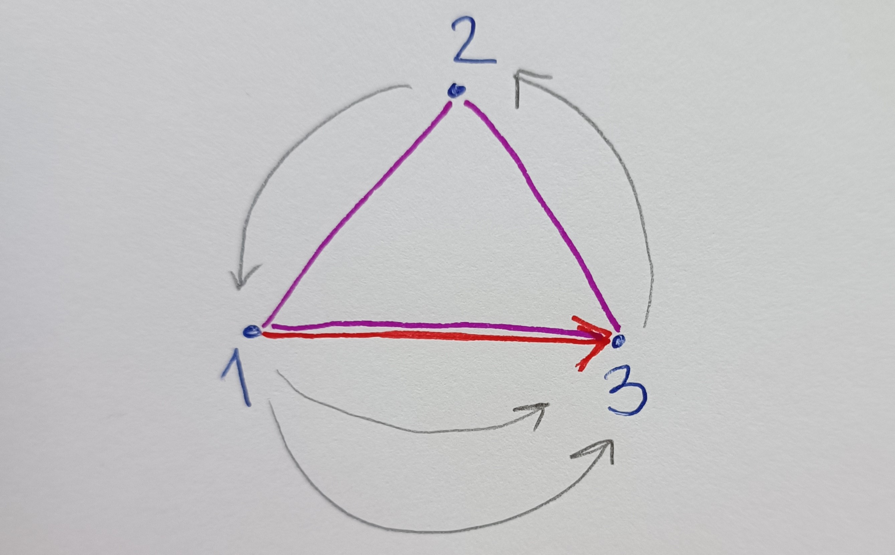

Iz vozlišča $1$ do $3$ gremo lahko po direktni poti oz. po rdeči povezavi. Ali pa gremo po poti od $1-3$ skozi vozlišče $2$. V tem primeru, naredimo dve poti. Pot $1-2$ skozi $3$ ter $2-3$ skozi vozlišče $1$. S tem pa dobimo cikel, kot vidimo na zgornji sliki.
Ti dve poti pa nista "kompatibilne". To pomeni, če ti dve poti združimo, se nam vozlišča in povezave ponavljajo.

Kaj to pomeni v FW algoritmu?

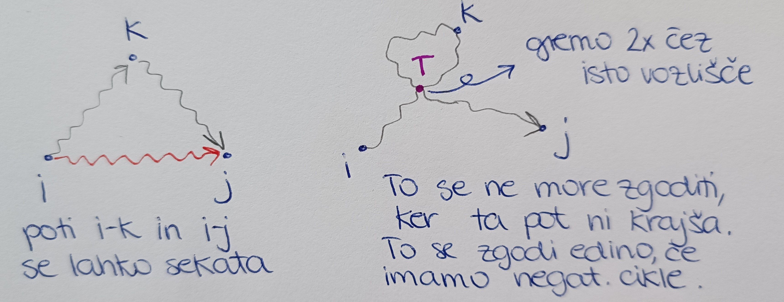

## *Naloga 4*

Radi bi čim bolj ugodno pretvorili neko količino denarja iz valute $i$ v valuto $j$.
Najdi algoritem tako, da bomo na koncu čim manj izgubili.

* SESTAVIMO GRAF $G(V, E)$

Vozlišča: EUR, YEN, USD (velute)

Povezave: pretvorba valut

Na grafu nas zanima najdražja pot od $i$-te do $j$-te valute. Ceno poti pa dobimo, kot produkt uteži na povezavah.


Cena poti je potem enaka $R_{i,i_{1}} \times R_{i_{1},i_{2}} \times ... \times R_{i_{k},j}$, kjer so $R$-ji uteži na povezavah med dvema poljubnima vozliščema poti. To lahko zapišemo kot $log = \sum_{i} \log(R_{i})$.

Utež na povezavi $i-j$ nastavimo na $-\log(R_{i,j})$. Tako iščemo najcenejšo pot v danem grafu. V ta namen želimo uporabiti FW algoritem, kar lahko, če graf nima negativnih ciklov. Dokažimo, da jih naš graf res nima.

To dokažemo s protislovjem:
Predpostavimo, da imamo negativen cikel $i-i$. Torej začetno in končno vozlišče je isto. 

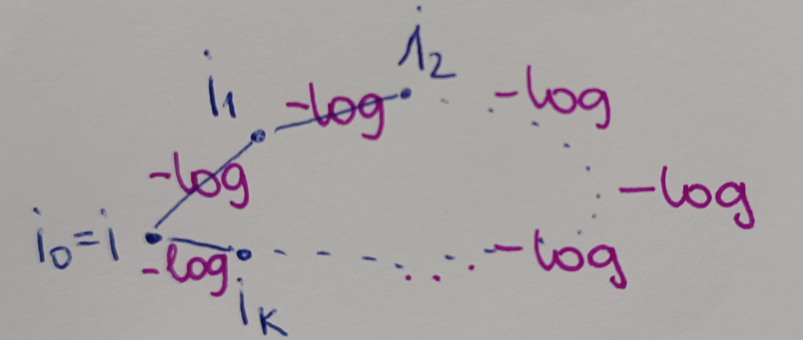

Cena tega cikla je $-(\sum_{j=1}^k \log(R_{i_{j-1}, i_{j}})) < 0$.

Sledi:

$-\log(\prod_{j=1}^k R_{i_{j-1}, i_{j}}) < 0$ množimo z $-1$ in dobimo

$\log (\prod_{j=1}^k R_{i_{j-1}, i_{j}}) > 0$ antilogaritmiramo ter dobimo

$\prod_{j=1}^k R_{i_{j-1}, i_{j}} > 1$.

To je arbitraža, kar pa nas privede do protislovja. Torej naš graf nima negativnih ciklov.


## *Naloga 5*

Ponovili smo Djikstrov algoritem.

Vhodni podatki:
* usmerjeni graf $G(V,E)$
* začetno vozlišče $s \in V$
* cene povezav $c_{i,j} \in E$

Cene povezav so nenegativne.

Izhodni podatki:
* cene najcenejših poti od začetnega do $i$-tega vozlišča
* drevo najkrajših poti od začetnega do $i$-tega vozlišča.

Psevdo koda algoritma je od Gregorja Kuhlja.

```python
def dijkstra(G,s):
    '''Vrne najkrajšo pot od s do vseh vozlišč v grafu G'''
    n = len(G)
    D = [float("inf")] * n
    P = [None] * n
    D[s] = 0 # D[i] pove razdaljo od s do i -> pri nas je i = s
    P[s] = s
    obiskani = [False] * n
    q = Vrsta(V(G))  # v vrsto dodamo še nedodana vozlišča  ... list[range(n)]

    while len(obiskani) != n:
        c = q.popmin()  # dobimo najmnajši element in ga odstrani iz seznama
        obiskani.add(c)

        for sosed, utez in G[c]:
            if sosed not in obiskani:
                if D[c] + utez + D[sosed]:
                    D[sosed] = D[c] + utez
                    P[sosed] = c
    return D,P
```

Časovna zatevnost algoritma: 

Do while zanke je $O(n)$, while zanka je $O(n)$ in for zanka je $O(n)$. Skupna časovna zahtevnost je tako $O(n)$.

---
# Vaje 8

## *Naloga 1*

Naša naloga je bila, da uporabimo Djikstra algoritem, implementiran v datoteki `djikstra.py`, na naslednjih podatkih:

* `roadNet-TX.txt` sem spremenila v ustrezno podatkovno strukturo grafa

```python
def seznam_povezav(ime_dat):
    '''Iz dane txt datoteke razbere povezave grafa, povezave doda v seznam `tocke` in jih uredi glede na začetna vozlišča.'''
    tocke = list()
    with open(ime_dat, 'r') as file:
        for vrstica in file:
            # če je vrstica začetna, ki nas ne zanima, jo spusti
            if '#' in vrstica:
                continue
            else:
                zacetek, konec = vrstica[:-1].split('\t')  # povezava
                tocke.append((int(zacetek), int(konec)))
    tocke = sorted(tocke, key=lambda x: x[0])  # uredimo tabelo povezav
    return tocke  # [(0, 1), (0, 2), (0, 29), (1, 0), (1, 23), (1, 32), (2, 0), (2, 26),...]


def ustvari_graf(povezave):
    graf = [list() for _ in range(povezave[-1][0]+1)]
    for u, v in povezave:
        graf[u].append((v,1))  # utež je 1
    return graf
```

V nadaljevanju si pomagamo s funkcijo `djikstra(G, s)`, kjer je G usmerjen in utežen graf ter s začetno vozlišče, od katerega razdalje nas zanimajo.

* poišči najkrajše razdalje od vozlišča 100 do vseh ostalih vozlišč

Zanimajo nas najkrajše razdalje od vozlišča 100 do vseh ostalih, zato kot parameter vozlišče $s$ vnesemo št. 100. Najprej iz dane txt datoteke razberemo vse povezave in jih vrnemo v urejeni tabeli. Nato s pomočjo funkcije `ustvari_graf(tab)` naredimo pravilno strukturiran graf, ki jo sprejme metoda `djikstra`. Torej graf kot seznam seznamov, kjer i-ti seznam v grafu G predstavlja sosede i-tega vozlišča v grafu ter uteži ustreznih direktnih povezav iz i-tega do vseh sosednjih vozlišč.

```python
tab = seznam_povezav('roadNet-TX.txt')
graf2 = ustvari_graf(tab)
razdalje, poti = djikstra(graf2, 100)
print(razdalje[:6])  # prvih 5
```
Za prvih 5 vozlišč v grafu dobimo:
```python
>>> %Run djikstra.py
[10, 11, 9, 10, 10, 11]
```
Torej najkrajša razdalja od vozlišča $100$ do vozlišča $0$ je dolga 10 (gledamo element na indeksu 0), do vozlišča $1$ (element na indeksu 1) je 11 in tako dalje do vozlišča $5$ je najkrajša pot dolga 11.

* Koliko je razdalja $dG(100, 100000)$?

Zanima nas razdalja od $100$ do vozlišča $100000$. Pogledamo 100000-ti element v seznamu `razdalje` pri parametru s=100.
```python
>>> print(razdalje[100000])
240
```

* Katero vozlišče je najbolj oddaljeno od vozlišča 100?
```python
najdaljsi = max(razdalje)
for i, elt in enumerate(razdalje):
    if elt == najdaljsi:
        naj_indeks = i
        break
print(naj_indeks)
```

```python
>>> %Run djikstra.py
1389039
```

* Koliko vozlišč je dosegljivih iz vozlišča 100?
```python
tab= seznam_povezav('roadNet-TX.txt')
graf2 = ustvari_graf(tab)
print(len(graf2[100]))  # število sosedov od 100
```

```python
>>> %Run djikstra.py
2
```


## *Naloga 2*

Glede na to, da graf ni utežen, lahko za isto nalogo implementiramo BFS algoritem. Implementiraj BFS algoritem, ki bo poiskal dolžine najkrajših poti od $s$ do vseh ostalih vozlišč. Vrne naj tudi `drevo najkrajših poti`, tako kot Djikstra. To preverimo isto kot v prejšnji nalogi. Dobiti moram sevesa iste rezultate.

BFS algoritem z dodatkom za vračanje, poleg najkrajših poti, tudi drevo najkrajših poti v obliki seznama.
```python
def BFS_poti(G, u):
    '''Vrne najkrajše poti v neuteženem grafu G od u do vseh ostalih vozlišč.
        Graf G je predstavljen kot seznam sosedov.
    '''
    n = len(G)
    d = [0]*n  # vse razdalje na začetku nastavimo na 0
    obiskani = [False]*n
    poti = [-1] * n
    q = [(u, 0)]  # drugi element=0 je razdalja i-tega vozlišča do u
    while q:
        trenutni, razdalja = q[0]
        q = q[1:]
        if obiskani[trenutni]:
            continue
        else:
            obiskani[trenutni] = True
            d[trenutni] = razdalja
            for sosed in G[trenutni]:
                if not obiskani[sosed]:
                    # soseda dodamo na desno stran vrste
                    q += [(sosed, razdalja + 1)]
                    if poti[sosed] == -1:
                        poti[sosed] = trenutni        
    poti[u] = u
    return d, poti
```

Preverila sem delovanje funkcije na primeru grafa G podanega spodaj. Na primeru iz prejšnje naloge pa mi funkciji vrneta različna seznama poti vendar nisem prepričana zakaj.

```python
# spodnja funkcija je za BFS algoritem nad txt datoteko, saj graf ne sme imeti uteži
def ustvari_neutezen_graf(povezave):
    graf = [list() for _ in range(povezave[-1][0]+1)]
    i = 0
    for tocka in povezave:
        if tocka[0] == i:
            graf[i].append(tocka[1])
        else:
            i +=1
            graf[i].append(tocka[1])
    return graf  #[[1, 2, 29], [0, 23, 32], ...]


G1 = [
    [(1,1), (5,1)],
    [(3, 1), (4, 1), (5, 1)],
    [(4,1), (5, 1)],
    [(5,1), (2, 1)],
    [(4,1), (5, 1)],
    [(0, 1), (1,1), (4, 1)]
]

G2_neutezen = [
    [1, 5],
    [3, 4, 5],
    [4, 5],
    [5, 2],
    [4, 5],
    [0, 1, 4]
]
```

```python
>>> %Run BFS_poti.py
>>> %Run djikstra.py
>>> razdalje, poti = djikstra(G2, 0)
>>> razdalje2, poti2 = BFS_poti(G2_neutezen, 0)
>>> razdalje == razdalje2
True
>>> poti == poti2
True
>>> poti
[0, 0, 3, 1, 1, 0]

>>> razdalje, poti = djikstra(G2, 1)
>>> razdalje2, poti2 = BFS_poti(G2_neutezen, 1)
>>> razdalje == razdalje2
True
>>> poti == poti2
True
>>> poti
[5, 1, 3, 1, 1, 1]
```
Pri začetnem vozlišču $s=3$ pride do razlike, saj v danem neuteženem grafu lahko v vozlišče $4$ pridemo iz vozlišča $2$ ali $5$ po enaki ceni.

```python
>>> razdalje, poti = djikstra(G2, 2)
>>> razdalje2, poti2 = BFS_poti(G2_neutezen, 2)
>>> razdalje == razdalje2
True
>>> poti == poti2
True
>>> poti
[5, 5, 2, 1, 2, 2]
>>> razdalje, poti = djikstra(G2, 3)
>>> razdalje2, poti2 = BFS_poti(G2_neutezen, 3)
>>> razdalje == razdalje2
True
>>> poti == poti2
False
>>> poti, poti2
([5, 5, 3, 3, 2, 3], [5, 5, 3, 3, 5, 3])
```

## *Naloga 3*

Oba algoritma dodelaj, tako da dodaš nov vhodni podatek $t$, ki predstavlja končno vozlišče. Algoritma naj torej vrneta razdaljo med $s$ in $t$ v grafu ter pot (kot drevo) med njima. Delujeta naj, tako da se ustavita takoj ko najdemo željeno pot.

---
## BFS algoritem
---

Funkcijo sem dopolnila tako, da sem kot tretji parameter v vrsti $q$ dodala še vozlišče oz. starša, od katerega pridemo do trenutnega soseda. Če obstaja direktna povezava od $u$ do $t$, preverimo že v prvem if stavku in v tem primeru vrnemo razdaljo enako 1 ter pot, sestavljeno le iz teh dveh vozlišč.
Ko dodajamo sosede, katerih kasneje pregledamo vse sosede, hranimo še njihove starše. Z njimi si na koncu pomagamo izpisati pot, ko pridemo do končnega vozlišča.

Koda v Pythonu za BFS algoritem:
```python
def BFS_s_t(G, u, t):
    '''Vrne najkrajše poti v neuteženem grafu G od u do vozlišča t.
        Graf G je predstavljen kot seznam sosedov.
    '''
    if u == t:
        return 0, []
    n = len(G)
    obiskani = [False]*n
    pot = list()
    vrsta = [(u, 0, u)]  # tu hranimo vsa vozlišča in njihove starše
    q = [(u, 0, u)]  # drugi element=0 je razdalja i-tega vozlišča do u
    while q:
        trenutni, razdalja, stars = q[0]
        q = q[1:]
        if obiskani[trenutni]:
            continue
        else:
            obiskani[trenutni] = True
            for sosed in G[trenutni]:
                if sosed == t and razdalja == 0:
                    # direktni sosed
                    return 1, [sosed, u]
                if sosed == t:
                    pot.append(t)
                    pot.append(trenutni)
                    while True:
                        for elt in vrsta:
                            if elt[0] == trenutni:
                                stars = elt[2]
                                if stars == u:
                                    pot.append(u)
                                    return razdalja + 1, pot
                                pot.append(stars)
                                trenutni = stars
                
                if not obiskani[sosed]:
                    # soseda dodamo na desno stran vrste
                    q += [(sosed, razdalja + 1, trenutni)]
                    vrsta += [(sosed, razdalja, trenutni)]
```
Pri vnosu začetnega vozlišča $u=0$ in končnega $t=2$ imamo na koncu tako situacijo. Glede na starša funkcija poišče v vrsti starša od tega starša itd. Tako dobimo pot od $u$ do $t$ v obratnem vrstnem redu.


Primer:
```python
G2_neutezen = [
    [1, 5],
    [3, 4, 5],
    [4, 5],
    [5, 2],
    [4, 5],
    [0, 1, 4]
]
print(BFS_s_t(G2_neutezen, 0, 1))
print(BFS_s_t(G2_neutezen, 0, 2))
print(BFS_s_t(G2_neutezen, 5, 3))
print(BFS_s_t(G2_neutezen, 0, 0))
```
Za dane vnose funkcija izpiše:
```python
>>> %Run BFS_s_t.py
(1, [1, 0])
(3, [2, 3, 1, 0])
(2, [3, 1, 5])
(0, [])
>>> 
```

---
## Djikstra algoritem
---

Pri Djikstra algoritmu sem naredila podobno kot pri BFS.

Kodo sem sprva implementirala napačno. Zato sem jo na `Vajah 9` popravila. 

Pravilna verzija Djikstra algoritma za vračanje poti med vozliščema $s$ in $t$:
```python
def djikstra(G, s):
    """
    Funkcija sprejme usmerjen in utežen graf G predstavljen
    s seznamom sosednosti ter začetno vozlišče s.
    Torej G[i] = [(v_1, w_1), ... (v_d, w_d)],
    kjer je (i, v_k) povezava v grafu z utežjo w_k.
    Vrne seznam razdaljeDo, ki predstavlja najkrajšo pot od vozlišča s
    do vseh ostalih.
    Vrne tudi seznam poti, ki predstavlja drevo najkrajših poti od s
    do vseh ostalih vozlišč.
    """
    n = len(G)
    
    # Nastavimo začetne vrednosti za sezname obiskani, razdaljaDo in poti.
    obiskani = [False] * n
    razdaljeDo = [-1] * n
    poti = [-1] * n
    # Na vrsto dodamo trojico (d, v, p), kjer je:
    # v vozlišče, d razdalja do njega, p pa prejšnje vozlišče na najkrajši poti od
    # s do v.
    Q = [(0, s, s)]

    while Q:
        
        # Vzamemo minimalen element iz vrste
        # heapq.heappop(Q) odstrani element iz seznama  Q, ter pri tem ohranja
        # lastnost kopice : seznam Q tretira kot dvojiško drevo!
        razdalja, u, p = heapq.heappop(Q)  # iz seznama q vzame zadnji element, ampak ohranja lastnosti kopice

        # če je že obiskan, nadaljujemo.
        if obiskani[u]:
            continue
        
        # obiščemo vozlišče ter nastavimo njegovo razdaljo
        # ter predhodnika na najkrajši poti od s do u
        obiskani[u] = True
        razdaljeDo[u] = razdalja
        poti[u] = p

        # gremo čez vse sosede in dodamo potrebne elemente na vrsto.
        for (v, teza) in G[u]:
            if not obiskani[v]:

                # heap.heappush(Q, elem) doda element v seznam Q, kjer ohranja lastnost kopice.
                heapq.heappush(Q, (razdalja + teza, v, u))

    return razdaljeDo, poti

def pot(drevo, s, t):
    sez_pot = list()  # tu hranimo vse do sedaj pregledane starše vozlišč
    # sprehajamo se od končnega vozlišča t do s
    stars = drevo[t]  # starš od vozlišča t
    sez_pot.append(t)
    sez_pot.append(stars)
    while stars != s:
        # ponavljamo, dokler ne pridemo do starša enakega vozlišču s
        stars = drevo[stars]
        sez_pot.append(stars)
    return sez_pot

```


## *Naloga 4*

Zapiši funkcijo, ki sprejme začetno vozlišče $s$, končno vozlišče $t$ ter drevo najkrajših poti ter vrne najkrajšo pot med njima v obliki seznama. Sedaj rekonstruiraj najkrajšo pot med vozliščem 100 in 100000.

Ideja algoritma je, da se sprehajamo po drevesu najkrajših poti. Začnemo pri končnem vozlišču $t$ in 'skačemo' po starših, dokler ne pridemo do začetnega vozlišča $s$. Vrnemo pot od $s$ do vozlišča $t$.

Python koda:
```python
def pot_s_t(s, t, drevo_najkrajsih):
    '''
        Vrne pot od vozlišča s do t na podlagi drevesa najkrajših poti od vozlišča s do vseh ostalih.
    '''
    sez = list()
    v = drevo_najkrajsih[t]
    sez.append(t)
    while v != s:
        sez.append(v)
        v = drevo_najkrajsih[v]
    sez.append(s)
    return sez
```

Za vnos txt datoteke in $s=100$ ter $t=100000$, funkcija vrne:
```python
tab = seznam_povezav('roadNet-TX.txt')
graf2 = ustvari_graf(tab)
razdalje, poti = djikstra(graf2, 100)
pot = pot_s_t(100, 100000, poti)
print(pot)
```

Izhod:
```python
[100000, 99998, 99999, 100467, 100033, 100032, 100040, 100058, 100243, 100241, 100500, 100508, 98001, 97982, 98000, 98010, 779690, 779692, 779786, 779708, 779533, 779540, 779539, 774451, 774449, 774348, 774347, 774345, 774445, 774343, 774443, 774501, 774442, 774436, 775216, 775191, 775217, 775230, 954061, 954060, 954064, 954192, 952546, 954457, 954460, 954459, 954433, 952479, 952508, 952427, 952510, 952501, 952497, 952498, 952495, 952494, 952282, 952489, 952487, 952488, 952889, 952888, 950931, 950930, 950932, 951457, 951459, 951455, 951456, 953498, 953223, 953889, 954030, 953890, 953887, 953886, 953918, 953914, 953863, 956028, 660684, 661451, 661452, 661517, 661513, 661423, 661298, 661297, 661287, 659375, 661290, 661295, 661223, 661420, 661412, 661045, 661020, 660990, 661019, 661037, 661050, 661064, 662688, 661995, 661996, 661991, 661992, 662063, 662086, 662423, 662422, 662322, 662421, 662419, 662320, 662316, 662424, 662347, 662431, 662381, 655012, 10008, 10007, 9937, 10006, 9940, 3700, 3701, 3959, 3571, 3572, 3568, 3570, 1862, 1751, 1752, 1729, 1719, 1708, 1709, 1703, 1704, 1928, 1929, 1868, 1833, 1843, 1720, 164, 180, 182, 191, 78, 41, 90, 82, 81, 77, 75, 100]

>>> len(pot)-1 == razdalje[100000]
True
```

Preverila sem tudi, ali se ujema razdalja med vozliščema 100 in 100000 ter velikostjo seznama poti med tema dvema vozliščema. Pri velikosti seznama `pot` sem odštela 1, saj je razdalja število povezav med vozlišči. Če imamo n vozlišč, je povezav (n-1).


## *Naloga 5*

Analiziraj časovne zahtevnosti algoritmov.
Primerjaj hitrost med djikstro in BFS-jem. Prav tako analiziraj razliko med djikstro, ki izračuna najkrajše poti od s do vseh ostalih ter jo primerjaj s tisto verzijo iz Naloge 3.
Če nas bi zanimale najkrajše poti od $s$ do $t_1, t_2, ..., t_k$, kateri algoritem bi uporabil? Probaj odgovor podat na podlagi parametra $k$, ter analize, ki si jo opravil.


---
# Vaje 9

## *Naloga 1*: Naloge še od prejšnjih vaj

V kodi BFS_poti sem popravila funkcijo z uporabo knjižnice `collections`, saj sem zelo slabo implementirala vrsto `q`.
Sedaj mi Djikstra in BFS funkcija vrneta enak seznam razdalj pri podanem vozlišču.
Popravljena funkcija v pythonu:

```python
from collections import deque  # double ended queue

def BFS_poti(G, u):
    '''Vrne najkrajše poti v neuteženem grafu G od u do vseh ostalih vozlišč.
        Graf G je predstavljen kot seznam sosedov.
    '''
    n = len(G)
    d = [-1]*n  # vse razdalje na začetku nastavimo na 0
    obiskani = [False]*n
    poti = [-1] * n  # drevo najkrajših poti od u do vseh vozlišč
    q = deque([(u, 0)])  # drugi element=0 je razdalja i-tega vozlišča do u
    while q:
        trenutni, razdalja = q.popleft() # vzamemo in odstranimo vozlišče z leve strani vrste
        if obiskani[trenutni]:
            continue
        else:
            obiskani[trenutni] = True
            d[trenutni] = razdalja
            for sosed in G[trenutni]:
                if not obiskani[sosed]:
                    # soseda dodamo na desno stran vrste
                    #q += [(sosed, razdalja + 1)]
                    q.append((sosed, razdalja+1)) # dodamo soseda na desno stran vrste
                    if poti[sosed] == -1:
                        poti[sosed] = trenutni
    poti[u] = u
    return d, poti
```


```python
tab = seznam_povezav('roadNet-TX.txt')
graf2 = ustvari_graf(tab)
razdalje, poti = djikstra(graf2, 100)
graf_neutezen = ustvari_neutezen_graf(tab)
razdalje2, poti2 = BFS_poti(graf_neutezen, 100)
print(razdalje == razdalje2)

>>> %Run djikstra.py
True
>>> 
```
Pri načrtovanju najkrajše poti od začetnega do končnega vozlišča, sem pri BFS-ju, ki se sprehaja po nivojih, lahko pregledovala sosede, dokler nisem z enim prišla do končnega vozlišča. Pri Djikstri pa moram pregledati vse možne poti, saj ni v redu, da se vstavim takoj, ko prvič pridem do končnega vozlišča, saj ni vedno ta najkrajša pot.
Zato sem za načrtovanje najkrajše poti od $s$ do vozlišča $t$ posebej napisala funkcijo, ki kot argument sprejme drevo najkrajših poti od vozlišča $s$ in s pomočjo tega konstruirala najkrajšo pot.

```python
def pot(drevo, s, t):
    sez_pot = list()  # tu hranimo vse do sedaj pregledane starše vozlišč
    # sprehajamo se od končnega vozlišča t do s
    stars = drevo[t]  # starš od vozlišča t
    sez_pot.append(t)
    sez_pot.append(stars)
    while stars != s:
        # ponavljamo, dokler ne pridemo do starša enakega vozlišču s
        stars = drevo[stars]
        sez_pot.append(stars)
    return sez_pot
```

Preizkus za najkrajšo pot od vozlišča $100$ do $100000$:
```python
tab = seznam_povezav('roadNet-TX.txt')
graf2 = ustvari_graf(tab)
razdalje, poti = djikstra(graf2, 100)
najkrajsa_pot = pot(poti, 100, 100000)
print(najkrajsa_pot)
print(razdalje[100000], len(najkrajsa_pot))

>>> %Run djikstra.py
[100000, 99998, 99999, 100467, 100033, 100032, 100040, 100058, 100243, 100241, 100500, 100508, 98001, 97982, 98000, 98011, 98012, 779778, 779791, 779776, 779486, 779777, 783903, 783916, 783913, 783911, 774263, 774226, 774224, 774223, 784659, 784660, 774167, 774214, 774213, 774237, 774219, 774220, 774238, 774433, 774432, 774396, 774467, 774471, 775166, 774434, 774399, 774436, 775216, 775191, 775217, 775230, 954061, 954060, 954064, 954192, 952546, 954457, 954460, 954459, 954433, 952479, 952508, 952427, 952510, 952501, 952497, 952498, 952495, 952494, 952282, 952489, 952487, 952488, 952889, 951404, 951403, 951309, 951384, 951380, 951381, 951378, 951382, 684930, 684928, 684929, 684926, 684925, 684935, 684675, 684674, 684527, 684514, 684492, 684498, 684500, 684567, 684778, 684782, 684833, 684832, 684831, 684888, 950672, 950673, 957830, 950662, 950684, 658334, 658303, 658301, 658304, 658305, 658217, 658293, 658292, 658194, 658178, 657260, 657261, 657307, 657355, 657290, 657284, 657206, 657205, 657198, 657199, 657203, 657204, 657328, 657333, 657219, 657319, 657322, 657323, 657294, 657313, 657968, 657361, 657709, 657710, 657634, 657629, 657834, 657970, 657971, 657972, 657451, 657456, 657973, 657975, 657974, 657440, 657862, 657863, 656911, 657887, 657888, 657446, 657831, 654470, 654469, 654477, 654288, 654287, 654542, 654610, 662085, 662077, 662075, 661994, 662058, 662082, 662050, 662083, 662536, 662463, 662461, 662209, 662203, 662458, 662457, 662459, 662455, 662453, 662456, 662132, 662545, 9794, 9792, 7338, 7333, 7324, 7322, 7323, 7312, 7313, 7314, 10804, 7309, 7301, 7302, 7351, 7349, 7346, 3933, 3562, 3563, 3611, 3615, 3617, 3613, 3549, 3543, 3550, 3551, 3496, 3497, 3664, 3593, 3587, 3582, 1859, 1854, 1851, 1749, 1720, 164, 180, 183, 1866, 1680, 1664, 1653, 1636, 1635, 104, 103, 101, 100]

240 241
>>> 
```

`len(najkrajsa_pot)` mi vrne število vozlišč  (241), kar jih je za 1 več kot je število povezav (240) v `razdalje[100000]`. 

---

## Primerjava časovne zahtevnosti BFS in Djikstra algoritma

Napisala sem funkcijo, ki mi zgenerira naključna dva enaka grafa z $n$-vozlišči. Enega neuteženega in enega uteženega z utežmi enakimi 1 na vseh povezavah. Neuteženi graf potem uporabim nad BFS algoritmom, uteženega pa nad Djikstra. Čas izvajanja enega in drugega algoritma tudi na koncu izpišem ter podatke prikažen na grafu.

```python
import matplotlib.pyplot as plt
import random
import time
import heapq  # kopica
from collections import deque

G1_neutezen = [
    [1, 5],
    [3, 4, 5],
    [4, 5],
    [5, 2],
    [4, 5],
    [0, 1, 4]]
G1 = [
    [(1,1), (5,1)],
    [(3, 1), (4, 1), (5, 1)],
    [(4,1), (5, 1)],
    [(5,1), (2, 1)],
    [(4,1), (5, 1)],
    [(0, 1), (1,1), (4, 1)]]

def izmeri_cas_poti(fun, graf, zacetno_vozlisce):
    '''Izmeri čas izvajanja funkcije `fun` pri argumentu `graf`.
    '''
    cas1 = time.perf_counter()
    fun(graf, zacetno_vozlisce)
    cas2 = time.perf_counter()
    cas = cas2 - cas1
    return cas


def gen_graf(st_vozlisc):
    '''Generira neuteženi graf `graf1` in uteženi graf `graf2` z n vozlišči kot seznam sosednosti.
        V uteženem grafu so uteži enake 1. Oba grafa sta po povezavah enaka.
    '''
    graf1 = list([] for _ in range(st_vozlisc))  # vozlišča od 0 do st_vozlisc-1
    graf2 = list([] for _ in range(st_vozlisc))  # vozlišča od 0 do st_vozlisc-1
    for i in range(st_vozlisc):
        mn = set()  # da se sosedje ne ponavljajo
        for j in range(random.randint(0, st_vozlisc-1)):  # random koliko sosedov bo imelo i-to vozlišče
            stevilo = random.randint(0, st_vozlisc-1)
            mn.add(stevilo)
        for elt in mn:
            graf1[i].append(elt)
            graf2[i].append((elt, 1))
    return graf1, graf2

def izpisi_case(tab):
    n = len(tab)
    # za lepšo poravnavo izračunamo širino levega stolpca
    pad = n
    dol = max([len(str(x)) for x in tab])
    sep_len = pad + dol + 3

    # izpiši glavo tabele
    print("{:{pad}} | Čas izvedbe [s]".format("Št. vozlišč", pad=pad))
    # horizontalni separator
    sep_len = pad + dol + 3 
    print("-"*sep_len)
    
    st = 10
    # izpiši vrstice
    for i in range(n):
        print('{:{}} | {}'.format(st, pad, tab[i]))
        st += 10

def narisi_in_pokazi_graf(tocke1, tocke2):
    x_os = [_ for _ in range(len(tocke1))]
    plt.plot(x_os, tocke1, 'r')  # BFS
    plt.plot(x_os, tocke2, 'b')  # Djikstra
    plt.savefig('graf_BFS_Djikstra.png')
    plt.show()
```

Vhodni podatki:
```python
tab_testov = list()  # graf1: graf2
tab_testov.append((G1_neutezen, G1))
for s in range(1, 15):
    g1, g2 = gen_graf(s*10)  # st_vozlisc = 10, 20, 30, ..., 100
    tab_testov.append((g1, g2))

casi_g1 = list()
casi_g2 = list()
for neutezeni, utezeni in tab_testov:
    cas1 = izmeri_cas_poti(BFS_poti, neutezeni, 0)
    cas2 = izmeri_cas_poti(djikstra, utezeni, 0)
    casi_g1.append(cas1)
    casi_g2.append(cas2)

print('Časi izvajanja BFS algoritma:')
izpisi_case(casi_g1)
print('Časi izvajanja Djikstra algoritma:')
izpisi_case(casi_g2)
narisi_in_pokazi_graf(casi_g1, casi_g2)
```

Izhodni podatki:
```python
>>> %Run cas.py
Časi izvajanja BFS algoritma:
Št. vozlišč     | Čas izvedbe [s]
----------------------------------------
             10 | 2.140000000006026e-05
             20 | 1.6100000000074388e-05
             30 | 5.8399999999902974e-05
             40 | 9.049999999999336e-05
             50 | 0.00020970000000009037
             60 | 0.00028249999999996334
             70 | 0.00037260000000016724
             80 | 0.0010065000000001323
             90 | 0.0010186000000000917
            100 | 0.0009500000000000064
            110 | 0.0013288000000000189
            120 | 0.0013132999999998507
            130 | 0.0016534999999999744
            140 | 0.0018812999999999747
            150 | 0.002721999999999891
Časi izvajanja Djikstra algoritma:
Št. vozlišč     | Čas izvedbe [s]
----------------------------------------
             10 | 2.0000000000131024e-05
             20 | 2.3300000000059384e-05
             30 | 0.00010259999999995273
             40 | 0.00018289999999998585
             50 | 0.00043149999999991806
             60 | 0.0006445999999999952
             70 | 0.0010071999999998749
             80 | 0.001954499999999859
             90 | 0.0016359999999999708
            100 | 0.0024248000000000047
            110 | 0.004092200000000101
            120 | 0.003794499999999923
            130 | 0.004170899999999866
            140 | 0.005673800000000062
            150 | 0.005944900000000031
```

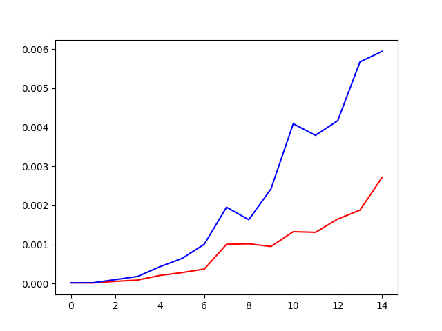

Ugotovimo, da BFS algoritem (rdeča črta) deluje hitreje za velike grafe, kot Djikstra (modra črta).

---
## *Naloga 2*

Konstruirajte nov graf, ki vsebuje le vozlišča od 0 do N.
Vsaki povezavi določite neko pozitivno utež (lahko čisto naključno) in zadevo shranite v novo .txt datoteko. Vrstice naj bodo oblike `u v w(u,v)`, kjer je (u,v) povezava in w(u,v) njena utež.


Napisala sem dve funkciji. Prva funkcija `generiraj_graf(n)` zgenerira graf seznam sosednosti na podlagi števila $n$. Druga `zapisi_txt(ime, graf)` pa glede na željeni naslov txt datoteke zapiše dani graf v prej podani obliki. 

```python
import random

def generiraj_graf(n):
    '''
        Zgenerira in vrne graf kot seznam sosedov za število vozlišč od 0 do n.
        Torej n+1 vozlišč. Uteži so cela števila od 1 do 10.
    '''
    graf=list()
    for vozlisce in range(n+1):
        tab = list()  # tabela sosedov i-tega vozlisca
        for sosed in range(random.randint(1,n+1)):  # vsako vozlišče ima vsaj enega soseda
            tab.append((random.randint(0,n), random.randint(1,10)))  # (sosed, utež)
        graf.append(tab)
    return graf


def zapisi_txt(ime, graf):
    '''
        Zapiše graf v txt datoteko pod imenom ime.txt. Vrstice
        so v obliki `u v w(u,v)`, kjer je (u,v) povezava in w(u,v) njena utež.
        u je začetno in v končno vozlišče povezave.
    '''
    with open(ime + '.txt', 'w') as dat:
        for ind, sosedje in enumerate(graf):
            for sosed in sosedje:
                vrstica = '{} {} {}\n'
                dat.write(vrstica.format(ind, sosed[0], sosed[1]))


g1 = generiraj_graf(49)  # 50 vozlišč = 0, 1, 2,... 49
zapisi_txt('graf_g1', g1)
```

## *Naloga 3*

Implementiranje še Bellman-Fordov algoritem in ga poženite na grafu iz prejšnje naloge. Analiziraje kako velik N iz prejšne naloge morate vzeti, da bo algoritem še deloval v zglednem času.

Bellman-Fordov algoritem je različica Dijskranovega algoritma. Uporabljamo ga, kadar nas zanima pot od enega do i-tega vozlišča. Dovoljene se tudi negativne povezave, ne sme imeti pa negativnih ciklov.

```python
def Bellman_Ford(graf, zacetek, n):
    # n = stevilo vozlisc
    razdalje = [float('Inf')]*n
    razdalje[zacetek] = 0
    for _ in range(n-1):  # st. operacij je za 1 manj kot je vozlisc
        for u, v, w in graf:
            # u = začetek
            # v = konec
            # w = utež na povezavi (u,v)
            if razdalje[u] != float('Inf') and razdalje[u] + w < razdalje[v]:
                # našli smo bližnjico
                razdalje[v] = razdalje[u] + w
    return razdalje

def seznam_povezav_BF(ime_dat):
    '''Iz dane txt datoteke razbere povezave grafa, povezave doda v seznam `tocke` in jih uredi glede na začetna vozlišča.'''
    tocke = list()
    with open(ime_dat, 'r') as file:
        for vrstica in file:
            zacetek, konec, utez = vrstica[:-1].split(' ')
            tocke.append((int(zacetek), int(konec), int(utez)))
    return tocke

graf = seznam_povezav_BF('graf_g1.txt')
sez_razdalj = Bellman_Ford(graf, 0, 50)
print(sez_razdalj)
```

Izhod:
```python
>>> %Run BellmanFord.py
[0, 8, 7, 6, 7, 8, 7, 8, 8, 6, 7, 8, 7, 6, 8, 8, 8, 7, 7, 8, 6, 7, 8, 6, 8, 8, 8, 7, 7, 9, 8, 9, 6, 8, 8, 7, 8, 8, 5, 7, 8, 9, 9, 8, 9, 7, 8, 8, 9, 7]
>>> 
```


---
# Vaje 10

## *Naloga 1*

`NAVODILA NALOGE:`

Simuliraj delovanje (minimalne) kopice. Za vsavljanje je kot operacija število, za brisanje pa x. Za boljšo predstavo nariši kar drevesa.

Operacije: 8,2,1,3,7,6, x, x, 5, x, -3, x.

`MINIMALNA KOPICA:`

Za minimalno kopico velja:

* vrednost očeta je manjša ali enaka vrednosti obeh sinov (starš $\leq$ sin),
* dvojiško drevo je levo poravnano,
* v korenskem vozlišču je najmanjša vrednost drevesa.

Ko vstavljamo novo vozlišče v kopico, ga vedno postavimo kot list najbolj levega na zadnjem nivoju. Nato pogledamo njegovega očeta ter, če ne velja naš pogoj, ju zamenjamo. Tako ponovimo z naslednjim očetom itd., dokler ne pridemo do očeta, ki ima manjšo vrednost. Pri menjavi očeta s sinom, ne potrebujemo preverjati še drugega sinova, saj očeta zamenjamo z nečem še manjšim in s tem ne porušimo veljavnost naših pogojev. Časovna zahtevnost vstavljanja v najslabšem primeru, kadar je vrednost novega vozlišča najmanjša v drevesu, je $O(log n)$, kjer je $n$ število vozlišč v kopici. V najboljšem primeru pa $O(1)$, kadar vstavimo tako veliko število, da nam ni potrebno zamenjati nobenega vozlišča.

Kopica deluje kot vrsta s prednostjo. To pomeni, da vedno jemljemo ven tisto vozlišče, ki ima največjo prioriteto oz. pomembnost. V minimalni kopici je to tisto, z najmanjšo vrednostjo, torej koren drevesa.
Tako ob metodi brisanja elementa, vzamemo ven koren drevesa. Tega nadomestimo z najbolj levim listom ter drevo ponovno pregledamo in zamenjamo vozlišča, da ohranimo pogoje najmanjše kopice. To pomeni, da vstavljeni novi koren zamenjamo z manjšim od njegovih dveh sinov.

`REŠITEV NALOGE 1:`

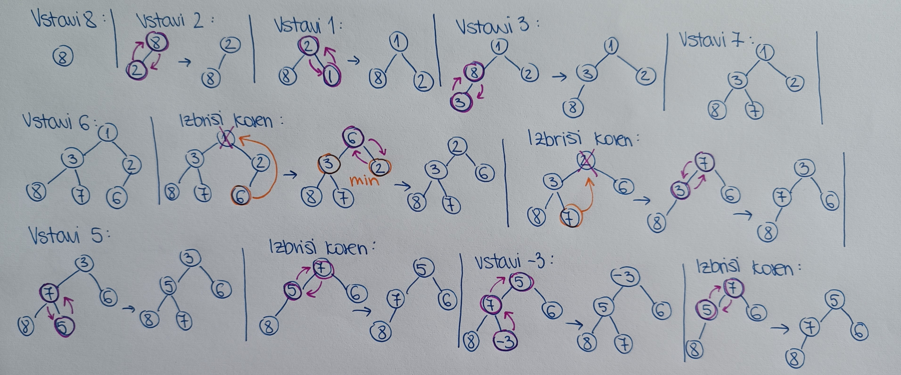


## *Naloga 2*

`NAVODILA NALOGE:`

Predstavi kopico s seznamom in zapiši delovanje pop() in push(x) operacij.

`REŠEVANJE NALOGE:`

Označimo $T$ kot seznam dolžine $n$, ker imamo kopico z $n$-elementi. To bo predstavljalo našo kopico.

$T[i]$ je $i$-to vozlišče

Sinovi od vozlišča $T[i]$ se nahajajo v seznamu na indeksih $2i$ in $2i+1$ ter starš je na $i//2$, če se dogovorimo, da je koren kopice na indeksu $1$. Če pa je koren pri $i=0$, potem sta sinova na $2i+1$ in $2i+2$, starš pa na $(i-1)//2$-tem indeksu.

Z operacijo `pop()` odstranimo koren, z operacijo `push()` pa dodamo novo vozlišče.

```python
def push(T, x):
    '''
        Funkcija v seznam `T`, ki predstavlja minimalno kopico, doda vozlišče `x`.
    '''
    T.append(x)  # dodamo na konec seznama
    i = len(T) - 1  # dobimo indeks od x-a
    stars = i//2  # koren na i=1
    while T[stars] >= T[i]:
        # ker imamo minimalno kopico in je vrednost očeta
        # večja ali enaka od sina, ju zamenjamo
        T[stars], T[i] = T[i], T[stars]
        i = stars
        stars = i//2


def pop(T):
    '''
        Funkcija vrne in odstrani koren dane kopice, predstavljeno kot seznam `T`, in jo popravi tako,
        da ohrani pogoje minimalne kopice.
    '''
    koren = T[1]  # prvi element seznama odmislimo
    T[1] = T[-1]  # koren zamenjamo z najbolj levim listom t.j. zadnji element v seznamu)
    
    T.pop()  # odstranimo zadnji element (to ni ista naša funkcija)
    
    i = 1  # začnemo pri korenu
    levi_sin = 2*i
    desni_sin = 2*i + 1
    while T[i] > T[levi_sin] or T[i] > T[desni_sin]:
        # ponavljamo, dokler ne bo veljalo pravilo za minimalno kopico (starš <= sin)
        # starša zamenjamo z manjšim od sinov
        
        if T[levi_sin] > T[desni_sin]:
            # menjava z desnim sinom
            T[desni_sin], T[i] = T[i], T[desni_sin]
            i = desni_sin
        else:
            # menjava z levim sinom
            T[levi_sin], T[i] = T[i], T[levi_sin]
            i = levi_sin
        
        levi_sin = 2*i
        desni_sin = 2*i + 1
    return koren
```
Časovna zahtevnost je enaka $O(log n)$, saj je čas izvajanja odvisen le od višine drevesa, ki pa je enaka $log n$.


## *Naloga 3*

`NAVODILA NALOGE:`

Kako bi s kopico sortiral seznam? Časovna zahtevnost? Kako in podanega seznama nardiš kopico v O(n) časa.

V kopico bi dali seznam, kar na vzame $n \cdot logn$ časa. Potem bi jemali s kopice ven z operacijo pop(), kar je $log n$ časa. Skupaj je to časovna zahtevnost $O(n \cdot log n)$

