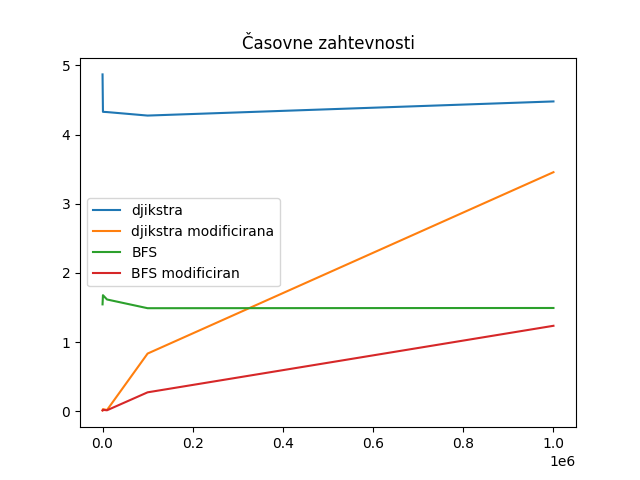

<h1 align="center"> PRVO POROČILO </h1>

**Ime:** Aljaž Lukežič

# Vsebina
* Vaje 5 (15.2.2023)
* Vaje 6 (22.2.2023)
* Vaje 7 (8.3.2023)
* Vaje 8 (8.3.2023)
* Vaje 9 (8.3.2023)
* Vaje 10 (8.3.2023)


<br>

# Vaje 5
**Datum**: 15.3.2023

Na vajah smo rešili nekaj nalog o usmerjenih grafih. Preden smo začeli reševati naloge, smo se morali spomniti kaj pomenijo nekateri pojmi v grafih, kot so pot, sprehod in cikel.<br>
**Sprehod** v grafu je zaporedje točk in povezav $v_0e_1v_1e_2v_2...v_{k-1}e_kv_k$, kjer je $e_i$ povezava med točkama $v_{i-1}$ in $v_i$ za $i ∈ {1,...,k}$.<br>
**Pot** je omejen sprehod, kjer so $v_1,...,v_k$ različne.<br>
**Cikel** je pot, ki je sklenjen sprehod ($v_0 = v_k$).<br>

<br>

Implementirali smo tudi algoritem, ki najde topološko ureditev grafa:
```python
def topo_sort(G):
    '''Vrne topološko ureditev grafa `G`, ki je podan kot seznam sosednosti.'''
    n = len(G)  
    in_deq = [0]*n  # in_deq[i] --- št povezav, ki kaže v i
    for i in range(n):  #vozlišča
        for j in G[i]:    #sosedi
            in_deq[j] += 1
    
    izvori = [i for i in range(n) if in_deq[i] == 0]  #vozlišča, ki niso sosedi nobenemu
    rezultat = []
    
    while izvori:
        izvor = izvori.pop()
        rezultat.append(izvor)
        for sosed in G[izvor]:
            in_deq[sosed] -= 1
            if in_deq[sosed] == 0:
                izvori.append(sosed)  #nima vec sosedov, zato je nov izvor
    
    return rezultat
```
<br>

Prilagam še povezavo do pdf-ja z nalogami, ki smo jih rešili na petih vajah: [povezava do petih vaj](../Datoteke/Vaje5/vaje5.pdf)

<br>

# Vaje 6
**Datum**: 22.3.2023

Na vajah smo ponovili BFS, DFS in Floyd-Warshallov algoritem.<br>
BFS pomeni Breadth first search oziroma iskanje v širino, DFS pa pomeni Depth first search oziroma iskanje v globino.<br>
Spodaj vidimo implemenacijo BFS algoritma:
<br>
```python
from collections import deque  #za vrsto

def BFS(G, u):
    n = len(G)
    obiskani = [False] * n
    q = deque([u])   # zacnemo v u
    while q:
        trenutni = q.popleft()
        if obiskani[trenutni]:
            continue          # smo ga ze obiskali
        obiskani[trenutni] = True
        for sosed in G[trenutni]:
            if not obiskani[sosed]:
                q.push(sosed)      # dodamo soseda na desno stran vrste
```

DFS je podoben, le da namesto vrste uporabimo sklad.

Na vajah smo BFS algoritem tudi modificirali, tako da išče najkrajše poti v neuteženem grafu.<br>

```python
from collections import deque  #za vrsto

def BFS_poti(G, u):
    '''Vrne najkrajše poti v neuteženem grafu G od u do vseh ostalih vozlišč.'''
    n = len(G)
    d = [0]*n  # vse razdalje na začetku nastavimo na 0
    obiskani = [False]*n
    q = deque([(u, 0)])  # drugi element=0 je razdalja i-tega vozlišča do u
    while q:
        trenutni, razdalja = q.popleft()
        if obiskani[trenutni]:
            continue
        else:
            obiskani[trenutni] = True
            d[trenutni] = razdalja
            for sosed in G[trenutni]:
                if not obiskani[sosed]:
                    # soseda dodamo na desno stran vrste
                    q.push((sosed, razdalja + 1))
    return d
```

Na vajah smo predstavili tudi idejo Floyd-Warshallovega algoritma.<br>
Prilagam povezavo do pdf-ja z nalogami, ki smo jih rešili na šestih vajah: [povezava do šestih vaj](../Datoteke/Vaje6/vaje6.pdf)

<br>

# Vaje 7
**Datum**: 29.3.2023

Ponovili smo Floyd-Warshallov algoritem, ki smo ga obravnavali že na prejšnjih vajah.<br>
Najprej nas je zanimalo, kako razberemo najkrajše poti s pomočjo matrike $\prod$, ki jo dobimo z FW algoritmom. V naslednji nalogi smo pogledali, kako najdemo najkrajše poti, če na vozlišča dodamo uteži. Pri tretji nalogi smo premislili, zakaj sprememba v FW algoritmu iz $min$ na $max$ ne najde nujno najdražje poti v grafu. Nato smo rešili tudi zanimivo nalogo. Zanimalo nas je, kako čim bolj ugodno pretvoriti neko količino denarja iz ene v drugo valuto.<br>

Na koncu smo ponovili Dijkstrin algoritem iz predavanj. Napisali smo tudi psevdo kodo.<br>

```python
def dijkstra(G,s):
    '''Vrne najkrajšo pot od s do vseh vozlišč v grafu G'''
    n = len(G)
    D = ["inf"] * n
    P = [None] * n
    D[s] = 0     # D[i] -> razdalja od s do i
    P[s] = s
    obiskani = set()  
    q = Vrsta(V(G))  # v vrsto dodamo še nedodana vozlišča (list[range(n)])
    while len(obiskani) != n:
        c = q.popmin()  # pregledamo vsa vozlisca v q in vrnemo tistega z najmanjsim D[]
        obiskani.add(c)
        for sosed, utez in G[c]:
            if sosed not in obiskani:
                if D[c] + utez < D[sosed]:
                    D[sosed] = D[c] + utez
                    P[sosed] = c
    return D,P
```

Tukaj smo uporabili metodo `popmin()`, ki ima v splošnm časovno zahtevnost $O(n)$. Ugotovili smo, da ima Dijkstrin algoritem časovno zahtevnost $O(n^2)$. Na koncu smo predlagali tudi izboljšavo. Če bi namesto `popmin()` uporabili prioritetno vrsto ali kopico, bi lahko zmanjšali časovno zahtvnost.

Tukaj prilagam pdf datoteko celotnih vaj: [povezava do sedmih vaj](../Datoteke/Vaje7/vaje7.pdf)

<br>

# Vaje 8
**Datum**: 29.3.2023

Rešiti smo morali nekaj nalog, ki se navezujejo na dve datoteki, ki sta bile podane. V eni datoteki je implementacija dijkstrovega algoritma, druga pa je datoteka z informacijami o cestnem omrežju v Texasu. Vozlišča so bodisi križišča oz. končne destinacije povezave pa so ceste med temi vozlišči. Povezave oz. ceste niso utežene so pa usmerjene.

<br>

## Naloga 1

Pri prvi nalogi, smo morali rešiti več problemov s pomočjo dijkstrovega algoritema:

* datoteko `roadNet-TX.txt` smo morali najprej spremeniti v ustrezno podatkovno strukturo grafa.

```python
def preberi_graf(ime_datoteke):
    '''Iz datoteke prebere povezave grafa in jih zapiše v pravilno obliko (za G)'''
    with open(ime_datoteke, 'r') as f:
        vrstice = f.readlines()
    
    # poiscemo vse povezave
    povezave = []
    for vrstica in vrstice[4:]:   #prve stiri vrstice so drugacne
        x, y = vrstica.strip().split()
        povezave.append((int(x), int(y)))
    
    # poiščemo koliko je vseh vozlišč (največje + 1)
    st_vozlisc = max(max(povezava) for povezava in povezave) + 1    

    # naredimo seznam sosedov (G)
    seznam_sosedov = [[] for _ in range(st_vozlisc)]
    for u, v in povezave:
        seznam_sosedov[u].append((v, 1))  # vsa vozlisca imajo tezo 1

    return seznam_sosedov
```

<br>

* poiščete najkrajše razdalje od vozlišča $100$ do vseh ostalih.

S pomočjo prej definirane funkcije `preberi_graf(ime_datoteke)` naredimo graf G, ki je tak, da ga sprejme funkcija `djikstra(G, s)`. Za s vzamemo $100$, saj nas zanimajo najkrajše razdalje od vozlišča s do vseh ostalih.

```python
G = preberi_graf("roadNet-TX.txt")
razdalje, poti = djikstra(G, 100)
```
Sedaj izpišimo najkrajše razdalje od vozlišča $100$ do prvih 9 vozlišč (začnemo z vozliščem 0).

```python
>>> print(razdalje[:10])  # pogledamo samo prvih 10
[10, 11, 9, 10, 10, 11, 12, 10, 9, 10]
```
<br>

* Koliko je razdalja $dG(100,100000)$?

```python
>>> print(razdalje[100000])
240
```

Vidimo, da je razdalja od vozlišča $100$ do vozlišča $100000$ enaka $240$.

<br>

* Katero vozlišče je najbolj oddaljeno od vozlišča $100$?

```python
>>> naj_razdalja = max(razdaljeDo)
>>> print(naj_razdalja)
717
>>> najbolj_oddaljeno_vozlisce = razdaljeDo.index(naj_razdalja)
>>> print(najbolj_oddaljeno_vozlisce)
1389039
```

Od vzlišča 100 je najbolj oddaljeno vozlišče $1389039$. Razdalja je $717$.

<br>

* Koliko vozlišč je dosegljivih iz vozlišča $100$?

Pogledati moramo, koliko vozlišč ima končno razdaljo iz vozlišča $100$. Torej, razdalja ne sme biti enaka -1.

```python
>>> st_dosegljivih = sum(1 for razdalja in razdaljeDo if razdalja != -1)
>>> print(st_dosegljivih)
1351137
```

Vidimo, da je iz vozlišča $100$ dosegljivih $1351137$ vozlišč.

<br>

## Naloga 2

 Sedaj implementirajmo še BFS algoritem, ki poišče dolžine najkrajših poti od s do vseh ostalih vozlišč. 
 
 ```python
from collections import deque

def bfs(G, s):
    """
    Funkcija sprejme graf G predstavljen
    s seznamom sosednosti ter začetno vozlišče s.
    Torej G[i] = [(v_1, w_1), ... (v_d, w_d)],
    kjer je (i, v_k) povezava v grafu z utežjo w_k.
    Vrne seznam razdaljeDo, ki predstavlja najkrajšo pot od vozlišča s
    do vseh ostalih.
    Vrne tudi seznam poti, ki predstavlja drevo najkrajših poti od s
    do vseh ostalih vozlišč.
    """
    n = len(G)
    razdalje = [-1] * n
    #vsak el poti[v] predstavlja starsa v-ja na najkrajsi poti od s do v
    poti = [-1] * n    #poti od s do vseh ostalih vozlisc
    razdalje[s] = 0
    q = deque([s])
    while q:
        u = q.popleft()
        # teze ne uposteamo 
        for v, _ in G[u]:   # poglej sosednje vozlisce (v),tezo ignoriraj
            if razdalje[v] == -1:
                razdalje[v] = razdalje[u] + 1
                poti[v] = u
                q.append(v)
    return razdalje, poti
 ```

Funkcijo `bfs(G, s)` testiramo na našem omrežju. Dobiti moramo enake rezultate kot pri dijkstri. 

Najprej spet ustvarimo graf G.

```python
def preberi_graf(ime_datoteke):
    '''Iz datoteke prebere povezave grafa in jih zapiše v pravilno obliko (za G)'''
    with open(ime_datoteke, 'r') as f:
        vrstice = f.readlines()
    
    povezave = []
    for vrstica in vrstice[4:]:   #prve stiri vrstice so drugacne
        x, y = vrstica.strip().split()
        povezave.append((int(x), int(y)))

    # poiščemo koliko je vseh vozlišč (največje + 1)
    st_vozlisc = max(max(povezava) for povezava in povezave) + 1    
    
    # naredimo seznam sosedov (G)
    seznam_sosedov = [[] for _ in range(st_vozlisc)]
    for u, v in povezave:
        seznam_sosedov[u].append((v, 1))  # vse povezave imajo ceno 1

    return seznam_sosedov
```

Sedaj preverimo vse 4 primere.

```python
>>> G = preberi_graf("roadNet-TX.txt")
>>> razdaljeDo, poti = bfs(G, 100)

#a
>>> print(razdaljeDo[:10])  # prvih 10
[10, 11, 9, 10, 10, 11, 12, 10, 9, 10]

#b
>>> print(razdaljeDo[100000])
240

#c
>>> naj_razdalja = max(razdaljeDo)
>>> print(naj_razdalja)
717
>>> najbolj_oddaljeno_vozlisce = razdaljeDo.index(naj_razdalja)
>>> print(najbolj_oddaljeno_vozlisce)
1389039

#d
>>> st_dosegljivih = sum(1 for razdalja in razdaljeDo if razdalja != -1)
>>> print(st_dosegljivih)
1351137
```

Vidimo, da so rezultati isti kot pri dijkstri, kar smo tudi želeli.

<br>

## Naloga 3

Pri tretji nalogi moramo dodelati oba algoritma, tako da dodamo nov vhodni podatek t, ki predstavlja končno vozlišče. Algoritma torej vrneta razdaljo med sin t v grafu ter pot (kot drevo) med njima. Delujeta tako, da se ustavita takoj ko najdemo željeno pot.

### Modificiran Dijkstrin algoritem

```python
def djikstra_modificiran(G, s, t):
    """
    Funkcija sprejme usmerjen in utežen graf G predstavljen
    s seznamom sosednosti ter začetno vozlišče s in končno vozlišče t.
    Vrne dolžino najkrajše poti od vozlišča s do vozlišča t.
    """
    n = len(G)

    # Nastavimo začetne vrednosti za sezname obiskani, razdaljaDo in poti.
    obiskani = [False] * n
    razdaljeDo = [float('inf')] * n
    razdaljeDo[s] = 0

    # Na vrsto dodamo trojico (d, v), kjer je:
    # v vozlišče, d razdalja do njega
    Q = [(0, s)]

    while Q:

        # Vzamemo minimalen element iz vrste
        # heapq.heappop(Q) odstrani element iz seznama  Q, ter pri tem ohranja
        # lastnost kopice : seznam Q tretira kot dvojiško drevo!
        razdalja, u = heapq.heappop(Q)

        # če smo prišli do ciljnega vozlišča, vrnemo dolžino poti
        if u == t:
            return razdalja

        # če je že obiskan, nadaljujemo.
        if obiskani[u]:
            continue

        # obiščemo vozlišče ter nastavimo njegovo razdaljo
        obiskani[u] = True

        # gremo čez vse sosede in dodamo potrebne elemente na vrsto.
        for (v, teza) in G[u]:
            if not obiskani[v]:
                heapq.heappush(Q, (razdalja + teza, v))

    # če ciljnega vozlišča nismo našli, vrnemo -1
    return -1
```


### Modificiran BFS algoritem

```python
def bfs_modificiran(G, s, t):
    """
    Funkcija sprejme graf G predstavljen
    s seznamom sosednosti ter začetno vozlišče s in končno vozlišče t.
    Torej G[i] = [(v_1, w_1), ... (v_d, w_d)],
    kjer je (i, v_k) povezava v grafu z utežjo w_k.
    Vrne razdaljo med vozliščema s in t v grafu ter pot (kot drevo) med njima.
    """
    n = len(G)
    razdalje = [-1] * n
    # vsak el. poti[v] predstavlja starsa v-ja na najkrajsi poti od s do v
    poti = [-1] * n    # poti od s do vseh ostalih vozlisc
    razdalje[s] = 0
    q = deque([s])
    while q:
        u = q.popleft()
        if u == t:
            break
        # teze ne uposteamo 
        for v, _ in G[u]:   # poglej sosednje vozlisce (v),tezo ignoriraj
            if razdalje[v] == -1:
                razdalje[v] = razdalje[u] + 1
                poti[v] = u
                q.append(v)
    if razdalje[t] == -1:
        return None, None
    # Sestavimo pot od t do s glede na starše, ki jih beležimo v seznamu poti
    pot = [t]
    while pot[-1] != s:
        pot.append(poti[pot[-1]])
    pot.reverse()
    return razdalje[t], pot
```

<br>

## Naloga 4

Napisati moramo funkcijo, ki sprejme začetno vozlišče s, končno vozlišče t ter drevo najkrajših poti ter vrne najkrajšo pot med s iin t v obliki seznama.

```python
def najkrajsa_pot(s, t, drevo_najkrajsih):
    pot = [t]
    while pot[-1] != s:
        pot.append(drevo_najkrajsih[pot[-1]])
    return list(reversed(pot))
```

Sedaj rekonstruiramo najkrajšo pot med vozliščem 100 in 100000.

```python
>>> G = preberi_graf('roadNet-TX.txt')
>>> razdalje, poti = djikstra(G, 100)
>>> pot = najkrajsa_pot(100, 100000, poti)
>>> print(pot[:10])
[100, 101, 103, 104, 1635, 1636, 1653, 1664, 1680, 1866]
```

<br>

## Naloga 5

Analizirati moramo časovne zahtevnosti algoritmov. Primerjati hitrost med djikstro in BFS-jem. Prav tako moramo analizirati razliko med djikstro, ki izračuna najkrajše poti od s do vseh ostalih ter jo primerjaj z tisto verzijo iz Naloge 3.

Teoretična časovna zahtevnost BFS algoritma je $O(V+E)$, kar pomeni, da je odvisen samo od števila vozlišč (V) in povezav (E) v grafu. Dijkstrov algoritem ima časovno zahtevnost $O((E+V)\log V)$, saj uporablja kopico, ki ima pri vsaki operaciji dodajanja ali brisanja vozlišča časovno zahtevnost $O(\log V)$. Modificiran dijkstrov algoritem, ki izračuna najkrajšo pot samo med začetnim vozliščem $s$ in končnim vozliščem $t$ hrani samo najkrajšo pot od $s$ do $t$. Informacije o vseh ostalih najkrajših poteh ne hrani. Zaradi tega je ta verzija običajno malo hitrejša.

Spodaj prilagam graf, ki prikazuje izmirjene časovne zahtevnosti vseh štirih funkcij. Narisal sem ga v datoteki `primerjava_cz.py`.





Iz grafa lahko vidimo, da je BFS algoritem hitrejši od dijkstrovega, tudi modificiran BFS je hitrejši od modificiranega dijkstrovega algoritma. 

Če bi nas zanimale najkrajše poti od $s$ do $t_1,t_2,...,t_k$ v neuteženem grafu, bi torej uporabili BFS algoritem.

Če bi bil graf utežen, bi izmed teh dveh algoritmov uporabili Dijkstrov algoritem. Časovna zahtevnost bi bila $O((E+V)\log V)$, pri čemer bi v algoritmu večkrat izračunali najkrajšo pot od $s$ do posameznega vozlišča $t_i$. Število ciljnih vozlišč $k$ bi torej vplivalo na to, kako pogosto se izvaja izračun najkrajše poti in posledično na celotno časovno zahtevnost algoritma.


<br>

# Vaje 9

## Naloga 2

Konstruirati moramo nov graf, ki vsebuje le vozlišča od 0 do N.
Vsaki povezavi moramo določiti neko pozitivno utež (lahko čisto naključno) in zadevo shraniti v novo .txt datoteko. Vrstice naj bodo oblike u v w(u,v), kjer je (u,v) povezava in w(u,v) njena utež.

```python
import random

def generiraj_graf(n):
    graf = [[] for _ in range(n+1)]
    for u in range(n+1):
        for v in range(n+1):
            if u != v and random.random() < 0.2:   # z 20% moznostjo bomo dodali vozlisce kot soseda
                w = random.randint(1, 10)
                graf[u].append((v, w))
    return graf

def zapisi_txt(ime, graf):
    with open(ime + '.txt', 'w') as dat:
        for u, sosedje in enumerate(graf):
            for v, w in sosedje:
                vrstica = '{} {} {}\n'.format(u, v, w)
                dat.write(vrstica)

G = generiraj_graf(49)
zapisi_txt('graf_G', G)
```

<br>

## Naloga 3

Implementirati moramo še Bellman-Fordov algoritem in ga pognati na grafu iz prejšnje naloge. Analizirati mormo, kako velik N iz prejšne naloge moramo vzeti, da bo algoritem še deloval v zglednem času.

Spodaj je Bellman-Fordov algoritem.

```python
def bellman_ford(graf, zacetek):
    n = len(graf)
    razdalje = [float('inf')] * n
    razdalje[zacetek] = 0

    for _ in range(n - 1):
        for u in range(n):
            for v, w in graf[u]:
                if razdalje[u] != float('inf') and razdalje[u] + w < razdalje[v]:
                    razdalje[v] = razdalje[u] + w

    # dodaten pregled za odkrivanje negativnih ciklov
    for u in range(n):
        for v, w in graf[u]:
            if razdalje[u] != float('inf') and razdalje[u] + w < razdalje[v]:
                return None

    return razdalje
```

Sedaj ga lahko poženemo na grafu iz druge naloge.

```python
with open('graf_G.txt', 'r') as dat:
    graf = [[] for _ in range(50)]
    for vrstica in dat:
        u, v, w = map(int, vrstica.strip().split())
        graf[u].append((v, w))

    zacetek = 0
    razdalje = bellman_ford(graf, zacetek)
    print(razdalje)
```

Program vrne:

```python
>>> %Run belman_ford_naloga3.py
[0, 7, 7, 4, 5, 5, 2, 7, 7, 3, 6, 6, 7, 10, 7, 5, 6, 6, 6, 7, 6, 6, 6, 7, 6, 8, 7, 6, 6, 3, 6, 2, 7, 5, 8, 5, 5, 6, 5, 9, 9, 8, 7, 1, 4, 3, 3, 10, 6, 8]
```

Kako velik N iz prejšne naloge moramo vzeti, da bo algoritem še deloval v zglednem času sem poiiskušal določiti v datoteki `iskanje_maxN.py` ampak mi ni najbolje uspelo.


<br>

# Vaje 10

Na teh vajah smo simulirali delovanje (min) kopice. Kopico smo predstavili s seznamom in zapisali delovanje pop() in push(x) operacij. 

```python
def push(T,x):
    T.(x))
    i = len(T)-1
    oce = i // 2
    while T[oce] > T[i]:
        T[oce], T[i] = T[i],T[oce]
        i = oce
        oce = i // 2
```

```python
def pop(T): #odstranimo koren
    koren = T[1]
    T[1] = T[-1]
    T.pop()
    i = 1
    levi_sin = 2 * i
    desni_sin = 2 * i + 1
    while T[i] > T[levi_sin] or T[i] > T[desni_sin]:
        if T[levi_sin] > T[desni_sin]:
            T[desni_sin], T[i] = T[i], T[desni_sin]
            i = desni_sin
            levi_sin = 2 * i
            densi_sin = 2 * i + 1
        else:
            T[levi_sin], T[i] = T[i], T[levi_sin]
            i = levi_sin
            levi_sin = 2 * i
            desni_sin = 2 * i + 1

    return koren
```

Ugotovimo, da je časovna zahtevnost funcij `pop()` in `push(x)` enaka $O(\log n)$.

Na koncu smo pogledali tudi, kako bi s kopico sortirali seznam.

Prilagam še povezavo do pdf-ja z nalogami, ki smo jih rešili na desetih vajah: [povezava do desetih vaj](../Datoteke/Vaje10/vaje10.pdf)