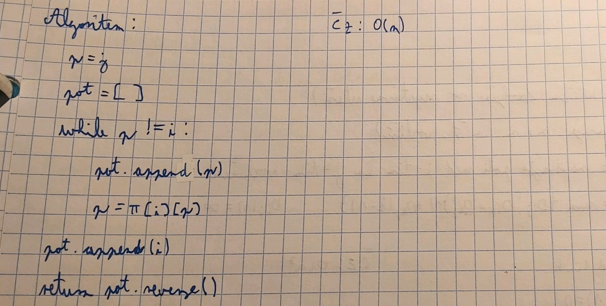
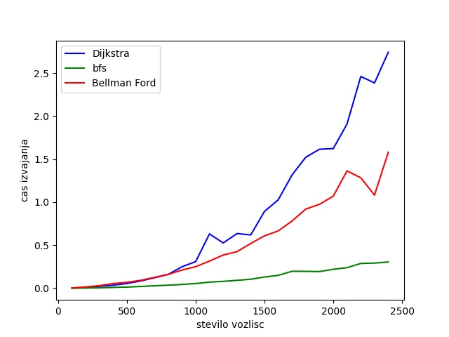
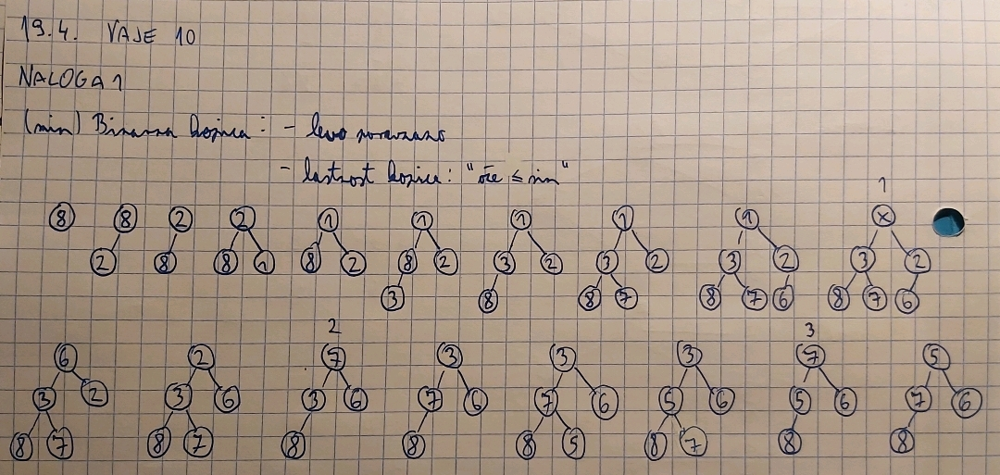
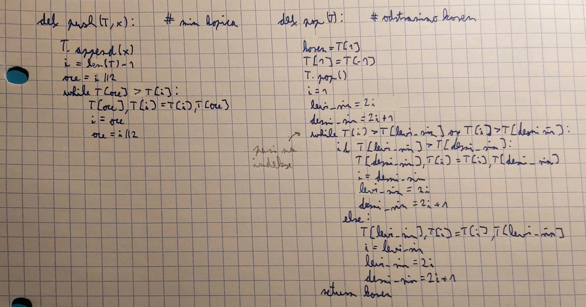

# Poročilo za vaje
**Ime:** Jure Lilija

## Vsebina
* Vaje 5 (15.3.2023)
* Vaje 6 (22.3.2023)
* Vaje 7 (29.3.2023)
* Vaje 8 (5.4.2023)
* Vaje 9 (12.4.2023)
* Vaje 10 (19.4.2023)

## Vaje 5
**Datum**: 15.3.2023

Na tablo smo reševali naloge s katerimi smo spoznavali grafe.

### Komentarji in opombe

Vaje so potekale enako kot ponavadi, ko rešujemo na tablo. Ta način dela mi je všeč.

### Naloga 1

<figure>

</figure>

### Naloga 2

<figure>

</figure>

### Naloga 3

<figure>

</figure>

## Vaje 6
**Datum**: 22.3.2023

Na tablo smo reševali naloge s katerimi smo spoznavali algoritme za iskanje poti v grafih.

### Komentarji in opombe

Vaje so potekale enako kot ponavadi, ko rešujemo na tablo.

### Naloga 1

<figure>

</figure>

### Naloga 2

<figure>

</figure>

### Naloga 3

<figure>

</figure>

## Vaje 7
**Datum**: 29.3.2023

Na tablo smo nadaljevali obravnavo algoritmov, kot sta FW in Dijkstra.

### Komentarji in opombe

Vaje so potekale enako kot ponavadi, ko rešujemo na tablo.

### Naloga 1

<figure>

</figure>
<figure>

</figure>

### Naloga 2

<figure>

</figure>

### Naloga 3

<figure>

</figure>

### Naloga 4

<figure>

</figure>
<figure>

</figure>


### Naloga 5

<figure>

</figure>
<figure>

</figure>

## Vaje 8
**Datum**: 5.4.2023

Na teh vajah smo programirali na računalnikih. Pri nalogah smo uporabljali Dijkstro in BFS algoritem. Del nalog smo reševali na naslednjih vajah, vendar bom dal vseh 5 nalog pod te vaje, tako kot kažejo navodila.

### Komentarji in opombe

Vaje so bile kar zahtevne. Na začetku je šlo zelo počasi in se mi je velikokrat zatikalo, proti koncu je pa šlo bolje.

Koda:
1. naloga:
```python
from dijkstra import *
dat = open('roadNet-TX.txt', 'r')
i = 1
g = []
n = -5
for vrstica in dat:
    if i>4:
        vrstica=vrstica.split()
        v1,v2 = int(vrstica[0]), int(vrstica[1])
        n = max(n,v1,v2)
        g.append((v1,v2))
    i +=1
dat.close()
graf = [[] for _ in range(n+1)]
for u,v in g:
    graf[u].append((v,1))

D,p = dijkstra(graf,100)
print(D[100000])
print(D.index(max(D)))
print(sum(x>=0 for x in D))
```

2. naloga:
```python
from collections import deque
def bfs(G,s):
    n = len(G)
    d = [0]*n
    obiskani = [False]*n
    poti = [None] * n
    q = deque([(s,0,s)])
    while q:
        trenutni, razdalja, p = q.popleft()
        if obiskani[trenutni]:
            continue
        obiskani[trenutni] = True
        d[trenutni] = razdalja
        poti[trenutni] = p
        for sosed,cena in G[trenutni]:
            if not obiskani[sosed]:
                q.append((sosed, razdalja+1, trenutni))
    return d, poti
```

3. naloga:
```python
import heapq
from collections import deque
def bfs_nov(G,s,t):
    n = len(G)
    d = [0]*n
    obiskani = [False]*n
    poti = [None] * n
    q = deque([(s,0,s)])
    while q:
        trenutni, razdalja, p = q.popleft()
        if obiskani[trenutni]:
            continue
        obiskani[trenutni] = True
        d[trenutni] = razdalja
        poti[trenutni] = p
        if trenutni == t:
            break
        for sosed,cena in G[trenutni]:
            if not obiskani[sosed]:
                q.append((sosed, razdalja+1, trenutni))
    return d, poti

def dijkstra_nov(G, s, t):
    n = len(G)
    obiskani = [False] * n
    razdaljeDo = [-1] * n
    poti = [None] * n
    Q = [(0, s, s)]
    while Q:
        razdalja, u, p = heapq.heappop(Q)
        if obiskani[u]:
            continue
        obiskani[u] = True
        razdaljeDo[u] = razdalja
        poti[u] = p
        if u == t:
            break
        for (v, teza) in G[u]:
            if not obiskani[v]:
                heapq.heappush(Q, (razdalja + teza, v, u))
    return razdaljeDo, poti
```

4. naloga:
```python
from bfs import *
from naloga3 import *
def najkrajsa_pot(s,t):
    sez = []
    predzadnji = p[t]
    sez.append(predzadnji)

    while predzadnji != s:
        predzadnji = p[predzadnji]
        sez.append(predzadnji)
    sez.reverse()
    return sez
print(najkrajsa_pot(100,100000))
```

### Naloga 5

BFS algoritem je hitrejši, saj gre samo enkrat čez vsako vozišče in vsako njegovo povezavo. Tako da ima BFS časovno zahtevnost $O(|E|+|V|)$. Pri Dijkstri pa imamo časovno zahtevnost $O(|E|*log(|E|))$, saj moramo še v vsakem koraku iskati najkrajšo pot do vozlišča, ki ga še nismo pregledali. 
\
Dijkstra, ki išče pot do določenega vozlišča je hitrejši, saj se algoritem ustavi, ko najde iskano vozlišče. 
\
Če nas bi pa zanimale najkrajše poti od vozlišča s do k vozlišč, bi pa rekel, da manjši kot je k, bolj bi se splačalo uporabljati Dijkstro. Pri večjih k-jih pa BFS.

## Vaje 9
**Datum**: 12.4.2023

Nadaljevali smo osme vaje. Najprej smo reševali naloge, ki nam jih ni ratalo rešiti prejšnjič. Nato pa smo sestavili nov graf in na njem iskali najkrajše poti s pomočjo Bellman-Fordovega algoritma.

### Komentarji in opombe

Enako kot prejšnje so se mi zdele tudi te kar zahtevne.

Koda:
```python
def bellman_ford(G, s):
    n = len(G)
    razdalja = [float("inf")] * n
    predhodnik = [None] * n
    razdalja[s] = 0
    for _ in range(n):
        sprememba = False
        for i in range(n):
            for j in range(len(G[i])):
                do, utez = G[i][j]
                trenutna = razdalja[i] + utez
                if trenutna < razdalja[do]:
                    razdalja[do] = trenutna
                    predhodnik[do] = i
                    sprememba = True
        if not sprememba:
            break
    for i in range(n):
        for j in range(len(G[i])):
            do, utez = G[i][j]
            if razdalja[i] + utez < razdalja[do]:
                print("Graf ima negativni cikel!")
                return
    return razdalja, predhodnik
```
Sestava grafa in testiranje časovne zahtevnosti algoritmov:
```python
import random
#n = int(input('Število vozlišč: '))
def novi_graf(n):
    with open("nov_graf.txt", "w") as f:
        for i in range(n):
            j = random.randint(1, n//2)
            for k in range(j):
                do = random.randint(0, n-1)
                while do == i:
                    do = random.randint(0, n-1)
                utez = random.randint(1, 20)
                line = str(i) +' '+ str(do) +' '+ str(utez)
                f.write(line)
                f.write('\n')
    f.close()

    nov_graf = [[] for _ in range(n)]
    with open('nov_graf.txt', 'r') as f:
        vrstice = f.readlines()
        for vrstica in vrstice:
            podatki = vrstica.strip().split()
            od = int(podatki[0])
            do = int(podatki[1])
            utez = int(podatki[2])
            nov_graf[od].append((do, utez))
    return nov_graf

from bellman_ford import *
from dijkstra import *
from bfs import *
import time
from matplotlib import pyplot as plt

def izmeri_cas(fun, G, s):
    zacetek = time.time()
    x = fun(G, s)
    konec = time.time()
    return konec - zacetek

def oceni_potreben_cas(fun, G, s, k):
    vsota = 0
    for i in range(k):
        vsota += izmeri_cas(fun, G, s)
    povprecje = vsota / k
    return povprecje

st_vozlisc = list()
g_dij = list()
g_bfs = list()
g_bellman = list()
for i in range(1,25):
    st_vozlisc.append(i*100)
    g_dij.append(oceni_potreben_cas(dijkstra, novi_graf(i*100), 1, 3))
    g_bfs.append(oceni_potreben_cas(bfs, novi_graf(i*100), 1, 3))
    g_bellman.append(oceni_potreben_cas(bellman_ford, novi_graf(i*100), 1, 3))
plt.plot(st_vozlisc, g_dij, 'b', label = "Dijkstra")
plt.plot(st_vozlisc, g_bfs, 'g', label = "bfs")
plt.plot(st_vozlisc, g_bellman, 'r', label = "Bellman Ford")
plt.xlabel('stevilo vozlisc')
plt.ylabel('cas izvajanja')
plt.legend()
plt.show()
```
<figure>

</figure>

### Naloga 3
Časovna zahtevnost Bellman-Ford algoritma je O(V*E). Tako da, če ima graf dovolj povezav se bo čas algoritma zelo hitro večal. V mojem primeru ima vozlišče v grafu v povprečju n/4 povezav. Torej se čas veča kubično. Pri 8000 vozliščih je tako potrebno že več kot 10 sekund, da najdemo vse najkrajše poti.

## Vaje 10
**Datum**: 19.4.2023

Na teh vajah smo se vrnili nazaj k reševanju na tablo. Spoznavali smo kopico.

### Komentarji in opombe

Vaje so mi bile zanimive.

### Naloga 1

<figure>

</figure>

### Naloga 2

<figure>

</figure>
<figure>

</figure>

### Naloga 3

<figure>

</figure>