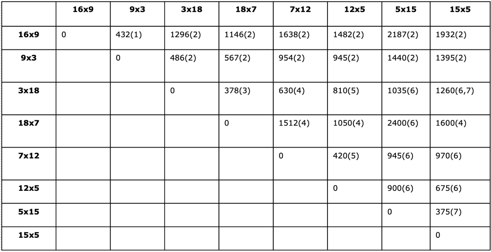

# Prvo poročilo za vaje
**Ime:** Anej Mužič

## Vsebina
* Vaje 1 (15.2.2023)
* Vaje 2 (22.2.2023)
* Vaje 3 (1.3.2023)
* Vaje 4 (8.3.2023)

## Vaje 1
**Datum:** 15.2.2023

Za uvodu smo definirali funkcijo O(n). Povedali smo nekaj osnovnih lastnosti ter si ogledali njej graf. Predstavili smo nekaj osnovnih podatkovnih struktur v pythonu in njihove časovne zahtevnosti. Nato smo reševali naloge iz dinamičnega programiranja na programu Tomo.

### Komentarji in opombe
Na vajah mi je všeč to, da stvari, ki so zapletene, zelo natačno in podrobno razložimo.

### Naloga 1
Ogledali smo si časovne zahtevnosti osnovnih operacij na različnih podatkovnih strukturah. Rešitve smo zapisali v tabelo:

| Podatkovna struktura | Dodaj(1)    | Dodaj(i)    | Dodaj(n)    | Dostop      | x in        | briši(0)    | briši(i)    | briši(n)    | 
| -------------------- | ----------- | ----------- | ----------- | ----------- | ----------- | ----------- | ----------- | ----------- |
| seznam               | O(n)        | O(n)        | O(1)        | O(1)        | O(n)        | O(1)        | O(n)        | O(n)        |
| množica/slovar       | O(1)        | O(1)        | O(1)        | O(1)        | O(1)        | O(1)        | O(1)        | O(1)        |
| verižni seznam       | O(1)/O(n)   | O(1)/O(n)   | O(1)/O(n)   | O(n)        | O(n)        | O(1)/O(n)   | O(1)/O(n)   | O(1)/O(n)   |

### Naloga 2
Na programu Tomo smo reševali nalogo Žabica iz sklopa dinamično programiranje. Naloge smo se najprej lotili z top-down pristopom, torej z rekurzijo. Program smo izboljšali z memoizacijo. Za domačo nalogo smo nalogo rešiti še z bottom-up pristopom.

Koda:
```python
def zabica(mocvara):
    '''Vrne stevilo korakov potrebnih, da zabica odskaklja iz mocvare.'''
    
    def skaci(i, e):
        ''' '''
        if i >= len(mocvara):
            return 0
        if (i, e) in memo:
            return memo[(i, e)]
        nova_energija = e + mocvara[i]
        min_skokov = min(skaci(i+k, nova_energija-k) for k in range(1, nova_energija+1))
        memo[(i, e)] = 1 + min_skokov
        return memo[(i, e)]
    
    memo = {}
    return skaci(0, 0)
    
    return memo(n, w)
```

Primer:
```python
>>> zabica([2, 4, 1, 2, 1, 3, 1, 1, 5])
3
```

## Vaje 2
**Datum:** 22.2.2023

Ponovili smo problem 0/1 nahrbtnika. Ukvarjali smo se z Bellmanovo enačbo ter z $S$ in $Z$ množicami. 

### Naloga 1


Rešili smo naslednja vprašanja v zvezi z $S$ in $Z$ množicami:
* Pri prepisu množice Z5 je pri natanko enem paru prišlo do napake. Kateri par je napačen in 
kakšen bi moral biti? Opiši, kako lahko napako ugotovimo, ne da bi šli Z5 računati na novo.

>Napačen je  5-ti predmet (45,6).
>
>Napako lahko razberemo s pomočjo dejstva, da mora biti množica Z5 naraščujoča.
>
>Pravilni odgovor je **(72,16)** namesto (72, 20)

* Če imamo na voljo 160 enot prostora, kakšna je optimalna vrednost nahrbtnika?

>V S8 pogledamo največji par (w,c), kjer še velja w <= 160. To je par (153,40). Iz tega sledi, da je optimalna vrednost 40.

* Koliko neizkoriščenega prostora nam ostane, če optimalno napolnimo nahrbtnik velikosti
110 s prvimi petimi predmeti. Kakšna je ta optimalna vrednost polnitve? Opiši vse možne
načine, kako dosežemo to optimalno vrednost!

>Pogledamo v S5. Zanima nas par, kjer je razlika 110 - w hkratni najmanjša in pozitivna.
>
>Tak par je (99, 26). Neizkoriščen prostor je potem enak rezultatu izraza 110 - 99, to pa je ravno 11.
>

* Skiciraj graf funkcije, ki pokaže, kako se v odvisnosti od razpoložljivega prostora spreminja
optimalna vrednost nahrbtnika, če imamo na voljo prvih 6 predmetov in 6. predmet
moramo dati v nahrbtnik.


* Ugotovili smo, da imamo na voljo še en predmet, in sicer velikosti 15 in vrednosti 4 (torej je
na voljo 9 predmetov). Kakšna je optimalna vrednost nahrbtnika, ki ima 180 enot prostora?
Opiši vse možne načine, kako dosežemo to optimalno vrednost!

**Prvi način**
>Izračunamo množico Z9.
>
>Z9 = S8 ++ (15,4) = [(15,4), (24,9), (26, 10), (35,15),...]
>
>S9 = $Z9 U S8$
>
>Iz S9 razberemo rezultat.

**Drugi način**
>Optimalno rešitev izračunamo s pomočjo Bellmanove enačbe.
>
>$G(9,180) = max(G(8,180), G(9, 165) + 4)$
>
>Iz Bellmanove enačbe sledi, da je optimalna rešitev 44.

### Naloga 2
Na tablo smo rešili naslednji problem. Na voljo imamo  seznam pozitivnih naravnih števil $sez$ in naravno število $S$.
Zanima nas, ali lahko $S$ zapišemo kot vsoto števil iz $sez$.

Recimo, da imamo seznam `sez=[3, 34, 4, 12, 5, 2]`, `S = 9`, ki vrne `True`, saj je $4 + 5 = 9$

Zapišemo Bellmanovo enačbo in oceni časovno zahtevnost.

$vsota(i,s) = vsota(i-1, s-s_i) :: or :: vsota(i-1,s)$

Imao dve možnosti, in sicer da vzamemo i-ti element ali pa ga ne vzamemo.

Robni primeri:

* $vsota(0,0) =$ `True` 
* $vsota(i,0) =$ `False`

## Vaje 3
**Datum:** 1.3.2023

Tokratne vaje so potekale nekoliko drugače. Izvedli smo neke vrste tekmovanje. Razdelili smo se v pare in reševali
naloge v zvezi z 0/1 nahrbtnikom na programu Tomo. Ekipa, ki je rešila največ nalog v najmanjšem možnem času je zmagala.

### Komentarji in opombe
Všeč mi je bilo, da so vaje potekale v parih, saj se tako lahko več naučimo.

### Navodilo
Trgovec želi iz Evrope v Ameriko spravit večjo količino predmetov. Pri tem ima na razpolago tovorno letalo, ki pa lahko prenese le omejeno količino blaga. Predmete predstavimo s seznamom elementov oblike (ci,vi), kjer ci predstavlja ceno i-tega predmeta, 
vi pa njegovo težo.

#### Podnaloga 1
Potrebno je implementirat funkcijo `optimalni_tovor(predmeti, w)`, ki vrne največjo skupno ceno predmetov, ki jih lahko trgovec 
natovori na letalo z maksimalno nosilnostjo $W$.

Koda:
```python
from functools import lru_cache
def optimalni_tovor(predmeti, w):
    '''Vrne najvecjo skupno ceno predmetov, ki jih lahko trgovec natovori na
        letalo z maksimalno nosilnostjo "W".'''
    
    n = len(predmeti)
    
    @lru_cache(maxsize=None)
    def memo(i, W):
        # Nimamo letala
        if W < 0:
            return float("-inf")
        # Nimamo prostora ali nimamo predmetov
        if W == 0 or i == 0:
            return 0
        # i-ti predmet vzamemo ali pa ga ne vzamemo
        neVzamemo = memo(i-1, W)
        vzamemo = memo(i-1, W-predmeti[i-1][1]) + predmeti[i-1][0]
        return max(neVzamemo, vzamemo)
    
    return memo(n, w)
```

Primer:
```python
>>> optimalni_tovor([(2,3), (4,4), (5,4), (3,2), (1,2), (15, 12)], 7)
8
```

#### Podnaloga 2
Potrebno je implementirati funkcijo `optimalni_predmeti(predmeti, W)`, ki vrne seznam predmetov ki dosežejo največjo vrednost, 
če lahko na letalo natovorimo skupno težo največ $W$. Če je možnosti več, naj funkcija vrne katerokoli možnost (vrednost).

Koda:
```python
def optimalni_predmeti(predmeti, W):
    '''Vrne seznam predmetov, ki dosežejo najvecjo vrednost, ce lahko
        na letalo natovorimo skupno tezo najvec "W".'''
    
    @lru_cache(maxsize=None)
    def najboljsi(i, w):
        
        if w < 0:
            return float("-inf"), 0
        
        if i == 0 or w == 0:
            return 0, 0
        
        neVzamemo, _ = najboljsi(i-1, w)
        vzamemo, _ = najboljsi(i-1, w-predmeti[i-1][1])
        
        # Tu se odlocimo, vzamemo predmet i samo takrat ko se nam dejansko splaca.
        # Torej prioritiziramo predmete z manjšim indeksom. Lahko bi dali tudi >=
        if vzamemo + predmeti[i-1][0] > neVzamemo:
            return vzamemo + predmeti[i-1][0], 1
        
        return neVzamemo, 0
    
    # preberemo katere predmete smo vzeli
    i = len(predmeti)
    v = []
    
    while W > 0 and i > 0:
        
        # ali smo vzeli i-ti predmet
        _, vzamemo = najboljsi(i, W)
        if vzamemo:
            # dodamo ga v seznam in zmanjsamo volumen letala
            v.append(predmeti[i-1])
            W -= predmeti[i-1][1]
        i-=1
    return v
```

Primer:
```python
>>> optimalni_predmeti([(2,3), (4,4), (5,4), (3,2), (1,2), (15, 12)], 7)
[(3, 2), (5, 4)]
```

#### Podnaloga 3
Trgovec je dobil dodatno pošiljko obstoječih predmetov. Tako ima sedaj na razpolago več kot en predmet posameznega tipa. Predmete tako predstavimo s seznamom elementov oblike $(ci,vi,zi)$, kjer je: $* ci$ cena $* vi$ teža $* zi$ zaloga $i$-tega predmeta.

Potrebno je implementirati funkcijo `optimalni_tovor_zaloga(predmeti, W)`, ki vrne največjo skupno ceno predmetov, ki jih lahko trgovec natovori na letalo z maksimalno nosilnostjo $W$.

Koda:
```python
def optimalni_tovor_zaloga(predmeti, W):
    '''Vrne najvecjo skupno ceno predmetov, ki jih lahko
        trgovec natovori na letalo z maksimalno nosilnostjo "W".'''
    pomozni_sez = []
    for p in predmeti:
        for i in range(p[2]):
            pomozni_sez.append((p[0], p[1]))
    return optimalni_tovor(pomozni_sez, W)
```

Primer:
```python
>>> optimalni_tovor_zaloga([(2,3, 1), (4,4, 2), (5,4, 4), (3,2, 3), (1,2, 3), (15, 12, 2)], 7))
9
```

#### Podnaloga 4¸
Predpostavimo, da ima sedaj trgovec na voljo neomejeno zalogo posameznih predmetov. Potrebno je implementirati funkcijo 
`neomejena_zaloga(predmeti, W)`, ki vrne najvišjo skupno ceno tovora na letalu z maksimalno nosilnostjo $W$.

Koda:
```python
def neomejena_zaloga(predmeti, W):
    '''Vrne najvisjo skupno ceno tovora na letalu z maksimalno nosilnostjo "W"'''
    
    @lru_cache(maxsize=None)
    def memo(w):
        # Nimamo vec prostora
        if w == 0:
            return 0
        # Vedno gremo cez vse predmete in enega vzamemo.
        # Pogledamo, katerega se nam najbolj splaca vzet.
        return max([memo(w-v) + c for (c, v) in predmeti if v <= w] + [0])
    
    return memo(W)
```

Primer:
```python
>>> neomejena_zaloga([(2,3), (4,4), (5,4), (3,2), (1,2), (15, 12)], 23)
33
```

## Vaje 4
**Datum:** 8.3.2023

Ponovili smo matrično množenje iz predavanj, nato pa smo začeli z reševanjem nalog na tabelo.

### Naloga 0
Najprej se spomnimo problema matričnega množenja iz predavanj ter kako ga rešimo.

Opišimo Bellmanovo enačbo oz. rekurzivno zvezo.

>Vhod: MATRIKE $(A_1,...,A_n)$ in DIMENZIJE $(d_1,...,d_{n+1})$
>
>$dim A_i = d_i \times d_{i+1}$
>
>Izhod: min št. množenj real. št. za izračun produkta danih matrik $A_1 * A_2 * \ldots * A_n$
>
>Bellmanova enačba: $N(i,j) = min {N(i,k)+N(k+1,j) + d_i \times d_{k+1} \times d_j }$
>
> Robni pogoji: $i=j: N(i,i)=0$

Potrebno je izračunati problem za produkt matrik velikosti: 3x5, 5x4, 4x2, 2x3, 3x5, 5x4, 4x6, 6x3 v tem vrstnem redu.


### Naloga 1
Recimo, da imamo izračunano tabelo $N(i,j)=(v,idx)$ iz Bellmanove enačbe, kjer je $v$ optimalno število operacij, $idx$ pa je seznam
indeksov $k$, kjer je bil dosežen minimum pri združevanju podproblemov. Naša naloga je, da izračunamo število vseh optimalnih produktov, 
jih izpisati ter zapisati časovno zahtevnost problema.

>$O(i,j)$ = število optimalnih produktov matrik $A_i, \ldots, A_j$
>
>$O(i,i) = 1$
>
>$O(i,i+1) = 1$
>
>$O(i,j) = O(i,k) * O(k+1,j)$
>
>$O(i,j)=\sum_{k \in N(i,j)[1]} O(i,k) * O(k+1,j)$
>
>Časovna zahtevnost: $O(n^2 \times n)$
>
>$n^2$ je število množenj, $n$ pa izračun trenutnega stanja

### Naloga 2
V spodnji tabeli imamo že izveden izračun za vse vrednotsi N(i,j) za matrike podanih velikosti, kjer matrike štejemo od 1 dalje.
V tabeli je v (i,j)-ti celici prikazano min_operacij(index, kjer je bil dosežen min).

Naša naloga je bila, da poiščemo optimalno število operacij in način kako lahko zmnožimo te matrike, da imamo toliko operacij.



### Naloga 3
Podobno kot pri prejšni nalogi imamo izračunano spodnjo tabelo.


Odgovorili smo na naslednja vprašanja:
* Koliko operacij potrebujemo, da jih optimalno zmnožimo?

> 242

* Kako jih mormao množiti?

> $(A_{0}(A_{1}A_{2}))((((A_{3}A_{4})A_{5})A_{6})A_{7})$

* Kako optimalno zmnožimo matrike od 3 do 7?

> $((((A_{3}A_{4})A_{5})A_{6})A_{7})$

* Koliko operacij potrebujemo, da optimalno zmnožimo prvih 5 matrik?

> 130

* Kako naj zmnožimo zadnje štiri matrike, da bo število operacij najmanjše?

> N(5,8) = 168

* Ali si lahko pomagamo z izračunanimi podatki, če spremenimo število stolpcev zadnje matrike iz 3 na 4, da izračunamo novo optimalno množenje? Kaj moramo narediti?

> Zadnji stolpec bi morali ponovno izračunati.

# Viri

1. Cone, M., Markdown Cheat Sheet, pridobljeno s [https://www.markdownguide.org/cheat-sheet/] https://www.markdownguide.org/cheat-sheet/), 16. 3. 2023.