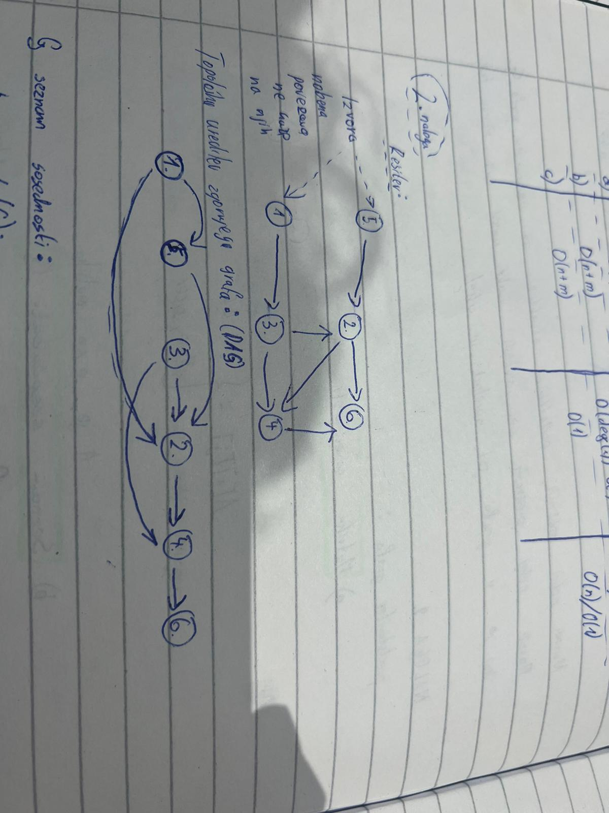
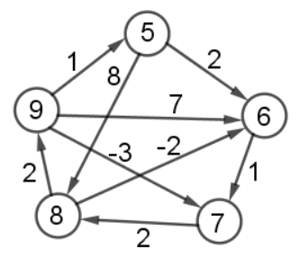
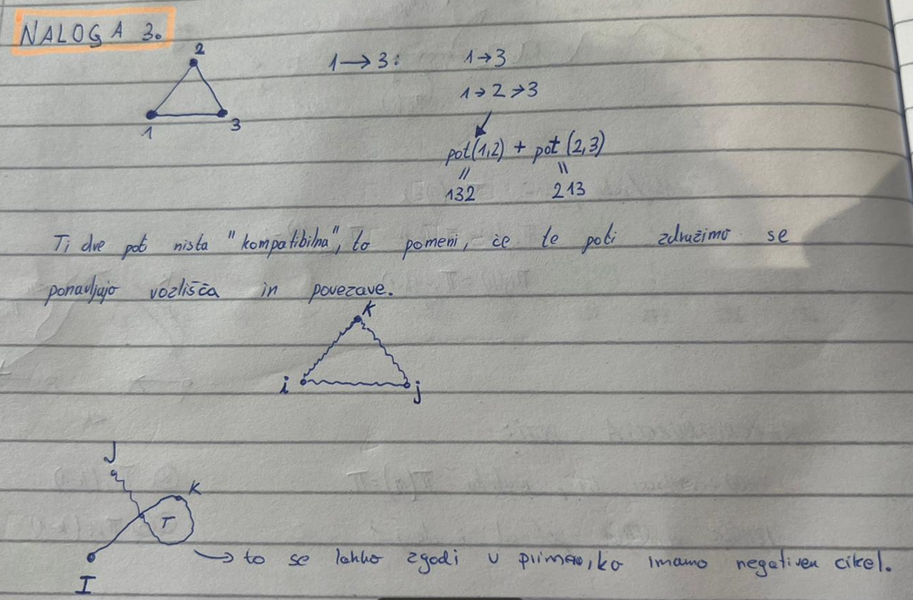
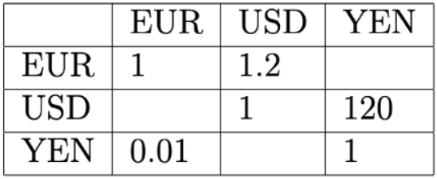
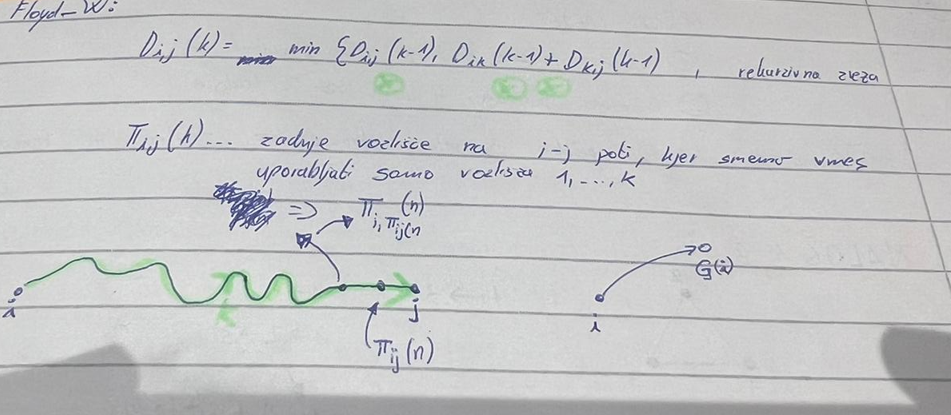
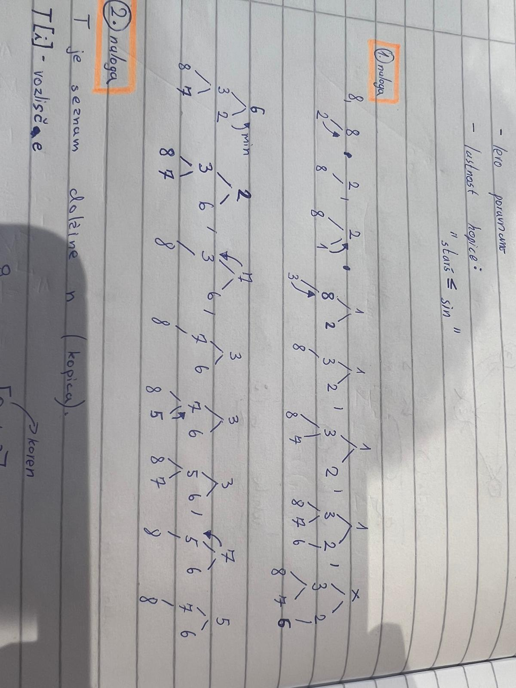
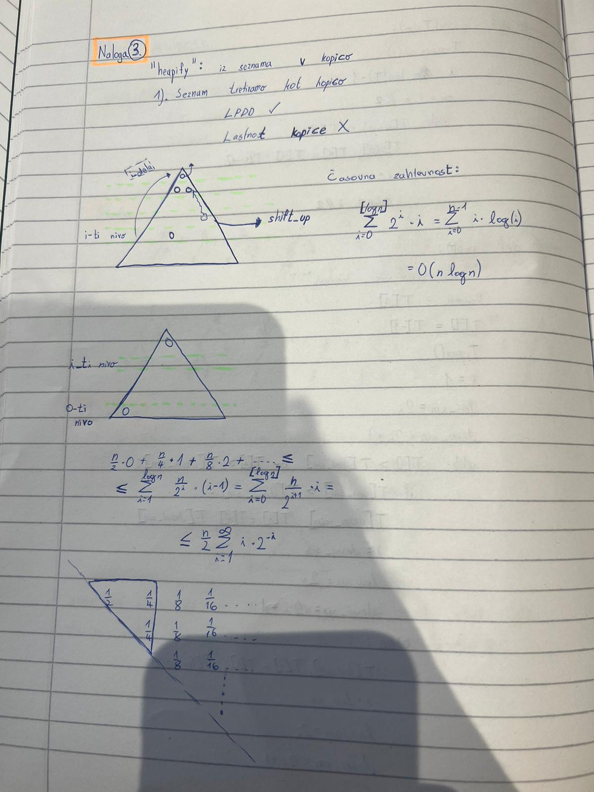

# Drugo poročilo za vaje
**Ime:** Anej Mužič

## Vsebina
* Vaje 5 (15.3.2023)
* Vaje 6 (22.3.2023)
* Vaje 7 (29.3.2023)
* Vaje 8 (5.4.2023)
* Vaje 9 (12.4.2023)
* Vaje 10 (19.4.2023)

## Vaje 5
**Datum:** 15.3.2023

Za uvod smo začeli obravnavati grafe. Pokazali smo nekaj osnovnih pojmov (vozlišče, povezave, ...) ter si ogledali, kako lahko graf predstavimo v kodi. Spoznali smo tri različice predstavitve ter povedali nekaj prednosti in slabosti za vsako posebej. 

### Komentarji in opombe
Na vajah mi je všeč to, da stvari, ki so zapletene, zelo natačno in podrobno razložimo.

### Naloga 1
Imamo graf $G = (V,E)$ z utežmi $\omega : E \mapsto A$, ki vsaki povezavi dodeli utež iz množice A. $V = \{1,...,n\}, E \subset \binom{v}{2}$

Navedi nekaj možnih podatkovnih struktur za predstavitev grafa $G$. Navedi nekaj prednosti oz. slabosti vsake izmed njih. Ponovi tudi, kaj je v grafu pot, sprehod in cikel.

Predstavitev grafa:

- Matrika sosednosti $A$

    $A$ je matrika dimenzij $n \times n$ s sledečim predpisom:
    $$
    A[i][j] =
    \begin{cases}
    \omega(i, j),\ (i, j) \in E\\
    None;\ \text{sicer}
    \end{cases}
    $$

- Seznam sosednosti $G$

    $$G[i] = [(j, w(i,j)\ \text{za vsak j, da je (i, j) povezava})]$$  


- Slovar sosednosti $G$
 
    $$G[i] = \{j: w(i,j)\ \text{za}\ \forall\ j, \text{da je} (i,j)\ \text{povezava}\}$$

    |                     |Prostorska zahtevnost| $i$ in $j$ soseda?       |Sosedi od $i$|
    | ------------------- | ------------------- | ------------------------ | ----------- | 
    | Matrika sosednosti  | O(n^2)              | O(1)                     | O(n)        |         
    | Seznam sosednosti   | O(n + m)            | O(\small{deg(i)}) = O(n) | O(1)        |
    | Slovar sosednosti   | O(n+m)              | O(1)                     | O(n) / O(1) |

### Naloga 2
Usmerjenemu grafu $G$ z $n$ vozlišči, ki nima ciklov rečemu tudi DAG (directed acyclic graph). Vozlišča takega grafa lahko topološko uredimo. To pomeni, da obstaja da zaporedje vozlišč $(v1,v2,…,vn)$, tako da ne obstaja povezava od v<sub>i</sub> do v<sub>j</sub>, če je $j<i$.

Sestavi algoritem, ki najde tako zaporedje. Namig: Katera vozlišča lahko zagotovo damo na prvo mesto v to ureditev?

Topološke ureditve grafa je pomemben koncept teorije grafov. Graf topološko uredimo tako, da na prvo mesto postavimo vozlišča, v katera ne kaže nobena povezava. Nadaljujemo tako, da iz grafa izbrišemo vozlišča, ki smo jih že postavili v vrsto. Postopek ponovimo. Topološka ureditev ni enolično določena.



Psevdokoda topološke ureditve grafa:
``` python
def topo_sort(G):
    """
    Sprejme graf G kot seznam sosednosti in vrne njegovo topološko ureditev.
    """
    n = len(G)
    in_deg = [0] * n
    # Sprehodimo se čez vsa vozlišča
    for i in range(n):
        # Sprehodimo se čez vse sosede
        for j in G[i]:
            # Povezava od i do j
            in_deg[j] += 1 
        izvori = [i for i in range(n) if in_deg(i) == 0] 
        rezultat = []
        while(izvori):
            izvor = izvori.pop()
            rezultat.append(izvor)
            for sosed in G[izvor]:
                in_deg[sosed] -= 1
                if in_deg[sosed] == 0:
                    izvor.append(sosed)
    return rezultat
```

### Naloga 3
Naj bo sedaj $G$ usmerjen utežen graf brez ciklov. Kako bi izračunal ceno najdaljše poti v tem grafu med vozliščema $s$ in $t$?

> $D[i] =$ najdaljša pot od $i$ do $t$
>
> $D[t] = 0$
>
> $D[i] = max_{(j , \omega) \in G[i]}\{ D[j] + \omega \}$
>
> Graf uredimo topološko, poiščemo kje se $t$ nahaja v topološki ureditvi in seznam $D$ polnimo v obratni topološki ureditvi.

## Vaje 6
**Datum:** 22.3.2023

Spoznali smo BFS, DFS, Floyd-Warshalov ter FW algoritme, ki jih uporabljamo za iskanje najkrajših poti v grafih.

### Naloga 1
Ponovi BFS algoritem. Modificiraj ga, tako da bo iskal najkrajše poti v neuteženem grafu.

* BFS (Breath first search)
* DFS (Depth first search)

BFS uporabljamo za:

* pregled grafa,
* iskanje vpetega drevesa/gozda v grafu, povezanih komponent,
* preverjanje dvodelnosti grafa,
* iskanje najkrajših poti v neuteženem grafu.

Koda:
```python
from collections import Deque

def BFS(G, u):
    """ 
    Funkcija sprejme graf G predstavljen kot seznam sosedov 
    in startno vozlisce u ter naredi pregled v širino.
    """
    n = len(G)
    obiskani = [False] * n
    # Začnemo v u. V primeru DFS-ja to spremenimo v sklad.
    q = vrsta([u]) 

    while q:
        trenutni = q.popleft()
        # Soseda smo že obiskali
        if obiskani[trenutni] : 
            continue 
        obiskani[trenutni] = True
        for sosed in G[trenutni]:
            if not obiskani[sosed]:
                # Doda nov element v q
                q.push(sosed) 
```

Poglejmo si še modificiran BFS algoritem, ki poišče najkrajše poti v neuteženem grafu.

Koda:
```python
from collections import Deque

def BFS(G, u):
    """ 
    Funkcija sprejme graf G predstavljen kot seznam sosedov in startno vozlisce 
    u ter vrne seznam najkraših poti od vozlišča u do vseh ostalih vozlišč.
    """
    n = len(G)
    d = [0] * n
    obiskani = [False] * n
    # Začnemo v u. V primeru DFS-ja to spremenimo v sklad
    q = vrsta([(u,0)]) 

    while q:
        trenutni, razdalja = q.popleft()
        if obiskani[trenutni]:
            # Soseda smo že obiskali 
            continue 
        obiskani[trenutni] = True
        d[trenutni] = razdalja
        for sosed in G[trenutni]:
            if not obiskani[sosed]:
                # Doda nov element v q
                q.push(sosed, razdalja+1) 
    return d
```

### Naloga 2
Ponovi Floyd-Warshallow algoritem. Kaj računa in kaj vrne? Kakšna je njegova časovna zahtevnost?

> VHOD: 
> - utežen graf G (negativne uteži so dovoljenje).
>
> IZHOD: 
> - Matrika $D$ oz. $(D_{ij}(n))$ predstavljena kot seznam seznamov v Pythonu, dimenzije $n \times n$, kjer je $n$ število vozlišč,
> - $D_{ij} \dots$ cena najkrajše poti med $i$-tim in $j$-tim vozliščem.
>
> IDEJA:  
> - $D_{ij}(k) = min \{D_{ij}(k-1), D_{ik}(k-1) + D_{kj}(k-1) \}$, kjer je $D_{i,j}(k)$ enako kot $D_{i,j}$, le da uporabljamo vozlišča od 1 do >$k$.
>
> ROBNI POGOJI:
> - $D_{i,i} (1) = 0$
> - $D_{1,i}(1) = \omega_{1,i}$ (utež povezave)
>
> Časovna zahtevnost algoritma: O(n^3) ($n$ matrik krat $n^2$ elementov, kjer vsak izračun porabimo konstantno mnogo operacij).

> Prostorska zahtevnost algoritma: O(n) (saj lahko operacije izvajamo samo na eni matriki in jo na vsakem koraku algoritma spreminjamo).

### Naloga 3
Simuliraj FW algoritem na spodnjem grafu.



Nato dodamo vozlišče 10 in povezavo (5 -> 10) z utežjo -1 in (10 -> 6) z utežjo 2. Kako uporabil prejšnje rezultate, da bi izračunal nove najkrajše poti?


Ko dodamo novo vozlišče s povezavo, lahko uporabimo prejšnje izračune tako, da le dodamo novo vrstico in stolpec ter izračunamo elemente po enakem postopku. Če na diagonali dobimo negativen element, potem imamo negativen cikel v grafu.

### Naloga 4
Na predavanjih ste poleg izračuna matrike $D(n)$ izračunali tudi $P(n)$. Kaj lahko iz njih razberemo? Kako dobimo najkrajšo pot med $i$ in $j$?

> Mesto $P_{i,j}$ v matriki $P(n)$ nam poda zadnje vozlišče v najkrajši poti med vozliščema $i$ in $j$.

Koda:
```python
def najkrajša_pot(i, j):
    """
    Vrne najkrajšo pot med vozliščema i in j.
    """
    sez = []
    zacetek = i
    konec = j
    while zacectek != konec:
        sez.append(konec)
        konec = P[i][j]
    sez.append(konec)
    return sez[::-1]
```

### Naloga 5
Kako bi s FW algoritmom odkrili, če v grafu obstajajo negativni cikli? Kaj vrne FW, če graf vsebuje negativen cikel?

> V matriki, bi se na diagonali pojavilo negativno število. Na ta način bi vedeli, da v grafu obstaja negativni cikel.

## Vaje 7
**Datum:** 29.3.2023

Obravnavali smo Floyd-Warshalov in Dijkstrin algoritem ter si ogledali nalogo, v kateri smo iskali arbitražne strategije s pomočjo teorije grafov in algoritmov, ki jih uporabljamo na grafih.

### Naloga 1
Iz prejšnjih vaj obravnavaj, kako razberemo najkrajše poti s pomočjo matrike $Π$, ki jo dobimo z FW algoritmom.

Koda:
```python
p = j
pot = []
while p != i:
    pot.append(p)
    # Stars vozlišča p
    p = Π[i][p] 
pot.append(i)
return pot.reverse()
```

### Naloga 2
Uteži sedaj dodamo še na vozlišča. Kako sedaj poiskati najcenejše poti?

Možne ideje:
- Prištejemo povezave, ki kažejo v to vozlišče,
- Prištejemo povezave, ki kažejo ven iz vozlišča.

Odločimo se glede na problem (smiselno obravnavamo začetno in končno vozlišče v poti).

### Naloga 3
Premisli, zakaj preprosta sprememba v FW algoritmu iz min na max ne najde nujno najdražje poti v grafu.



### Naloga 4
Na neki borzi se trgujejo valute po menjalnem tečaju, ki ga podaja tabela $R$ velikosti $n\times n$, kjer je $n$ število različnih valut. Vrednost $R[i][j]$ pove, da za $a$ enot valute $i$ dobimo $a\cdot R[i][j]$ enot valuje $j$. Ker menjalni tečaji lahko hitro spreminjajo in so odvisni od raznih parametrov se lahko zgodi, da $R[i][j]\cdot R[j][i] \neq 1$.

Za primer si oglejmo naslednjo shemo: 



Če trgujemo USD -> YEN -> EUR -> USD končamo z 1.44 USD. Tako zaporedje imenujemo arbitraža.

Predpostavi, da ne obstaja arbitražnih zaporedij. Kako bi poiskal najbolj ugodno pretvorbo valute $i$ v valuto $j$?

Kaj pa če sedaj opustimo predpostavko in dovoljujemo, da arbitražna zaporedja obstajajo. Kako bi odkril, kakšna so?

>Sestavimo graf $G(V, E)$, kjer so vozlišča valute, povezave pa menjalni tečaji. Na temu grafu nas zanima: "najdražja" pot v grafu $G(V, E)$ od $i$ do $j$. Ceno poti dobimo tako, da zmnožimo uteži na povezavah.
>
>
>
> Produkt pretvorimo na vsoto
>
>ceno izračunamo na sledeč način: 
>
>$$R_{i,i_1} \cdot R_{i_1,i_2} \cdots R_{i_k,i_1}$$
>
>$$log(R_{i,i_1} \cdot R_{i_1,i_2} \cdots R_{i_k,i_1}) = \sum log(R)$$
>
>Sedaj imamo najdražjo pot in neke uteži na grafu. Ker nas zanima najbolj ugodna pretvorba valute, utež na povezavi $ij$ nastavimo na $-log(R_{ij})>$. Problem smo prevedli na iskanje najceneše poti od $i$ do $j$ v novem grafu. V ta namen bi si želeli uporabiti FW algoritem. To lahko storimo, >če graf nima negativnih ciklov. Želimo pokazati, da jih naš graf res nima.
>
>Dokazovanja se lotimo s protislovjem. Predpostavimo, da imamo negativen cikel od $i-i$. Cena tega cikla je: 
>
>$$-(\sum\limits_{j=1}^k \log(R_{i_{j-1}, i_{j}})) < 0$$
>
>Enačbo pomnožimo z $-1$ in vsoto logaritmov zapišemo kot logaritem produktov:
>
>$$\log (\prod\limits_{j=1}^k (R_{i_{j-1}, i_{j}})) > 0$$
>
>Antilogaritmiramo in dobimo:
>
>$$\prod\limits_{j=1}^k (R_{i_{j-1}, i_{j}}) > 1$$
>
>Iz tega sledi, da imamo arbitražo, kar nas je pripeljalo do protislovja, saj smo predpostavili, da arbitražna priložnost ne obstaja. Od tod sledi, da graf ne premore negativnih ciklov.

>Če opustimo predpostavko o neobstoju arbitraže, lahko arbitražna zaporedja odkrijemo tako, da izvedemo FW algoritem in preverimo, če obstaja negativen cikel v grafu. Negativni cikel (iz zgonjega dokaza) pomeni arbitražno strategiijo.

### Naloga 5
Ponovi Djikstrov algoritem. Kaj so vhodni in izhodni podatki, kakšne so predpostavk, itd.
Zapiši tudi njegovo glavno idejo oziroma kar psevdo kodo.

Vhodni podatki: 
- usmerjen graf $G(V, E)$
- začetno vozlišče $s \in V$
- cene povezav $c_{i,j} \in E$ (cene povezav so nenegativne!)

Izhodni podatki:
- cene najcenejših poti od začetnega do $i$-tega vozlišča $\forall i \in V$ --> D
- drevo najkrajših poti od začetnega do $i$-tega vozlišča $\forall i \in V$ --> P

Psevdo koda:
```python
def dijkstra(G, s):
    """
    Vrne najkrajšo pot od s do vseh vozlišč v grafu G.
    """
    n = len(G)
    D = [float("inf")] * n
    P = [None] * n
    # D[i] pove razdaljo od s do i
    D[s] = 0 
    P[s] = s
    obiskani = [False] * n
    # V vrsto dodamo še nedodana vozlišča
    q = Vrsta(V(G)) 

    while len(obiskani) != n:
        # Poišče najmanjši element in ga odstrani iz seznama
        c = q.popmin() 
        obiskani.add(c)

        for sosed, utez in G[c]:
            if sosed not in obiskani:
                if D[c] + utez + D[sosed]:
                    D[sosed] = D[c] + utez
                    P[sosed] = c
    return D, P
```

## Vaje 8
**Datum:** 5.4.2023

Ukvarjali smo se z algoritmi za iskanje najkrajših poteh v gafu ter jih implementirali.

### Naloga 1
Vaša naloga bo, da uporabite ta algoritem na teh podatkih, torej:

- roadNet-TX.txt spremenite v ustrezno podatkovno strukturo grafa.
- poiščete najkrajše razdalje od vozlišča 100 do vseh ostalih.
- Koliko je razdalja dG(100,100000)?
- Katero vozlišče je najbolj oddaljeno od vozlišča 100?
- Koliko vozlišč je dosegljivih iz vozlišča 100?

Koda:
```python
def pretvori_v_seznam(datoteka):
    '''Funkcija prebere datoteko in v seznam shrani vse povezave'''
    seznam = []
    with open(datoteka, 'r') as file:
        for vrstica in file:
            if vrstica[0] == '#': continue
            else:
                podatki = vrstica.split('\t')
                seznam.append((int(podatki[0]), int(podatki[1])))
    seznam.sort(key=lambda x: x[0], reverse=True)           
    return seznam

povezave = pretvori_v_seznam('roadNet-TX.txt')

def ustvari_graf(povezave):
    '''Funkcija naredi seznam sosednosti'''
    G = [list() for _ in range(povezave[0][0]+1)]
    for i in povezave:
        u,v = i[0],i[1]
        G[u].append((v, 1)) #uteži so enake 1
    return G

graf = ustvari_graf(povezave)
```

Od tu naprej si pomagamo z dijkstra algortimom:
```python
import heapq
from collections import deque

def dijkstra(G, s):
    """
    Vrne tudi seznam poti, ki predstavlja drevo najkrajših poti od s
    do vseh ostalih vozlišč.
    """
    n = len(G)
    
    # Nastavimo začetne vrednosti za sezname obiskani, razdaljaDo in poti.
    obiskani = [False] * n
    razdaljeDo = [-1] * n
    poti = [None] * n

    # Na vrsto dodamo trojico (d, v, p), kjer je:
    # v vozlišče, d razdalja do njega, p pa prejšnje vozlišče na najkrajši poti od
    # s do v.
    Q = [(0, s, s)]

    while Q:
        
        # Vzamemo minimalen element iz vrste
        # heapq.heappop(Q) odstrani element iz seznama  Q, ter pri tem ohranja
        # lastnost kopice : seznam Q tretira kot dvojiško drevo!
        razdalja, u, p = heapq.heappop(Q)

        # če je že obiskan, nadaljujemo.
        if obiskani[u]:
            continue
        
        # obiščemo vozlišče ter nastavimo njegovo razdaljo
        # ter predhodnika na najkrajši poti od s do u
        obiskani[u] = True
        razdaljeDo[u] = razdalja
        poti[u] = p

        # gremo čez vse sosede in dodamo potrebne elemente na vrsto.
        for (v, teza) in G[u]:
            if not obiskani[v]:

                # heap.heappush(Q, elem) doda element v seznam Q, kjer ohranja lastnost kopice.
                heapq.heappush(Q, (razdalja + teza, v, u))

    return razdaljeDo, poti

```
- **Poiščete najkrajše razdalje od vozlišča 100 do vseh ostalih.**
    ```python
    razdalje, poti = dijkstra(G,100)
    ```

- **Koliko je razdalja dG(100, 100000)?**

```python
    razdalje[100000]
    #rezultat = 240
```
- **Katero vozlišče je najbolj oddaljeno od vozlišča 100?**

```python
    razdalje.index(max(razdalje))
    #rezultat = 1389039
```
- **Koliko vozlišč je dosegljivih iz vozlišča 100?**
```python
    len(graf[100])
    #rezultat = 2
```

### Naloga 2
Glede na to, da graf ni utežen, lahko za isto nalogo implementiramo BFS algoritem. Implementiraj BFS algoritem, ki bo poiskal dolžine najkrajših poti od s do vseh ostalih vozlišč. Vrne naj tudi drevo najkrajših poti, tako kot Djikstra. Preveri iste zadeve kot zgoraj, dobiti moraš seveda iste odgovore.

Koda:
```python
def BFS(G, u):
    '''Vrne seznam poti od vozlisca u do vseh ostalih vozlic v grafu G.'''
    n = len(G)
    razdalje = [0]*n
    obiskani = [False]*n
    # Razdaljo nastavimo na 0, zacnemo v u
    q = ([(u,0,u)])
    poti =[None]*n
    while q:
        trenutni, razdalja, prejsnji = q.pop(0)
        # Ze obiskan sosed
        if obiskani[trenutni]:
            continue
        obiskani[trenutni] = True
        razdalje[trenutni] = razdalja
        poti[trenutni] = prejsnji
        for sosed, teza in G[trenutni]:
            if not obiskani[sosed]:
                # V vrsto dodamo soseda
                q.append((sosed, razdalja +1, trenutni))
    return razdalje, poti
```

### Naloga 3
Oba algoritma dodelaj, tako da dodaš nov vhodni podatek $t$, ki predstavlja končno vozlišče. Algoritma naj torej vrneta razdaljo med $s$
 in $t$ v grafu ter pote (kot drevo) med njima. Delujeta naj, tako da se ustavita takoj ko najdemo željeno pot.

### BFS algoritem

Koda:
```python
def BFS(G, u, t):
    '''Funkcija vrne seznam poti od vozlisca u do vseh ostalih vozlic v grafu G'''
    n = len(G)
    razdalje = [0]*n
    obiskani = [False]*n
    # Razdaljo nastavimo na 0, zacnemo v u
    q = ([(u,0,u)])
    poti =[None]*n
    while q: #dokler vrsta ni prazna
        trenutni, razdalja, prejsnji = q.pop(0)
        # Ze obiskan sosed
        if obiskani[trenutni]:
            continue
        obiskani[trenutni] = True
        razdalje[trenutni] = razdalja
        poti[trenutni] = prejsnji
        if trenutni == t:
            break
        for sosed, teza in G[trenutni]:
            if not obiskani[sosed]:
                # V vrsto dodamo soseda
                q.append((sosed, razdalja +1, trenutni))
    return razdalje, poti
```

### Dijkstra algoritem

Koda:
```python
import heapq
from collections import deque

def dijkstra(G, s, t):
    """
    Vrne tudi seznam poti, ki predstavlja drevo najkrajših poti od s
    do vseh ostalih vozlišč.
    """
    n = len(G)
    
    # Nastavimo začetne vrednosti za sezname obiskani, razdaljaDo in poti.
    obiskani = [False] * n
    razdaljeDo = [-1] * n
    poti = [None] * n

    # Na vrsto dodamo trojico (d, v, p), kjer je:
    # v vozlišče, d razdalja do njega, p pa prejšnje vozlišče na najkrajši poti od
    # s do v.
    Q = [(0, s, s)]

    while Q:
        
        # Vzamemo minimalen element iz vrste
        # heapq.heappop(Q) odstrani element iz seznama  Q, ter pri tem ohranja
        # lastnost kopice : seznam Q tretira kot dvojiško drevo!
        razdalja, u, p = heapq.heappop(Q)

        # če je že obiskan, nadaljujemo.
        if obiskani[u]:
            continue
        
        # obiščemo vozlišče ter nastavimo njegovo razdaljo
        # ter predhodnika na najkrajši poti od s do u
        obiskani[u] = True
        razdaljeDo[u] = razdalja
        poti[u] = p
        if u == t:
            break

        # gremo čez vse sosede in dodamo potrebne elemente na vrsto.
        for (v, teza) in G[u]:
            if not obiskani[v]:

                # heap.heappush(Q, elem) doda element v seznam Q, kjer ohranja lastnost kopice.
                heapq.heappush(Q, (razdalja + teza, v, u))

    return razdaljeDo, poti
```

### Analiza

```python
import time                        

import matplotlib.pyplot as plt     
import random                       
from dijsktra import *
from BFS import *

def pretvori_v_seznam(datoteka):
    '''Funkcija prebere datoteko in v seznam shrani vse povezave'''
    seznam = []
    with open(datoteka, 'r') as file:
        for vrstica in file:
            if vrstica[0] == '#': continue
            else:
                podatki = vrstica.split('\t')
                seznam.append((int(podatki[0]), int(podatki[1])))
    seznam.sort(key=lambda x: x[0], reverse=True)
                
    return seznam

#seznam povezav
povezave = pretvori_v_seznam('roadNet-TX.txt')

def ustvari_graf(povezave):
    '''Funkcija naredi seznam sosednosti'''
    G = [list() for _ in range(povezave[0][0]+1)]
    for i in povezave:
        u,v = i[0],i[1]
        G[u].append((v, 1)) #uteži so enake 1
    return G

#ustvarimo graf
graf = ustvari_graf(povezave)

def djikstra_dodelan(G, s, t):
    """
    Vrne seznam razdaljeDo, ki predstavlja najkrajšo pot od vozlišča s
    do vseh ostalih ter seznam poti, ki predstavlja drevo najkrajših poti od s
    do vseh ostalih vozlišč.
    """
    n = len(G)

    # Nastavimo začetne vrednosti za sezname obiskani, razdaljaDo in poti.
    obiskani = [False] * n
    razdaljeDo = [-1] * n
    poti = [None] * n

    # Na vrsto dodamo trojico (d, v, p), kjer je:
    # v vozlišče, d razdalja do njega, p pa prejšnje vozlišče na najkrajši poti od
    # s do v.
    Q = [(0, s, s)]

    while Q:

        # Vzamemo minimalen element iz vrste
        # heapq.heappop(Q) odstrani element iz seznama  Q, ter pri tem ohranja
        # lastnost kopice : seznam Q tretira kot dvojiško drevo!
        razdalja, u, p = heapq.heappop(Q)

        # če je že obiskan, nadaljujemo.
        if obiskani[u]:
            continue

        # obiščemo vozlišče ter nastavimo njegovo razdaljo
        # ter predhodnika na najkrajši poti od s do u
        obiskani[u] = True
        razdaljeDo[u] = razdalja
        poti[u] = p

        if u == t: #V primeru da je u naše željeno končno vozlišče zaključimo s to zanko in končamo
            break

        # gremo čez vse sosede in dodamo potrebne elemente na vrsto.
        for (v, teza) in G[u]:
            if not obiskani[v]:

                # heap.heappush(Q, elem) doda element v seznam Q, kjer ohranja lastnost kopice.
                heapq.heappush(Q, (razdalja + teza, v, u))

    return razdaljeDo, poti

def BFS_dodelan(G, u, t):
    '''Funkcija vrne seznam poti od vozlisca u do vozlišča t v grafu G'''
    n = len(G)
    razdalje = [0]*n
    obiskani = [False]*n
    q = ([(u,0,u)]) #začnemo v u, razdlaja je na začetku 0
    poti =[None]*n
    while q: #dokler vrsta ni prazna
        trenutni, razdalja, prejsni = q.pop(0)
        if obiskani[trenutni]:
            continue #soseda smo že obiskali

        if trenutni == t:
            break 
        #v primeru da smo prišli do našega željenga končnega vozlišča t zaključimo s to zanko
        obiskani[trenutni] = True
        razdalje[trenutni] = razdalja
        poti[trenutni] = prejsni
        for sosed, teza in G[trenutni]:
            if not obiskani[sosed]:
                q.append((sosed, razdalja +1, trenutni)) #v vrsto dodamo soseda,razdalji prištejemo ena
    return razdalje, poti


vozlisce = [1,10,100,1000,10000,100000,1000000]
#Dijkstra-nedodelana

casi_d1 = []
cas_d1 = 0

for i in vozlisce:
    zacetek = time.perf_counter()
    dijkstra(graf,i)
    konec = time.perf_counter()
    cas_d1 += konec - zacetek
    casi_d1.append(cas_d1)

#dijkstra dodelana

casi_d2 = []
cas_d2 = 0

for i in vozlisce:
    zacetek = time.perf_counter()
    djikstra_dodelan(graf,1,i)
    konec = time.perf_counter()
    cas_d2 += konec - zacetek
    casi_d2.append(cas_d2)
    
#BFS

casi_b1 = []
cas_b1 = 0

for i in vozlisce:
    zacetek = time.perf_counter()
    BFS(graf,i)
    konec = time.perf_counter()
    cas_b1 += konec - zacetek
    casi_b1.append(cas_b1)
    
#BFS dodelan
    
casi_b2 = []
cas_b2 = 0

for i in vozlisce:
    zacetek = time.perf_counter()
    BFS_dodelan(graf,1,i)
    konec = time.perf_counter()
    cas_b2 += konec - zacetek
    casi_b2.append(cas_b2)
    
print(casi_d1)
print(casi_d2)
print(casi_b1)
print(casi_b2)

x_os = [1,2,3,4,5,6,7]

plt.grid(linestyle = '-', linewidth = 0.5)
plt.xlabel('Število vozlišč')
plt.ylabel('Potreben čas [s]')
plt.plot(x_os, casi_d1, label='Dijkstra - nedodelan')
plt.plot(x_os, casi_d2, label='Dijkstra - dodelan')
plt.plot(x_os, casi_b1, label='BFS - nedodelan')
plt.plot(x_os, casi_b2, label='BFS - dodelan')
plt.legend()
plt.show()
```

Kodo sem si sposodil od Zale Duh.

## Vaje 9
**Datum:** 12.4.2023

Za uvod smo začeli obravnavati grafe. Pokazali smo nekaj osnovnih pojmov (vozlišče, povezave, ...) ter si ogledali, kako lahko graf predstavimo v kodi. Spoznali smo tri različice predstavitve ter povedali nekaj prednosti in slabosti za vsako posebej. 

### Naloga 1
Nadaljujte z nalogami 2,3,4 od zadnjič. Naloga 5 naj ostane za poročilo.

### Naloga 2
Konstruirajte nov graf, ki vsebuje le vozlišča od 0 do N.

Vsaki povezavi določite neko pozitivno utež (lahko čisto naključno) in zadevo shranite v novo .txt datoteko. Vrstice naj bodo oblike u v w(u,v), kjer je (u,v) povezava in w(u,v) njena utež.

Koda:
```Python
import random

def ustvari_graf(N):
    """
    Funkcija sprejme število N, ki predstavlja število vozlišč. Ustvari novo .txt 
    datoteko na katero zapiše nov graf z vozlišči od 0 do N. Vozlišča so oblike 
    (u, v) w(u, v), kjer je (u, v) povezava in w(u, v) je njena utež.
    """
    povezave = set()
    with open('ustvari_graf.txt', 'w') as datoteka:
        for u in range(N+1):
            st_povezav = random.randint(1, 15) 
            for _ in range(st_povezav):
                # Povezav do nekega vozlišča je več kolikor povezav v grafu
                if st_povezav > N: 
                    break
                # Ustvarimo vozlišče v katerega gre u
                v = random.randint(0, N) 
                if u == v:
                    continue
                # Določimo ceno te povezave
                w = random.randint(1, 10) 
                if (u, v) in povezave:
                    continue
                povezave.add((u, v))
                datoteka.write(f"{u}\t{v}\t{w}\n")
```

Kodo sem dobil od Adnan Pajalić

### Naloga 3
Implementiranje še Bellman-Fordov algoritem in ga poženite na grafu iz prejšnje naloge. Analiziraje kako velik N iz prejšne naloge morate vzeti, da bo algoritem še deloval v zglednem času.

## Vaje 10
**Datum:** 19.4.2023

Spoznali smo novo podatkovno strukturo kopico, njene osnovne lastnosti ter jo skonstruirali. Na koncu pa smo še implementirali operaciji vstavljanja in brisanja na tej podatkovni strukturi.

### Naloga 1
Simuliraj delovanje (min) kopice. Za vsavljanje je kot operacija število, za brisanje pa x. Za boljšo predstavo nariši kar drevesa.

Operacije: 8,2,1,3,7,6, x, x, 5, x, -3, x

> (Minimalna) Binarna kopica je levo poravnano dvojiško drevo, ki ni nujno, da je polno.
>
> LASTNOST (MINIMALNE) KOPICE: starš je manjši ali enak sinovoma
>
> Operacije dodajamo na sledeč način:



### Naloga 2
Predstavi kopico s seznamom in zapiši delovanje pop() in push(x) operacij.

Operacija `push()`:

Koda:
```python
def push(T,x): 
"""
Funkcija sprejme seznam T, ki predstavlja kopico 
ter element x, ki ga želimo dodati na kopico.
"""
    T.append(x) 
    i = len(T)-1 
    oce = i // 2
    while T[oce] >= T[i]: 
        # dokler ni izpolnjena lastnost kopice 
        # zamenjamo položaj sina in očeta
        T[oce], T[i] = T[i], T[oce]
        i = oce
        oce = i // 2
```

Operacija `pop()`:

Koda:
```python
def pop(T):
"""
Funkcija sprejme seznam T, ki predstavlja kopico ter odstrani element 
v korenu. Pri tem seznam modificira tako, da ohrani lastnost kopice.
"""
    koren = T[1]
    T[1] = T[-1]
    T.pop()
    i = 1
    levi_sin = 2 * i
    desni_sin = 2 * i + 1
    while T[i] > T[levi_sin] or T[i] > T[desni_sin]:
        
        if T[levi_sin] > T[desni_sin]:
            T[desni_sin], T[i] = T[i], T[desni_sin]
            i = desni_sin
            levi_sin = 2 * i
            desni_sin = 2 * i + 1

        else:
            T[levi_sin], T[i] = T[i], T[levi_sin]
            i = levi_sin
            levi_sin = 2 * i
            desni_sin = 2 * i + 1

    return koren
```

### Naloga 3
Kako bi s kopico sortiral seznam? Časovna zahtevnost? Kako in podanega seznama nardiš kopico v O(n) časa.



# Viri

1. Cone, M., Markdown Cheat Sheet, pridobljeno s [https://www.markdownguide.org/cheat-sheet/] https://www.markdownguide.org/cheat-sheet/), 7. 5. 2023.