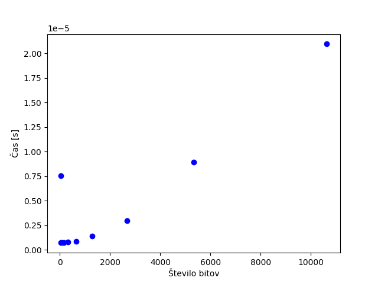

# Primer poročila za vaje
**Ime:** Gašper Domen Romih

## Vsebina
* Vaje 1 (15.2.2023)
* Vaje 2 (22.2.2023)

## Vaje 1
**Datum**: 15.2.2023

Kratek opis oziroma povzetek kaj smo delali na vajah.
Recimo: na vajah smo se ukvarjali z osnovnimi podatkovnimi strukturami v pythonu in njihovimi časovnimi zahtevnostmi. Nato smo rešili nekaj nalog iz dinamičnega programiranja na programu Tomo.

### Komentarji in opombe

Napišite kaj vam je bilo na vajah všeč oziroma češa niste marali. So bile pretežke/prelahke, ...

### Naloga 1
Opis in rešitev naloge 1. Če se naloga **rešuje na tablo** povzemite pomembne ideje ali pa zapišite kar celotno rešitev, ki smo jo naredili na tablo. Pri tem lahko uporabljate matematično okolje v Markdown-u, podobno kot v latexu.

Naprimer, naj bo $G = (V(G), E(G))$ graf in $\omega : E(G) \rightarrow \mathbb{R}^+$ nenegativna funkcija. 

 V kolikor je naloga **programerskega tipa**, potem je potrebno v primerno okolje vstavit tudi kodo. Naprimer tako:

Opis:\
Potrebno je implementirati funkcijo `sestej(a,b)`, ki vrne vsoto števil a in b. 


Koda:
```python
def sestej(a,b):
    return a + b
```

Primer:
```python
>>> print(sestej(3,5))
8
```

Določene programerske naloge bodo imele še dodatne zahteve. Ponavadi boste morali za funkcijo, ki jo boste implementirali narediti svoj nabor testov ter narediti analizo časovne zahtevnosti funkcije. Tukaj je pomembno, da podatek pripravite, tako da se bo videl trend časovne zahtevnosti.

Pri tem lahko vstavite sliko iz repozitorija


V primeru, da ste veliko dela vložili v prirpavo podatkov to tudi omenite in povejte kako ste pripravili podatke.

Idealno tudi pripravite navodila, kako reproducirati rezultate iz vaše analize. 

### Naloga 2

Enako kot pri nalogi 1.


## Vaje 2
**Datum**: 22.2.2023


# Viri

1. Cone, M., Markdown Cheat Sheet, pridobljeno s [https://www.markdownguide.org/cheat-sheet/] https://www.markdownguide.org/cheat-sheet/), 30. 9. 2020.

