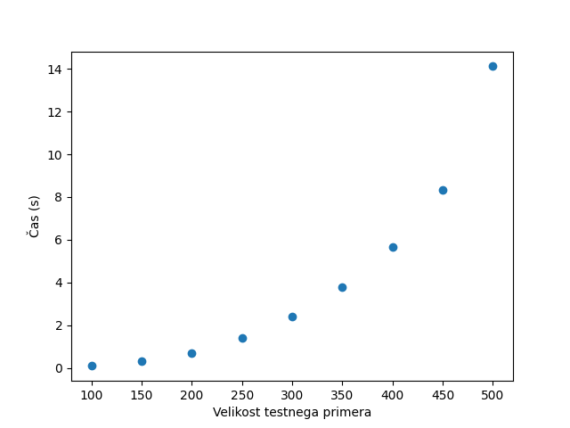

<h1 align="center"> PRVO POROČILO </h1>

**Ime:** Aljaž Lukežič

# Vsebina
* Vaje 1 (15.2.2023)
* Vaje 2 (22.2.2023)
* Vaje 4 (8.3.2023)
* Analiza naloge žabica iz vaj 1

Vaj 3 mi ni bilo treba oddati.

<br>

# Vaje 1
**Datum**: 15.2.2023

Na vajah smo ponovili časovne zahtevnosti nekaj osnovnih podatkovnih struktur v pythonu. Nato smo rešili nekaj nalog iz dinamičnega programiranja na programu Tomo. <br>
<br>
Tukaj prilagam link do pdf-ja z nalogami, ki smo jih rešili na prvih vajah: [povezava do prvih vaj](../Datoteke/Vaje1/vaje1.pdf)

<br>

# Vaje 2
**Datum**: 22.2.2023

Na vajah smo ponovili 0/1 nahrbtnik. Razložili smo kako pridemo do Bellmanove enačbe.

Prilagam link do pdf-ja z nalogami, ki smo jih rešili na drugih vajah: [povezava do drugih vaj](../Datoteke/Vaje2/vaje2.pdf) 

<br>

# Vaje 4
**Datum**: 22.2.2023

Na vajah smo reševali naloge iz matričnega množenja.

Prilagam link do pdf-ja z nalogami, ki smo jih rešili na četrtih vajah: [povezava do četrtih vaj](../Datoteke/Vaje4/vaje4.pdf) 

<br>

# Analiza naloge žabica iz vaj 1

Analiziral sem (iterativni) botttoms up pristop. <br>
Generator je napisan tudi v datoteki 'zabica.py'.<br>

Najprej si poglejmo kako nalogo naredimo z uporabo rekurzije: 
```python
from functools import lru_cache

### z rekurzijo
def zabica(mocvara):
    n = len(mocvara) - 1
    @lru_cache(maxsize=None)
    def pobeg(i, e):
        if i > len(mocvara):
            return 0
        if e > n - i:
            return 1
        else:
            e += mocvara[i]  #ze naredimo + muhe[i + d]
            return 1 + min([pobeg(i + d, e - d) for d in range(1, e)])           
    return pobeg(0, mocvara[0])
```

Primer:
```python
>>> mocvara = [2, 4, 1, 2, 1, 3, 1, 1, 5]
>>> print(zabica(mocvara))
3
```
<br>

Z bottoms up pristopom lahko nalogo naredimo tako:
```python
#### bottoms up
def zabica(muhe):
    if muhe == [1]:
        return 1
    
    n = len(muhe)
    # pripravimo si tabelo velikosti (n+1) * (n+1)
    dp = [[0] * (n + 1) for _ in range(n + 1)]

    # nastavimo robne pogoje
    for i in range(n + 1):
        dp[i][n] = float('inf')
        dp[i][n - 1] = 0

    # izračunamo vrednosti v dp tabeli
    for i in range(n - 2, -1, -1):
        for j in range(n - 1, -1, -1):
            m = float('inf')
            l = j
            l += muhe[i]

            if i + l >= n:
                dp[j][i] = 1
                continue

            for d in range(1, l + 1):
                if i + d >= n:
                    m = 0
                else:
                    if l - d >= 0:
                        m = min(m, dp[l - d][i + d])

            dp[j][i] = 1 + m

    return dp[0][0]
```

Primer:
```python
>>> mocvara = [2, 4, 1, 2, 1, 3, 1, 1, 5]
>>> print(zabica(mocvara))
3
```


Spodaj naredimo generator testnih primerov:
```python
### generator testnih primerov za bottom up pristop
import random
import matplotlib.pyplot as plt
import timeit


# vre seznam dolzine n, z naključnimi vrednostmi od 1 do max vrednosti.
def generator_testnih_primerov(n, max_vr):
    return [random.randint(1, max_vr) for _ in range(n)]


def izmera_casa(testni_primer):
    koda = 'from __main__ import zabica'
    nas_primer = f'zabica({testni_primer})'
    t = timeit.timeit(nas_primer, setup=koda, number=5)
    return t / 5.0  # povprečen čas izvedbe funkcije, izmerjen v 5 ponovitvah


izmeri_cas1 = True
if izmeri_cas1 == True:
    print()
    print('Nas zacetni primer')
    for n in range(100, 600, 100):
        testni_primer = [2, 4, 1, 2, 1, 3, 1, 1, 5]
        t = izmera_casa(testni_primer)
        print(f'n = {n}, cas = {t:.6f}s')


# pogledamo, koliko casa potrebuje funkcija v povprecju 5 ponovitev, ko je n = 100, 200, 300, 400 in 500
izmeri_cas2 = True
if izmeri_cas2 == True:
    tabela_casov = []
    print()
    print('Nakljucni podatki')
    for n in range(100, 501, 50):
        testni_primer = generator_testnih_primerov(n, 10)
        t = izmera_casa(testni_primer)
        tabela_casov.append(t)
        print(f'n = {n}, cas = {t:.6f}s')
  

    # izmerjeni časi
    velikosti = [100, 150, 200, 250, 300, 350, 400, 450, 500]
    casi = tabela_casov

    # nariši graf
    plt.plot(velikosti, casi, 'o')
    plt.xlabel('Velikost testnega primera')
    plt.ylabel('Čas (s)')
    
    # Shranimo sliko 
    plt.savefig('casovna_zahtevnost.png')

    plt.show()
```

<br>

### Analiza časovne zahtevnosti: 
Teoretična časovna zahtevnost funkcije zabica je $O(n^3) = O(n^2) * O(n)$. 

Poglejmo si graf časovne zahtevnosti pri uporabi iterativnega pristopa za reševanje problema žabice.

