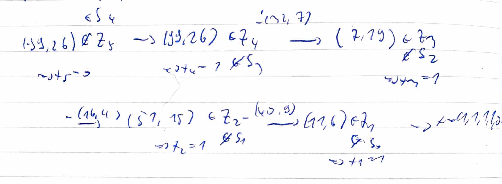
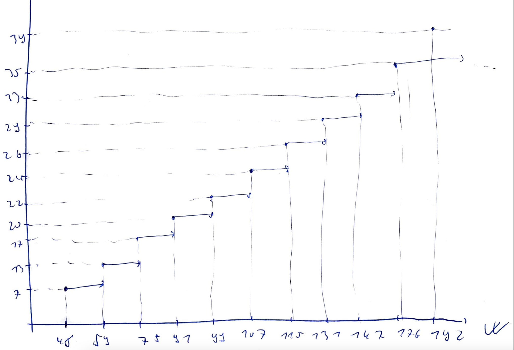
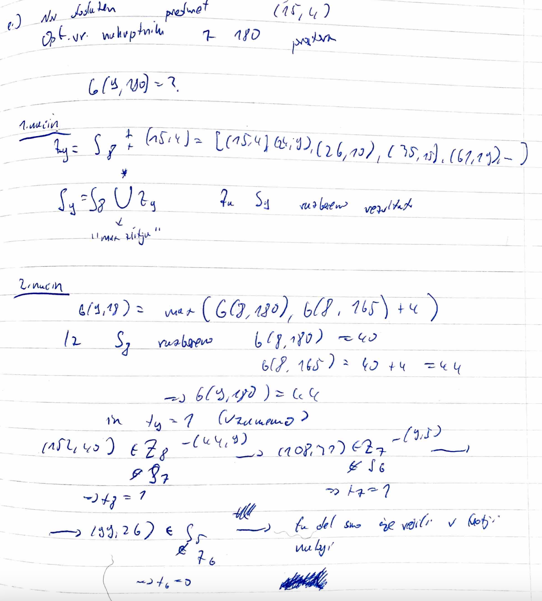
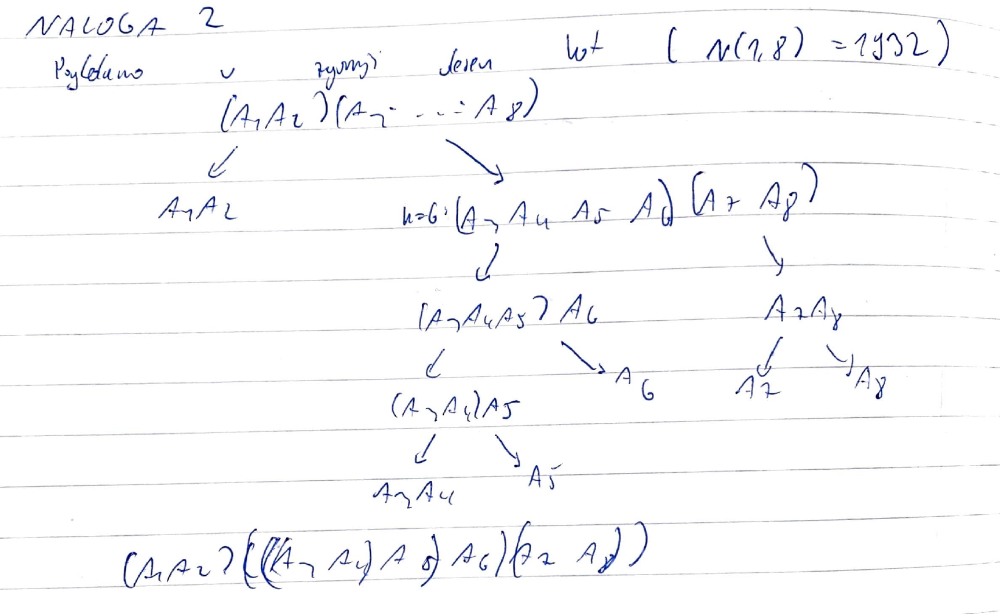
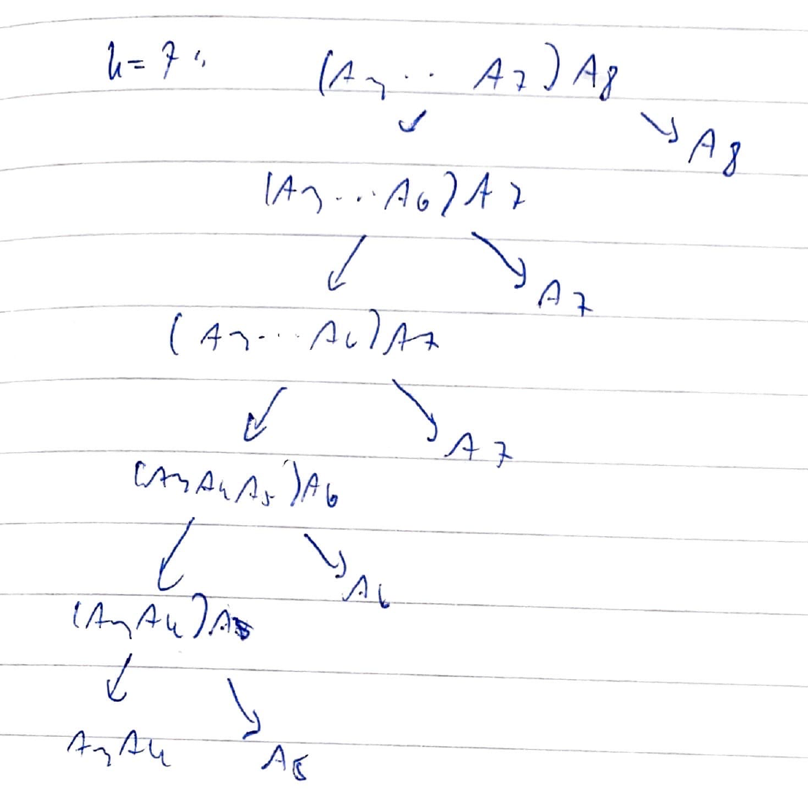
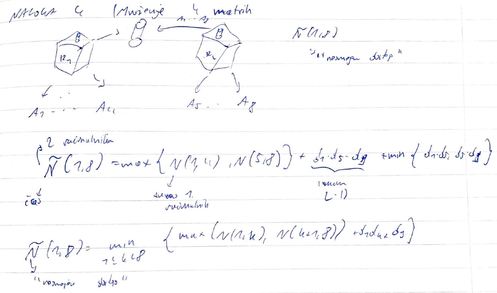
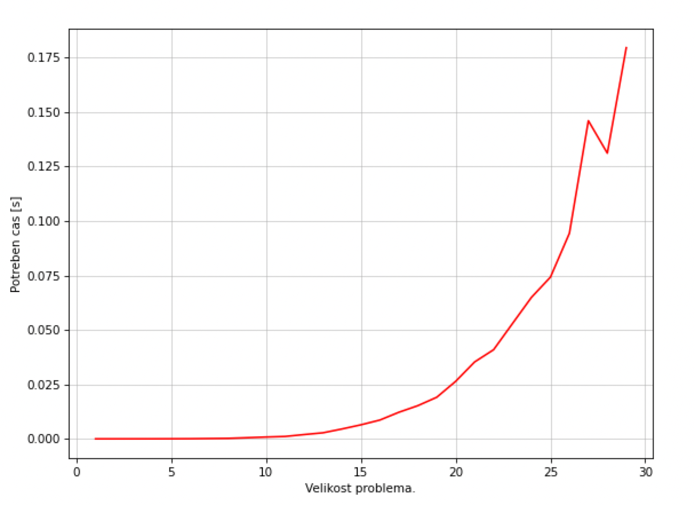
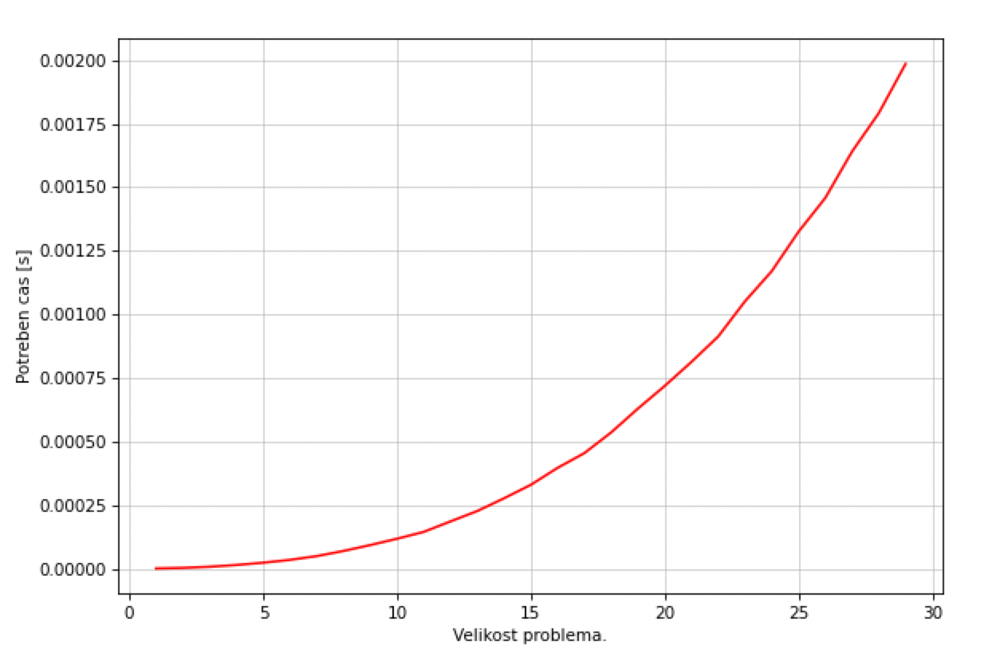
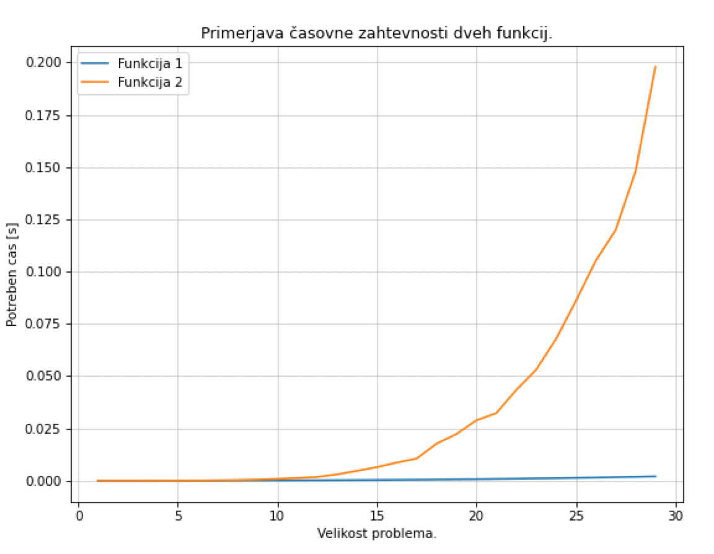
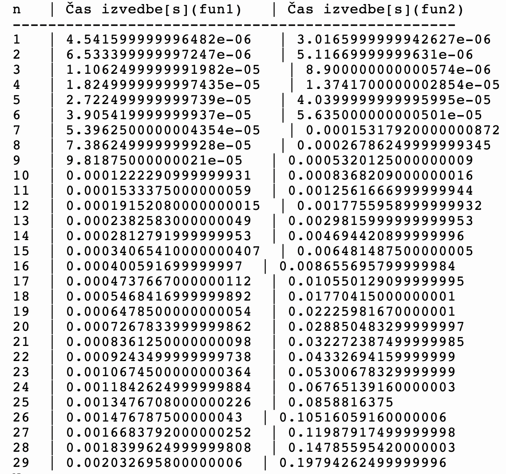

# Prvo poročilo
**Ime in priimek:** Robi Rihter 
<br />
**Datum:** 17.3.2023

## Vsebina poročila
 >   - Vaje 1 (15.2.2023)
 >   - Vaje 2 (22.2.2023)
 >  - Vaje 3 (1.3.2023)
 >  - Vaje 4 (8.3.2023)

## Vaje 1 (15.2.2023)
### Naloga 1
 >Ponovitev časovne zahtevnosti in O notacije.
 >
 >Za podatkovne strukture v pythonu seznam, slovar in verižni seznam zapiši njihove časovne zahtevnosti za:
>
>* dodajanje na začetku/sredini/koncu
>* poizvedbe
>* iskanje
>* brisanje na začetku/sredini/koncu

Definicija O notacije:

Kaj pomeni $f \in \mathcal{O}(g)$ za neki funkciji $f, g: \mathbb{N} \rightarrow \mathbb{R}^+$
$$f \in \mathcal{O}(g) \Leftrightarrow \exists c. \exists n_{0}: \forall n > n_{0}, \quad f(n) \le c \cdot g(n)$$


### Ponovitev časovne zahtevnosti:
| Operacija  | Seznam          |Množica / Slovar|  Verižni seznam  |
| :--------: | :-------------: | :------------: |  :------------:  | 
| dodaj(n)   | $\mathcal{O}(1)$          | $\mathcal{O}(1)$         | $\mathcal{O}(1)$ / $\mathcal{O}(n)$  |
| dodaj(i)   | $\mathcal{O}(n)$          | $\mathcal{O}(1)$         | $\mathcal{O}(1)$ / $\mathcal{O}(n)$  | 
| dodaj(0)   | $\mathcal{O}(n)$          | $\mathcal{O}(1)$         | $\mathcal{O}(1)$ / $\mathcal{O}(n)$  | 
| dostop(i)     | $\mathcal{O}(1)$          | $\mathcal{O}(1)$         | $\mathcal{O}(n)$ / $\mathcal{O}(i)$          | 
| "$x$ in"     | $\mathcal{O}(n)$          | $\mathcal{O}(1)$         | $\mathcal{O}(n)$           | 
| briši(0)   | $\mathcal{O}(n)$          | $\mathcal{O}(1)$         | $\mathcal{O}(1)$ / $\mathcal{O}(n)$  | 
| briši(i)   | $\mathcal{O}(n)$          | $\mathcal{O}(1)$         | $\mathcal{O}(1)$ / $\mathcal{O}(n)$  | 
| briši(n)   | $\mathcal{O}(1)$          | $\mathcal{O}(1)$         | $\mathcal{O}(1)$ / $\mathcal{O}(n)$  |

### Naloga 2

Ukvarjali smo se s parimi problemi iz dinamičnega programiranja. Najprej smo jih reševali na tablo, nato pa smo jih nekaj rešili iz projekta Tomo.

Večino dela vaj smo se ukvarjali s problemom žabice. 
### Navodilo naloge 
>Žabica se je izgubila v močvari in želi kar se da hitro odskakljati ven. Na srečo močvara vsebuje veliko muh, s katerimi si lahko povrne energijo, kajti utrujena žabica ne skoči daleč.

>S funkcijo zabica(mocvara) želimo ugotoviti, kako hitro lahko žabica odskaklja iz močvare. Močvaro predstavimo s tabelo, kjer žabica prične na ničtem polju. Če je močvara dolžine k, je cilj žabice priskakljati vsaj na k-to polje ali dlje (torej prvo polje, ki ni več vsebovano v tabeli).

>Energičnost žabice predstavimo z dolžino najdaljšega možnega skoka. Torej lahko žabica z količino energije e skoči naprej za katerokoli razdaljo med 1 in e, in če skoči naprej za k mest ima sedaj zgolj e - k energije. Na vsakem polju močvare prav tako označimo, koliko energije si žabica povrne, ko pristane na polju. Tako se včasih žabici splača skočiti manj daleč, da pristane na polju z več muhami. Predpostavimo, da ima vsako polje vrednost vsaj 1, da lahko žabica v vsakem primeru skoči naprej.

>V primeru [2, 4, 1, 2, 1, 3, 1, 1, 5] lahko žabica odskaklja iz močvare v treh skokih, v močvari [4, 1, 8, 2, 11, 1, 1, 1, 1, 1] pa potrebuje zgolj dva.

Za dan problem smo zapisali Bellmanovo enačbo:

$$zabica(i,e) = 
    \begin{cases}
        0, \qquad i+e>n\\
        \min_{1 \le d \le e + muhe[i]}(zabica(i+d,e-d+muhe[i+d]))
    \end{cases}
$$
ter robna pogoja:

$$zabica(i, e) = 0, \quad i > n$$

$$zabica(i, e) = 1, \quad e > n - i$$

Funkcija $zabica(i, e)$ predstavlja minimalno število skokov, ki jih potrebujemo, da odskaljamo iz močvare, če se nahajamo na i-tem mestu.

Zapisali smo rekurzivni in iterativni algoritem za dani problem v programskem jeziku python.
```python
def zabica(mocvara):
    """Rekurzivni izračuna najmanjše število potrebnih skokov, da žabica zapusti močvaro."""
    memo = {}
    def skaci(i, e):
        if i >= len(mocvara):
            return 0
        if (i,e) in memo:
            return memo[(i,e)]
        nova_energija = e + mocvara[i]
        min_skokov = min(skaci(i+k, nova_energija - k) for k in range(1, nova_energija + 1))
        memo[(i,e)] = 1 + min_skokov
        return memo[(i,e)] 
    return skaci(0, 0)
```
```python
def zabica_iteracija(mocvara):
    """Iterativno izračuna najmanjše število potrebnih skokov, da žabica zapusti močvaro."""
    n = len(mocvara)
    dp = [[0] * (n + 1) for _ in range(n + 1)]

    for i in range(n + 1): #Določimo robne vrednosti
        dp[n][i] = 0
        dp[n - 1][i] = 1

    for i in range(n - 1, -1, -1):
        for j in range(n - 1, -1, -1):
            m = n
            e = j
            e += mocvara[i]

            if i + j > n:
                dp[i][j] = 1
                continue

            for d in range(1, e + 1):
                if i + d >= n:
                    m = 0
                else:
                    if e - d >= n:
                        m = 1
                    else:
                        m = min(m, dp[i + d][e - d])
            dp[i][j] = 1 + m
    return dp[0][0]
```

## Vaje 2 (22.2.2023)
### Problem 0/1 nahrbtnika
### Vhod
Vhodni podatki so pari $(v_i, c_i), \quad i = 1, 2, \dots, n$, kjer $v_i$ predstavlja velikost predmeta, $c_i$ pa vrednost predmeta. Podana je tudi velikost nahrbtnika, ki ga označimo z $W$.
### Izhod
Izhodni podatek je vektor 
$$x = (x_1, \cdots, x_n);\quad x_i = 
\begin{cases}
        1, & vzamemo\; i-ti\; predmet \\
        0, & sicer
\end{cases}$$

Pri pogojih, da velja $\sum_{i=1}^{n}v_i \cdot x_i \leq W$, torej količina vzetih predmetov ne sme presegati velikosti nahrbtnika. Vrednost nahrbtnika izračunamo preko formule $\sum_{i=1}^{n}c_i \cdot x_i$.

Za dan problem so zapisali Bellmanovo enačbo:

$$G(i, W) = \max(G(i-1, W),\; G(i-1, W - v_i) + c_i)$$

ter robna pogoja:

$$G(0, W) = -\infty, \quad W < 0$$
$$G(0, W) = 0, \quad W \ge  0$$

Funkcija $G(i, W)$ nam pove maksimalno vrednost nahrbtnika za prvih $i$ predmetov in $W$ enot prostora nahrbtnika.

### Naloga 1
Rešujemo problem 0/1 nahrbtnika. Dani so predmeti:

| i | Velikost | Vrednost|
| :-: | :-: | :-: |
| 1 | 11 | 6 |
| 2 | 40 | 9 |
| 3 | 16 | 4 |
| 4 | 32 | 7 |
| 5 | 45 | 6 |
| 6 | 48 | 7 |
| 7 | 9 | 5 |
| 8 | 44 | 9 |

Ter množice:
```
S0 = [(0, 0)]
Z1 = [(11, 6)]
S1 = [(0, 0), (11, 6)]
Z2 = [(40, 9), (51, 15)]
S2 = [(0, 0), (11, 6), (40, 9), (51, 15)]
Z3 = [(16, 4), (27, 10), (56, 13), (67, 19)]
S3 = [(0, 0), (11, 6), (27, 10), (51, 15), (67, 19)]
Z4 = [(32, 7), (43, 13), (59, 17), (83, 22), (99, 26)]
S4 = [(0, 0), (11, 6), (27, 10), (43, 13), (51, 15), (59, 17), (67, 19), (83, 22), (99, 26)]
Z5 = [(45, 6), (56, 12), (72, 20), (88, 19), (96, 21), (104, 23), (112, 25), (128, 28),(144, 32)]
S5 = [(0, 0), (11, 6), (27, 10), (43, 13), (51, 15), (59, 17), (67, 19), (83, 22), (99, 26), (128, 28), (144, 32)]
Z6 = [(48, 7), (59, 13), (75, 17), (91, 20), (99, 22), (107, 24), (115, 26), (131, 29), (147, 33), (176, 35), (192, 39)]
S6 = [(0, 0), (11, 6), (27, 10), (43, 13), (51, 15), (59, 17), (67, 19), (83, 22), (99,
26), (128, 28), (131, 29), (144, 32), (147, 33), (176, 35), (192, 39)]
Z7 = [(9, 5), (20, 11), (36, 15), (52, 18), (60, 20), (68, 22), (76, 24), (92, 27), (108, 31), (137, 33), (140, 34), (153, 37), (156, 38), (185, 40), (201, 44)]
S7 = [(0, 0), (9, 5), (11, 6), (20, 11), (36, 15), (52, 18), (60, 20), (68, 22), (76, 24), (92, 27), (108, 31), (137, 33), (140, 34), (153, 37), (156, 38), (185, 40), (201, 44)]
Z8 = [(44, 9), (53, 14), (55, 15), (64, 20), (80, 24), (96, 27), (104, 29), (112, 31), (120, 33), (136, 36), (152, 40), (181, 42), (184, 43), (197, 46), (200, 47), (229, 49), (245, 53)]
S8 = [(0, 0), (9, 5), (11, 6), (20, 11), (36, 15), (52, 18), (60, 20), (68, 22), (76, 24), (92, 27), (104, 29), (108, 31), (120, 33), (136, 36), (152, 40), (181, 42), (184, 43), (197, 46), (200, 47), (229, 49), (245, 53)]
```
a.)
>Pri prepisu množice Z5 je pri natanko enem paru prišlo do napake. Kateri par je napačen in kakšen bi moral biti? Opiši, kako lahko napako ugotovimo, ne da bi šli Z5 računati na novo.

Napaka nastane pri paru (72, 20). To lahko ugotovimo tako, da primerjamo naslednje 3 zaporedne pare (56, 12), (72, 20) in (88, 19). Če gledamo 2. element para, kar nam predstavlja ceno, lahko opazimo da gre cena iz 12 na 20, nato pa na 19. Par (72, 20) bi moral biti (72, 16), saj ima 5. predmet velikost 45, nato pa pogledamo v S4 par, ki ima velikost vzetih predmetov 27. Vrednost tistega narhbtnika je 10 in ker smo vzeli 5. predmet, moramo prišteti še vrednost tega predmeta in tako dobimo 16.

Napako lahko brez računanja opazimo tako, da Z5 ni naraščajoča funkcija.

b.)
>Če imamo na voljo 160 enot prostora, kakšna je optimalna vrednost nahrbtnika? 

V S8 pogledamo zadnji (manjši) par oblike $(W, c)$ tako, da je  $W \le 160 $. Tak par je $(152, 40)$ zato je optimalna vrednost $40$.


c.)
>Koliko neizkoriščenega prostora nam ostane, če optimalno napolnimo nahrbtnik velikosti 110 s prvimi petimi predmeti. Kakšna je ta optimalna vrednost polnitve? Opiši vse možne načine, kako dosežemo to optimalno vrednost!

Iz množiče S5 pogledamo par (99, 26) tako, da nam ostane 11 vredosti neizkoriščenega prostora. V tem primeru je optimalna vrednost nahrbtnika enaka 26.

Do te vrednosti pridemo tako, da prve štiri predmete vzamemo, petega pa pustimo. 


d.)
>Skiciraj graf funkcije, ki pokaže, kako se v odvisnosti od razpoložljivega prostora spreminja optimalna vrednost nahrbtnika, če imamo na voljo prvih 6 predmetov in 6. predmet moramo dati v nahrbtnik.

 

e.)
>Ugotovili smo, da imamo na voljo še en predmet, in sicer velikosti 15 in vrednosti 4 (torej je na voljo 9 predmetov). Kakšna je optimalna vrednost nahrbtnika, ki ima 180 enot prostora? Opiši vse možne načine, kako dosežemo to optimalno vrednost!

 
### Naloga 2
>Na voljo imamo seznam pozitivnih naravnih števil sez in naravno število S.
>
>Zanima nas, ali lahko S zapišemo kot vsoto števil iz sez. 
>
>Recimo: sez = [3, 34, 4, 12, 5, 2], S = 9 vrne True, saj 9 = 4 + 5.

Dinamični pristom k problemu:

$S = [s_1, \cdots, s_n]$
$$vsota(i, s) = vsota(i - 1, S - s_i)\; OR\; vsota(i-1, S) $$
$vsota(i - 1, S - s_i)\; ...$ Vzamemo i-ti element

$vsota(i - 1, S - s_i)\; ...$ Ne vzamemo i-tega elementa
$$vsota(i,  s)= 
\begin{cases}
        true, & če\ S\ lahko\ zapišemo\ kot\ vsoto\ z\ [s_1,\cdots ,s_n]\\
        false, & sicer
\end{cases}$$

Robni primeri:
$$vsota(i, s) = true, \quad s_i = 0$$
$$vsota(0, 0) = true$$
$$vsota(i, 0) = false, \quad i>0$$

## Vaje 3 (1.3.2023)
Izvedli smo tekmmovanje iz projekta Tomo na temo problema 0/1 nahrbtnika.

### 1. Podnaloga

Navodilo naloge
>Trgovec želi iz Evrope v Ameriko spravit večjo količino predmetov. Pri tem ima na razpolago tovorno letalo, ki pa lahko prenese le omejeno količino blaga. Predmete predstavimo s seznamom elementov oblike $(c_i,v_i)$,kjer $c_i$ predstavlja ceno i-tega predmeta, $v_i$ pa njegovo težo.

>Implementiraj funkcijo `optimalni_tovor(predmeti, W)`, ki vrne največjo skupno ceno predmetov, ki jih lahko trgovec natovori na letalo z maksimalno nosilnostjo W.

Rešitev:
```python
from functools import lru_cache
def optimalni_tovor(predmeti, W):
    @lru_cache(maxsize=None)
    def poberi(i, P):
        if i == -1:
            if P >= 0:
                return 0
            else:
                return float('-inf')
        return max(poberi(i-1, P), poberi(i-1, P-predmeti[i][1])+predmeti[i][0])
    return poberi(len(predmeti)-1,W)
```
### 2. podnaloga
Navodilo naloge

>Implementiraj funkcijo `optimalni_predmeti(predmeti, W)`, ki vrne seznam predmetov ki dosežejo največjo vrednost, če lahko na letalo natovorimo skupno težo največ W.

Rešitev:
```python
def optimalni_predmeti(predmeti, W):
    predmeti = [(el[1],el[0]) for el in predmeti]
    n = len(predmeti)
    # matrika kjer hranimo vrednosti za vsak predmet in težo
    dp = [[0 for _ in range(W + 1)] for _ in range(n + 1)]

    for i in range(1, n + 1):
        for j in range(1, W + 1):
            # preverimo če trenutni predmet gre v nahrbtnik
            if predmeti[i-1][0] <= j:
                dp[i][j] = max(dp[i-1][j], dp[i-1][j-predmeti[i-1][0]] + predmeti[i-1][1])
            else:
                dp[i][j] = dp[i-1][j]

    # preverimo katere predmete smo vzeli
    selected = list()
    j = W
    for i in range(n, 0, -1):
        if dp[i][j] != dp[i-1][j]:
            selected.append(predmeti[i-1])
            j -= predmeti[i-1][0]
    
    selected = [(el[1],el[0]) for el in selected]
    return selected
```


### 3. podnaloga
Navodilo naloge

>Trgovec je dobil dodatno pošiljko obstoječih predmetov. Tako ima sedaj na razpolago več kot en predmet posameznega tipa. Predmete tako predstavimo s seznamom elementov oblike $(c_i,v_i,z_i)$, kjer je: * $c_i$ cena * $v_i$ teža * $z_i$ zaloga i-tega predmeta.

>Implementiraj funkcijo `optimalni_tovor_zaloga(predmeti, W)`, ki vrne največjo skupno ceno predmetov, ki jih lahko trgovec natovori na letalo z maksimalno nosilnostjo $W$

Rešitev:
```python
from functools import lru_cache
def optimalni_tovor_zaloga(predmeti, W):
    nova = []
    for predmet in predmeti:
        if predmet[2] > 1:
            for _ in range(predmet[2]):
                nova.append(predmet)
        else:
            nova.append(predmet)
    @lru_cache(maxsize=None)
    def poberi(i, P):
        if i == -1:
            if P >= 0:
                return 0
            else:
                return float('-inf')
        return max(poberi(i-1, P), poberi(i-1, P-nova[i][1])+nova[i][0])
    return poberi(len(nova)-1,W)
```
### 4. podnaloga
Navodilo naloge

>Predpostavi, da ima sedaj trgovec na voljo neomejeno zalogo posameznih predmetov. implementiraj funkcijo `neomejena_zaloga(predmeti, W)`, ki vrne najvišjo skupno ceno tovora na letalu z maksimalno nosilnostjo $W$.

Rešitev:

```python
def neomejena_zaloga(predmeti, W):
    @lru_cache(maxsize=None)
    def poberi(w):
        if w == 0:
            return 0 
        return max([poberi(w - v) + c for (c, v) in predmeti if v <= w] + [0])
    
    return poberi(W)
```

## Vaje 4 (8.3.2023)

Obravnavali smo problem matričnega množenja. Za dan problem smo zapisali Bellmanovo enačbo.

### Naloga 0

>Opiši Bellmanovo enačbo oz. rekurzivno zvezo.
>
>Izračunajte problem za produkt matrik velikosti: 3x5, 5x4, 4x2, 2x3, 3x5, 5x4, 4x6, 6x3 v tem vrstnem redu.

Vhodni podatki so matrike $A_1, A_2, \ldots, A_n$ in njihove dimenzije $[d_1, d_2, \ldots, d_{n+1}]$, kjer velja $dim\ A_i = d_i \times d_{i+1}$.

Izhodni podatek je minimalno število množenj realnih števil za izračun produkta danih matrik $A_1, A_2, \ldots, A_n$.

$N(i, j)$ nam pove minimalno število množenj realnih števil za $A_i, \ldots, A_j$
Bellmanova enačba:
 $$ N(i, j) = \min_{i\ <\ k\ \le\ j}\{N(i, k) + N(k+1, j) + d_i \cdot d_{i+1} \cdot d_j \}$$

Robni pogoj:

$$N(i, i) = 0$$

### Izračun produkta za matrike dimenzij in navodila naloge.

i \ j | 1 ${(3\times 5)}$ | 2 ${(5\times 4)}$ | 3 ${(4\times 2)}$ | 4 ${(2\times 3)}$ | 5 ${(3\times 5)}$ | 6 ${(5\times 4)}$ | 7 ${(4\times 6)}$ | 8 ${(6\times 3)}$ |
:-:|:-:|:-:|:-:|:-:|:-:|:-:|:-:|:-:|
1|0|60 ${(1)}$|70 ${(1)}$|88 ${(3)}$|130 ${(3)}$|164 ${(3)}$|224 ${(3)}$|242 ${(3)}$|
2| |0|40 ${(2)}$|70 ${(3)}$|120 ${(3)}$|150 ${(3)}$|218 ${(3)}$|224 ${(3)}$|
3| | |0|24 ${(3)}$|70 ${(3)}$|102 ${(3)}$|166 ${(3)}$|178 ${(3)}$|
4| | | |0|30 ${(4)}$|70 ${(5)}$|118 ${(6)}$|154 ${(7)}$|
5| | | | |0|60 ${(5)}$|132 ${(6)}$|168 ${(6)}$|
6| | | | | |0|120 ${(6)}$|132 ${(6)}$|
7| | | | | | |0|72 ${(7)}$|
8| | | | | | | |0|

Minimalno število množenj realnih števil: 242 (optimalna rešitev).

### Naloga 1

Navodilo naloge:

>Recimo, da imamo izračunano tabelo $N(i,j) = (v, idx)$ iz Bellmanove enačbe, kjer je v optimalno število operacij, $idx$ pa je seznam indeksov $k$, kjer je bil dosežen minimum pri združevanju podproblemov. Kako bi izračunal število vseh optimalnih produktov? Kakšna je časovna zahtevnost? Kaj pa če bi želel izpisati vse optimalne produkte?

Optimalni produkt dobimo po dani formuli: 

$$O(i, j) = \sum_{k \in N(i,j)} O(i, k) \cdot O(k+1, j)$$

Pri tem velja:
$$O(i, i) = 1$$
$$O(i, i+1) = 1$$

$O(i, j)$ predstavlja optimalni produkt matrik $A_i, \ldots, A_j$

Časovna zahtevnost je $\mathcal{O}(n^2 \cdot n)$ torej $\mathcal{O}(n^3)$, pri tem je $n^2$ potrebnih za  število stanj, $n$ pa izračun stanja.

### Naloga 2
Navodilo naloge:
>V spodnji tabeli imamo že izveden izračun za vse vrednosti $N(i,j)$ za matrike podanih velikosti, kjer matrike štejemo od 1 dalje. V tabeli je v (i,j)-ti celici prikazano min_operacij(index kjer je bil dosežen min) .

i \ j | ${(16\times 9)}$ | ${(9\times 3)}$ | ${(3\times 18)}$ | ${(18\times 7)}$ | ${(7\times 12)}$ | ${(12\times 5)}$ | ${(5\times 15)}$ | ${(15\times 5)}$ |
:-:|:-:|:-:|:-:|:-:|:-:|:-:|:-:|:-:|
${16\times 9}$|0|432 ${(1)}$|1296 ${(2)}$|1146 ${(2)}$|1638 ${(2)}$|1482 ${(2)}$|2187 ${(2)}$|1932 ${(3)}$|
${9\times 3}$| |0|486 ${(2)}$|567 ${(2)}$|954 ${(2)}$|945 ${(2)}$|1440 ${(2)}$|1395 ${(2)}$|
${3\times 18}$| | |0|378 ${(3)}$|630 ${(4)}$|810 ${(5)}$|1035 ${(6)}$|1260 ${(6, 7)}$|
${18\times 7}$| | | |0|1512 ${(4)}$|1050 ${(4)}$|2400 ${(6)}$|1600 ${(4)}$|
${7\times 12}$| | | | |0|420 ${(5)}$|945 ${(6)}$|970 ${(6)}$|
${12\times 5}$| | | | | |0|900 ${(6)}$|675 ${(6)}$|
${5\times 15}$| | | | | | |0|375 ${(7)}$|
${15\times 5}$| | | | | | | |0|

>Koliko je optimalno število operacij? Na kakšne načine lahko zmnožimo te matrike, da imamo toliko operacij?

Za optimalno število operacij pogledamo v zgornji desen kot tabele $N(1,8) = 1932$

Možna sta dva načina kako lahko zmožimo matrike optimalno:

1. $(A_1 \cdot A_2) \cdot (((A_3 \cdot A_4) \cdot A_5) \cdot A_6 ) \cdot (A_7 \cdot A_8)$

2. $(A_1 \cdot A_2) \cdot (((((A_3 \cdot A_4) \cdot A_5) \cdot A_6 ) \cdot A_7) \cdot A_8)$

### Naloga 3
Navodilo naloge:

>Podobno kot pri prejšnji nalogi imamo izračunano spodnjo tabelo (le da se to tabele številčijo od 0 naprej).

i \ j | 1 ${(3\times 5)}$ | 2 ${(5\times 4)}$ | 3 ${(4\times 2)}$ | 4 ${(2\times 3)}$ | 5 ${(3\times 5)}$ | 6 ${(5\times 4)}$ | 7 ${(4\times 6)}$ | 8 ${(6\times 3)}$ |
:-:|:-:|:-:|:-:|:-:|:-:|:-:|:-:|:-:|
1|0|60 ${(1)}$|70 ${(1)}$|88 ${(3)}$|130 ${(3)}$|164 ${(3)}$|224 ${(3)}$|242 ${(3)}$|
2| |0|40 ${(2)}$|70 ${(3)}$|120 ${(3)}$|150 ${(3)}$|218 ${(3)}$|224 ${(3)}$|
3| | |0|24 ${(3)}$|70 ${(3)}$|102 ${(3)}$|166 ${(3)}$|178 ${(3)}$|
4| | | |0|30 ${(4)}$|70 ${(5)}$|118 ${(6)}$|154 ${(7)}$|
5| | | | |0|60 ${(5)}$|132 ${(6)}$|168 ${(6)}$|
6| | | | | |0|120 ${(6)}$|132 ${(6)}$|
7| | | | | | |0|72 ${(7)}$|
8| | | | | | | |0|

>Odgovori na naslednja vprašanja:

> - Koliko operacij potrebujemo, da jih optimalno zmnožimo?

Potrebujemo $N(1,8) = 242$ množenj realnih števil.

> - Kako jih mormao množiti?

Zmnožiti moramo $(A_1 \cdot (A_2 \cdot A_3)) \cdot ((((A_4 \cdot A_5) \cdot A_6) \cdot A_7) \cdot A_8)$.

>- Kako optimalno zmnožimo matrike od 3 do 7?

Pogledamo 3. vrstico in 7. stolpec iz katereg dobimo: $A_3 \cdot ((A_4 \cdot A_5) \cdot A_6) \cdot A_7$.

>- Koliko operacij potrebujemo, da optimalno zmnožimo prvih 5 matrik?

Potrebujemo $N(1,5) = 130$ množenj realnih števil.

>- Kako naj zmnožimo zadnje štiri matrike, da bo število operacij najmanjše?

Pogledamo 5. vrstico in 8. stolpec $(A_5 \cdot A_6) \cdot (A_7 \cdot A_8)$. Potrebujemo $N(5, 8) = 168$ operacij. 

>- Ali si lahko pomagamo z izračunanimi podatki, če spremenimo število stolpcev zadnje matrike iz 3 na 4, da izračunamo novo optimalno množenje? Kaj moramo narediti?

Zadnji stolpec je potrebno popraviti od spodaj navzgor. Časovna zahtevnost postopka bo $\mathcal{O}(n^2)$.

### Naloga 4
Na azpolago imamo več računalnikov oz. procesorjev


# Analiza časovne zahtevnosti problema žabice
## Rekurzivna rešitev problema 
Na spodnjem grafu imamo prikazano velikost potrebnega časa za zagon funkcije. Potrebni čas precej strogo narašča glede na velikost dolžine vhodnega seznama močvare.

## Iterativna  rešitev problema (bottoms up)
Na spodnjem grafu imamo prikazano odvisnoti časa od velikosti seznam za iterativen algoritem. Precej hitro lahko opazimo, da je iterativna rešitev časovno zelo majn zahtevna


Na spodnjem grafu, kjer Funkcija 1 predstavlja iterativni algoritem in Funkcija 2 rekurizni algoritem si še lahko bolje predstavljamo razliko med časono zahtevnostjo teh dveh algoritmov.

