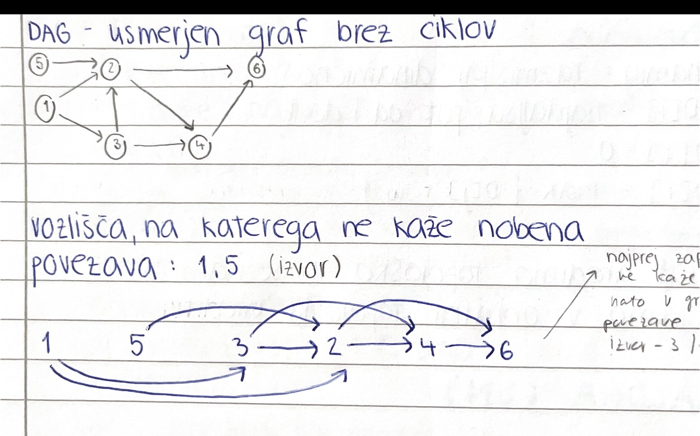
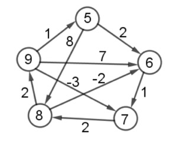
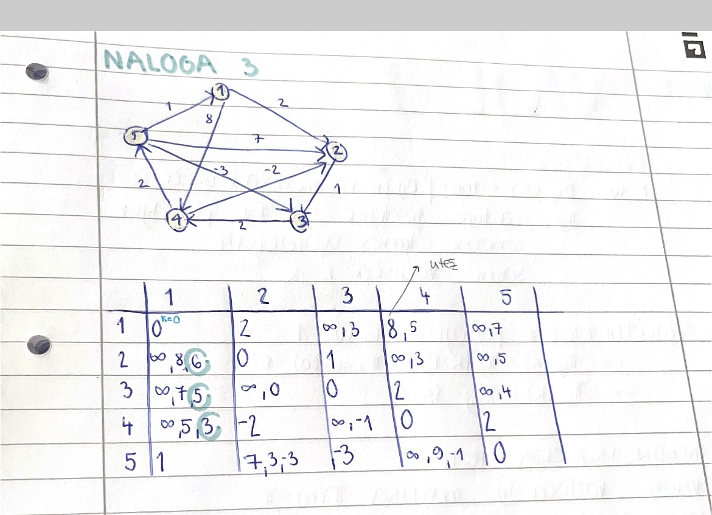
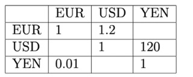
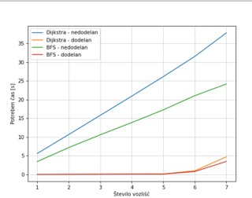
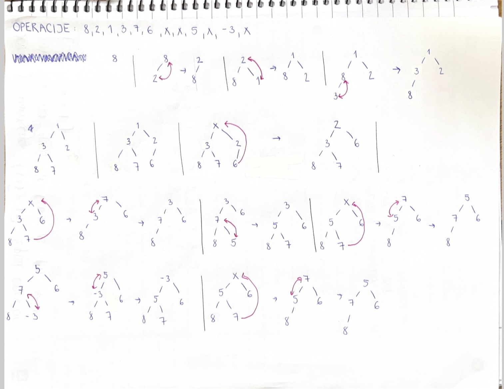

# **2. POROČILO**
**Ime:** Ela Kenda
# Vsebina:
* Vaje 5
* Vaje 6
* Vaje 7
* Vaje 8
* Vaje 9
* Vaje 10

# **VAJE 5 - 15.3.2023**
## NALOGA 1: 
**NAVODILO:** Imamo graf $G = (V,E)$ z utežmi $\omega : E \mapsto A$, ki vsaki povezavi dodeli utež iz množice A. $V = \{1,...,n\}, E \subset \binom{v}{2}$ Navedi nekaj prednosti oz. slabosti vsake izmed njih. Ponovi tudi, kaj je v grafu pot, sprehod in cikel.

**REŠITEV:**

Osnovni pojmi, ki jih uporabljamo pri  grafih:
- $V = \{1,...,n\}$ množica vozlišč, ki sestavljajo graf,
- $E \subset \binom{v}{2}$ množica povezav grafa $G$,
- $n = |V|$ število vozlišč,
- $m = |E|$ število povezav,

Graf lahko predstavimo na več različnih načinov. Mi smo pogledali tri primere:
1) Matrika sosednosti $A$:

    $A$ je matrika dimenzij $n \times n$:
        $$
        A[i][j] =
        \begin{cases}
        \omega(i, j),\ (i, j) \in E\\
        None;\ \text{sicer}
        \end{cases}
        $$
2) Seznam sosednosti $G$:
    $G$ je seznam seznamov dolžine $n$:

    $G[i] = [(j, w(i,j)\ \text{za vsak j, da je (i, j) povezava})]$ 

3) Slovar sosednosti $G$:

    $G$ je seznam slovarjev dolžine $n$:

    $G[i] = \{j: w(i,j)\ \text{za}\ \forall\ j, \text{da je} (i,j)\ \text{povezava}\}$

    
    |     |Prostorska zahtevnost|Ali sta $(i,j)$ soseda?   |Sosedi od $i$|
    | :-: |:-------------------:|:------------------------:|:-----------:| 
    | 1.  |$O(n^2)$             |$O(1)$                    |$O(n)$|               
    | 2.  |$O(n + m)$           |$O(\small{deg(i)}) = O(n)$|$O(1)$       | 
    | 3.  |$O(n+m)$             |$O(1)$                    |$O(n)$/$O(1)$|

Ponovimo naslednje pojme:

Zaporedje točk $v_0 v_1 \dots v_k$ grafa $G$ je **sprehod** dolžine $k$, če $v_i \sim v_{i+1}$ za $0 \leq i < k$, kjer $v_i \sim v_{i+1}$ pomeni, da sta vozlišči sosednji. **Sprehod**, na katerem so vse točke različne, je *pot*. Enostaven sklenjen sprehod z vsaj eno povezavo, na katerem sta enaki le prva in zadnja točka, pa je **cikel** grafa. 

## NALOGA 2: 
**NAVODILO:**
Usmerjenemu grafu $G$ z $n$ vozlišči, ki nima ciklov rečemu tudi DAG (directed acyclic graph). Vozlišča takega grafa lahko topološko uredimo. To pomeni, da obstaja zaporedje vozlišč $(v1,v2,\dots,v_n)$, tako da ne obstaja povezava od $v_i$ do $v_j$, če je $j<i$.

Sestavi algoritem, ki najde tako zaporedje. Namig: Katera vozlišča lahko zagotovo damo na prvo mesto v to ureditev? 

**REŠITEV:**

 Na prvo mesto postavimo vozlišča, v katera ne kaže nobena povezava - ta vozlišča imenujemo izvori. Nadaljujemo tako, da iz grafa izbrišemo vozlišča, ki smo jih že postavili v vrsto. Nadalje ponovno v vrsto vstavimo tista vozlišča, v katera ne kaže nobena povezava. Možnih je več topoloških ureditev, torej topološka ureditev v splošnem ni enolično določena. 

 Na spodnji sliki je prikazan primer topološke ureditve grafa:



``` python
def topo_sort(G):
    """
    Sprejme graf G kot seznam sosednosti in vrne njegovo topološko ureditev.
    """
    n = len(G)
    in_deg = [0] * n # in_deg[i]: število povezav, ki kažejo v i
    for i in range(n): # Čez vsa vozlišča
        for j in G[i]: # Čez vse sosede
            in_deg[j] += 1 # Imamo povezavo od i do j
        izvori = [i for i in range(n) if in_deg(i) == 0] 
        rezultat = []
        while(izvori):
            izvor = izvori.pop()
            rezultat.append(izvor)
            for sosed in G[izvor]:
                in_deg[sosed] -= 1
                if in_deg[sosed] == 0:
                    izvor.append(sosed)
    return rezultat
```
Časovna zahtevnost algoritma je $O(n+m)$.
- for zanka: $O(n+m)$
- izvori: $O(n)$
- while zanka: $O(n+m)$

## NALOGA 3: 
**NAVODILO:**
Naj bo sedaj $G$ usmerjen utežen graf brez ciklov. Kako bi izračunal ceno najdaljše poti v tem grafu med vozliščema $s$ in $t$.

**REŠITEV:**

Namig: razmišljaj dinamično

$D[i] =$ najdaljša pot od $i$ do $t$

$D[t] = 0$

$D[i] = max_{(j , \omega) \in G[i]}\{ D[j] + \omega \}$

Graf uredimo topološko, poiščemo kje se $t$ nahaja v topološki ureditvi in seznam $D$ polnimo v obratni topološki ureditvi.


# **VAJE 6 - 22.3.2023**
## NALOGA 1: 
**NAVODILO:**
Ponovi BFS algoritem. Modificiraj ga, tako da bo iskal najkrajše poti v neuteženem grafu.

**REŠITEV:**

* BFS - iskanje v širino
* DFS - iskanje v globino
```python
from collections import Deque

def BFS(G, u):
    """ 
    Funkcija sprejme graf G predstavljen kot seznam sosedov 
    in štartno vozlišče u ter naredi pregled v širino.
    """
    n = len(G)
    obiskani = [False] * n
    q = vrsta([u]) # začnemo v u. V primeru DFS-ja to spremenimo v sklad

    while q:
        trenutni = q.popleft()
        if obiskani[trenutni] : continue # soseda smo že obiskali
        obiskani[trenutni] = True
        for sosed in G[trenutni]:
            if not obiskani[sosed]:
                q.push(sosed) # doda nov element v q
```

Sedaj pa si poglejmo modificiran BFS, ki poišče najkrajše poti v neuteženem grafu.

```python
from collections import Deque

def BFS(G, u):
    """ 
    Funkcija sprejme graf G predstavljen kot seznam sosedov in štartno vozlišče 
    u ter vrne seznam najkraših poti od vozlišča u do vseh ostalih vozlišč.
    """
    n = len(G)
    d = [0] * n
    obiskani = [False] * n
    q = vrsta([(u,0)]) # začnemo v u. V primeru DFS-ja to spremenimo v sklad

    while q:
        trenutni, razdalja = q.popleft()
        if obiskani[trenutni]: continue # soseda smo že obiskali
        obiskani[trenutni] = True
        d[trenutni] = razdalja
        for sosed in G[trenutni]:
            if not obiskani[sosed]:
                q.push(sosed, razdalja+1) # doda nov element v q
    return d
```
**Časovna zahtevnost** algoritma je $O(n+m)$, kjer n predstavlja število vozlišč, m pa število povzav.
## NALOGA 2: 
**NAVODILO:**
Ponovi Floyd-Warshallow algoritem. Kaj računa in kaj vrne? Kakšna je njegova časovna zahtevnost?

**REŠITEV:**


VHOD: utežen graf $G$, kjer so dovoljene negativne uteži

IZHOD: matrika $D$, dimenzije $nxn$, kjer n predstavlja število vozlišč. PredStvaljena je kot seznam seznamov, kjer  $D_{ij}$ predstavlja ceno najkrajše poti med $i$-tim in $j$-tim vozliščem.

IDEJA:  
- $D_{ij}(k) = min \{D_{ij}(k-1), D_{ik}(k-1) + D_{kj}(k-1) \}$, kjer je $D_{i,j}(k)$ enako kot $D_{i,j}$, le da uporabljamo vozlišča od 1 do $k$.

ROBNI POGOJI:
- $D_{i,i} (1) = 0$
- $D_{1,i}(1) = \omega_{1,i}$ (utež povezave)

**Časovna zahtevnost** algoritma je $O(n^3)$ - $n$ matrik $n x n$ velikosti.
## NALOGA 3: 
**NAVODILO:**
Simuliraj FW algoritem na spodnjem grafu.



**REŠITEV:**




Nato dodamo vozlišče 10 in povezavo (5 -> 10) z utežjo -1 in (10 -> 6) z utežjo 2. Kako uporabil prejšnje rezultate, da bi izračunal nove najkrajše poti?

Ko dodamo novo vozlišče s povezavo, lahko uporabimo prejšnjo tabelo izračunov, le da dodamo nov stolpec in novo vrstivo ter izračunamo elemente po enakem principu. Če se zgodi, da na diagonali dobimo negativen element, to pomeni, da imamo negativen cikel v grafu.


# **VAJE 7 - 29.3.2023**
## NALOGA 1: 
**NAVODILO:**
Iz prejšnjih vaj obravnavaj, kako razberemo najkrajše poti s pomočjo matrike $\Pi$, ki jo dobimo z FW algoritmom.

**REŠITEV:**

$D_{i,j}(k) = min(D_{i,j}(k-1), D_{i,k}(k-1) + D_{k,j}(k-1)$

(*): $D_{i,j}(k-1)$

(**): $D_{i,k}(k-1) + D_{k,j}(k-1)$

$\Pi_{i,j}\dots$ zadnje vozlišče na $i-j$ poti, kjer smemo  uporabiti vozlišča od $1 \dots k$

**Začetni / robni pogoji:**
* $\Pi_{i,i}(0) = 1$
* (*): $\Pi_{i,j}(k) = \Pi_{i,j}(k-1) \cdot \Pi_{i, G[i]}(0) = 1$
* (**): $\Pi_{i,j}(k) = \Pi_{k,j}(k-1)$

**Rekonstrukcija poti:**

Vhod: vozlišča $i,j$, matrika $\Pi(n) = \Pi$

Izhod: najkrajša pot od $i$ do $j$

Algoritem:
``` python
def rekonctrukcija(i,j,Pi):
    p = j
    pot = []
    while p != i:
        pot.append(p)
        p = Pi[i][p]
    pot.append(i)
    return pot.reverse()
```
Časovna zahtevnost: $O(n)$
## NALOGA 2: 
**NAVODILO:**
Uteži sedaj dodamo še na vozlišča. Kako sedaj poiskati najcenejše poti?

**REŠITEV:**

Možne ideje:
1) prištejemo povezavi, ki kaže v to vozlišče
2) prištejemo povezavi, ki kaže iz vozlišča

Odločimo se glede na problem in smiselno obravnavamo začetno in končno vozlišče.

## NALOGA 3: 
**NAVODILO:**
Premisli, zakaj preprosta sprememba v FW algoritmu iz min na max ne najde nujno najdražje poti v grafu.

**REŠITEV:**


Iščemo maksimalno razdaljo, zato si izberemo možnosti, ki so obarvane z rdečo. Poti med sabo nista združljivi, saj se ponavljajo tako vozlišča kot povezave. 

Lahko bi naredili inverz, tako bi dobili negativne vrednosti, vendar je to možno le v grafih, ki nimajo pozitivnih ciklov.

## NALOGA 4: 
**NAVODILO:**
Na neki borzi se trgujejo valute po menjalnem tečaju, ki ga podaja tabela $R$ velikosti $n\times n$, kjer je $n$ število različnih valut. Vrednost $R[i][j]$ pove, da za $a$ enot valute $i$ dobimo $a\cdot R[i][j]$ enot valuje $j$. Ker menjalni tečaji lahko hitro spreminjajo in so odvisni od raznih parametrov se lahko zgodi, da $R[i][j]\cdot R[j][i] \neq 1$.

Za primer si oglejmo naslednjo shemo: 



Če trgujemo USD -> YEN -> EUR -> USD končamo z 1.44 USD. Tako zaporedje imenujemo arbitraža.

Predpostavi, da ne obstaja arbitražnih zaporedij. Kako bi poiskal najbolj ugodno pretvorbo valute $i$ v valuto $j$?

Kaj pa če sedaj opustimo predpostavko in dovoljujemo, da arbitražna zaporedja obstajajo. Kako bi odkril, kakšna so?

**REŠITEV:**

Sestavimo graf $G(E,V)$, kjer vozlišča predstavljajo valute ( EUR, YEN, USD), povezave pa pretvorbe. 

Zanima nas "najdražja pot" v zgornjem grafu $i - j$. Ceno poti dobimo kot produkt uteži na povezavah.

Utež na povezavah $i-j$ nastavimo na $-log(R_{i,j})$ ( iščemo najcenejšo pot od $i-j$ v tem grafu).

V ta namen želimo uporabiti Floyd Warshallov algoritem (to lahko naredimo, če graf nima negativnih ciklov).

Pokažimo, da jih naš graf res nima:

**Dokaz s protislovjem:**

Predpostavimo, da imamo negativen cikel od $i$ do $j$.
Cena tega cikla je: 

$-\sum_{j=1}^{k}log(R(i_{j-1},i_j)) < 0 $

$log(\Pi_{j=1}^{k} R(i_{j-1},i_j)) > 0$ 

$\Pi_{j=1}^{k} R(i_{j-1},i_j)) > 1 $

To je arbitraža in tako pridemo do protislovja. Od tod sledi, da graf nima negativnih ciklov.

## NALOGA 5: 
**NAVODILO:**
Ponovi Djikstrov algoritem. Kaj so vhodni in izhodni podatki, kakšne so predpostavk, itd.

Zapiši tudi njegovo glavno idejo oziroma kar psevdo kodo.

**REŠITEV:**

Vhodni podatki:
* usmerjeni graf $G(V,E)$
* začetno vozlišče $s \in V$
* cene povezav $c_{i,j} \in E$ - nenegativne


Izhodni podatki:
* cene najcenejših poti od začetnega do $i$-tega vozlišča
* drevo najkrajših poti od začetnega do $i$-tega vozlišča.


```python
def dijkstra(G,s):
    '''Vrne najkrajšo pot od s do vseh vozlišč v grafu G'''
    n = len(G)
    D = [float("inf")] * n
    P = [None] * n
    D[s] = 0 # D[i] pove razdaljo od s do i -> pri nas je i = s
    P[s] = s
    obiskani = [False] * n
    q = Vrsta(V(G))  # v vrsto dodamo še nedodana vozlišča  ... list[range(n)]

    while len(obiskani) != n:
        c = q.popmin()  # dobimo najmnajši element in ga odstrani iz seznama
        obiskani.add(c)

        for sosed, utez in G[c]:
            if sosed not in obiskani:
                if D[c] + utez + D[sosed]:
                    D[sosed] = D[c] + utez
                    P[sosed] = c
    return D,P
```
**Časovna zahtevnost** algoritma je $O(n^2)$.


# **VAJE 8 - 5.4.2023**
## NALOGA 1: 
**NAVODILO + REŠITEV:**
Vaša naloga bo, da uporabite ta algoritem na teh podatkih, torej:

- **RoadNet-TX.txt spremenite v ustrezno podatkovno strukturo grafa.**
```python
def pretvori_v_seznam(datoteka):
    '''Funkcija prebere datoteko in v seznam shrani vse povezave'''
    seznam = []
    with open(datoteka, 'r') as file:
        for vrstica in file:
            if vrstica[0] == '#': continue
            else:
                podatki = vrstica.split('\t')
                seznam.append((int(podatki[0]), int(podatki[1])))
    seznam.sort(key=lambda x: x[0], reverse=True)           
    return seznam

povezave = pretvori_v_seznam('roadNet-TX.txt')

def ustvari_graf(povezave):
    '''Funkcija naredi seznam sosednosti'''
    G = [list() for _ in range(povezave[0][0]+1)]
    for i in povezave:
        u,v = i[0],i[1]
        G[u].append((v, 1)) #uteži so enake 1
    return G

graf = ustvari_graf(povezave)
```
Kodo sem si sposodila od sošolke Zale Duh.

Od tu naprej si pomagamo z dijkstra algortimom:
```python
import heapq
from collections import deque

def dijkstra(G, s):
    """
    Funkcija sprejme usmerjen in utežen graf G predstavljen
    s seznamom sosednosti ter začetno vozlišče s.
    Torej G[i] = [(v_1, w_1), ... (v_d, w_d)],
    kjer je (i, v_k) povezava v grafu z utežjo w_k.
    Vrne seznam razdaljeDo, ki predstavlja najkrajšo pot od vozlišča s
    do vseh ostalih.
    Vrne tudi seznam poti, ki predstavlja drevo najkrajših poti od s
    do vseh ostalih vozlišč.
    """
    n = len(G)
    
    # Nastavimo začetne vrednosti za sezname obiskani, razdaljaDo in poti.
    obiskani = [False] * n
    razdaljeDo = [-1] * n
    poti = [None] * n

    # Na vrsto dodamo trojico (d, v, p), kjer je:
    # v vozlišče, d razdalja do njega, p pa prejšnje vozlišče na najkrajši poti od
    # s do v.
    Q = [(0, s, s)]

    while Q:
        
        # Vzamemo minimalen element iz vrste
        # heapq.heappop(Q) odstrani element iz seznama  Q, ter pri tem ohranja
        # lastnost kopice : seznam Q tretira kot dvojiško drevo!
        razdalja, u, p = heapq.heappop(Q)

        # če je že obiskan, nadaljujemo.
        if obiskani[u]:
            continue
        
        # obiščemo vozlišče ter nastavimo njegovo razdaljo
        # ter predhodnika na najkrajši poti od s do u
        obiskani[u] = True
        razdaljeDo[u] = razdalja
        poti[u] = p

        # gremo čez vse sosede in dodamo potrebne elemente na vrsto.
        for (v, teza) in G[u]:
            if not obiskani[v]:

                # heap.heappush(Q, elem) doda element v seznam Q, kjer ohranja lastnost kopice.
                heapq.heappush(Q, (razdalja + teza, v, u))

    return razdaljeDo, poti

```
- **Poiščete najkrajše razdalje od vozlišča 100 do vseh ostalih.**
    ```python
    razdalje, poti = dijkstra(G,100)
    ```

- **Koliko je razdalja dG(100, 100000)?**

```python
    razdalje[100000]
    #rezultat = 240
```
- **Katero vozlišče je najbolj oddaljeno od vozlišča 100?**

```python
    razdalje.index(max(razdalje))
    #rezultat = 1389039
```
- **Koliko vozlišč je dosegljivih iz vozlišča 100?**
```python
    len(graf[100])
    #rezultat = 2
```


## NALOGA 2: 
**NAVODILO:**
Glede na to, da graf ni utežen, lahko za isto nalogo implementiramo BFS algoritem. Implementiraj BFS algoritem, ki bo poiskal dolžine najkrajših poti od s do vseh ostalih vozlišč. Vrne naj tudi drevo najkrajših poti, tako kot Djikstra. Preveri iste zadeve kot zgoraj, dobiti moraš seveda iste odgovore.

**REŠITEV:**
```python
def BFS(G, u):
    '''Funkcija vrne seznam poti od vozlisca u do vseh ostalih vozlic v grafu G'''
    n = len(G)
    razdalje = [0]*n
    obiskani = [False]*n
    q = ([(u,0,u)]) #začnemo v u, razdlaja je na začetku 0
    poti =[None]*n
    while q: #dokler vrsta ni prazna
        trenutni, razdalja, prejsnji = q.pop(0)
        if obiskani[trenutni]:
            continue #soseda smo že obiskali
        obiskani[trenutni] = True
        razdalje[trenutni] = razdalja
        poti[trenutni] = prejsnji
        for sosed, teza in G[trenutni]:
            if not obiskani[sosed]:
                q.append((sosed, razdalja +1, trenutni)) #v vrsto dodamo soseda,razdalji prištejemo ena
    return razdalje, poti
```

## NALOGA 3: 
**NAVODILO:**
Oba algoritma dodelaj, tako da dodaš nov vhodni podatek $t$, ki predstavlja končno vozlišče. Algoritma naj torej vrneta razdaljo med $s$ in $t$ v grafu ter poti (kot drevo) med njima. Delujeta naj, tako da se ustavita takoj ko najdemo željeno pot.

**REŠITEV:**

* **BFS**
```python
def BFS(G, u, t):
    '''Funkcija vrne seznam poti od vozlisca u do vseh ostalih vozlic v grafu G'''
    n = len(G)
    razdalje = [0]*n
    obiskani = [False]*n
    q = ([(u,0,u)]) #začnemo v u, razdlaja je na začetku 0
    poti =[None]*n
    while q: #dokler vrsta ni prazna
        trenutni, razdalja, prejsnji = q.pop(0)
        if obiskani[trenutni]:
            continue #soseda smo že obiskali
        obiskani[trenutni] = True
        razdalje[trenutni] = razdalja
        poti[trenutni] = prejsnji
        if trenutni == t:
            break
        for sosed, teza in G[trenutni]:
            if not obiskani[sosed]:
                q.append((sosed, razdalja +1, trenutni)) #v vrsto dodamo soseda,razdalji prištejemo ena
    return razdalje, poti
```

* **DIJSKTRA**
```python
import heapq
from collections import deque

def djikstra(G, s, t):
    """
    Funkcija sprejme usmerjen in utežen graf G predstavljen
    s seznamom sosednosti ter začetno vozlišče s.
    Torej G[i] = [(v_1, w_1), ... (v_d, w_d)],
    kjer je (i, v_k) povezava v grafu z utežjo w_k.
    Vrne seznam razdaljeDo, ki predstavlja najkrajšo pot od vozlišča s
    do vseh ostalih.
    Vrne tudi seznam poti, ki predstavlja drevo najkrajših poti od s
    do vseh ostalih vozlišč.
    """
    n = len(G)
    
    # Nastavimo začetne vrednosti za sezname obiskani, razdaljaDo in poti.
    obiskani = [False] * n
    razdaljeDo = [-1] * n
    poti = [None] * n

    # Na vrsto dodamo trojico (d, v, p), kjer je:
    # v vozlišče, d razdalja do njega, p pa prejšnje vozlišče na najkrajši poti od
    # s do v.
    Q = [(0, s, s)]

    while Q:
        
        # Vzamemo minimalen element iz vrste
        # heapq.heappop(Q) odstrani element iz seznama  Q, ter pri tem ohranja
        # lastnost kopice : seznam Q tretira kot dvojiško drevo!
        razdalja, u, p = heapq.heappop(Q)

        # če je že obiskan, nadaljujemo.
        if obiskani[u]:
            continue
        
        # obiščemo vozlišče ter nastavimo njegovo razdaljo
        # ter predhodnika na najkrajši poti od s do u
        obiskani[u] = True
        razdaljeDo[u] = razdalja
        poti[u] = p
        if u == t:
            break

        # gremo čez vse sosede in dodamo potrebne elemente na vrsto.
        for (v, teza) in G[u]:
            if not obiskani[v]:

                # heap.heappush(Q, elem) doda element v seznam Q, kjer ohranja lastnost kopice.
                heapq.heappush(Q, (razdalja + teza, v, u))

    return razdaljeDo, poti

```
## NALOGA 4: 

**NAVODILO:**
Zapiši funkcijo, ki sprejme začetno vozlišče $s$, končno vozlišče $t$ ter drevo najkrajših poti ter vrne najkrajšo pot med njima v obliki seznama.

Sedaj rekonstruiraj najkrajšo pot med vozliščem 100 in 100000.

**REŠITEV:**
```python
def pot(s, t, drevo_najkrajsih):
    '''
        Vrne pot od vozlišča s do t na podlagi drevesa najkrajših poti od vozlišča s do vseh ostalih.
    '''
    seznam = []
    while t != s:
        seznam.append(t)
        t = drevo[t]
    seznam.append(s)
    return seznam
```
## NALOGA 5: 
**NAVODILO:**
Analiziraj časovne zahtevnosti algoritmov. Primerjaj hitrost med djikstro in BFS-jem. Prav tako analiziraj razliko med djikstro, ki izračuna najkrajše poti od s do vseh ostalih ter jo primerjaj z tisto verzijo iz Naloge 3.

Če nas bi zanimale najkrajše poti od $s$ do $t_1, t_2, ..., t_k$, kateri algoritem bi uporabil? Probaj odgovor podat na podlagi parametra $k$, ter analize, ki si jo opravil.

**REŠITEV:**
Koda je enaka kot pri sošolki Zali, ker sva naredili skupaj.
```python
import time                         # Štoparica

import matplotlib.pyplot as plt     # Risanje grafov
import random                       # Za generiranje primerov

from dijsktra import *
from BFS import *

def pretvori_v_seznam(datoteka):
    '''Funkcija prebere datoteko in v seznam shrani vse povezave'''
    seznam = []
    with open(datoteka, 'r') as file:
        for vrstica in file:
            if vrstica[0] == '#': continue
            else:
                podatki = vrstica.split('\t')
                seznam.append((int(podatki[0]), int(podatki[1])))
    seznam.sort(key=lambda x: x[0], reverse=True)
                
    return seznam

#seznam povezav
povezave = pretvori_v_seznam('roadNet-TX.txt')

def ustvari_graf(povezave):
    '''Funkcija naredi seznam sosednosti'''
    G = [list() for _ in range(povezave[0][0]+1)]
    for i in povezave:
        u,v = i[0],i[1]
        G[u].append((v, 1)) #uteži so enake 1
    return G

#ustvarimo graf
graf = ustvari_graf(povezave)

def djikstra_dodelan(G, s, t):
    """
    Funkcija sprejme usmerjen in utežen graf G predstavljen
    s seznamom sosednosti ter začetno vozlišče s.
    Torej G[i] = [(v_1, w_1), ... (v_d, w_d)],
    kjer je (i, v_k) povezava v grafu z utežjo w_k.
    Vrne seznam razdaljeDo, ki predstavlja najkrajšo pot od vozlišča s
    do vseh ostalih.
    Vrne tudi seznam poti, ki predstavlja drevo najkrajših poti od s
    do vseh ostalih vozlišč.
    """
    n = len(G)

    # Nastavimo začetne vrednosti za sezname obiskani, razdaljaDo in poti.
    obiskani = [False] * n
    razdaljeDo = [-1] * n
    poti = [None] * n

    # Na vrsto dodamo trojico (d, v, p), kjer je:
    # v vozlišče, d razdalja do njega, p pa prejšnje vozlišče na najkrajši poti od
    # s do v.
    Q = [(0, s, s)]

    while Q:

        # Vzamemo minimalen element iz vrste
        # heapq.heappop(Q) odstrani element iz seznama  Q, ter pri tem ohranja
        # lastnost kopice : seznam Q tretira kot dvojiško drevo!
        razdalja, u, p = heapq.heappop(Q)

        # če je že obiskan, nadaljujemo.
        if obiskani[u]:
            continue

        # obiščemo vozlišče ter nastavimo njegovo razdaljo
        # ter predhodnika na najkrajši poti od s do u
        obiskani[u] = True
        razdaljeDo[u] = razdalja
        poti[u] = p

        if u == t: #V primeru da je u naše željeno končno vozlišče zaključimo s to zanko in končamo
            break

        # gremo čez vse sosede in dodamo potrebne elemente na vrsto.
        for (v, teza) in G[u]:
            if not obiskani[v]:

                # heap.heappush(Q, elem) doda element v seznam Q, kjer ohranja lastnost kopice.
                heapq.heappush(Q, (razdalja + teza, v, u))

    return razdaljeDo, poti

def BFS_dodelan(G, u, t):
    '''Funkcija vrne seznam poti od vozlisca u do vozlišča t v grafu G'''
    n = len(G)
    razdalje = [0]*n
    obiskani = [False]*n
    q = ([(u,0,u)]) #začnemo v u, razdlaja je na začetku 0
    poti =[None]*n
    while q: #dokler vrsta ni prazna
        trenutni, razdalja, prejsni = q.pop(0)
        if obiskani[trenutni]:
            continue #soseda smo že obiskali

        if trenutni == t:
            break 
        #v primeru da smo prišli do našega željenga končnega vozlišča t zaključimo s to zanko
        obiskani[trenutni] = True
        razdalje[trenutni] = razdalja
        poti[trenutni] = prejsni
        for sosed, teza in G[trenutni]:
            if not obiskani[sosed]:
                q.append((sosed, razdalja +1, trenutni)) #v vrsto dodamo soseda,razdalji prištejemo ena
    return razdalje, poti


vozlisce = [1,10,100,1000,10000,100000,1000000]
#Dijkstra-nedodelana

casi_d1 = []
cas_d1 = 0

for i in vozlisce:
    zacetek = time.perf_counter()
    dijkstra(graf,i)
    konec = time.perf_counter()
    cas_d1 += konec - zacetek
    casi_d1.append(cas_d1)

#dijkstra dodelana

casi_d2 = []
cas_d2 = 0

for i in vozlisce:
    zacetek = time.perf_counter()
    djikstra_dodelan(graf,1,i)
    konec = time.perf_counter()
    cas_d2 += konec - zacetek
    casi_d2.append(cas_d2)
    
#BFS

casi_b1 = []
cas_b1 = 0

for i in vozlisce:
    zacetek = time.perf_counter()
    BFS(graf,i)
    konec = time.perf_counter()
    cas_b1 += konec - zacetek
    casi_b1.append(cas_b1)
    
#BFS dodelan
    
casi_b2 = []
cas_b2 = 0

for i in vozlisce:
    zacetek = time.perf_counter()
    BFS_dodelan(graf,1,i)
    konec = time.perf_counter()
    cas_b2 += konec - zacetek
    casi_b2.append(cas_b2)
    
    
print(casi_d1)
print(casi_d2)
print(casi_b1)
print(casi_b2)

x_os = [1,2,3,4,5,6,7]

plt.grid(linestyle = '-', linewidth = 0.5)
plt.xlabel('Število vozlišč')
plt.ylabel('Potreben čas [s]')
plt.plot(x_os, casi_d1, label='Dijkstra - nedodelan')
plt.plot(x_os, casi_d2, label='Dijkstra - dodelan')
plt.plot(x_os, casi_b1, label='BFS - nedodelan')
plt.plot(x_os, casi_b2, label='BFS - dodelan')
plt.legend()
plt.show()
```
Slika grafa:



# **VAJE 9 - 12.4.2023**

## NALOGA 2: 
**NAVODILO:**
Konstruirajte nov graf, ki vsebuje le vozlišča od 0 do $N$.

Vsaki povezavi določite neko pozitivno utež (lahko čisto naključno) in zadevo shranite v novo .txt datoteko. Vrstice naj bodo oblike u v $w(u,v)$, kjer je $(u,v)$ povezava in $w(u,v)$ njena utež.

**REŠITEV:**
```python
def generiraj_graf(n):
    '''
        Zgenerira in vrne graf kot seznam sosedov za število vozlišč od 0 do n.
        Torej n+1 vozlišč. Uteži so cela števila od 1 do 10.
    '''
    graf=[]
    for vozlisce in range(n+1):
        tabela = []  # tabelaela sosedov i-tega vozlisca
        for sosed in range(random.randint(1,n+1)):  # vsako vozlišče ima vsaj enega soseda
            tabela.append((random.randint(0,n), random.randint(1,10)))  # (sosed, utež)
        graf.append(tabela)
    return graf


def zapisi_v_txt(ime, graf):
    '''
        Zapiše graf v txt datoteko pod imenom ime.txt. Vrstice
        so v obliki `u v w(u,v)`, kjer je (u,v) povezava in w(u,v) njena utež.
        u je začetno in v končno vozlišče povezave.
    '''
    with open(ime + '.txt', 'w') as dat:
        for i, sosedje in enumerate(graf):
            for sosed in sosedje:
                vrstica = '{} {} {}\n'
                dat.write(vrstica.format(i, sosed[0], sosed[1]))
```

## NALOGA 3: 
**NAVODILO:**
Implementiranje še Bellman-Fordov algoritem in ga poženite na grafu iz prejšnje naloge. Analiziraje kako velik N iz prejšne naloge morate vzeti, da bo algoritem še deloval v zglednem času.

**REŠITEV:**
def Bellman_Ford(graf, zacetek, n):
    # n = stevilo vozlisc
    razdalje = [float('Inf')]*n
    razdalje[zacetek] = 0
    for _ in range(n-1):  # st. operacij je za 1 manj kot je vozlisc
        for u, v, w in graf:
            # u = začetek
            # v = konec
            # w = utež na povezavi (u,v)
            if razdalje[u] != float('Inf') and razdalje[u] + w < razdalje[v]:
                # našli smo bližnjico
                razdalje[v] = razdalje[u] + w
    return razdalje

def seznam_povezav_BF(ime_dat):
    '''Iz dane txt datoteke razbere povezave grafa, povezave doda v seznam `tocke` in jih uredi glede na začetna vozlišča.'''
    tocke = list()
    with open(ime_dat, 'r') as file:
        for vrstica in file:
            zacetek, konec, utez = vrstica[:-1].split(' ')
            tocke.append((int(zacetek), int(konec), int(utez)))
    return tocke

graf = seznam_povezav_BF('graf_g1.txt')
sez_razdalj = Bellman_Ford(graf, 0, 50)
print(sez_razdalj)
# **VAJE 10 - 19.4.2023**
## NALOGA 1: 
**NAVODILO:**
Simuliraj delovanje (min) kopice. Za vsavljanje je kot operacija število, za brisanje pa $x$. Za boljšo predstavo nariši kar drevesa.

Operacije: $8,2,1,3,7,6, x, x, 5, x, -3, x$

**REŠITEV:**


## NALOGA 2: 
**NAVODILO:**
Predstavi kopico s seznamom in zapiši delovanje pop() in push(x) operacij.

**REŠITEV:**

Naša kopica je predstavljena s seznamom $T$, dolžine $n$.

 $T[i]$ predstavlja vozlišče:
* če je koren na indseksu $i = 0$, je indeks desnega sina $2i + 1$, levega sina pa  $2i + 2$
* če je koren na indeksu $i = 1$, je indeks desnega $2i + 1$, levega sina pa $2i$

Push:
```python
def push(T,x): 
"""
Funkcija sprejme seznam T, ki predstavlja kopico 
ter element x, ki ga želimo dodati na kopico.
"""
    T.append(x) 
    i = len(T)-1 
    oce = i // 2
    while T[oce] >= T[i]: 
        # dokler ni izpolnjena lastnost kopice 
        # zamenjamo položaj sina in očeta
        T[oce], T[i] = T[i], T[oce]
        i = oce
        oce = i // 2
```

Pop:

```python
def pop(T): # odstranimo koren
"""
Funkcija sprejme seznam T, ki predstavlja kopico ter odstrani element 
v korenu. Pri tem seznam modificira tako, da ohrani lastnost kopice.
"""
    koren = T[1]
    T[1] = T[-1]
    T.pop()
    i = 1
    levi_sin = 2 * i
    desni_sin = 2 * i + 1
    while T[i] > T[levi_sin] or T[i] > T[desni_sin]:
        
        if T[levi_sin] > T[desni_sin]:
            T[desni_sin], T[i] = T[i], T[desni_sin]
            i = desni_sin
            levi_sin = 2 * i
            desni_sin = 2 * i + 1

        else:
            T[levi_sin], T[i] = T[i], T[levi_sin]
            i = levi_sin
            levi_sin = 2 * i
            desni_sin = 2 * i + 1

    return koren
```

## NALOGA 3: 
**NAVODILO:**
Kako bi s kopico sortiral seznam? Časovna zahtevnost? Kako in podanega seznama nardiš kopico v $O(n)$ časa.

**REŠITEV:**

Da seznam spravimo v kopico potrebujemo $O(n \cdot log n)$ časa. Da iz kopice preberemo elemente je $log n$ časa. Skupna časovna zahtevnost je torej $O(n \cdot log n)$.
